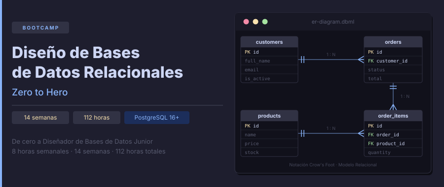

<p align="center">
  
</p>

<p align="center">
  <a href="LICENSE"></a>
  
  
  
</p>

<p align="center">
  <a href="README.md"></a>
</p>

---

## 📋 Description

Intensive **14-week (~3.5-month)** bootcamp focused on mastering **relational database design**: conceptual modeling, logical modeling, and physical modeling. Designed to take students from zero to **Junior Database Designer/Architect**, with emphasis on rigorous modeling, normalization, and PostgreSQL implementation best practices.

### 🎯 Learning Objectives

Upon completing the bootcamp, students will be able to:

- ✅ Analyze business requirements and transform them into data models
- ✅ Design Entity-Relationship (ER) diagrams using Chen and Crow's Foot notations
- ✅ Model advanced relationships: ternary, reflexive, specialization/generalization
- ✅ Transform conceptual models into normalized relational models
- ✅ Apply normal forms (1NF, 2NF, 3NF, BCNF, 4NF) with technical judgment
- ✅ Implement complete physical models in PostgreSQL with professional DDL
- ✅ Design indexing strategies and analyze execution plans (EXPLAIN ANALYZE)
- ✅ Create advanced objects: views, functions, stored procedures, triggers
- ✅ Apply advanced design patterns (soft delete, audit trails, hierarchies)
- ✅ Version and migrate schemas in a controlled manner

### 🗄️ Why master database design?

> **The right data model from day one** — a poorly designed schema costs 10x to 100x more to fix in production.

Every application, from a startup to a banking system, rests on a database. Poor design leads to inconsistent data, slow queries, irreparable technical debt, and painful migrations. This bootcamp teaches you to do things right from the very beginning:

- **Conceptual model:** capture business reality before writing a single line of SQL
- **Logical model:** structure data with normalization and no redundancy
- **Physical model:** implement in PostgreSQL with constraints, indexes, and advanced objects that guarantee performance and integrity

---

## 🗓️ Bootcamp Structure

| Phase | Weeks | Hours | Main Topics |
|:-----:|:-----:|:-----:|-------------|
| **Fundamentals** | 1–2 | 16h | Relational model, PostgreSQL environment, SQL queries |
| **Conceptual Model** | 3–5 | 24h | ER diagrams, cardinalities, advanced relationships, inheritance |
| **Logical Model** | 6–9 | 32h | ER→Relational transformation, normalization 1NF–BCNF |
| **Physical Model** | 10–12 | 24h | Full DDL, indexes, advanced objects, transactions |
| **Advanced Design** | 13–14 | 16h | Patterns, migrations, final integrative project |

**Total: 14 weeks** | **112 hours** of training

### 📅 Weekly Content

| Week | Topic | Phase |
|:----:|-------|-------|
| 01 | The relational world — DBMS, environment, first database | Fundamentals |
| 02 | SQL query fundamentals — SELECT, JOINs, data types, NULL | Fundamentals |
| 03 | Basic ER — entities, attributes, relationships, cardinalities | Conceptual |
| 04 | Intermediate ER — multivalued attributes, weak entities, ternary relationships | Conceptual |
| 05 | Advanced ER — inheritance, specialization/generalization, tools | Conceptual |
| 06 | From ER to relational model — transformation rules | Logical |
| 07 | Normalization I — functional dependencies, 1NF, 2NF | Logical |
| 08 | Normalization II — 3NF, BCNF, when to denormalize | Logical |
| 09 | Integrity and constraints — PRIMARY KEY, FOREIGN KEY, CHECK, UNIQUE | Logical |
| 10 | Full DDL in PostgreSQL — data types, schemas, sequences | Physical |
| 11 | Indexes and optimization — B-tree, Hash, GIN, EXPLAIN ANALYZE | Physical |
| 12 | Advanced objects and transactions — views, functions, triggers, ACID | Physical |
| 13 | Design patterns — soft delete, audit trails, multi-tenancy, hierarchies | Advanced |
| 14 | Final Integrative Project — requirements → ER → Relational → DDL | Advanced |

---

## 📚 Weekly Content Structure

Each week includes:

```
bootcamp/week-XX-main_topic/
├── README.md                 # Description and objectives
├── rubrica-evaluacion.md     # Evaluation rubric
├── 0-assets/                 # SVG diagrams and visual resources
├── 1-teoria/                 # Theory material
├── 2-practicas/              # Guided SQL exercises
├── 3-proyecto/               # Weekly project
│   ├── starter/              # Skeleton with TODOs for the student
│   └── solution/             # ⚠️ Instructors only
├── 4-recursos/               # Additional resources
│   ├── ebooks-free/
│   ├── videografia/
│   └── webgrafia/
└── 5-glosario/               # Key terms for the week (A-Z)
```

### 🔑 Key Components

- 📖 **Theory**: Modeling concepts with diagrams, SQL examples, and design decision analysis
- 💻 **Practice**: Step-by-step guided SQL exercises (commented code to execute and observe)
- 🏗️ **Project**: Real business case — from requirements to a schema implemented in PostgreSQL
- 📝 **Evaluation**: Knowledge, performance, and product evidence
- 🎓 **Resources**: Glossaries, official references, and supplementary material

---

## 🛠️ Tech Stack

| Tool | Version | Purpose |
|------|---------|---------|
| PostgreSQL | **16+** | Primary DBMS |
| pgAdmin | **4+** | Visual database administration |
| DBeaver | **Community** | Cross-platform SQL client |
| dbdiagram.io | Online | Logical/physical modeling (DBML) |
| draw.io | Online/Desktop | Conceptual ER diagrams |
| Docker | **27+** | Reproducible development environment |
| Docker Compose | **2.x** | PostgreSQL + pgAdmin orchestration |

**Development environment**: Docker + Docker Compose — no need to install PostgreSQL locally.

---

## 🚀 Quick Start

### Prerequisites

- **Docker** and **Docker Compose** installed
- **Git** for version control
- **VS Code** (recommended) with included extensions
- **DBeaver** or **pgAdmin** as SQL client

### 1. Clone the Repository

```bash
git clone https://github.com/ergrato-dev/bc-disenio-bdd.git
cd bc-disenio-bdd
```

### 2. Start the database environment

```bash
# Start PostgreSQL + pgAdmin
docker compose up -d

# Verify containers are running
docker compose ps
```

Access pgAdmin at [http://localhost:5050](http://localhost:5050):
- **Email:** `admin@bootcamp.local`
- **Password:** `admin`

### 3. Connect to PostgreSQL from DBeaver or pgAdmin

```
Host:     localhost
Port:     5432
DB:       bootcamp_db
User:     bootcamp_user
Password: bootcamp_pass
```

### 4. Navigate to the Current Week

```bash
cd bootcamp/week-01-el_mundo_relacional
```

Each week contains a `README.md` with detailed instructions.

---

## 📊 Learning Methodology

### Teaching Strategies

- 🎯 **Project-Based Learning (PBL)**: Real-world cases from well-known systems
- 🧩 **Deliberate Practice**: Incremental SQL exercises with immediate feedback
- 🔍 **Design Reviews**: Critical analysis of designs with trade-off discussions
- 🔄 **Schema Refactoring**: Identify and fix poorly designed schemas
- 🎮 **Live Modeling**: Live data modeling sessions from scratch

### Time Distribution (8h/week)

| Component | Hours |
|-----------|-------|
| Theory | 2h |
| Guided practice | 3h |
| Weekly project | 2h |
| Evaluation / review | 1h |

### Assessment

Each week includes three types of evidence:

1. **Knowledge 🧠** (30%): Quizzes and theoretical assessments
2. **Performance 💪** (40%): Hands-on exercises in class
3. **Product 📦** (30%): Functional deliverables (projects)

**Passing criterion**: Minimum 70% in each type of evidence

---

## 📞 Support

- 💬 **Discussions**: [GitHub Discussions](https://github.com/ergrato-dev/bc-disenio-bdd/discussions)
- 🐛 **Issues**: [GitHub Issues](https://github.com/ergrato-dev/bc-disenio-bdd/issues)

---

## ⚠️ Disclaimer

This repository is an **educational** resource created for learning purposes. By using it, you agree to the following terms:

- **Educational purposes only**: The content, SQL scripts, and projects are designed exclusively for teaching and learning. They do not constitute professional, legal, or security advice.
- **No warranties**: The material is provided **"as is"**, without warranties of any kind, express or implied.
- **Production code**: SQL examples are illustrative. Before using them in production environments, perform security, performance, and context-specific reviews.
- **Software versions**: Tool versions mentioned may become outdated. Always consult the latest official documentation.
- **Limitation of liability**: Authors and contributors are not responsible for data loss, direct or indirect damages, service interruptions, or any other harm arising from the use of this material.
- **Student responsibility**: Each student is responsible for their own implementations, development environments, and technical decisions.

---

## 📄 License

This project is licensed under **[CC BY-NC-SA 4.0](https://creativecommons.org/licenses/by-nc-sa/4.0/)** (Creative Commons Attribution-NonCommercial-ShareAlike 4.0 International).

**You may:** share and adapt the material, including creating educational forks.<br>
**You may not:** use this material for commercial purposes.<br>
**You must:** give appropriate credit and distribute adaptations under the same license.

See the [LICENSE](LICENSE) file for the full text.

---

## 🏆 Acknowledgements

- [PostgreSQL](https://www.postgresql.org/) — For being the most advanced open-source relational DBMS
- [pgAdmin](https://www.pgadmin.org/) — For the most complete visual administration tool for PostgreSQL
- [dbdiagram.io](https://dbdiagram.io) — For making data modeling accessible and visual
- [Use The Index, Luke](https://use-the-index-luke.com/) — Essential reference on indexes in relational databases
- PostgreSQL Community — For world-class resources, documentation, and examples
- All contributors

---

## 📚 Additional Documentation

- [🤖 Copilot Instructions](.github/copilot-instructions.md)
- [📜 Code of Conduct](CODE_OF_CONDUCT.md)
- [🔒 Security Policy](SECURITY.md)

---

<p align="center">
  <strong>🎓 Relational Database Design Bootcamp — Zero to Hero</strong><br>
  <em>From zero to Database Designer in 3.5 months</em>
</p>

<p align="center">
  <a href="bootcamp/week-01-el_mundo_relacional">Start Week 1</a> •
  <a href="docs">View Documentation</a> •
  <a href="https://github.com/ergrato-dev/bc-disenio-bdd/issues">Report Issue</a>
</p>

<p align="center">
  Made with ❤️ for the data community
</p>
