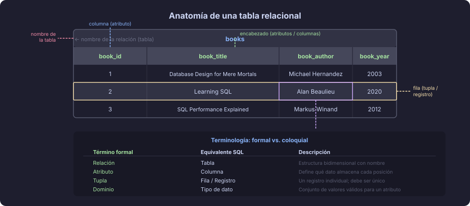

# El modelo relacional: tablas, filas y columnas

## 🎯 Objetivos

- Comprender qué es el modelo relacional y por qué domina la industria
- Identificar los componentes fundamentales: tablas, filas y columnas
- Distinguir los conceptos de esquema, instancia e integridad

---

## 📖 1. ¿Qué es el modelo relacional?

El **modelo relacional** es un framework matemático para organizar datos en estructuras
bidimensionales llamadas **relaciones** (coloquialmente: _tablas_). Fue propuesto por
Edgar F. Codd en 1970 en su paper _"A Relational Model of Data for Large Shared Data Banks"_
y sigue siendo el modelo predominante en la industria más de 50 años después.

La idea central es simple pero poderosa: **todos los datos se representan como tablas,
y todas las operaciones producen tablas**.

> 💡 **Por qué importa:** Antes del modelo relacional, los datos se almacenaban en
> estructuras jerárquicas o de red, lo que hacía que los programas dependieran
> estrechamente del almacenamiento físico. Codd separó el _qué_ (los datos) del
> _cómo_ (el almacenamiento), dando origen a los sistemas modernos.

---

## 📖 2. Anatomía de una tabla

Una tabla en el modelo relacional tiene un nombre único dentro del esquema y está
compuesta por:

| Componente | Término formal | Descripción |
|---|---|---|
| Tabla | Relación | Estructura bidimensional con nombre único |
| Columna | Atributo | Define qué tipo de dato almacena cada posición |
| Fila | Tupla | Un registro individual; cada fila es única |
| Celda | Valor | La intersección de una fila y una columna |
| Encabezado | Esquema de la relación | El conjunto de nombres y tipos de columnas |



### Ejemplo concreto

Imagina una tabla `books` en un sistema de biblioteca:

```
books
┌──────┬────────────────────────────┬────────────────┬──────┐
│  id  │           title            │     author     │ year │
├──────┼────────────────────────────┼────────────────┼──────┤
│  1   │ Database Design for Mere   │ Michael Hernandez│ 2003│
│  2   │ Learning SQL               │ Alan Beaulieu  │ 2020 │
│  3   │ SQL Performance Explained  │ Markus Winand  │ 2012 │
└──────┴────────────────────────────┴────────────────┴──────┘
```

- La tabla tiene **3 filas** (3 tuplas → 3 libros)
- La tabla tiene **4 columnas** (4 atributos: `id`, `title`, `author`, `year`)
- La celda de la fila 2, columna `title` tiene el valor `'Learning SQL'`

---

## 📖 3. Propiedades fundamentales de una relación

El modelo relacional impone propiedades que lo diferencian de una simple hoja de cálculo:

### 3.1 Unicidad de filas

No pueden existir dos filas idénticas en la misma tabla. Esta propiedad se garantiza
mediante la **clave primaria** (`PRIMARY KEY`): una columna (o conjunto de columnas)
cuyos valores identifican de forma única cada fila.

```sql
-- La columna `book_id` garantiza que cada libro sea único
CREATE TABLE books (
    book_id     UUID        DEFAULT gen_random_uuid()
                            CONSTRAINT pk_books PRIMARY KEY,
    book_title  TEXT        NOT NULL,
    book_author TEXT        NOT NULL,
    book_year   SMALLINT
);
```

### 3.2 Orden irrelevante

El orden de las filas y el orden de las columnas **no tiene significado** en el modelo
relacional. SQL devuelve filas en orden arbitrario a menos que se especifique `ORDER BY`.

```sql
-- ❌ Nunca asumas que los datos llegan en el orden en que los insertaste
SELECT * FROM books;   -- el orden no está garantizado

-- ✅ Especifica el orden cuando lo necesites
SELECT * FROM books ORDER BY year DESC;
```

### 3.3 Atomicidad de valores

Cada celda contiene exactamente **un valor atómico** (indivisible). No se permiten
listas, conjuntos ni estructuras anidadas en una sola celda. Esta propiedad da nombre
a la **Primera Forma Normal (1FN)**, que estudiaremos en la Semana 07.

```
-- ❌ Violación de atomicidad — múltiples autores en una celda
│ 1 │ Clean Code │ Robert Martin, Martin Fowler │ 2008 │

-- ✅ Correcto — cada fila representa un autor-libro
│ 1 │ Clean Code │ Robert Martin  │ 2008 │
│ 2 │ Clean Code │ Martin Fowler  │ 2008 │
```

---

## 📖 4. Esquema vs. instancia

Es crucial distinguir estos dos conceptos:

| Concepto | Definición | Analogía |
|---|---|---|
| **Esquema** | La estructura: nombre de tabla, nombres y tipos de columnas, constraints | El plano arquitectónico de una casa |
| **Instancia** | Los datos reales almacenados en un momento dado | La casa construida con sus muebles |

El esquema cambia raramente (cuando modificamos la estructura de la BD) y se define con
**DDL** (`CREATE`, `ALTER`, `DROP`). La instancia cambia constantemente con las
operaciones cotidianas y se gestiona con **DML** (`INSERT`, `UPDATE`, `DELETE`, `SELECT`).

---

## 📖 5. Relaciones entre tablas

La verdadera potencia del modelo relacional está en conectar tablas mediante
**claves foráneas** (`FOREIGN KEY`). Una clave foránea en una tabla referencia la
clave primaria de otra tabla, estableciendo una restricción de integridad referencial.

```sql
-- Tabla principal: autores
CREATE TABLE authors (
    author_id   UUID         DEFAULT gen_random_uuid()
                             CONSTRAINT pk_authors PRIMARY KEY,
    full_name   VARCHAR(150) NOT NULL,
    nationality VARCHAR(50)
);

-- Tabla dependiente: libros — referencia a authors
CREATE TABLE books (
    book_id     UUID         DEFAULT gen_random_uuid()
                             CONSTRAINT pk_books PRIMARY KEY,
    book_title  TEXT         NOT NULL,
    author_id   UUID         NOT NULL,
    book_year   SMALLINT,

    CONSTRAINT fk_books_author_id
        FOREIGN KEY (author_id) REFERENCES authors(author_id)
        ON DELETE RESTRICT
);
```

Con esta relación, el SGBD garantiza que **nunca pueda existir un libro con un
`author_id` que no exista en la tabla `authors`**. Esto es la **integridad referencial**.

---

## 📖 6. El papel del SGBD

Un **Sistema Gestor de Bases de Datos** (SGBD o DBMS por sus siglas en inglés) es
el software que implementa el modelo relacional y ofrece:

- **Motor de almacenamiento:** escribe y lee datos en disco de forma eficiente
- **Procesador de consultas:** interpreta y ejecuta sentencias SQL
- **Gestor de transacciones:** garantiza las propiedades ACID
- **Control de concurrencia:** maneja múltiples usuarios simultáneos
- **Seguridad:** autenticación, autorización y auditoría

PostgreSQL implementa el modelo relacional de forma robusta y con extensiones que lo
hacen especialmente versátil (JSON, arrays, tipos personalizados, extensiones geoespaciales).

---

## 🔑 Resumen

| Concepto | Definición clave |
|---|---|
| Modelo relacional | Organiza datos en tablas; las operaciones producen tablas |
| Tabla (relación) | Estructura con nombre, columnas tipadas y filas únicas |
| Clave primaria | Identifica de forma única cada fila en una tabla |
| Clave foránea | Vincula una tabla con otra; garantiza integridad referencial |
| Esquema | La estructura de la BD (cambia raramente) |
| Instancia | Los datos actuales en la BD (cambia constantemente) |
| SGBD | Software que implementa el modelo relacional |

---

## 🔗 Navegación

← [README Semana 01](../README.md) &nbsp;&nbsp;|&nbsp;&nbsp; [Siguiente: Historia y comparativa de SGBD →](02-sgbd-historia-comparativa.md)
