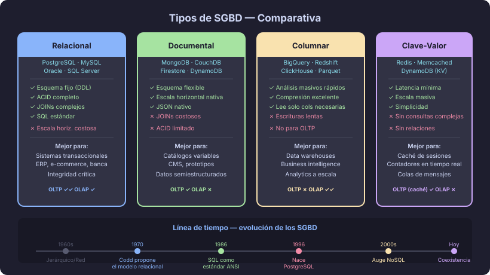

# Historia y comparativa de SGBD

## 🎯 Objetivos

- Conocer la evolución histórica de los sistemas de gestión de bases de datos
- Comparar los principales modelos de SGBD: relacional, documental, columnar y clave-valor
- Decidir cuándo PostgreSQL es la elección correcta

---

## 📖 1. Breve historia de los SGBD

### Años 60: el modelo jerárquico y de red

Las primeras bases de datos organizaban los datos en estructuras de árbol
(**modelo jerárquico**, como IBM IMS) o grafos (**modelo de red**, como CODASYL).
Los programas de aplicación dependían del almacenamiento físico: si cambiabas cómo
guardabas los datos, tenías que reescribir todos los programas. Era frágil y costoso.

### 1970: el paper de Codd

Edgar F. Codd, investigador de IBM, publicó su propuesta del **modelo relacional**
con una idea revolucionaria: separar la descripción lógica de los datos de su
implementación física. Los programas hablarían con el SGBD en un lenguaje declarativo
(SQL) sin preocuparse de cómo los datos estaban almacenados en disco.

### Años 80–90: SQL como estándar de facto

IBM desarrolló DB2. Oracle surgió como la primera BD comercial en implementar SQL.
`ANSI` y `ISO` estandarizaron SQL en 1986. Microsoft lanzó SQL Server. Los sistemas
relacionales se convirtieron en el backbone de las aplicaciones empresariales.

### Años 90: el nacimiento de PostgreSQL

PostgreSQL tiene origen académico: el proyecto **POSTGRES** de la Universidad de
California en Berkeley (liderado por Michael Stonebraker), que evolucionó a
**PostgreSQL** en 1996 al añadir soporte completo a SQL. Es open-source, altamente
extensible y mantiene una reputación de ser la BD relacional más avanzada del mundo.

### 2000s–2010s: el movimiento NoSQL

El auge de aplicaciones web a escala masiva (Google, Amazon, Facebook) impulsó
nuevos modelos de almacenamiento **NoSQL** ("Not Only SQL"), diseñados para escalar
horizontalmente con datos no estructurados o semiestructurados.

### Hoy: coexistencia y convergencia

Los SGBD relacionales modernos (especialmente PostgreSQL) han adoptado capacidades
NoSQL (`JSONB`, búsqueda de texto completo, tipos geoespaciales). Los sistemas NoSQL
han añadido soporte a transacciones ACID. La elección correcta depende del problema,
no de la moda.

---

## 📖 2. Taxonomía de SGBD modernos

### 2.1 SGBD Relacional (RDBMS)

**Cómo organiza los datos:** tablas con esquema fijo, relaciones mediante claves foráneas.

**Fortalezas:**
- Integridad de datos garantizada (constraints, transacciones ACID)
- SQL como lenguaje estándar y maduro
- Consultas complejas con `JOIN` entre múltiples tablas
- Herramientas de administración maduras

**Casos de uso ideales:**
- Sistemas transaccionales (e-commerce, banca, ERP, CRM)
- Cualquier dominio con relaciones complejas entre entidades
- Cuando la integridad de datos es crítica

**Ejemplos:** PostgreSQL, MySQL/MariaDB, Oracle, SQL Server

### 2.2 SGBD Documental

**Cómo organiza los datos:** documentos JSON/BSON sin esquema fijo, agrupados en
colecciones.

**Fortalezas:**
- Flexible: cada documento puede tener estructura diferente
- Escala horizontal fácilmente (sharding nativo)
- Ideal para datos semiestructurados

**Casos de uso ideales:**
- Catálogos de productos con atributos variables
- Sistemas de contenido (CMS)
- Datos con estructura cambiante en el tiempo

**Limitación clave:** las consultas `JOIN` entre colecciones son costosas o imposibles.

**Ejemplos:** MongoDB, CouchDB, Firestore

### 2.3 SGBD Columnar

**Cómo organiza los datos:** en lugar de guardar una fila completa, guarda cada
columna por separado. Permite comprimir y leer solo las columnas necesarias.

**Fortalezas:**
- Muy eficiente para consultas analíticas que leen pocas columnas de millones de filas
- Excelente compresión de datos
- Ideal para `GROUP BY`, `SUM`, `AVG` sobre grandes volúmenes

**Casos de uso ideales:**
- Data warehouses y business intelligence
- Análisis de logs a gran escala

**No es bueno para:** transacciones OLTP (muchas escrituras individuales de filas completas)

**Ejemplos:** Amazon Redshift, Google BigQuery, Apache Parquet, ClickHouse

### 2.4 SGBD Clave-Valor

**Cómo organiza los datos:** pares clave → valor, donde el valor es opaco al SGBD.

**Fortalezas:**
- Latencia extremadamente baja (microsegundos)
- Escala masivamente
- Simplicidad de modelo

**Casos de uso ideales:**
- Caché de sesiones y resultados de consultas
- Contadores en tiempo real
- Colas de mensajes

**No es bueno para:** consultas por atributos del valor, relaciones entre entidades.

**Ejemplos:** Redis, DynamoDB (modo clave-valor), Memcached

---

## 📖 3. Comparativa rápida

| Criterio | Relacional | Documental | Columnar | Clave-Valor |
|---|---|---|---|---|
| Esquema | Fijo (DDL) | Flexible | Fijo | Sin esquema |
| Integridad | Alta (ACID) | Variable | Variable | Baja |
| Consultas complejas | ✅ Excelente | ⚠️ Limitado | ⚠️ Solo lectura | ❌ No |
| Escala horizontal | ⚠️ Requiere trabajo | ✅ Nativo | ✅ Nativo | ✅ Nativo |
| Casos OLTP | ✅ Ideal | ⚠️ Posible | ❌ No | ✅ Para caché |
| Casos OLAP | ⚠️ Posible | ❌ No | ✅ Ideal | ❌ No |
| Curva de aprendizaje | Media | Baja | Media-Alta | Baja |

> **OLTP** = _Online Transaction Processing_ — muchas transacciones pequeñas (insertar, actualizar, leer)  
> **OLAP** = _Online Analytical Processing_ — pocas consultas analíticas sobre grandes volúmenes

---

## 📖 4. ¿Cuándo elegir PostgreSQL?

PostgreSQL es la elección correcta cuando necesitas:

**✅ Integridad transaccional estricta** — banca, e-commerce, salud, contratos.

**✅ Relaciones complejas entre entidades** — un pedido tiene muchos productos,
cada producto tiene un proveedor, el proveedor tiene múltiples contratos...

**✅ Consultas ad-hoc complejas** — informes, dashboards, análisis de negocios
que combinan múltiples tablas con condiciones complejas.

**✅ Extensibilidad** — necesitas tipos personalizados (`ENUM`, `DOMAIN`),
índices especializados (`GIN`, `GiST`) o extensiones como PostGIS (datos geoespaciales).

**✅ Cuando los datos tienen estructura conocida** — si sabes de antemano qué
atributos tiene cada entidad, un esquema fijo protege la calidad de los datos.

**⚠️ Considera otras opciones cuando:**
- Necesitas escalar a miles de escrituras por segundo en múltiples regiones → CockroachDB, PlanetScale
- Tus datos son fundamentalmente no estructurados o cambian de esquema continuamente → MongoDB
- Haces análisis sobre petabytes de datos históricos → BigQuery, Redshift
- Necesitas caché en memoria con microsegundos de latencia → Redis

> 💡 **Regla práctica:** para la mayoría de aplicaciones empresariales y startups,
> PostgreSQL es la elección correcta desde el inicio. Escala sorprendentemente bien
> y su flexibilidad evita migraciones costosas.

---

## 📖 5. PostgreSQL en números

| Dato | Valor |
|---|---|
| Primer release | 1996 |
| Versión actual (2026) | PostgreSQL 17 |
| Licencia | PostgreSQL License (similar a MIT) |
| Tipos de datos nativos | 50+ (incluyendo `JSONB`, `UUID`, arrays, rangos) |
| Extensiones disponibles | 1000+ (PostGIS, pgvector, TimescaleDB...) |
| Plataformas | Linux, macOS, Windows, ARM |
| Adoptado por | Instagram, Spotify, Reddit, GitHub, Twitch |

---

## 🔑 Resumen

| Concepto | Puntos clave |
|---|---|
| Modelo relacional | Propuesto por Codd (1970); datos en tablas con SQL |
| NoSQL | Surgió para escalar con datos no estructurados; no reemplaza al relacional |
| RDBMS | Mejor para integridad, relaciones complejas, consultas ad-hoc |
| Documental | Mejor para esquemas flexibles y escalado horizontal |
| Columnar | Mejor para análisis de grandes volúmenes (OLAP) |
| Clave-Valor | Mejor para caché y latencia mínima |
| PostgreSQL | RDBMS open-source más avanzado; elección por defecto para la mayoría de casos |

---

## 🔗 Navegación

← [El modelo relacional](01-modelo-relacional.md) &nbsp;&nbsp;|&nbsp;&nbsp; [Siguiente: Tipos de datos en PostgreSQL →](03-tipos-datos-postgresql.md)
