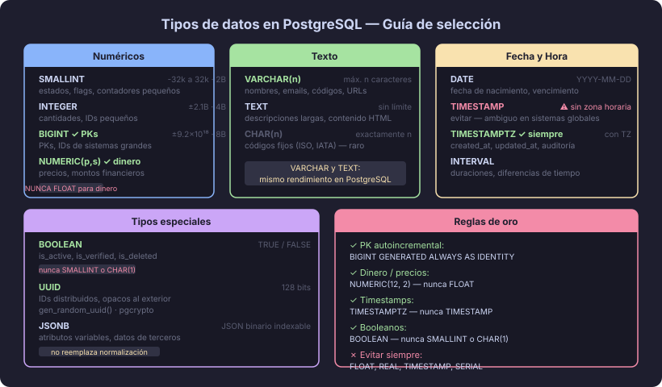

# Tipos de datos en PostgreSQL

## 🎯 Objetivos

- Conocer las categorías de tipos de datos nativos de PostgreSQL
- Elegir el tipo correcto para cada caso de uso
- Evitar errores comunes de tipado que afectan integridad y rendimiento

---

## 📖 1. Por qué los tipos de datos importan

Elegir el tipo de dato correcto no es solo una cuestión de espacio en disco; tiene
consecuencias directas en:

- **Integridad:** PostgreSQL rechaza valores inválidos (`'hola'` en un campo `INTEGER`)
- **Rendimiento:** índices en `INTEGER` son más rápidos que en `VARCHAR`
- **Semántica:** `DATE` sabe que febrero tiene 28 días; `VARCHAR` no
- **Operaciones:** puedes sumar `NUMERIC`, no puedes sumar `TEXT`

> 💡 **Principio de diseño:** usa siempre el tipo más específico que represente
> fielmente el dominio del dato. Un código postal no es un número (no tiene aritmética);
> es texto. Una edad sí es un número (`SMALLINT`).

---

## 📖 2. Tipos numéricos



### Enteros

| Tipo | Rango | Bytes | Cuándo usarlo |
|---|---|---|---|
| `SMALLINT` | −32 768 a 32 767 | 2 | Contadores pequeños, estados, flags |
| `INTEGER` | −2 147 483 648 a 2 147 483 647 | 4 | IDs de tablas pequeñas, cantidades |
| `BIGINT` | −9.2×10¹⁸ a 9.2×10¹⁸ | 8 | PKs de tablas grandes, identificadores externos |

```sql
-- ✅ Usar BIGINT para PKs en tablas con crecimiento indeterminado
id          BIGINT  GENERATED ALWAYS AS IDENTITY CONSTRAINT pk_products PRIMARY KEY

-- ✅ Usar SMALLINT para valores acotados
stock_units SMALLINT NOT NULL CONSTRAINT ck_products_stock CHECK (stock_units >= 0)

-- ❌ No usar INTEGER para PKs en sistemas que escalan
id          SERIAL  -- SERIAL usa INTEGER internamente; se puede agotar con ~2 mil millones de filas
```

### Decimales exactos vs. aproximados

| Tipo | Precisión | Bytes | Cuándo usarlo |
|---|---|---|---|
| `NUMERIC(p, s)` | Exacta | Variable | Dinero, precios, porcentajes, cualquier cálculo financiero |
| `REAL` | Aprox. 6 dígitos | 4 | Cálculos científicos donde la precisión aproximada es aceptable |
| `DOUBLE PRECISION` | Aprox. 15 dígitos | 8 | Coordenadas geográficas, cálculos de ingeniería |

```sql
-- ✅ SIEMPRE usar NUMERIC para dinero
unit_price  NUMERIC(12, 2)  NOT NULL  -- hasta 9 999 999 999,99

-- ❌ NUNCA usar FLOAT/REAL para dinero (error de redondeo por representación binaria)
-- 0.1 + 0.2 en FLOAT = 0.30000000000000004
price       REAL            -- ❌ error de redondeo garantizado
```

---

## 📖 3. Tipos de texto

| Tipo | Longitud | Cuándo usarlo |
|---|---|---|
| `VARCHAR(n)` | Máximo `n` caracteres | Texto con límite conocido: nombres, emails, códigos |
| `TEXT` | Ilimitado | Descripción larga, contenido HTML, JSON crudo, notas |
| `CHAR(n)` | Exactamente `n` caracteres | Códigos de longitud fija (ISO, IATA); raro en práctica |

```sql
-- ✅ VARCHAR para campos con límite natural
full_name   VARCHAR(100)    NOT NULL
email       VARCHAR(254)    NOT NULL  -- RFC 5321 establece max 254 chars

-- ✅ TEXT para contenido libre
description TEXT
bio         TEXT

-- ❌ Evitar CHAR en la mayoría de casos (rellena con espacios, causa comparaciones incorrectas)
country_code CHAR(2)  -- solo aceptable si SIEMPRE tienes 2 chars (ISO 3166)
```

> 📌 **Nota:** En PostgreSQL, `VARCHAR` y `TEXT` tienen rendimiento idéntico
> internamente. La diferencia es semántica: `VARCHAR(n)` documenta y enforce el límite.

---

## 📖 4. Tipos de fecha y hora

| Tipo | Almacena | Cuándo usarlo |
|---|---|---|
| `DATE` | Solo fecha (YYYY-MM-DD) | Fecha de nacimiento, fecha de vencimiento |
| `TIME` | Solo hora (HH:MM:SS) | Horario de apertura (sin zona horaria) |
| `TIMESTAMP` | Fecha + hora **sin** zona horaria | Evitar — puede causar ambigüedades |
| `TIMESTAMPTZ` | Fecha + hora **con** zona horaria | Auditoría, `created_at`, `updated_at` — usar siempre |
| `INTERVAL` | Duración | Calcular diferencias, añadir periodos |

```sql
-- ✅ SIEMPRE usar TIMESTAMPTZ para marcas de tiempo
created_at  TIMESTAMPTZ NOT NULL DEFAULT NOW()
updated_at  TIMESTAMPTZ NOT NULL DEFAULT NOW()

-- ✅ DATE para fechas sin hora
birth_date  DATE
start_date  DATE    NOT NULL

-- ❌ TIMESTAMP (sin TZ) — peligroso en sistemas con múltiples zonas horarias
registered_at TIMESTAMP  -- ¿de qué zona horaria?
```

```sql
-- Operaciones con fechas — PostgreSQL es muy expresivo
SELECT NOW();                              -- timestamp actual con TZ
SELECT CURRENT_DATE;                       -- fecha de hoy
SELECT age(birth_date) FROM users;         -- edad calculada automáticamente
SELECT created_at + INTERVAL '30 days'     -- sumar períodos
  FROM subscriptions;
```

---

## 📖 5. Tipo booleano

```sql
-- ✅ Usar BOOLEAN — no SMALLINT, no CHAR(1), no INTEGER
is_active   BOOLEAN NOT NULL DEFAULT TRUE
is_verified BOOLEAN NOT NULL DEFAULT FALSE
```

PostgreSQL acepta múltiples representaciones para `TRUE`: `true`, `'t'`, `'yes'`, `'on'`, `1`.  
Y para `FALSE`: `false`, `'f'`, `'no'`, `'off'`, `0`.

---

## 📖 6. UUID

Un `UUID` (Universally Unique Identifier) es un identificador de 128 bits que puede
generarse de forma distribuida sin coordinación central.

```sql
-- ✅ UUID como PK — útil cuando múltiples sistemas generan IDs
CREATE TABLE events (
    id          UUID        NOT NULL DEFAULT gen_random_uuid()
                            CONSTRAINT pk_events PRIMARY KEY,
    event_type  VARCHAR(50) NOT NULL,
    occurred_at TIMESTAMPTZ NOT NULL DEFAULT NOW()
);
```

**Cuándo preferir UUID sobre BIGINT:**
- Necesitas generar IDs en el cliente antes de insertar
- Múltiples bases de datos que se sincronizan entre sí
- Quieres que los IDs sean opacos (no revelen el volumen de registros)

**Cuándo preferir BIGINT:**
- El ID solo se genera en la BD
- El rendimiento de índices es crítico (BIGINT 2× más rápido en índices)
- La tabla crece a miles de millones de filas

---

## 📖 7. JSONB — el puente entre relacional y documental

`JSONB` almacena JSON en formato binario comprimido y permite **indexarlo y
consultarlo** con operadores nativos.

```sql
CREATE TABLE products (
    id          BIGINT  GENERATED ALWAYS AS IDENTITY CONSTRAINT pk_products PRIMARY KEY,
    sku         VARCHAR(50) NOT NULL UNIQUE,
    name        VARCHAR(200) NOT NULL,
    attributes  JSONB   -- atributos variables según categoría del producto
);

-- Insertar
INSERT INTO products (sku, name, attributes)
VALUES (
    'LAPTOP-001',
    'ThinkPad X1 Carbon',
    '{"ram_gb": 16, "storage_gb": 512, "color": "black", "weight_kg": 1.12}'
);

-- Consultar por atributo JSON
SELECT name FROM products
WHERE attributes->>'color' = 'black'
  AND (attributes->>'ram_gb')::INTEGER >= 16;
```

**Cuándo usar JSONB:**
- Atributos que varían por categoría (productos, configuraciones)
- Datos de terceros con estructura no controlada
- Cuando el esquema evoluciona muy rápido en la fase de prototipo

**Cuándo NO usar JSONB:**
- Para datos con estructura fija y conocida → usa columnas normales
- Si necesitas hacer `JOIN` sobre los valores JSON frecuentemente → normaliza

---

## 📖 8. Resumen visual de tipos

| Dominio | Tipo recomendado | Anti-patrón |
|---|---|---|
| PK auto-incremental | `BIGINT GENERATED ALWAYS AS IDENTITY` | `SERIAL`, `INT` |
| Nombre, email, código | `VARCHAR(n)` con n adecuado | `TEXT` para campos acotados |
| Descripción libre | `TEXT` | `VARCHAR(9999)` |
| Precio, monto | `NUMERIC(12, 2)` | `FLOAT`, `REAL` |
| Contador, estado | `SMALLINT` | `INTEGER` para valores pequeños |
| Fecha de nacimiento | `DATE` | `VARCHAR` para fechas |
| Timestamp de auditoría | `TIMESTAMPTZ` | `TIMESTAMP` |
| Activo/Inactivo | `BOOLEAN` | `SMALLINT`, `CHAR(1)` |
| ID distribuido | `UUID` | `VARCHAR(36)` |
| Atributos variables | `JSONB` | `TEXT` con JSON como string |

---

## 🔑 Resumen

- **Usa el tipo más específico** — no todo es `VARCHAR` y `INTEGER`
- **NUMERIC** para dinero, nunca FLOAT
- **TIMESTAMPTZ** siempre (con zona horaria), nunca TIMESTAMP
- **BIGINT GENERATED ALWAYS AS IDENTITY** para PKs, evita SERIAL
- **BOOLEAN** para flags, nunca SMALLINT ni CHAR(1)
- **JSONB** es una herramienta poderosa, pero no reemplaza la normalización

---

## 🔗 Navegación

← [Historia y comparativa de SGBD](02-sgbd-historia-comparativa.md) &nbsp;&nbsp;|&nbsp;&nbsp; [Siguiente: Entorno de desarrollo →](04-entorno-desarrollo.md)
