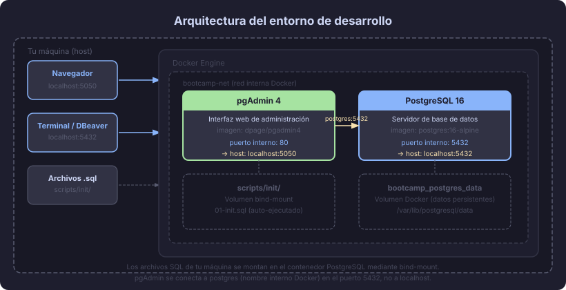

# Entorno de desarrollo: Docker + PostgreSQL + pgAdmin

## 🎯 Objetivos

- Levantar un entorno PostgreSQL reproducible con Docker en menos de 10 minutos
- Conectarse a la base de datos desde pgAdmin y DBeaver
- Entender por qué usamos Docker en lugar de instalar PostgreSQL directamente

---

## 📖 1. ¿Por qué Docker?

Instalar PostgreSQL directamente en tu sistema operativo funciona, pero genera problemas
a medida que trabajas en múltiples proyectos:

| Problema sin Docker | Solución con Docker |
|---|---|
| Versión global única (v15 en un proyecto, v16 en otro) | Cada proyecto elige su versión |
| Configuración del sistema difícil de reproducir | `docker-compose.yml` es el entorno completo |
| "En mi máquina funciona" | Mismo entorno en todas las máquinas |
| Limpieza difícil al terminar el proyecto | `docker compose down -v` elimina todo |

Docker **no reemplaza** el conocimiento de PostgreSQL; solo nos da un entorno
limpio, versionado y reproducible.

---

## 📖 2. Arquitectura del entorno



El entorno tiene tres capas:

1. **Tu máquina (host):** donde corres los comandos y donde vive el código
2. **Docker Engine:** el motor que ejecuta los contenedores como procesos aislados
3. **Contenedores:**
   - `postgres` — el servidor de base de datos PostgreSQL 16
   - `pgadmin` — interfaz web para administrar la BD

Las dos aplicaciones se comunican a través de una **red interna Docker** (`bootcamp-net`).
Desde tu máquina accedes a pgAdmin vía `http://localhost:5050` y PostgreSQL vía el
puerto `5432`.

---

## 📖 3. Estructura de archivos

```
tu-proyecto/
├── docker-compose.yml      ← Definición del entorno completo
├── .env                    ← Variables de entorno (no subir a git)
└── scripts/
    └── init/
        └── 01-init.sql     ← Script que se ejecuta al crear la BD
```

---

## 📖 4. El archivo `docker-compose.yml`

```yaml
# docker-compose.yml
# Entorno de desarrollo — PostgreSQL 16 + pgAdmin 4

services:
  postgres:
    image: postgres:16-alpine          # Alpine = imagen más liviana
    container_name: bootcamp_postgres
    restart: unless-stopped
    environment:
      POSTGRES_DB:       bootcamp_db
      POSTGRES_USER:     bootcamp_user
      POSTGRES_PASSWORD: bootcamp_pass
    ports:
      - "5432:5432"                    # host:contenedor
    volumes:
      - postgres_data:/var/lib/postgresql/data        # datos persistentes
      - ./scripts/init:/docker-entrypoint-initdb.d    # scripts de inicialización

  pgadmin:
    image: dpage/pgadmin4:latest
    container_name: bootcamp_pgadmin
    restart: unless-stopped
    environment:
      PGADMIN_DEFAULT_EMAIL:    admin@bootcamp.local
      PGADMIN_DEFAULT_PASSWORD: admin
    ports:
      - "5050:80"                      # acceder en http://localhost:5050
    depends_on:
      - postgres

volumes:
  postgres_data:
    name: bootcamp_postgres_data

networks:
  default:
    name: bootcamp-net
```

> ⚠️ **Seguridad:** las credenciales del `docker-compose.yml` son para desarrollo
> local. Nunca uses estas contraseñas en producción.

---

## 📖 5. El script de inicialización

El archivo `scripts/init/01-init.sql` se ejecuta **automáticamente** la primera vez
que se levanta el contenedor (cuando el volumen está vacío):

```sql
-- scripts/init/01-init.sql
-- Inicialización del entorno de desarrollo del bootcamp

-- Extensión para generar UUIDs
CREATE EXTENSION IF NOT EXISTS pgcrypto;

-- Esquema de trabajo (opcional — separa objetos del schema public)
CREATE SCHEMA IF NOT EXISTS bootcamp
    AUTHORIZATION bootcamp_user;

-- Comentario de bienvenida
COMMENT ON DATABASE bootcamp_db IS
    'Base de datos del Bootcamp Diseño de BDD — Semana 01';
```

---

## 📖 6. Comandos esenciales

```bash
# Levantar el entorno en segundo plano
docker compose up -d

# Ver el estado de los contenedores
docker compose ps

# Ver los logs de PostgreSQL
docker compose logs postgres

# Conectarse a PostgreSQL desde la terminal (psql)
docker compose exec postgres psql -U bootcamp_user -d bootcamp_db

# Detener el entorno (conserva los datos)
docker compose down

# Detener el entorno Y borrar todos los datos (empezar desde cero)
docker compose down -v
```

---

## 📖 7. Conectarse desde pgAdmin

1. Abre `http://localhost:5050` en tu navegador
2. Inicia sesión con `admin@bootcamp.local` / `admin`
3. Click derecho en **Servers** → **Register** → **Server...**
4. En la pestaña **General**: Name = `Bootcamp`
5. En la pestaña **Connection**:
   - Host: `postgres` (nombre del servicio Docker, no `localhost`)
   - Port: `5432`
   - Database: `bootcamp_db`
   - Username: `bootcamp_user`
   - Password: `bootcamp_pass`
6. Click **Save**

> 💡 **Por qué `postgres` y no `localhost`:** pgAdmin corre dentro de Docker, en la
> misma red interna. Para él, el servidor de PostgreSQL se llama `postgres` (el nombre
> del servicio). `localhost` dentro del contenedor apuntaría al propio contenedor de pgAdmin.

---

## 📖 8. Conectarse desde DBeaver

1. Abre DBeaver → **New Database Connection** (Ctrl+Shift+N)
2. Selecciona **PostgreSQL**
3. Completa los campos:
   - Host: `localhost`
   - Port: `5432`
   - Database: `bootcamp_db`
   - Username: `bootcamp_user`
   - Password: `bootcamp_pass`
4. Click **Test Connection** → luego **Finish**

> 💡 **Por qué `localhost` en DBeaver:** DBeaver corre en tu máquina (fuera de Docker).
> Accede al puerto que Docker expuso en `localhost:5432`.

---

## 📖 9. Verificar que todo funciona

Una vez conectado (desde psql, pgAdmin o DBeaver), ejecuta:

```sql
-- Verificar versión de PostgreSQL
SELECT version();

-- Verificar la base de datos actual
SELECT current_database(), current_user, NOW();

-- Verificar las extensiones instaladas
SELECT name, installed_version FROM pg_available_extensions
WHERE installed_version IS NOT NULL;
```

Si ves la versión de PostgreSQL 16 y tu usuario `bootcamp_user`, el entorno está listo.

---

## 🔑 Resumen

| Componente | Propósito | Acceso |
|---|---|---|
| `postgres` (contenedor) | Servidor PostgreSQL 16 | `localhost:5432` |
| `pgadmin` (contenedor) | Interfaz web de administración | `localhost:5050` |
| `docker compose up -d` | Levantar el entorno | Terminal |
| `docker compose down` | Detener el entorno | Terminal |
| `docker compose down -v` | Borrar todo (datos incluidos) | Terminal |

---

## 🔗 Navegación

← [Tipos de datos en PostgreSQL](03-tipos-datos-postgresql.md) &nbsp;&nbsp;|&nbsp;&nbsp; [Práctica: Levantando el entorno →](../2-practicas/README.md)
