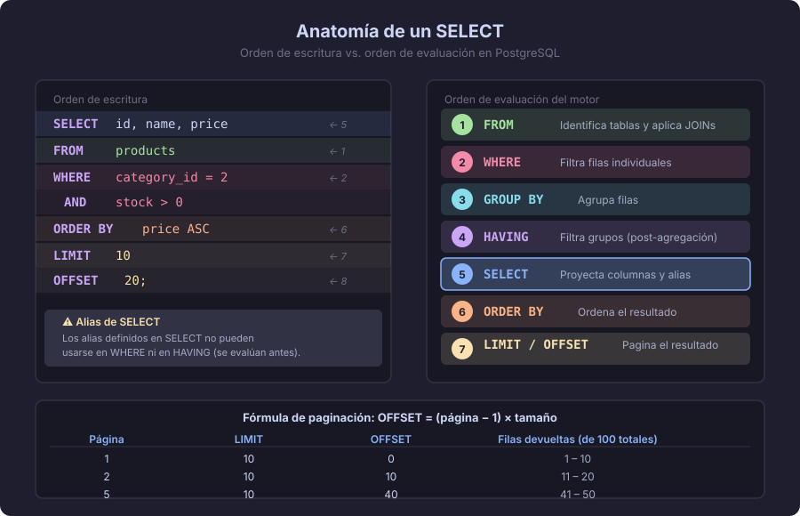

# SELECT: el corazón del lenguaje SQL

> "SQL no es un lenguaje de programación, es un lenguaje de declaración de intenciones: le dices **qué** quieres, no **cómo** buscarlo."

---

## ¿Por qué aprender SQL antes de modelar?

El diseño de bases de datos y la consulta SQL están profundamente interconectados.
Un buen diseñador sabe que una tabla mal estructurada hace que hasta la consulta más
simple sea dolorosa. Esta semana aprenderás a leer datos — en semanas posteriores,
entenderás por qué diseñar bien facilita exactamente esto.

---

## Anatomía de un SELECT

```sql
SELECT   columnas           -- ¿qué campos quiero ver?
FROM     tabla              -- ¿de dónde?
WHERE    condicion          -- ¿con qué filtro?
ORDER BY columna [ASC|DESC] -- ¿en qué orden?
LIMIT    n                  -- ¿cuántas filas?
OFFSET   m;                 -- ¿saltando cuántas?
```

PostgreSQL evalúa estas cláusulas en un orden lógico diferente al que las escribimos:

```
FROM → WHERE → SELECT → ORDER BY → LIMIT / OFFSET
```

Esto tiene implicaciones importantes: **no puedes filtrar en WHERE usando un alias
definido en SELECT**, porque WHERE se evalúa antes.



---

## Cláusula WHERE — filtrar filas

`WHERE` acepta cualquier expresión que produzca un valor booleano (`TRUE` / `FALSE`).

### Operadores de comparación

```sql
-- Igualdad y desigualdad
SELECT * FROM products WHERE price = 29.99;
SELECT * FROM products WHERE price <> 29.99;   -- distinto
SELECT * FROM products WHERE price != 29.99;   -- equivalente a <>

-- Rango
SELECT * FROM products WHERE price > 10 AND price <= 50;
SELECT * FROM products WHERE price BETWEEN 10 AND 50;   -- inclusivo en ambos extremos

-- Lista de valores
SELECT * FROM products WHERE category_id IN (1, 3, 7);
SELECT * FROM products WHERE category_id NOT IN (2, 4);
```

### Operador LIKE — patrones de texto

```sql
-- % = cualquier secuencia de caracteres (incluida vacía)
-- _ = exactamente un carácter

SELECT * FROM products WHERE name LIKE 'Café%';      -- empieza con "Café"
SELECT * FROM products WHERE name LIKE '%orgánico%'; -- contiene "orgánico"
SELECT * FROM products WHERE sku  LIKE 'PRD-___';    -- "PRD-" + 3 caracteres exactos
```

> En PostgreSQL, `ILIKE` hace lo mismo pero insensible a mayúsculas/minúsculas.

### Condiciones compuestas

```sql
-- AND: ambas condiciones deben ser verdaderas
SELECT * FROM orders
WHERE status = 'pending'
  AND created_at >= '2026-01-01';

-- OR: al menos una condición debe ser verdadera
SELECT * FROM products
WHERE category_id = 1
   OR category_id = 2;

-- NOT: negación
SELECT * FROM products
WHERE NOT (price < 5.00);

-- Paréntesis para controlar prioridad (AND tiene mayor prioridad que OR)
SELECT * FROM orders
WHERE (status = 'pending' OR status = 'processing')
  AND total > 100;
```

---

## Cláusula ORDER BY — ordenar resultados

```sql
-- Ascendente (por defecto)
SELECT id, name, price FROM products ORDER BY price ASC;
SELECT id, name, price FROM products ORDER BY price;      -- ASC es el default

-- Descendente
SELECT id, name, price FROM products ORDER BY price DESC;

-- Múltiples columnas: primero por precio, luego alfabéticamente
SELECT id, name, price FROM products ORDER BY price DESC, name ASC;

-- Por posición de columna (evitar en código real, frágil ante cambios de esquema)
SELECT id, name, price FROM products ORDER BY 3 DESC;
```

### NULL en ORDER BY

Por defecto en PostgreSQL, los NULL aparecen **al final** en ORDER ASC y **al inicio** en ORDER DESC. Puedes controlarlo:

```sql
SELECT id, name, deleted_at
FROM products
ORDER BY deleted_at ASC NULLS LAST;   -- NULL siempre al final
```

---

## Cláusulas LIMIT y OFFSET — paginación

```sql
-- Traer solo los primeros 10 resultados
SELECT id, name, price
FROM products
ORDER BY price DESC
LIMIT 10;

-- Página 3 de resultados (10 por página)
-- Página 1: OFFSET 0, Página 2: OFFSET 10, Página 3: OFFSET 20
SELECT id, name, price
FROM products
ORDER BY price DESC
LIMIT  10
OFFSET 20;
```

> **Regla de oro:** Siempre combina LIMIT/OFFSET con ORDER BY.
> Sin ORDER BY, el motor puede devolver las filas en cualquier orden y
> la paginación será inconsistente.

---

## Proyección y alias

No siempre necesitas todas las columnas. La **proyección** es elegir qué columnas traer.

```sql
-- Traer solo nombre y precio
SELECT name, price FROM products;

-- Alias con AS — renombra columnas en el resultado
SELECT
    name              AS producto,
    price             AS precio_usd,
    stock * price     AS valor_inventario
FROM products;

-- AS es opcional (se puede omitir, pero se recomienda escribirlo)
SELECT name producto FROM products;  -- funciona pero es menos legible
```

---

## DISTINCT — eliminar duplicados

```sql
-- ¿Qué ciudades tienen clientes registrados?
SELECT DISTINCT city FROM customers ORDER BY city;

-- ¿Qué combinaciones país-ciudad existen?
SELECT DISTINCT country, city FROM customers ORDER BY country, city;
```

> `DISTINCT` opera sobre **la fila completa** proyectada, no solo la primera columna.

---

## Ejemplo integrador

```sql
-- ¿Cuáles son los 5 productos más baratos de la categoría 2
--  que tienen stock disponible, ordenados por precio ascendente?
SELECT
    id,
    name                AS producto,
    price               AS precio,
    stock
FROM products
WHERE category_id = 2
  AND stock > 0
ORDER BY price ASC
LIMIT 5;
```

---

## Errores comunes

| Error | Descripción | Solución |
|-------|-------------|----------|
| `WHERE` con alias de `SELECT` | `WHERE total > 100` cuando `total` es alias definido en SELECT | Usar la expresión completa o un subquery |
| `ORDER BY` sin `LIMIT` en paginación | Resultados inconsistentes | Siempre incluir ORDER BY |
| `BETWEEN` con fechas sin hora | `BETWEEN '2026-01-01' AND '2026-01-31'` no incluye el día 31 a las 23:59 | Usar `>= ... AND < ...` para rangos de fechas con TIMESTAMPTZ |
| `LIKE` con `%` al inicio | `LIKE '%palabra'` no puede usar índice de B-tree | Evaluar si ILIKE o búsqueda de texto completo es más adecuada |

---

## Resumen

- `SELECT` + `FROM` son obligatorios; el resto de cláusulas son opcionales.
- `WHERE` filtra filas antes de seleccionar — no puede usar alias de `SELECT`.
- `ORDER BY` garantiza un orden determinista; necesario para paginación correcta.
- `LIMIT` + `OFFSET` implementan paginación; siempre acompañar de `ORDER BY`.
- `DISTINCT` elimina filas duplicadas del resultado.

---

← [README Semana 02](../README.md) &nbsp;&nbsp;|&nbsp;&nbsp; [02 — JOINs →](./02-joins.md)
