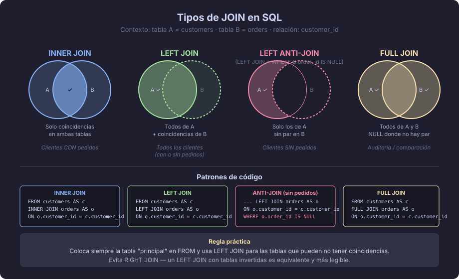

# JOINs: combinando tablas relacionadas

> "Una base de datos relacional sin JOINs es como una biblioteca donde cada libro
> tiene el índice en un cuarto separado — los datos tienen valor cuando se combinan."

---

## ¿Por qué necesitamos JOINs?

El modelo relacional distribuye la información en **múltiples tablas** para evitar
redundancia y mantener la coherencia. Los JOINs son el mecanismo que permite
**reunir** esa información cuando la necesitamos.

Cuando dices "quiero el nombre del cliente junto con sus pedidos", estás describiendo
un JOIN entre `customers` y `orders`.



---

## Concepto: la condición de JOIN

Un JOIN combina filas de dos tablas basándose en una condición, casi siempre
la igualdad entre una **clave foránea** y la **clave primaria** que referencia:

```sql
-- Patrón general
SELECT ...
FROM   tabla_a AS a
JOIN   tabla_b AS b  ON b.id = a.tabla_b_id
```

La condición `ON b.id = a.tabla_b_id` es el **predicado de JOIN**.
Puedes usar cualquier expresión booleana, pero la igualdad de claves es el 95% de los casos.

---

## INNER JOIN — la intersección

Devuelve solo las filas que tienen correspondencia en **ambas** tablas.
Si un registro no tiene par en la otra tabla, **no aparece**.

```sql
-- ¿Qué pedidos existen y quién los hizo?
SELECT
    o.id            AS pedido_id,
    c.full_name     AS cliente,
    o.created_at    AS fecha
FROM orders         AS o
INNER JOIN customers AS c  ON c.id = o.customer_id
ORDER BY o.created_at DESC;
```

> `INNER` es opcional — `JOIN` a secas es un INNER JOIN.
> Se recomienda escribirlo explícitamente para mayor claridad.

---

## LEFT JOIN — todos los de la izquierda

Devuelve **todas** las filas de la tabla izquierda (la del FROM), aunque no tengan
correspondencia en la tabla derecha. Las columnas de la derecha serán `NULL` cuando
no exista coincidencia.

```sql
-- ¿Qué clientes existen, hayan hecho pedidos o no?
SELECT
    c.id            AS cliente_id,
    c.full_name     AS cliente,
    o.id            AS pedido_id    -- será NULL si no tiene pedidos
FROM customers      AS c
LEFT JOIN orders    AS o  ON o.customer_id = c.id
ORDER BY c.full_name;
```

**Caso de uso típico:** encontrar registros "huérfanos" (clientes sin pedidos):

```sql
-- Clientes que NUNCA han realizado un pedido
SELECT
    c.id,
    c.full_name,
    c.email
FROM customers   AS c
LEFT JOIN orders AS o  ON o.customer_id = c.id
WHERE o.id IS NULL;  -- <-- la magia: filtramos los que no tienen par
```

---

## RIGHT JOIN — todos los de la derecha

Espejo del LEFT JOIN: devuelve todas las filas de la tabla **derecha**
(la del JOIN), aunque no tengan par en la izquierda.

```sql
-- Equivalente al LEFT JOIN anterior, con tablas invertidas
SELECT
    c.id,
    c.full_name
FROM orders      AS o
RIGHT JOIN customers AS c  ON c.id = o.customer_id
WHERE o.id IS NULL;
```

> **Consejo práctico:** en la mayoría de casos puedes reescribir un RIGHT JOIN
> como LEFT JOIN simplemente intercambiando el orden de las tablas.
> El LEFT JOIN es más común y más legible.

---

## FULL JOIN — la unión

Devuelve **todas** las filas de ambas tablas. Donde no hay coincidencia,
rellena con `NULL`.

```sql
-- Ver todos los clientes y todos los pedidos, emparejados donde sea posible
SELECT
    c.full_name  AS cliente,
    o.id         AS pedido_id
FROM customers   AS c
FULL JOIN orders AS o  ON o.customer_id = c.id;
```

**Caso de uso:** auditoría de integridad referencial, comparar dos conjuntos de datos.

---

## CROSS JOIN — el producto cartesiano

Combina **cada fila** de la primera tabla con **cada fila** de la segunda.
Raramente se usa en producción, pero es útil para generar combinaciones.

```sql
-- 3 tallas × 4 colores = 12 variantes posibles
SELECT sizes.name AS talla, colors.name AS color
FROM sizes
CROSS JOIN colors;
```

> Sin condición ON: si A tiene 1 000 filas y B tiene 1 000 filas,
> el resultado tiene 1 000 000 de filas. Úsalo con precaución.

---

## JOINs múltiples

Puedes encadenar tantos JOINs como necesites:

```sql
-- Pedido + cliente + ítems del pedido + producto de cada ítem
SELECT
    o.id                AS pedido_id,
    c.full_name         AS cliente,
    p.name              AS producto,
    oi.quantity,
    oi.unit_price,
    oi.quantity * oi.unit_price  AS subtotal
FROM orders             AS o
INNER JOIN customers    AS c   ON c.id  = o.customer_id
INNER JOIN order_items  AS oi  ON oi.order_id = o.id
INNER JOIN products     AS p   ON p.id  = oi.product_id
ORDER BY o.id, p.name;
```

**Tip de legibilidad:** alinea los alias y los predicados ON en columna para que
la cadena de joins sea fácil de seguir.

---

## Self JOIN — una tabla se une a sí misma

Útil para relaciones reflexivas (empleados y sus supervisores, categorías con
subcategorías, etc.):

```sql
-- employees tiene la columna manager_id que apunta al id del mismo empleado
SELECT
    e.full_name    AS empleado,
    m.full_name    AS supervisor
FROM employees     AS e
LEFT JOIN employees AS m  ON m.id = e.manager_id
ORDER BY m.full_name NULLS FIRST;
```

---

## Errores comunes

| Error | Descripción | Solución |
|-------|-------------|----------|
| Filas duplicadas inesperadas | JOIN con relación 1:N sin agrupar devuelve más filas de las esperadas | Verificar la cardinalidad antes de hacer el JOIN |
| Confundir LEFT con RIGHT | Olvidar cuál tabla es "la principal" | Nombrar siempre la tabla más importante en FROM; usar LEFT JOIN |
| Predicado ON incorrecto | `ON a.id = b.id` cuando debería ser `ON b.a_id = a.id` | Revisar las claves foráneas del modelo |
| NULL después de LEFT JOIN | Los valores NULL de la tabla derecha rompen cálculos | Usar COALESCE para valores por defecto |
| Producto cartesiano accidental | Olvidar la condición ON en un JOIN | El plan de ejecución mostrará un Hash Join sin predicado |

---

## Resumen visual

| JOIN | ¿Qué devuelve? | Caso de uso típico |
|------|----------------|--------------------|
| INNER JOIN | Solo los que coinciden en ambas tablas | Listar pedidos con su cliente |
| LEFT JOIN | Todos de la izquierda + coincidencias | Clientes con o sin pedidos |
| RIGHT JOIN | Todos de la derecha + coincidencias | Equivalente invertido al LEFT |
| FULL JOIN | Todos de ambas tablas | Auditoría, comparación de conjuntos |
| CROSS JOIN | Producto cartesiano | Generar combinaciones |

---

← [01 — SELECT →](./01-select-where-order-limit.md) &nbsp;&nbsp;|&nbsp;&nbsp; [03 — NULL →](./03-null-y-comparaciones.md)
