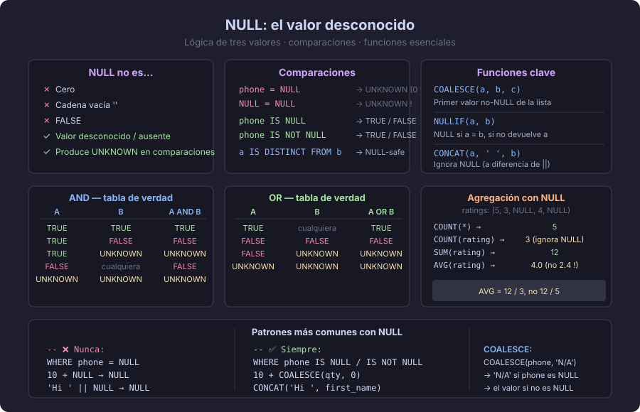

# NULL: el valor desconocido

> "NULL no significa cero, no significa vacío, no significa falso.
> NULL significa **'no sé'** — y eso cambia todo."

---

## ¿Qué es NULL?

`NULL` es un marcador especial en SQL que representa un valor **desconocido, ausente o
no aplicable**. No es un valor en sí mismo; es la ausencia de valor.

Ejemplos del mundo real:
- El campo `birth_date` de un usuario que no lo proporcionó → `NULL` (desconocido)
- El campo `deleted_at` de un registro activo → `NULL` (no aplica, aún no fue eliminado)
- El campo `phone` de un cliente que no tiene teléfono → `NULL` (ausente)

---

## La lógica de tres valores (3VL)

SQL no opera con lógica binaria (verdadero/falso), sino con **lógica de tres valores**:
`TRUE`, `FALSE` y `UNKNOWN`.

Cuando cualquier operando de una comparación es `NULL`, el resultado es `UNKNOWN`.
Y `UNKNOWN` en una cláusula `WHERE` se comporta como `FALSE` — la fila **no aparece**.

```sql
-- Esto NO devuelve los NULL
SELECT * FROM users WHERE phone = NULL;   -- siempre devuelve 0 filas

-- Esto SÍ devuelve los NULL
SELECT * FROM users WHERE phone IS NULL;

-- Esto SÍ devuelve los no-NULL
SELECT * FROM users WHERE phone IS NOT NULL;
```



---

## Tabla de verdad con NULL

### AND

| A | B | A AND B |
|---|---|---------|
| TRUE | TRUE | TRUE |
| TRUE | FALSE | FALSE |
| TRUE | UNKNOWN | UNKNOWN |
| FALSE | cualquier | FALSE |
| UNKNOWN | UNKNOWN | UNKNOWN |

### OR

| A | B | A OR B |
|---|---|--------|
| TRUE | cualquier | TRUE |
| FALSE | FALSE | FALSE |
| FALSE | UNKNOWN | UNKNOWN |
| UNKNOWN | UNKNOWN | UNKNOWN |

### NOT

| A | NOT A |
|---|-------|
| TRUE | FALSE |
| FALSE | TRUE |
| UNKNOWN | UNKNOWN |

---

## NULL en aritmética y concatenación

```sql
-- Cualquier operación aritmética con NULL produce NULL
SELECT 10 + NULL;    -- NULL
SELECT 5  * NULL;    -- NULL
SELECT 0  + NULL;    -- NULL (no es 0)

-- Concatenación de texto (en PostgreSQL, || es concatenación)
SELECT 'Hola ' || NULL;  -- NULL  (cuidado!)

-- Solución: usar COALESCE para dar un valor por defecto
SELECT 'Hola ' || COALESCE(first_name, 'Visitante');  -- 'Hola Visitante'
```

---

## Funciones esenciales para manejar NULL

### COALESCE — primer valor no NULL

```sql
-- Devuelve el primer argumento que no sea NULL
SELECT COALESCE(phone, mobile, 'Sin teléfono') AS contacto
FROM customers;

-- Uso común: evitar NULL en cálculos
SELECT
    name,
    price * COALESCE(discount_pct, 0) / 100  AS descuento
FROM products;
```

### NULLIF — convierte un valor a NULL

```sql
-- Devuelve NULL si los dos argumentos son iguales; de lo contrario, devuelve el primero
SELECT NULLIF(stock, 0) AS stock_valido FROM products;
-- Útil para evitar división por cero:
SELECT total / NULLIF(quantity, 0) AS precio_unitario FROM order_items;
```

### IS DISTINCT FROM — comparación NULL-safe

```sql
-- = NULL siempre es UNKNOWN
-- IS DISTINCT FROM maneja NULL de forma predecible
SELECT * FROM products
WHERE new_price IS DISTINCT FROM old_price;
-- Devuelve filas donde los precios son diferentes O uno de ellos es NULL y el otro no
```

---

## NULL en funciones de agregación

Las funciones de agregación **ignoran los NULL** automáticamente:

```sql
-- Tabla: ratings con valores (5, 3, NULL, 4, NULL)
SELECT
    COUNT(*)           AS total_filas,      -- 5 (cuenta filas, incluye NULL)
    COUNT(rating)      AS con_rating,       -- 3 (ignora NULL)
    AVG(rating)        AS promedio,         -- (5+3+4)/3 = 4.0, no (5+3+0+4+0)/5
    SUM(rating)        AS suma              -- 12 (ignora NULL)
FROM reviews;
```

> Este comportamiento es correcto en casi todos los casos, pero hay que conocerlo
> para no interpretar mal los resultados.

---

## NULL en ORDER BY

Como vimos en el tema anterior, en PostgreSQL:
- `ORDER BY col ASC` → NULL al **final**
- `ORDER BY col DESC` → NULL al **principio**

```sql
-- Controlar explícitamente dónde van los NULL
SELECT name, deleted_at
FROM products
ORDER BY deleted_at ASC NULLS LAST;
```

---

## NULL en constraints

```sql
-- NOT NULL prohíbe insertar NULL en esa columna
CREATE TABLE products (
    product_id    UUID         DEFAULT gen_random_uuid() PRIMARY KEY,
    product_name  VARCHAR(100) NOT NULL,  -- obligatorio
    product_sku   VARCHAR(20),            -- opcional, puede ser NULL
    product_price NUMERIC(10,2) NOT NULL  -- obligatorio
);

-- UNIQUE permite múltiples NULL (cada NULL es distinto de los demás)
CREATE TABLE customers (
    customer_id    UUID         DEFAULT gen_random_uuid() PRIMARY KEY,
    customer_email VARCHAR(150) UNIQUE,   -- NULL está permitido y no choca con otros NULL
    customer_phone VARCHAR(20)  UNIQUE
);
```

---

## Errores comunes

| Error | Código incorrecto | Código correcto |
|-------|-------------------|-----------------|
| Comparar con NULL usando = | `WHERE phone = NULL` | `WHERE phone IS NULL` |
| Asumir que NULL = 0 | `COALESCE(qty, 0) + price` — correcto, pero NULL no era 0 | Documentar la decisión |
| `COUNT(*)` vs `COUNT(col)` | `COUNT(rating)` cuando querías contar filas totales | `COUNT(*)` para filas totales |
| División por cero con NULL | `total / quantity` cuando quantity puede ser 0 | `total / NULLIF(quantity, 0)` |
| Concatenar texto con NULL | `first_name || ' ' || last_name` (NULL si alguno falta) | `CONCAT(first_name, ' ', last_name)` — CONCAT ignora NULL |

---

## Resumen

- `NULL` representa valor desconocido o ausente — no es cero, no es cadena vacía.
- Comparar con `NULL` usando `=` siempre produce `UNKNOWN` → usar `IS NULL` / `IS NOT NULL`.
- La aritmética y la mayoría de funciones se "contaminan" por NULL (devuelven NULL).
- `COALESCE` es la solución estándar para dar valores por defecto.
- Las funciones de agregación ignoran NULL — importante para interpretar promedios.
- `UNIQUE` permite múltiples NULL.

---

← [02 — JOINs](./02-joins.md) &nbsp;&nbsp;|&nbsp;&nbsp; [04 — Agregación →](./04-agregacion-group-by.md)
