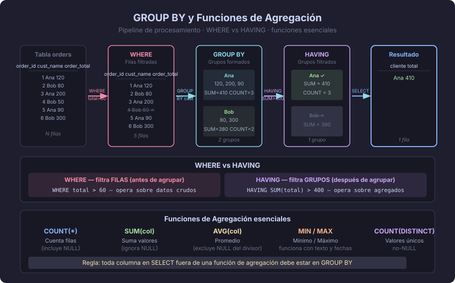

# Agregación y GROUP BY

> "Las funciones de agregación convierten muchas filas en una sola respuesta.
> GROUP BY convierte muchas filas en muchos grupos, cada uno con su respuesta."

---

## ¿Qué es la agregación?

Hasta ahora hemos consultado filas individuales. La **agregación** nos permite
calcular estadísticas sobre conjuntos de filas:

- ¿Cuántos pedidos hay? → `COUNT`
- ¿Cuánto suma el total de ventas? → `SUM`
- ¿Cuál es el precio promedio? → `AVG`
- ¿Cuál es el producto más caro? → `MAX`
- ¿Cuál es el precio mínimo? → `MIN`



---

## Funciones de agregación

```sql
-- Dataset de ejemplo: tabla orders con columna total

SELECT
    COUNT(*)           AS total_pedidos,        -- cuenta todas las filas
    COUNT(total)       AS pedidos_con_total,     -- cuenta solo las no-NULL
    SUM(total)         AS ingresos_totales,
    AVG(total)         AS ticket_promedio,
    MIN(total)         AS pedido_mas_bajo,
    MAX(total)         AS pedido_mas_alto,
    ROUND(AVG(total), 2) AS ticket_promedio_redondeado
FROM orders;
```

> Recordar de la teoría anterior: las funciones de agregación **ignoran NULL**.

---

## GROUP BY — agregación por grupos

`GROUP BY` divide las filas en grupos y aplica la función de agregación
**a cada grupo por separado**:

```sql
-- ¿Cuántos pedidos tiene cada cliente?
SELECT
    customer_id,
    COUNT(*)   AS total_pedidos,
    SUM(total) AS total_gastado
FROM orders
GROUP BY customer_id
ORDER BY total_gastado DESC;
```

### Regla de oro de GROUP BY

> Toda columna en `SELECT` que **no esté dentro** de una función de agregación
> **debe aparecer** en `GROUP BY`.

```sql
-- ❌ ERROR: name no está en GROUP BY ni dentro de una función de agregación
SELECT customer_id, name, COUNT(*) FROM orders GROUP BY customer_id;

-- ✅ CORRECTO
SELECT customer_id, COUNT(*) FROM orders GROUP BY customer_id;

-- ✅ CORRECTO: name está en GROUP BY
SELECT customer_id, name, COUNT(*)
FROM orders
GROUP BY customer_id, name;
```

---

## GROUP BY con JOIN

Lo más habitual es combinar GROUP BY con JOINs para mostrar información legible:

```sql
-- ¿Cuántos pedidos tiene cada cliente, mostrando su nombre?
SELECT
    c.full_name                 AS cliente,
    COUNT(o.id)                 AS total_pedidos,
    COALESCE(SUM(o.total), 0)   AS total_gastado
FROM customers   AS c
LEFT JOIN orders AS o  ON o.customer_id = c.id
GROUP BY c.id, c.full_name
ORDER BY total_gastado DESC;
```

> Nota: agrupamos por `c.id` y `c.full_name`. En PostgreSQL, `GROUP BY c.id`
> es suficiente si `full_name` es funcionalmente dependiente de `id` (es su PK).
> Sin embargo, escribir ambas es más portátil y explícito.

---

## HAVING — filtrar grupos

`WHERE` filtra filas **antes** de agrupar.
`HAVING` filtra grupos **después** de agrupar.

```sql
-- ¿Qué clientes han realizado más de 5 pedidos?
SELECT
    customer_id,
    COUNT(*) AS total_pedidos
FROM orders
GROUP BY customer_id
HAVING COUNT(*) > 5;

-- ¿Qué categorías tienen ventas totales superiores a $10 000?
SELECT
    p.category_id,
    SUM(oi.quantity * oi.unit_price) AS ventas_totales
FROM order_items  AS oi
INNER JOIN products AS p  ON p.id = oi.product_id
GROUP BY p.category_id
HAVING SUM(oi.quantity * oi.unit_price) > 10000
ORDER BY ventas_totales DESC;
```

### WHERE vs HAVING

```sql
-- WHERE filtra ANTES de agrupar (más eficiente: reduce filas que se procesan)
SELECT category_id, COUNT(*)
FROM products
WHERE price > 10        -- filtra productos baratos antes de agrupar
GROUP BY category_id;

-- HAVING filtra DESPUÉS de agrupar (opera sobre el resultado del grupo)
SELECT category_id, COUNT(*)
FROM products
GROUP BY category_id
HAVING COUNT(*) > 5;    -- solo categorías con más de 5 productos

-- Puedes combinar ambos
SELECT category_id, COUNT(*) AS total
FROM products
WHERE price > 10        -- filtra primero por precio
GROUP BY category_id
HAVING COUNT(*) > 5     -- luego filtra por cantidad de productos en el grupo
ORDER BY total DESC;
```

---

## Orden completo de evaluación SQL

Ahora podemos completar el orden de evaluación que iniciamos en el tema 1:

```
1. FROM        — identifica tablas y aplica JOINs
2. WHERE       — filtra filas individuales
3. GROUP BY    — agrupa filas
4. HAVING      — filtra grupos
5. SELECT      — proyecta columnas y aplica funciones
6. DISTINCT    — elimina duplicados del resultado
7. ORDER BY    — ordena el resultado final
8. LIMIT       — limita la cantidad de filas devueltas
9. OFFSET      — salta N filas
```

Esto explica por qué:
- No puedes usar alias de SELECT en WHERE ni en HAVING.
- Sí puedes usar alias de SELECT en ORDER BY (PostgreSQL lo permite como extensión).

---

## Funciones adicionales útiles

```sql
-- STRING_AGG: concatena valores de un grupo en una cadena
SELECT
    category_id,
    STRING_AGG(name, ', ' ORDER BY name) AS productos
FROM products
GROUP BY category_id;

-- ARRAY_AGG: reúne valores en un array
SELECT
    customer_id,
    ARRAY_AGG(DISTINCT status ORDER BY status) AS estados_pedidos
FROM orders
GROUP BY customer_id;

-- COUNT(DISTINCT): cuántos valores únicos hay
SELECT COUNT(DISTINCT customer_id) AS clientes_con_pedidos FROM orders;
```

---

## Errores comunes

| Error | Descripción | Solución |
|-------|-------------|----------|
| Columna no agregada en SELECT | `SELECT name, COUNT(*)` sin `name` en GROUP BY | Agregar `name` a GROUP BY o envolverlo en una función de agregación |
| Usar WHERE para filtrar por agregado | `WHERE COUNT(*) > 5` — error de sintaxis | Usar HAVING para filtrar por resultados de agregación |
| AVG de enteros truncado | `AVG(INTEGER)` produce resultado entero en algunos SGBD | En PostgreSQL, AVG siempre devuelve NUMERIC — sin problema |
| Confundir COUNT(*) y COUNT(col) | `COUNT(col)` ignora NULL; `COUNT(*)` no | Elegir conscientemente según si quieres contar los NULL o no |

---

## Ejemplo integrador completo

```sql
-- Informe de ventas por categoría: nombre, total vendido, ticket promedio,
-- número de pedidos — solo categorías con más de 3 pedidos
SELECT
    cat.name                                     AS categoria,
    COUNT(DISTINCT o.id)                         AS total_pedidos,
    SUM(oi.quantity * oi.unit_price)             AS ingresos_totales,
    ROUND(AVG(oi.quantity * oi.unit_price), 2)   AS ticket_promedio
FROM categories         AS cat
INNER JOIN products     AS p    ON p.category_id = cat.id
INNER JOIN order_items  AS oi   ON oi.product_id = p.id
INNER JOIN orders       AS o    ON o.id = oi.order_id
GROUP BY cat.id, cat.name
HAVING COUNT(DISTINCT o.id) > 3
ORDER BY ingresos_totales DESC;
```

---

## Resumen

- Las funciones de agregación (`COUNT`, `SUM`, `AVG`, `MIN`, `MAX`) resumen muchas filas en un valor.
- `GROUP BY` divide los datos en grupos y aplica la agregación a cada grupo.
- Toda columna en SELECT fuera de una función de agregación debe estar en GROUP BY.
- `WHERE` filtra filas antes de agrupar; `HAVING` filtra grupos después de agrupar.
- Las funciones de agregación ignoran NULL — considerar el impacto en los resultados.

---

← [03 — NULL](./03-null-y-comparaciones.md) &nbsp;&nbsp;|&nbsp;&nbsp; [Práctica →](../2-practicas/README.md)
