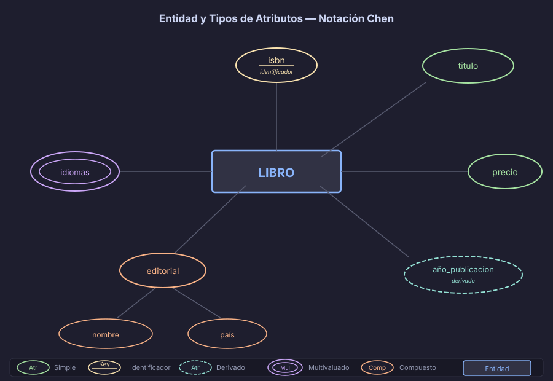

# Entidades y Atributos: el vocabulario del ER

El **Modelo Entidad-Relación (ER)** es el lenguaje con el que capturamos la realidad
de un negocio *antes* de pensar en tablas, columnas o tipos de datos. Su propósito
es responder una sola pregunta: **¿sobre qué necesitamos guardar información y cómo
se relaciona?**

El primer paso es aprender sus dos bloques fundamentales: **entidades** y **atributos**.



---

## 1. ¿Qué es una entidad?

Una **entidad** es cualquier persona, objeto, lugar, evento o concepto sobre el que
el sistema necesita almacenar información. Tiene existencia propia, independiente
de otras entidades.

### Características que debe cumplir una entidad

| Característica | Descripción | Ejemplo |
|---------------|-------------|---------|
| **Distinguible** | Cada instancia se puede identificar de forma única | El cliente con id=42 |
| **Relevante** | El negocio necesita gestionar su información | Los productos del catálogo |
| **Persistente** | Su información vale la pena almacenarla | Una venta realizada |

### Tipo de entidad vs. instancia

- **Tipo de entidad**: la clase o plantilla → `CLIENTE`
- **Instancia**: un dato concreto → Juan Pérez, id=42

En el diagrama ER modelamos el **tipo**; en la base de datos almacenamos las **instancias**.
En el modelo físico, cada tipo de entidad se convierte en una tabla.

### Ejemplos por categoría

| Categoría | Entidades típicas |
|-----------|-------------------|
| Personas  | CLIENTE, EMPLEADO, PROVEEDOR, MÉDICO, ESTUDIANTE |
| Objetos   | PRODUCTO, VEHICULO, LIBRO, HABITACION, MEDICAMENTO |
| Lugares   | SUCURSAL, CIUDAD, ALMACEN, SALA |
| Eventos   | VENTA, RESERVA, PEDIDO, CITA, INSCRIPCION |
| Conceptos | CATEGORIA, ROL, ESTADO, PLAN, CONTRATO |

---

## 2. Tipos de atributos

Un **atributo** es una propiedad descriptiva de una entidad. Conocer sus tipos
es fundamental: impactan directamente en cómo se implementa la entidad en el modelo físico.

### 2.1 Atributo simple (atómico)

Un valor indivisible: no tiene sentido dividirlo en partes menores.
La gran mayoría de atributos son simples.

**Símbolo Chen:** Óvalo con borde simple
**Ejemplos:** `precio`, `fecha_nacimiento`, `stock`, `correo_electronico`

### 2.2 Atributo compuesto

Formado por sub-componentes que tienen significado propio y pueden consultarse
o filtrarse de forma independiente.

**Símbolo Chen:** Óvalo que se ramifica en sub-óvalos
**Ejemplos:**
- `nombre_completo` → `primer_nombre` + `apellido`
- `direccion` → `calle`, `ciudad`, `pais`, `codigo_postal`

> **Decisión de diseño:** si solo necesitas el valor completo, mantenlo simple.
> Si necesitas filtrar o consultar por partes ("todos los clientes de México"),
> divídelo en atributos simples o promociónalo a entidad.

### 2.3 Atributo derivado

Su valor se **calcula** a partir de otro atributo u operación. No necesita almacenarse,
puede computarse cuando se necesita.

**Símbolo Chen:** Óvalo con borde discontinuo (punteado)
**Ejemplos:**
- `edad` (calculada de `fecha_nacimiento` + fecha actual)
- `total_pedido` (suma de las líneas del pedido)
- `antigüedad_empleado` (calculada de `fecha_ingreso`)

> **En el modelo físico:** los atributos derivados se implementan como columnas
> generadas (`GENERATED ALWAYS AS`) o funciones SQL. Nunca se almacenan con
> el riesgo de quedar desincronizados.

### 2.4 Atributo multivaluado

Puede tener **múltiples valores** para una misma instancia.

**Símbolo Chen:** Óvalo con doble borde
**Ejemplos:**
- `telefonos` de EMPRESA (central, soporte, ventas...)
- `idiomas` de LIBRO (Español, Inglés, Portugués)
- `especialidades` de MÉDICO

> **En el modelo físico:** los atributos multivaluados se convierten en una tabla
> separada con una relación 1:N hacia la entidad principal. Veremos esto en la
> Semana 06 al transformar el ER al modelo relacional.

### 2.5 Atributo identificador (clave)

Identifica de forma **única** cada instancia de la entidad. Es el futuro `PRIMARY KEY`.

**Símbolo Chen:** Nombre subrayado dentro del óvalo
**Ejemplos:** `isbn` (LIBRO), `numero_serie` (EQUIPO), `codigo_producto` (PRODUCTO)

> ✅ Toda entidad fuerte debe tener exactamente un atributo identificador.
> Si el dominio no ofrece un identificador natural, se añade un `id` sustituto.

---

## 3. Resumen visual de tipos de atributos

| Tipo | Símbolo Chen | ¿Se almacena? | Ejemplo |
|------|-------------|---------------|---------|
| Simple | Óvalo simple | ✅ Directamente | `precio` |
| Compuesto | Óvalo ramificado | ✅ Por partes | `direccion` |
| Derivado | Óvalo punteado | ❌ Se calcula | `edad` |
| Multivaluado | Óvalo doble | Tabla separada | `telefonos` |
| Identificador | Nombre subrayado | ✅ Es la PK | `isbn` |

---

## 4. Decisión clave: ¿entidad o atributo?

Esta es una de las preguntas más frecuentes en el diseño ER.

> **Regla de oro:** si algo tiene atributos propios → conviértelo en entidad.
> Si es solo un valor descriptivo → mantenlo como atributo.

### Ejemplo 1: `ciudad` en el modelo de clientes

**Escenario A** — solo guardamos el nombre de la ciudad:
```
CLIENTE
  └── ciudad  (atributo simple → un texto como "Bogotá")
```

**Escenario B** — necesitamos también país, código postal y región:
```
CLIENTE ———— pertenece a ———— CIUDAD
                                ├── nombre
                                ├── codigo_postal
                                ├── pais
                                └── region
```

### Ejemplo 2: `categoria` en productos

| Situación | Decisión |
|-----------|----------|
| Solo un nombre de categoría sin más datos | Atributo `categoria` en PRODUCTO |
| Categoría tiene descripción, imagen, jerarquía | Entidad CATEGORIA con relación a PRODUCTO |

### Señales de que un atributo debería ser entidad

1. Se repite exactamente el mismo valor en muchas instancias (→ redundancia evitable)
2. Tiene sus propios atributos descriptivos
3. Participa en relaciones con otras entidades
4. El negocio gestiona su ciclo de vida de forma independiente

---

## 5. Errores comunes

| Error | Descripción | Corrección |
|-------|-------------|-----------|
| **Entidad-campo** | Crear una entidad para cada campo de un formulario | Identificar las cosas del dominio, no los campos de pantalla |
| **Atributo-entidad** | `pais` como texto cuando el sistema gestiona países con detalle | Promover a entidad PAIS si tiene información propia |
| **Entidad redundante** | NOMBRE_CLIENTE cuando ya existe CLIENTE con `nombre` | Revisar si la información ya existe en otra entidad |
| **Derivado almacenado** | Guardar `total_pedido` cuando se puede calcular | Marcarlo como derivado o usar columna generada |
| **Sin identificador** | Entidad sin atributo clave ni PK sustituta | Agregar identificador natural o id sustituto |

---

## 6. Ejemplo integrador: entidad LIBRO

```
LIBRO
├── isbn           (identificador — clave)     ← subrayado en óvalo
├── titulo         (simple)
├── precio         (simple)
├── año_publicacion (simple)
├── edad_catalogo  (derivado)                  ← óvalo punteado
├── idiomas        (multivaluado)              ← óvalo doble
└── editorial      (compuesto)                 ← se ramifica
      ├── nombre_editorial
      └── pais_editorial
```

**Decisiones de diseño:**
- `edad_catalogo` = año actual − `año_publicacion`. No se almacena.
- `idiomas` en el modelo físico se convierte en tabla `book_languages`.
- `editorial` podría promover a entidad EDITORIAL si manejamos su catálogo completo
  (otros libros, datos de contacto, sede, etc.).

---

← [README Semana 03](../README.md) &nbsp;&nbsp;|&nbsp;&nbsp; [02 — Relaciones y cardinalidades →](02-relaciones-y-cardinalidades.md)
