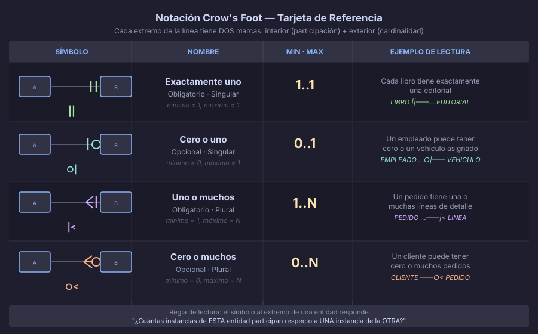
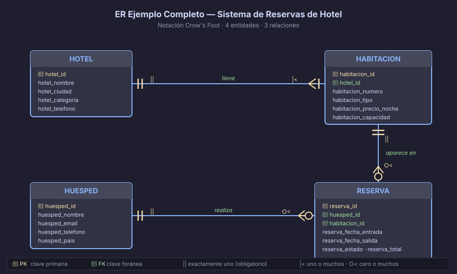

# Notación Crow's Foot

La **notación Crow's Foot** ("pata de cuervo") es el estándar visual de facto
para diagramas ER en herramientas profesionales como draw.io, Lucidchart y dbdiagram.io.
Reemplaza los rombos y óvalos de Chen por líneas con símbolos compactos en los extremos.



---

## 1. Historia y contexto

| Notación | Autor | Año | Características |
|----------|-------|-----|-----------------|
| **Chen ER** | Peter Chen | 1976 | Rombos, óvalos, tipos de atributos. Más académica y expresiva. |
| **Crow's Foot** | Gordon Everest / James Martin | 1976–1987 | Compacta, sin diamantes. Ampliamente adoptada en la industria. |
| **IDEF1X** | NIST | 1993 | Variante formal de Crow's Foot usada en estándares de gobierno. |

> ✅ En este bootcamp usamos **Chen** para explicar conceptos (tipos de atributos, etc.)
> y **Crow's Foot** para todos los diagramas ER prácticos, ya que es lo que
> encontrarás en draw.io, Lucidchart, dbdiagram.io y la mayoría de herramientas profesionales.

---

## 2. Los cuatro símbolos

Cada extremo de una línea de relación tiene **dos marcas** apiladas:
- **Interior** (más cerca de la entidad): indica la **participación** (mínimo)
- **Exterior** (hacia la línea): indica la **cardinalidad** (máximo)

### Marca de participación (mínimo)

| Símbolo | Significado | La entidad... |
|---------|-------------|---------------|
| `\|` (barra vertical) | Obligatorio — mínimo 1 | DEBE participar en la relación |
| `○` (círculo)         | Opcional — mínimo 0   | PUEDE no participar |

### Marca de cardinalidad (máximo)

| Símbolo | Significado | La entidad... |
|---------|-------------|---------------|
| `\|` (barra vertical)    | Uno — máximo 1 | Participa como máximo una vez |
| `<` (pata de cuervo) | Muchos — máximo N | Puede participar múltiples veces |

### Combinaciones resultantes

| Símbolo completo | Notación | Lectura |
|-----------------|----------|---------|
| `\|\|` | Exactamente uno | Obligatorio, singular |
| `○\|` | Cero o uno | Opcional, máximo uno |
| `\|<` | Uno o muchos | Obligatorio, puede ser varios |
| `○<` | Cero o muchos | Opcional, puede ser varios |

---

## 3. Cómo leer un diagrama Crow's Foot

### La regla de los dos extremos

Para cada línea de relación, lees **en ambas direcciones**:

1. Parado en la entidad A, miras hacia B:
   > *"Cada [A] se asocia con [símbolo en extremo B] [B]"*

2. Parado en la entidad B, miras hacia A:
   > *"Cada [B] se asocia con [símbolo en extremo A] [A]"*

### Ejemplo completo

```
EDITORIAL  ||——o<  LIBRO
```

- Símbolo en extremo LIBRO (`o<`): *"Cada EDITORIAL tiene cero o muchos LIBROS"*
- Símbolo en extremo EDITORIAL (`||`): *"Cada LIBRO pertenece a exactamente una EDITORIAL"*

**Regla de negocio capturada:** Una editorial puede existir sin haber publicado
ningún libro aún. Todo libro publicado tiene exactamente una editorial.

---

## 4. Los tres patrones principales

### 4.1 Uno a uno (1:1)

```
PERSONA  ||——||  PASAPORTE
```

Ambos extremos con `||` (exactamente uno). Cada persona tiene exactamente un
pasaporte; cada pasaporte pertenece a exactamente una persona.

### 4.2 Uno a muchos (1:N) — el más común

```
EDITORIAL  ||——o<  LIBRO
```

- Extremo LIBRO `o<`: una editorial tiene cero o muchos libros
- Extremo EDITORIAL `||`: cada libro pertenece a exactamente una editorial

También puedes ver la variante `|<` (uno o muchos) cuando la existencia del
"muchos" es obligatoria:

```
PEDIDO  ||——|<  LINEA_PEDIDO
```
*Un pedido tiene una o muchas líneas; cada línea pertenece a exactamente un pedido.*

### 4.3 Muchos a muchos (N:M) — requiere tabla intermedia

```
ESTUDIANTE  o<——o<  CURSO
```

Ambos extremos con `o<`. Un estudiante toma cero o muchos cursos;
un curso tiene cero o muchos estudiantes.

> ⚠️ Esta relación se **resuelve** en el modelo relacional con una tabla intermedia:
> `ESTUDIANTE` ← `inscripciones` → `CURSO`

---

## 5. Comparación Chen vs. Crow's Foot

| Elemento | Chen | Crow's Foot |
|----------|------|-------------|
| Entidad | Rectángulo | Rectángulo |
| Relación | Diamante con nombre | Línea con etiqueta |
| Cardinalidad | `1`, `N`, `M` junto a la línea | Símbolos `\|`, `○`, `<` en extremos |
| Participación total | Línea doble hacia entidad | `\|` interior |
| Participación parcial | Línea simple | `○` interior |
| Atributo simple | Óvalo | No representado (se documenta aparte) |
| Atributo clave | Óvalo con nombre subrayado | Columna marcada como PK |
| Atributo multivaluado | Óvalo doble | Tabla separada |
| Atributo derivado | Óvalo punteado | Columna generada / función |

---

## 6. draw.io — configuración para ER

### Paso a paso

1. Ir a **app.diagrams.net** o abrir draw.io Desktop
2. Crear nuevo diagrama → seleccionar plantilla **Entity Relationship**
3. En el panel izquierdo, activar la biblioteca **"Entity Relation"**
4. Para agregar una entidad: arrastrar el shape **"Entity"** (rectángulo)
5. Para conectar dos entidades: pasar el cursor por el borde de una entidad
   hasta que aparezca la flecha azul, y arrastrar a la otra entidad
6. Para cambiar el extremo de una relación: seleccionar la línea → panel
   derecho → **Connection** → elegir el estilo del extremo (ERone, ERmany, etc.)
7. Para etiquetar la relación: doble clic sobre la línea

### Convenciones de nombres

- **Entidades:** `MAYUSCULAS` (o PascalCase) para el nombre del tipo
- **Relaciones:** verbo en minúsculas itálica sobre la línea
- **Atributos:** se documentan en la hoja de análisis, no en el diagrama Crow's Foot

### Exportar como SVG

**Archivo** → **Exportar como** → **SVG** → activar **"Incluir una copia del diagrama"**
(esto permite reabrir el SVG en draw.io para seguir editándolo)

---

## 7. Ejemplo completo: Sistema de Reservas



El diagrama muestra un sistema de hotel con cuatro entidades: `HOTEL`, `HABITACION`,
`HUESPED` y `RESERVA`.

### Lectura de cada relación

| Relación | Dirección | Lectura |
|----------|-----------|---------|
| HOTEL — HABITACION | HOTEL → | Un hotel tiene una o muchas habitaciones |
| HOTEL — HABITACION | HABITACION → | Una habitación pertenece a exactamente un hotel |
| HUESPED — RESERVA | HUESPED → | Un huésped tiene cero o muchas reservas |
| HUESPED — RESERVA | RESERVA → | Una reserva pertenece a exactamente un huésped |
| HABITACION — RESERVA | HABITACION → | Una habitación aparece en cero o muchas reservas |
| HABITACION — RESERVA | RESERVA → | Una reserva incluye exactamente una habitación |

### Atributos clave (documentados aparte)

| Entidad | Atributo identificador | Atributos relevantes |
|---------|----------------------|----------------------|
| HOTEL | `id` | `nombre`, `ciudad`, `categoria` (1–5 estrellas) |
| HABITACION | `numero` (compuesto con `hotel_id`) | `tipo`, `precio_noche`, `capacidad` |
| HUESPED | `id` | `nombre`, `email`, `telefono`, `pais` |
| RESERVA | `id` | `fecha_entrada`, `fecha_salida`, `estado`, `total` |

---

← [02 — Relaciones y cardinalidades](02-relaciones-y-cardinalidades.md) &nbsp;&nbsp;|&nbsp;&nbsp; [Práctica →](../2-practicas/README.md)
