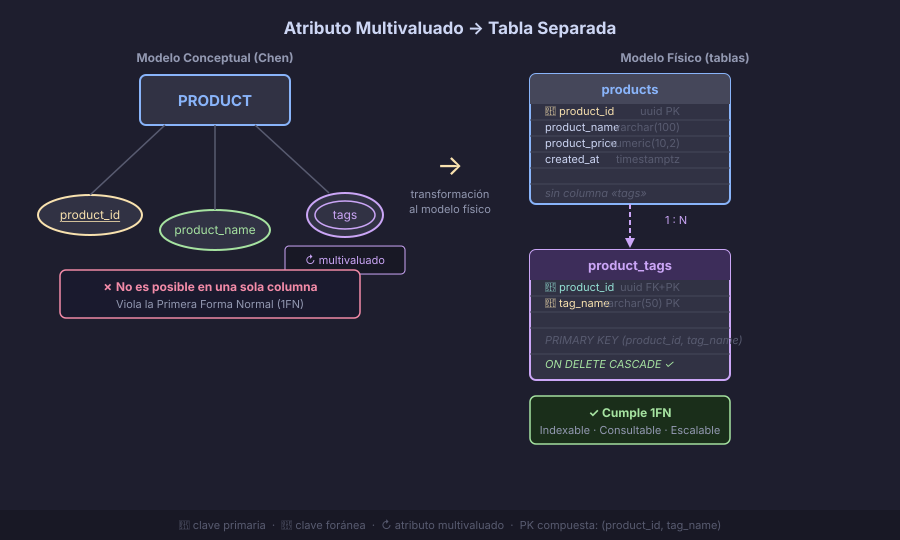

# Atributos Multivaluados y Compuestos

> En la Semana 03 aprendiste a reconocer estos tipos de atributos en un diagrama Chen.
> Esta semana profundizamos en cómo **transformarlos al modelo físico** — porque ninguna
> base de datos relacional puede almacenar directamente un atributo con múltiples valores.

---

## 🎯 Objetivos

- Distinguir atributo compuesto de multivaluado con precisión
- Saber cuándo descomponer un atributo compuesto en columnas separadas
- Transformar atributos multivaluados en tablas independientes
- Decidir cuándo un atributo multivaluado debería ser una entidad propia

---

## 📖 Atributo compuesto: descomponer o no descomponer

Un **atributo compuesto** tiene partes con significado propio (semana 03). La pregunta
de diseño es: ¿hasta dónde descomponemos?

### Regla de descomposición

> Descomponer si el sistema necesita **operar sobre las partes de forma independiente**:
> filtrar, ordenar, validar o mostrar por separado.

| Atributo | ¿Descomponer? | Justificación |
|----------|---------------|---------------|
| `nombre_completo` → `nombre` + `apellido` | ✅ Sí, si buscamos por apellido | Permite `ORDER BY apellido`, `WHERE apellido = 'García'` |
| `dirección` → `calle` + `ciudad` + `país` | ✅ Sí, si filtramos por ciudad | Permite análisis geográfico y reportes por región |
| `coordenadas` → `latitud` + `longitud` | ✅ Sí, para cálculos geoespaciales | Operaciones con `point` o extensión PostGIS |
| `nombre_completo` (solo para mostrar) | ❌ No siempre | Si nunca buscamos por apellido, una columna es suficiente |

### En el modelo físico

```sql
-- ❌ Antipatrón: guardar todo junto
CREATE TABLE customers (
    customer_id UUID DEFAULT gen_random_uuid() PRIMARY KEY,
    customer_full_name TEXT NOT NULL   -- "García, María Elena" — no se puede filtrar por apellido
);

-- ✅ Correctamente descompuesto
CREATE TABLE customers (
    customer_id         UUID         DEFAULT gen_random_uuid() PRIMARY KEY,
    customer_first_name VARCHAR(80)  NOT NULL,
    customer_last_name  VARCHAR(80)  NOT NULL,
    -- Derivado: no se almacena; se genera en la consulta
    -- full_name AS (last_name || ', ' || first_name)  -- en PostgreSQL: columna generada
    created_at          TIMESTAMPTZ  NOT NULL DEFAULT NOW()
);
```

---

## 📖 Atributo multivaluado: el problema central

Un **atributo multivaluado** puede tener *varios valores para la misma instancia*.
En notación Chen se dibuja con óvalo de doble borde.

### El problema con las bases de datos relacionales

Las bases de datos relacionales se basan en el **Principio de Primera Forma Normal**:
cada columna debe contener un valor **atómico** (indivisible). Almacenar múltiples
valores en una columna viola este principio y crea problemas graves:

```sql
-- ❌ Antipatrón: lista de valores en una columna
CREATE TABLE products (
    product_id         UUID         DEFAULT gen_random_uuid() PRIMARY KEY,
    product_name       VARCHAR(100) NOT NULL,
    product_categories TEXT  -- "electrónica,computadoras,laptops" ← NUNCA así
);

-- Problema 1: ¿Cómo busco todos los productos de categoría "computadoras"?
-- Requiere: WHERE categories LIKE '%computadoras%'  → muy lento, no usa índices

-- Problema 2: ¿Cómo cuento productos por categoría?
-- Imposible sin parsear la cadena en código de aplicación

-- Problema 3: ¿Cómo agrego o elimino solo una categoría?
-- Hay que leer, parsear, modificar y reescribir toda la cadena
```

### La solución: tabla separada



Todo atributo multivaluado se transforma en una **tabla independiente** con:
- Una `FK` que referencia a la entidad padre
- Una columna para el valor
- La `PK` puede ser compuesta (`entity_id + valor`) o un `id` sustituto

```sql
-- ✅ Correcto: tabla separada para el atributo multivaluado
CREATE TABLE products (
    product_id   UUID         DEFAULT gen_random_uuid() PRIMARY KEY,
    product_name VARCHAR(100) NOT NULL
);

CREATE TABLE product_categories (
    product_id  UUID        NOT NULL REFERENCES products(product_id) ON DELETE CASCADE,
    category    VARCHAR(50) NOT NULL,
    PRIMARY KEY (product_id, category)   -- PK compuesta: un producto no repite categoría
);

-- Ahora podemos:
-- Buscar por categoría:     SELECT * FROM products p JOIN product_categories pc ON pc.product_id = p.product_id WHERE pc.category = 'laptops'
-- Contar por categoría:     SELECT category, COUNT(*) FROM product_categories GROUP BY category
-- Agregar categoría:        INSERT INTO product_categories VALUES (gen_random_uuid(), 'gaming')
-- Eliminar categoría:       DELETE FROM product_categories WHERE product_id = '...' AND category = 'gaming'
```

---

## 📖 Ejemplos de atributos multivaluados comunes

| Entidad | Atributo multivaluado | Tabla que genera | Clave |
|---------|-----------------------|-----------------|-------|
| `PERSON` | `phone_numbers` | `person_phones` | `person_id + phone` |
| `PRODUCT` | `tags` | `product_tags` | `product_id + tag` |
| `EMPLOYEE` | `skills` | `employee_skills` | `employee_id + skill` |
| `ARTICLE` | `authors` | `article_authors` | `article_id + author_id → FK` |
| `ORDER` | `applied_discounts` | `order_discounts` | `order_id + discount_code` |

---

## 📖 ¿Atributo multivaluado o entidad propia?

Esta es la decisión más importante. Guíate con estas preguntas:

| Pregunta | Si responde SÍ → | Si responde NO → |
|----------|-----------------|-----------------|
| ¿El valor tiene atributos propios? | Entidad | Atributo multivaluado |
| ¿El valor participa en otras relaciones? | Entidad | Atributo multivaluado |
| ¿Otros objetos del sistema referencian este valor? | Entidad | Atributo multivaluado |
| ¿El conjunto de valores es abierto (ilimitado)? | Puede ser entidad | Puede ser enum o lookup |

### Ejemplo comparativo

**Caso 1 — `idiomas` de un libro:** solo necesitamos saber "en qué idiomas está disponible".
El idioma no tiene descripción, no participa en otras relaciones. → **Atributo multivaluado**

```sql
CREATE TABLE book_languages (
    book_id   UUID        NOT NULL REFERENCES books(book_id) ON DELETE CASCADE,
    language  CHAR(2)     NOT NULL,  -- código ISO: 'es', 'en', 'fr'
    PRIMARY KEY (book_id, language)
);
```

**Caso 2 — `categorías` de un producto en e-commerce:** cada categoría tiene nombre,
descripción, imagen, categoría padre (jerarquía), y se usa en menús de navegación.
→ **Entidad propia** (`CATEGORY`) con relación N:M a `PRODUCT`

```sql
CREATE TABLE categories (
    category_id   UUID         DEFAULT gen_random_uuid() PRIMARY KEY,
    category_name VARCHAR(80)  NOT NULL,
    description   TEXT,
    parent_id     UUID         REFERENCES categories(category_id)  -- jerarquía
);

CREATE TABLE product_categories (
    product_id   UUID NOT NULL REFERENCES products(product_id)   ON DELETE CASCADE,
    category_id  UUID NOT NULL REFERENCES categories(category_id) ON DELETE RESTRICT,
    PRIMARY KEY (product_id, category_id)
);
```

---

## 📖 Columnas generadas: el atributo derivado en PostgreSQL

Los atributos derivados (semana 03) tienen soporte nativo en PostgreSQL 12+ con
columnas generadas (`GENERATED ALWAYS AS`):

```sql
CREATE TABLE employees (
    employee_id         UUID         DEFAULT gen_random_uuid() PRIMARY KEY,
    employee_first_name VARCHAR(80)  NOT NULL,
    employee_last_name  VARCHAR(80)  NOT NULL,
    hire_date           DATE         NOT NULL,
    -- Columna generada: calculada automáticamente, almacenada en disco
    employee_full_name  TEXT GENERATED ALWAYS AS (employee_last_name || ', ' || employee_first_name) STORED,
    -- Antigüedad en años: en PostgreSQL, los GENERATED no pueden usar funciones volátiles
    -- Se calcula en consulta: EXTRACT(YEAR FROM age(hire_date)) AS years_of_service
    created_at          TIMESTAMPTZ  NOT NULL DEFAULT NOW()
);
```

> **Nota:** PostgreSQL solo soporta columnas generadas `STORED` (se calculan al insertar/actualizar
> y se almacenan en disco). Las columnas virtuales (calculadas al leer) están planificadas
> para versiones futuras.

---

## 🔑 Resumen

| Tipo | En ER (Chen) | En el modelo físico |
|------|-------------|---------------------|
| Atributo compuesto | Óvalo con sub-óvalos | Columnas separadas (si se opera sobre las partes) |
| Atributo multivaluado | Óvalo doble borde | Tabla separada con FK a la entidad |
| Atributo derivado | Óvalo borde discontinuo | NO se almacena; columna generada o cálculo en consulta |

---

← [README Semana 04](../README.md) &nbsp;&nbsp;|&nbsp;&nbsp; [02 — Entidades Débiles →](02-entidades-debiles.md)
