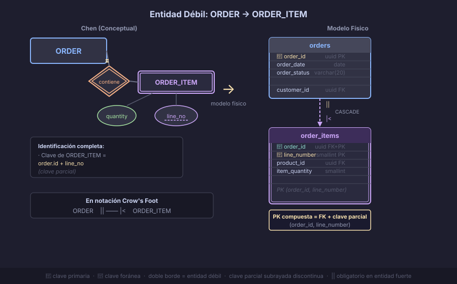

# Entidades Débiles y Relación de Identificación

> Una **entidad débil** no puede existir por sí sola: necesita de otra entidad para
> ser identificada. Es uno de los conceptos más importantes del ER intermedio y uno
> de los más frecuentes en sistemas reales.

---

## 🎯 Objetivos

- Reconocer cuándo una entidad es débil
- Identificar la clave parcial y la relación de identificación
- Representar entidades débiles en notación Crow's Foot
- Transformar la entidad débil al modelo físico con PK compuesta o sustituta

---

## 📖 ¿Qué es una entidad débil?

Una **entidad débil** (`weak entity`) es un tipo de entidad que:

1. **No tiene suficientes atributos propios** para identificar unívocamente sus instancias
2. **Depende existencialmente** de otra entidad (la entidad fuerte o propietaria)
3. Se identifica por la combinación de su **clave parcial** + el identificador de la entidad fuerte

### Vocabulario clave

| Término | Definición |
|---------|-----------|
| **Entidad débil** | Entidad sin identificador propio |
| **Entidad fuerte** (propietaria) | La entidad de la que depende la débil |
| **Clave parcial** (discriminador) | Atributo(s) de la débil que la distinguen *dentro de* la fuerte |
| **Relación de identificación** | La relación que vincula la débil con su fuerte; es total y obligatoria |

### Símbolos en notación Chen

- Entidad débil: **rectángulo de doble borde** `⬜⬜`
- Clave parcial: **atributo subrayado con línea discontinua**
- Relación de identificación: **rombo de doble borde** `◇◇`

---

## 📖 Ejemplo 1 — ITEM_PEDIDO: la entidad débil más común

Considera un sistema de e-commerce. Un pedido (`ORDER`) contiene varios ítems.
Cada ítem tiene un número de línea (1, 2, 3…), pero ese número **solo tiene sentido
dentro de su pedido**:

- El ítem de línea 1 del pedido #100 es diferente al ítem de línea 1 del pedido #200
- Sin saber a qué pedido pertenece, el número de línea no identifica nada

```
                    ┌─────────────────┐
                    │     ORDER       │
                    │─────────────────│
                    │ id (PK)         │
                    │ order_date      │
                    │ status          │
                    └────────┬────────┘
                             │
                             │ ||──|< (identificación: total, muchos ítems)
                             │
                    ┌─────────────────┐
                    │  ORDER_ITEM     │  ← entidad DÉBIL
                    │─────────────────│
                    │ order_id (FK+PK)│
                    │ line_number (PK)│  ← clave parcial (discriminador)
                    │ product_id (FK) │
                    │ quantity        │
                    │ unit_price      │
                    └─────────────────┘
```



### En el modelo físico

La PK de la entidad débil es **compuesta**: incluye la FK a la entidad fuerte + la clave parcial.

```sql
CREATE TABLE orders (
    id          BIGINT      GENERATED ALWAYS AS IDENTITY PRIMARY KEY,
    order_date  DATE        NOT NULL DEFAULT CURRENT_DATE,
    status      VARCHAR(20) NOT NULL DEFAULT 'pending',
    customer_id BIGINT      NOT NULL REFERENCES customers(id) ON DELETE RESTRICT
);

CREATE TABLE order_items (
    order_id     BIGINT         NOT NULL REFERENCES orders(id) ON DELETE CASCADE,
    line_number  SMALLINT       NOT NULL CHECK (line_number > 0),
    product_id   BIGINT         NOT NULL REFERENCES products(id) ON DELETE RESTRICT,
    quantity     SMALLINT       NOT NULL CHECK (quantity > 0),
    unit_price   NUMERIC(10,2)  NOT NULL CHECK (unit_price >= 0),
    PRIMARY KEY (order_id, line_number)   -- PK compuesta: FK + discriminador
);
```

> **ON DELETE CASCADE** en la FK de la débil a la fuerte: si se borra el pedido,
> se borran sus ítems. El ítem no tiene sentido sin el pedido.

---

## 📖 Ejemplo 2 — HABITACION: débil respecto a HOTEL

Una habitación se identifica por su número (`101`, `202`…), pero ese número solo
es único *dentro de un hotel*. El mismo número `101` puede existir en el Hotel Paraíso
y en el Hotel Las Flores.

```sql
CREATE TABLE hotels (
    id      BIGINT GENERATED ALWAYS AS IDENTITY PRIMARY KEY,
    name    VARCHAR(100) NOT NULL,
    city    VARCHAR(80)  NOT NULL
);

-- Opción A: PK compuesta (fiel al modelo débil)
CREATE TABLE rooms (
    hotel_id  BIGINT      NOT NULL REFERENCES hotels(id) ON DELETE CASCADE,
    number    VARCHAR(10) NOT NULL,           -- clave parcial: '101', '202'
    room_type VARCHAR(20) NOT NULL,
    price     NUMERIC(8,2) NOT NULL,
    PRIMARY KEY (hotel_id, number)
);

-- Opción B: PK sustituta (más común en práctica)
CREATE TABLE rooms (
    id        BIGINT      GENERATED ALWAYS AS IDENTITY PRIMARY KEY,
    hotel_id  BIGINT      NOT NULL REFERENCES hotels(id) ON DELETE CASCADE,
    number    VARCHAR(10) NOT NULL,
    room_type VARCHAR(20) NOT NULL,
    price     NUMERIC(8,2) NOT NULL,
    UNIQUE (hotel_id, number)               -- garantía de unicidad del "number" por hotel
);
```

> **¿Cuándo usar PK sustituta vs PK compuesta?**
> La PK compuesta es más fiel al modelo conceptual pero puede complicar las FK en cascada.
> La PK sustituta (`id`) es más flexible. En la práctica, muchos equipos prefieren la
> sustituta + constraint `UNIQUE` compuesto para garantizar la regla de negocio.

---

## 📖 Representación en Crow's Foot

En Crow's Foot no hay un símbolo específico para "entidad débil" como el doble rectángulo
de Chen. La relación de identificación se expresa con:

| Extremo de la relación | Símbolo Crow's Foot | Significado |
|------------------------|---------------------|-------------|
| Lado de la entidad fuerte | `\|\|` | Exactamente una (obligatorio) |
| Lado de la entidad débil | `\|<` | Uno o muchos |

Y se documenta que la PK de la débil incluye la FK como parte de su clave.

> **Convención:** en algunos modelos se usa una línea doble o continua para la relación
> de identificación en Crow's Foot. Draw.io no tiene este símbolo especial; se usa la
> línea normal con `||` en el lado fuerte y se documenta la dependencia en los atributos.

---

## 📖 Cuándo NO es entidad débil: la trampa del surrogate key

Si asignas un `id BIGSERIAL` a cada entidad desde el principio, técnicamente ninguna
entidad es "débil" desde el punto de vista físico. Pero el concepto sigue siendo válido
en el **modelo conceptual**:

| Pregunta de diseño | Respuesta |
|-------------------|-----------|
| ¿Puede existir `ORDER_ITEM` sin `ORDER`? | No → dependencia existencial |
| ¿Tiene sentido `ORDER_ITEM` fuera del contexto de `ORDER`? | No → entidad débil |
| ¿Cuál es la clave natural de `ORDER_ITEM`? | `order_id + line_number` |

Incluso con un `id` sustituto, el modelo debe capturar la restricción con:
- `ON DELETE CASCADE` en la FK
- Constraint `UNIQUE (order_id, line_number)` para la clave natural

---

## 📖 Ejemplos adicionales de entidades débiles

| Entidad débil | Entidad fuerte | Clave parcial | Nota |
|---------------|----------------|---------------|------|
| `ORDER_ITEM` | `ORDER` | `line_number` | El más clásico |
| `ROOM` | `HOTEL` | `room_number` | Número único por hotel |
| `DEPENDENT` | `EMPLOYEE` | `dep_name` | Familiar de empleado |
| `INVOICE_LINE` | `INVOICE` | `line_seq` | Línea de factura |
| `CHAPTER` | `BOOK` | `chapter_number` | Capítulo único por libro |
| `FLOOR` | `BUILDING` | `floor_number` | Piso único por edificio |

---

## 🔑 Resumen

| Concepto | Descripción |
|----------|-------------|
| Entidad débil | No se identifica sola; necesita a su entidad fuerte |
| Clave parcial | Atributo que distingue instancias *dentro de* la fuerte |
| Relación de identificación | Siempre total (`\|\|`) en el lado de la entidad fuerte |
| PK física | `(fk_to_strong, partial_key)` compuesta, o `id` sustituto + constraint UNIQUE |
| `ON DELETE` | Siempre `CASCADE` — la débil no sobrevive a la fuerte |

---

← [01 — Atributos Multivaluados](01-atributos-multivaluados-y-compuestos.md) &nbsp;&nbsp;|&nbsp;&nbsp; [03 — Relaciones Ternarias →](03-relaciones-ternarias.md)
