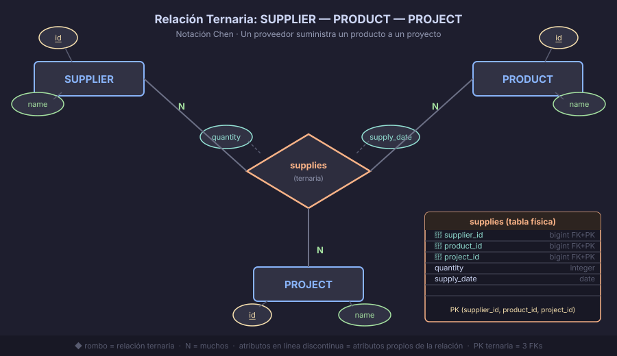
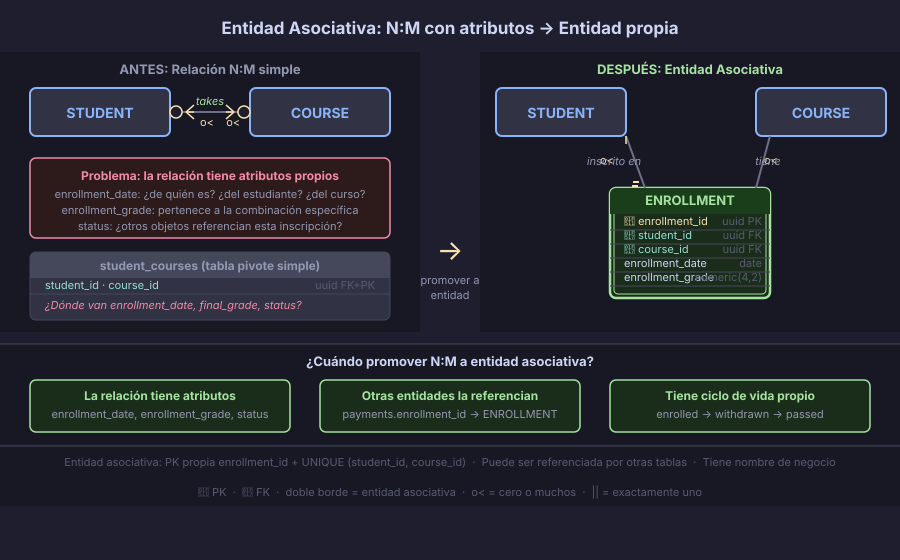

# Relaciones Ternarias y Entidades Asociativas

> Hasta ahora modelamos relaciones entre **dos** entidades. En el mundo real hay
> situaciones donde **tres** entidades participan simultáneamente en una misma
> interacción — y no puede reducirse a pares sin perder información.

---

## 🎯 Objetivos

- Reconocer cuándo se necesita una relación ternaria vs dos binarias
- Representar relaciones ternarias en notación Chen y Crow's Foot
- Entender cuándo promover una relación N:M a entidad asociativa
- Diseñar la tabla intermedia correctamente en el modelo físico

---

## 📖 Relaciones ternarias: cuando tres entidades son inseparables

Una **relación ternaria** involucra exactamente tres tipos de entidad que participan
*al mismo tiempo* en una interacción. No se puede descomponer en dos relaciones
binarias sin perder información.

### El ejemplo clásico: PROVEEDOR — PRODUCTO — PROYECTO

Un proveedor suministra un producto a un proyecto. La restricción de negocio es:

> "No basta saber qué proveedor vende qué producto, ni qué productos necesita un
> proyecto. Necesitamos saber **qué proveedor suministra qué producto a qué proyecto**
> (con su cantidad y fecha)."

Si descomponemos en dos binarias:
- `PROVEEDOR → PRODUCTO` (proveedor vende producto): perdemos el proyecto
- `PROYECTO → PRODUCTO` (proyecto usa producto): perdemos el proveedor

**Solo la ternaria captura la información completa.**



---

## 📖 Representación en Chen y Crow's Foot

### Notación Chen

```
    PROVEEDOR ────────────────────────────────
                                              |
    PRODUCTO  ─────── ◇ suministra ◇ ────────
                                              |
    PROYECTO  ────────────────────────────────
```

El rombo central conecta las tres entidades. La cardinalidad se lee para cada par
*fijando la tercera entidad*.

### Lectura de cardinalidad en una ternaria

> **Pregunta:** Fijando PROVEEDOR y PRODUCTO, ¿cuántos PROYECTOs pueden estar involucrados?

En la ternaria `suministra`:
- Un proveedor + un producto → puede abastecer a **muchos** proyectos
- Un proveedor + un proyecto → puede proveer **muchos** productos
- Un producto + un proyecto → puede ser suministrado por **muchos** proveedores

Esto la convierte en una relación `M:N:P` (todos son "muchos").

### En el modelo físico: tabla ternaria

```sql
CREATE TABLE suppliers  (id BIGINT GENERATED ALWAYS AS IDENTITY PRIMARY KEY, name VARCHAR(100) NOT NULL);
CREATE TABLE products   (id BIGINT GENERATED ALWAYS AS IDENTITY PRIMARY KEY, name VARCHAR(100) NOT NULL);
CREATE TABLE projects   (id BIGINT GENERATED ALWAYS AS IDENTITY PRIMARY KEY, name VARCHAR(100) NOT NULL);

-- La ternaria se convierte en tabla con 3 FKs
CREATE TABLE supplies (
    supplier_id  BIGINT        NOT NULL REFERENCES suppliers(id) ON DELETE RESTRICT,
    product_id   BIGINT        NOT NULL REFERENCES products(id)  ON DELETE RESTRICT,
    project_id   BIGINT        NOT NULL REFERENCES projects(id)  ON DELETE RESTRICT,
    quantity     INTEGER       NOT NULL CHECK (quantity > 0),
    supply_date  DATE          NOT NULL DEFAULT CURRENT_DATE,
    PRIMARY KEY (supplier_id, product_id, project_id)  -- PK ternaria
);
```

> **Índices adicionales:** agrega índices en cada par de FK para búsquedas frecuentes:
> `(supplier_id, product_id)`, `(project_id, product_id)`, etc.

---

## 📖 ¿Ternaria o dos binarias? La prueba de la información

Antes de crear una ternaria, comprueba si **dos binarias pueden expresar lo mismo**:

| Escenario | ¿Ternaria necesaria? |
|-----------|---------------------|
| La combinación de las tres entidades tiene atributos propios (fecha, cantidad, nota) | ✅ Sí |
| Sin las tres entidades juntas, la información es incompleta o ambigua | ✅ Sí |
| Cada par de entidades tiene sentido por separado y no se pierde información | ❌ No — dos binarias son suficientes |
| Se puede derivar la tercera entidad de las dos binarias | ❌ No — son redundantes |

### Contraejemplo: MEDICO — PACIENTE — HOSPITAL (no ternaria)

Si un médico trabaja en un hospital (relación binaria `trabaja_en`), y un médico atiende
a un paciente (relación binaria `atiende`), estas dos relaciones son **independientes**.
Saber que el Dr. García trabaja en el Hospital Central y que atiende a María no implica
que la atiende *en el Hospital Central*. Pero si el sistema necesita registrar
"qué médico atendió a qué paciente **en qué hospital**", entonces sí necesitamos la
ternaria `consulta(medico, paciente, hospital)`.

---

## 📖 Entidades asociativas: cuando N:M necesita vivir

Una **entidad asociativa** (también llamada tabla pivote o tabla intermedia con atributos)
es lo que obtienes cuando una relación N:M tiene **atributos propios significativos**
o cuando la relación misma necesita ser referenciada por otras entidades.

### Señales de que necesitas una entidad asociativa

- La relación N:M tiene atributos (fecha, estado, calificación, monto)
- Otras entidades necesitan referenciar esta relación
- La relación tiene un ciclo de vida propio (se crea, se actualiza, se cancela)

### Evolución: de relación a entidad



**Paso 1 — Relación N:M simple:**
```
STUDENT ──────o<──────────────────>o──── COURSE
```

**Paso 2 — Se detectan atributos propios:** la inscripción tiene `enrollment_date`,
`final_grade`, `status`. Estos atributos no pertenecen ni al estudiante ni al curso
— pertenecen a *la inscripción*.

**Paso 3 — Se promueve a entidad asociativa:**
```
STUDENT ──────o<───── ENROLLMENT ─────>o──── COURSE
                      │
                      enrollment_date
                      final_grade
                      status
```

### En el modelo físico

```sql
CREATE TABLE students  (id BIGINT GENERATED ALWAYS AS IDENTITY PRIMARY KEY, ...);
CREATE TABLE courses   (id BIGINT GENERATED ALWAYS AS IDENTITY PRIMARY KEY, ...);

-- La entidad asociativa: tiene FK a ambas + atributos propios
CREATE TABLE enrollments (
    id               BIGINT      GENERATED ALWAYS AS IDENTITY PRIMARY KEY,
    student_id       BIGINT      NOT NULL REFERENCES students(id) ON DELETE RESTRICT,
    course_id        BIGINT      NOT NULL REFERENCES courses(id)  ON DELETE RESTRICT,
    enrollment_date  DATE        NOT NULL DEFAULT CURRENT_DATE,
    final_grade      NUMERIC(4,2),      -- NULL mientras el semestre no termina
    status           VARCHAR(20) NOT NULL DEFAULT 'enrolled'
                     CHECK (status IN ('enrolled', 'withdrawn', 'passed', 'failed')),
    UNIQUE (student_id, course_id)      -- un estudiante no puede inscribirse dos veces al mismo curso
);
```

> **¿PK sustituta o compuesta?** En entidades asociativas es muy común usar una PK
> sustituta (`id`) porque la entidad puede ser referenciada por otras tablas
> (por ejemplo, `payments.enrollment_id`). La unicidad se garantiza con `UNIQUE`.

---

## 📖 Entidad asociativa vs tabla pivote simple

| Característica | Tabla pivote simple | Entidad asociativa |
|----------------|--------------------|--------------------|
| Tiene atributos propios | ❌ Solo las dos FK | ✅ Sí (fecha, estado, etc.) |
| Es referenciada por otras entidades | ❌ No | ✅ Sí |
| Tiene ciclo de vida propio | ❌ No | ✅ Sí |
| PK recomendada | Compuesta `(fk1, fk2)` | Sustituta `id` + UNIQUE |
| Nombre en el dominio | Genérico ("pivot") | Nombre de negocio ("Enrollment") |

---

## 🔑 Resumen

| Concepto | Cuándo usarlo |
|----------|--------------|
| **Relación ternaria** | Tres entidades participan simultáneamente; la info se pierde si se separan en binarias |
| **Tabla ternaria** | `PK (fk1, fk2, fk3)` + atributos propios de la combinación |
| **Entidad asociativa** | Relación N:M con atributos propios, ciclo de vida, o que es referenciada |
| **PK en entidad asociativa** | `id` sustituto + `UNIQUE (fk1, fk2)` |

---

← [02 — Entidades Débiles](02-entidades-debiles.md) &nbsp;&nbsp;|&nbsp;&nbsp; [Práctica →](../2-practicas/README.md)
