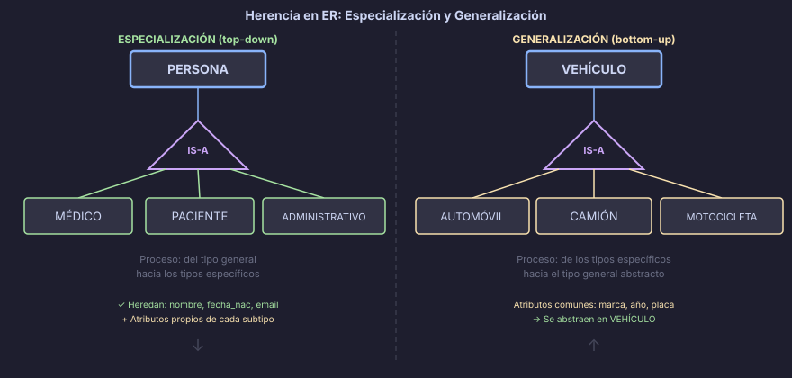
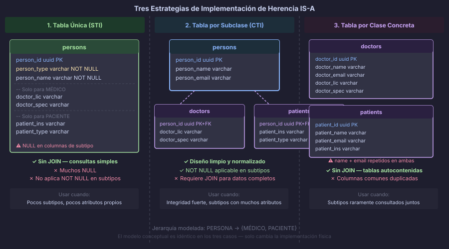

# Especialización y Generalización

> La herencia no es solo un concepto de programación orientada a objetos.
> En el modelo ER existe desde los años 80 para representar jerarquías reales del mundo.

---

## 🎯 Objetivos

- Distinguir entre especialización (top-down) y generalización (bottom-up)
- Identificar cuándo una jerarquía IS-A agrega valor al modelo
- Conocer las tres estrategias de implementación física en PostgreSQL

---

## 📖 La relación IS-A: "es un tipo de…"

Una relación **IS-A** (del inglés *is a*, "es un") conecta una entidad más general
(**supertipo** o superentidad) con entidades más específicas (**subtipos** o subentidades).

### El principio fundamental

> "Un `MÉDICO` *es un tipo de* `PERSONA`."
> "Un `AUTOMÓVIL` *es un tipo de* `VEHÍCULO`."
> "Una `CUENTA_CORRIENTE` *es un tipo de* `CUENTA_BANCARIA`."

Esta relación implica que el subtipo:

- **Hereda** todos los atributos del supertipo
- **Hereda** todas las relaciones del supertipo
- **Agrega** atributos o relaciones que solo le pertenecen a él



---

## 📖 Especialización: del general al específico (top-down)

La **especialización** parte de una entidad general y la subdivide en tipos más
específicos para capturar atributos o comportamientos que no todas las instancias comparten.

### ¿Cuándo especializar?

| Señal en el análisis de requerimientos | Acción recomendada |
|---|---|
| Un grupo de instancias tiene atributos que las demás no tienen | Crear subtipo |
| Un grupo participa en relaciones en las que las demás no participan | Crear subtipo |
| La lógica de negocio trata diferente a ciertos grupos | Crear subtipo |

### Ejemplo: Sistema hospitalario

```
PERSONA (nombre, fecha_nacimiento, email)
   ├── MÉDICO      (num_colegiado, especialidad)
   ├── PACIENTE    (num_seguro, grupo_sanguíneo)
   └── ADMINISTRATIVO (departamento, nivel_salarial)
```

Los tres subtipos **son** `PERSONA` pero tienen atributos exclusivos.
Las consultas sobre `email` o `nombre` se hacen sobre `PERSONA`;
las consultas sobre `num_colegiado` solo aplican a `MÉDICO`.

---

## 📖 Generalización: de lo específico a lo general (bottom-up)

La **generalización** parte de entidades ya existentes y abstrae sus atributos comunes
en una nueva superentidad. El resultado visual es idéntico al de la especialización;
la diferencia está en el **proceso de diseño**.

### Ejemplo: Flota de vehículos

Supongamos que en un modelo existían tres entidades separadas con atributos repetidos:

| Entidad | Atributos |
|---|---|
| `AUTOMÓVIL` | marca, año, placa, **num_puertas** |
| `CAMIÓN` | marca, año, placa, **capacidad_carga** |
| `MOTOCICLETA` | marca, año, placa, **cilindrada** |

Al detectar `marca`, `año` y `placa` como atributos comunes, **generalizamos** y creamos
el supertipo `VEHÍCULO`. El diagrama resultante es el mismo que si hubiéramos
especializado top-down.

---

## 📖 Tres estrategias de implementación física

Cuando pasamos del modelo conceptual al físico, existen tres formas estándar de
implementar una jerarquía IS-A en SQL relacional.



### Estrategia 1 — Tabla única (Single Table Inheritance / STI)

Todos los subtipos en **una sola tabla** con una columna discriminadora y columnas
opcionales por subtipo.

```sql
-- Una sola tabla con columna discriminadora
CREATE TABLE persons (
    person_id    UUID         DEFAULT gen_random_uuid() PRIMARY KEY,
    person_type  VARCHAR(20)  NOT NULL
                 CHECK (person_type IN ('doctor', 'patient', 'admin')),
    person_name  VARCHAR(100) NOT NULL,
    person_email VARCHAR(150),

    -- Atributos exclusivos de MÉDICO (NULL para otros tipos)
    doctor_medical_number VARCHAR(20),
    doctor_specialty      VARCHAR(80),

    -- Atributos exclusivos de PACIENTE
    patient_insurance_id  VARCHAR(30),
    patient_blood_type    VARCHAR(5),

    -- Atributos exclusivos de ADMINISTRATIVO
    admin_department      VARCHAR(80),
    admin_level           SMALLINT,

    created_at TIMESTAMPTZ NOT NULL DEFAULT NOW()
);
```

| Ventajas | Desventajas |
|---|---|
| Consultas simples, sin `JOIN` | Muchas columnas `NULL` |
| Rendimiento óptimo en lecturas | Imposible aplicar `NOT NULL` en columnas de subtipo |
| Fácil de mantener | La tabla crece y se vuelve difícil de leer |

**Cuándo usarla:** pocos subtipos, pocos atributos exclusivos, lecturas frecuentes de
todos los tipos juntos.

---

### Estrategia 2 — Tabla por subclase (Class Table Inheritance / CTI)

Una tabla para el supertipo + una tabla por cada subtipo, ligadas por `FK` uno a uno.

```sql
-- Supertipo: guarda los atributos comunes
CREATE TABLE persons (
    person_id    UUID         DEFAULT gen_random_uuid() PRIMARY KEY,
    person_name  VARCHAR(100) NOT NULL,
    person_email VARCHAR(150),
    created_at   TIMESTAMPTZ  NOT NULL DEFAULT NOW()
);

-- Subtipo MÉDICO: la PK es también FK al supertipo
CREATE TABLE doctors (
    person_id             UUID        PRIMARY KEY
                          REFERENCES persons(person_id) ON DELETE CASCADE,
    doctor_medical_number VARCHAR(20) NOT NULL UNIQUE,
    doctor_specialty      VARCHAR(80)
);

-- Subtipo PACIENTE
CREATE TABLE patients (
    person_id            UUID PRIMARY KEY
                         REFERENCES persons(person_id) ON DELETE CASCADE,
    patient_insurance_id VARCHAR(30),
    patient_blood_type   VARCHAR(5)
);
```

| Ventajas | Desventajas |
|---|---|
| Diseño limpio y normalizado | Requiere `JOIN` para obtener datos completos |
| `NOT NULL` aplicable en columnas de subtipo | Consultas más verbosas |
| Integridad declarativa fuerte | Overhead de lectura en tablas grandes |

**Cuándo usarla:** subtipos con muchos atributos propios, necesidad de integridad fuerte,
consultas frecuentes por subtipo.

---

### Estrategia 3 — Tabla por clase concreta (Concrete Table Inheritance)

Una tabla **por cada subtipo concreto**, repitiendo los atributos comunes del supertipo
en cada una. No existe tabla de supertipo.

```sql
-- Sin tabla supertipo: cada subtipo es autónomo
CREATE TABLE doctors (
    doctor_id             UUID         DEFAULT gen_random_uuid() PRIMARY KEY,
    doctor_name           VARCHAR(100) NOT NULL,       -- atributo heredado
    doctor_email          VARCHAR(150),                -- atributo heredado
    doctor_medical_number VARCHAR(20)  NOT NULL UNIQUE,
    doctor_specialty      VARCHAR(80),
    created_at            TIMESTAMPTZ  NOT NULL DEFAULT NOW()
);

CREATE TABLE patients (
    patient_id           UUID         DEFAULT gen_random_uuid() PRIMARY KEY,
    patient_name         VARCHAR(100) NOT NULL,        -- atributo heredado
    patient_email        VARCHAR(150),                 -- atributo heredado
    patient_insurance_id VARCHAR(30),
    patient_blood_type   VARCHAR(5),
    created_at           TIMESTAMPTZ  NOT NULL DEFAULT NOW()
);
```

| Ventajas | Desventajas |
|---|---|
| Tablas autocontenidas y simples | Duplicación de columnas comunes |
| Sin `JOIN` para consultar un subtipo | No hay punto único para consultar todos los tipos |
| Fácil de extender por separado | `FK` hacia la jerarquía son difíciles de declarar |

**Cuándo usarla:** subtipos que raramente se consultan juntos, heredan muy poco del
supertipo, o tienen ciclos de vida completamente independientes.

---

## ⚠️ Errores Comunes

| Error | Por qué ocurre | Cómo evitarlo |
|---|---|---|
| Especializar por similitud superficial | Confundir "tienen atributos parecidos" con herencia real | Verificar: "¿El subtipo IS-A el supertipo semánticamente?" |
| Usar IS-A cuando bastaría una columna `type` | Sobrediseño | Si la única diferencia es el "rol", una columna discriminadora es suficiente |
| Mezclar estrategias de implementación | Falta de criterio previo | Definir la estrategia para toda la jerarquía antes de implementar |

---

## 🧩 Resumen

| Concepto | Descripción |
|---|---|
| **IS-A** | Relación "es un tipo de" entre supertipo y subtipo |
| **Especialización** | Top-down: del supertipo general hacia subtipos específicos |
| **Generalización** | Bottom-up: de entidades específicas hacia un supertipo abstracto |
| **Herencia** | El subtipo hereda todos los atributos y relaciones del supertipo |
| **STI** | Tabla única con discriminador — simple pero con muchos `NULL` |
| **CTI** | Tabla por subclase con FK al supertipo — limpio pero con `JOIN` |
| **Concreta** | Tabla por clase concreta — independiente pero con duplicación |

---

## 📚 Recursos Adicionales

- [PostgreSQL: Table Inheritance](https://www.postgresql.org/docs/16/ddl-inherit.html)
- [Martin Fowler: Single Table Inheritance](https://www.martinfowler.com/eaaCatalog/singleTableInheritance.html)
- [Martin Fowler: Class Table Inheritance](https://www.martinfowler.com/eaaCatalog/classTableInheritance.html)

---

## ✅ Checklist de Comprensión

- [ ] ¿Puedo distinguir especialización de generalización con ejemplos propios?
- [ ] ¿Entiendo qué atributos hereda un subtipo y cuáles son exclusivamente suyos?
- [ ] ¿Sé elegir la estrategia de implementación según el contexto del negocio?
- [ ] ¿Puedo dibujar una jerarquía IS-A en notación Chen?

---

← [README](../README.md) &nbsp;&nbsp;|&nbsp;&nbsp; [Siguiente: Restricciones de Cobertura y Disyunción →](./02-restricciones-cobertura-disjuncion.md)
