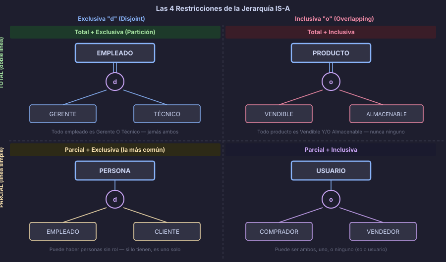

# Restricciones de Cobertura y Disyunción

> Una jerarquía IS-A sin restricciones declaradas es una jerarquía con semántica ambigua.
> Las restricciones son el contrato que define cómo operan los subtipos.

---

## 🎯 Objetivos

- Distinguir cobertura total de cobertura parcial
- Distinguir disyunción exclusiva de disyunción inclusiva
- Combinar ambas restricciones para modelar correctamente
- Traducir cada combinación al modelo físico en PostgreSQL

---

## 📖 Dimensión 1: Cobertura (Completeness Constraint)

La **cobertura** define si *todo* instancia del supertipo debe pertenecer a algún subtipo.

### Cobertura Total

> "Todo instancia del supertipo **debe** pertenecer a al menos un subtipo."

La especialización es **obligatoria**: no puede existir un `EMPLEADO` que no sea
ni `GERENTE`, ni `TÉCNICO`, ni `VENDEDOR`.

En diagramas Chen: **doble línea** del supertipo hacia el símbolo IS-A.

```sql
-- Total: la columna discriminadora es NOT NULL (no puede ser "sin tipo")
CREATE TABLE employees (
    employee_id   UUID         DEFAULT gen_random_uuid() PRIMARY KEY,
    employee_name VARCHAR(100) NOT NULL,
    employee_type VARCHAR(20)  NOT NULL   -- NOT NULL = cobertura total
                  CHECK (employee_type IN ('manager', 'technician', 'sales'))
);
```

### Cobertura Parcial

> "Una instancia del supertipo **puede o no** pertenecer a algún subtipo."

La especialización es **opcional**: puede existir un `VEHÍCULO` que no sea ni
automóvil, ni camión, ni motocicleta (por ejemplo, una bicicleta sin subtipo asignado).

En diagramas Chen: **línea simple** del supertipo hacia el símbolo IS-A.

```sql
-- Parcial: la columna discriminadora admite NULL (instancias sin subtipo)
CREATE TABLE vehicles (
    vehicle_id    UUID         DEFAULT gen_random_uuid() PRIMARY KEY,
    vehicle_brand VARCHAR(80)  NOT NULL,
    vehicle_type  VARCHAR(20)  -- NULL = sin subtipo específico (cobertura parcial)
                  CHECK (vehicle_type IN ('car', 'truck', 'motorcycle') OR vehicle_type IS NULL)
);
```

---

## 📖 Dimensión 2: Disyunción (Disjointness Constraint)

La **disyunción** define si una instancia puede pertenecer a varios subtipos simultáneamente.

### Disyunción Exclusiva (Disjoint)

> "Una instancia puede pertenecer a **máximo un subtipo**."

Un `EMPLEADO` es `GERENTE` **o** `TÉCNICO` **o** `VENDEDOR`, pero nunca dos al mismo tiempo.

En diagramas Chen: letra **"d"** dentro del círculo IS-A.

### Disyunción Inclusiva (Overlapping)

> "Una instancia puede pertenecer a **varios subtipos** simultáneamente."

Un `USUARIO` puede ser `COMPRADOR` **y** `VENDEDOR` al mismo tiempo
(como en Mercado Libre o Wallapop).

En diagramas Chen: letra **"o"** dentro del círculo IS-A.

---

## 📖 Las 4 Combinaciones



---

### Combinación 1 — Total + Exclusiva (Partición)

La más restrictiva: **todo padre pertenece a exactamente un subtipo**.
El conjunto de subtipos "divide" al supertipo sin solapamiento ni instancias huérfanas.

**Ejemplo de negocio:** `FORMA_PAGO → {TARJETA_CRÉDITO, TRANSFERENCIA, EFECTIVO}`
*Todo pago es exactamente uno de los tres tipos.*

```sql
CREATE TABLE payments (
    payment_id     UUID        DEFAULT gen_random_uuid() PRIMARY KEY,
    payment_amount NUMERIC(10,2) NOT NULL CHECK (payment_amount > 0),
    payment_method VARCHAR(20) NOT NULL  -- Total (NOT NULL) + Exclusiva (un solo valor)
                   CHECK (payment_method IN ('card', 'transfer', 'cash'))
);
```

---

### Combinación 2 — Total + Inclusiva

**Todo padre pertenece a al menos un subtipo, y puede pertenecer a varios.**

**Ejemplo de negocio:** `PRODUCTO → {VENDIBLE, ALMACENABLE}`
*Todo producto debe ser vendible, almacenable, o ambos; nunca ninguno de los dos.*

```sql
CREATE TABLE products (
    product_id          UUID    DEFAULT gen_random_uuid() PRIMARY KEY,
    product_name        VARCHAR(150) NOT NULL,
    product_is_sellable BOOLEAN NOT NULL DEFAULT TRUE,
    product_is_storable BOOLEAN NOT NULL DEFAULT TRUE,
    -- Total: al menos uno debe ser TRUE
    CONSTRAINT ck_products_at_least_one
        CHECK (product_is_sellable OR product_is_storable)
);
```

---

### Combinación 3 — Parcial + Exclusiva (la más común)

**El padre puede o no tener subtipo, pero si lo tiene es solo uno.**

**Ejemplo de negocio:** `PERSONA → {EMPLEADO, CLIENTE}`
*Hay personas empleadas, personas clientes, y personas de contacto sin rol específico.*

```sql
CREATE TABLE persons (
    person_id   UUID         DEFAULT gen_random_uuid() PRIMARY KEY,
    person_name VARCHAR(100) NOT NULL,
    person_role VARCHAR(20)  -- NULL permitido (parcial) + un solo valor (exclusiva)
                CHECK (person_role IN ('employee', 'customer') OR person_role IS NULL)
);
```

---

### Combinación 4 — Parcial + Inclusiva

**El padre puede tener ninguno, uno o varios subtipos.**

**Ejemplo de negocio:** `USUARIO → {COMPRADOR, VENDEDOR, MODERADOR}`
*Un usuario puede ser solo comprador, solo vendedor, ambos, moderador,
o simplemente usuario sin ningún rol especial.*

```sql
CREATE TABLE users (
    user_id           UUID         DEFAULT gen_random_uuid() PRIMARY KEY,
    user_email        VARCHAR(150) NOT NULL UNIQUE,
    user_is_buyer     BOOLEAN      NOT NULL DEFAULT FALSE,
    user_is_seller    BOOLEAN      NOT NULL DEFAULT FALSE,
    user_is_moderator BOOLEAN      NOT NULL DEFAULT FALSE
    -- Sin restricción de "al menos uno": un usuario puede no tener rol (parcial)
    -- Varios flags pueden ser TRUE al mismo tiempo (inclusiva)
);
```

---

## 📖 Tabla comparativa de las 4 combinaciones

| Combinación | ¿Todo padre tiene subtipo? | ¿Puede tener varios? | Notación SQL |
|---|---|---|---|
| **Total + Exclusiva** | Sí | No | `type VARCHAR NOT NULL` con un solo valor |
| **Total + Inclusiva** | Sí | Sí | Varios `BOOLEAN NOT NULL` + `CHECK` de "al menos uno" |
| **Parcial + Exclusiva** | No | No | `type VARCHAR NULL` con un solo valor o `NULL` |
| **Parcial + Inclusiva** | No | Sí | Varios `BOOLEAN NOT NULL`, sin restricción de mínimo |

---

## ⚠️ Errores Comunes

| Error | Por qué ocurre | Cómo evitarlo |
|---|---|---|
| No declarar cobertura | Omitir el análisis de restricciones | Preguntar: "¿Puede existir un padre sin ningún subtipo?" |
| Usar exclusiva cuando el negocio permite roles múltiples | Asumir que las entidades tienen un solo rol | Preguntar: "¿Puede pertenecer a varios subtipos simultáneamente?" |
| Confundir Parcial+Exclusiva con Parcial+Inclusiva | Ambas son "parciales" | La diferencia está en si permite pertenecer a varios subtipos |
| Usar STI para una jerarquía Inclusiva | STI con un discriminador no puede representar pertenencia múltiple | Usar columnas booleanas o CTI para jerarquías inclusivas |

---

## 🧩 Resumen

| Restricción | Significado | Notación Chen | SQL |
|---|---|---|---|
| **Total** | Todo padre tiene al menos un subtipo | Doble línea del supertipo al IS-A | Columna `NOT NULL` |
| **Parcial** | El padre puede no tener subtipo | Línea simple del supertipo al IS-A | Columna `NULL` |
| **Exclusiva** | Máximo un subtipo por instancia | "d" en el círculo IS-A | Un solo valor en columna |
| **Inclusiva** | Varios subtipos simultáneos posibles | "o" en el círculo IS-A | Múltiples booleanos / múltiples filas |

---

## ✅ Checklist de Comprensión

- [ ] ¿Puedo responder "¿cobertura total o parcial?" para un caso de negocio dado?
- [ ] ¿Entiendo cuándo una jerarquía es exclusiva vs. inclusiva?
- [ ] ¿Sé qué implicaciones tiene cada combinación en el DDL de PostgreSQL?
- [ ] ¿Puedo identificar las 4 combinaciones en un diagrama ER?

---

← [Especialización y Generalización](./01-especializacion-y-generalizacion.md) &nbsp;&nbsp;|&nbsp;&nbsp; [Siguiente: DBML como puente →](./03-dbml-como-puente.md)
