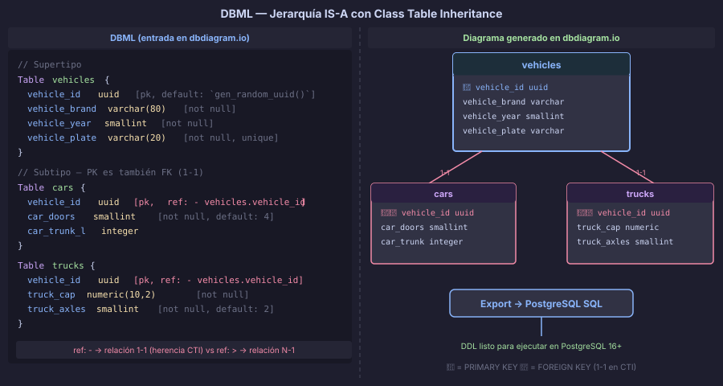

# DBML como Puente entre ER y SQL

> `draw.io` es ideal para el modelo conceptual.
> PostgreSQL es el modelo físico.
> DBML es el lenguaje que los conecta — legible para personas, exportable a SQL.

---

## 🎯 Objetivos

- Entender qué es DBML y por qué se usa en el bootcamp
- Escribir modelos relacionales en DBML con la sintaxis completa
- Representar jerarquías IS-A en DBML usando Class Table Inheritance
- Publicar y compartir modelos en dbdiagram.io

---

## 📖 ¿Qué es DBML?

**DBML** (Database Markup Language) es un lenguaje de texto plano diseñado para
describir esquemas de bases de datos relacionales de forma legible y concisa.

Al igual que Markdown simplifica la escritura de documentos HTML, DBML simplifica
la descripción de tablas, columnas, índices y relaciones — sin la verbosidad del `DDL`.

### ¿Por qué DBML en lugar de solo SQL?

| Criterio | SQL DDL | DBML |
|---|---|---|
| Legibilidad | Media | Alta |
| Velocidad de escritura | Baja | Alta |
| Visualización automática | No | ✅ En dbdiagram.io |
| Exportar a SQL | N/A | ✅ PostgreSQL, MySQL, etc. |
| Versionado en Git | Posible | ✅ Texto plano, fácil de differenciar |
| Compartir con el equipo | Script SQL | ✅ Enlace público |

---

## 📖 Sintaxis básica de DBML

### Tabla y columnas

```dbml
Table products {
  product_id    uuid          [pk, default: `gen_random_uuid()`]
  product_name  varchar(150)  [not null]
  product_price numeric(10,2) [not null]
  product_stock integer       [not null, default: 0]
  created_at    timestamptz   [not null, default: `now()`]
}
```

### Tipos de datos más comunes

```dbml
Table type_examples {
  col_uuid       uuid
  col_short_text varchar(100)
  col_long_text  text
  col_integer    integer
  col_decimal    numeric(10, 2)
  col_boolean    boolean
  col_date       date
  col_datetime   timestamptz
  col_json       jsonb
}
```

### Relaciones con `ref`

Los operadores de referencia indican la cardinalidad:

| Operador | Significado |
|---|---|
| `>` | Muchos a uno (many-to-one) |
| `<` | Uno a muchos (one-to-many) |
| `-` | Uno a uno (one-to-one) |
| `<>` | Muchos a muchos (many-to-many) |

```dbml
Table orders {
  order_id     uuid       [pk, default: `gen_random_uuid()`]
  customer_id  uuid       [not null]
  order_date   date       [not null]
  order_status varchar(20) [not null, default: 'pending']
}

Table customers {
  customer_id    uuid        [pk, default: `gen_random_uuid()`]
  customer_name  varchar(100) [not null]
  customer_email varchar(150) [unique, not null]
}

// Muchos pedidos → un cliente
Ref: orders.customer_id > customers.customer_id
```

### Índices

```dbml
Table orders {
  order_id     uuid       [pk, default: `gen_random_uuid()`]
  customer_id  uuid       [not null]
  order_date   date       [not null]
  order_status varchar(20) [not null]

  indexes {
    customer_id            [name: 'ix_orders_customer_id']
    order_date             [name: 'ix_orders_order_date']
    (customer_id, order_date) [name: 'ix_orders_customer_date']
  }
}
```

### Enums

```dbml
Enum order_status_enum {
  pending
  processing
  shipped
  delivered
  cancelled
}

Table orders {
  order_id     uuid              [pk, default: `gen_random_uuid()`]
  order_status order_status_enum [not null, default: 'pending']
}
```

### Notas y grupos

```dbml
Table products {
  product_id    uuid         [pk, note: "Clave primaria UUID v4"]
  product_name  varchar(150) [not null, note: "Nombre comercial del producto"]
  product_price numeric(10,2) [not null, note: "Precio en MXN sin IVA"]
}

TableGroup ecommerce {
  orders
  order_items
  products
}
```

---

## 📖 Representar jerarquías IS-A en DBML

DBML no tiene sintaxis nativa para herencia, pero se representa con el patrón
**Class Table Inheritance (CTI)**: tabla del supertipo + tabla por subtipo,
donde la `PK` del subtipo es también `FK` al supertipo (relación uno a uno `ref: -`).

```dbml
// ============================================================
// Jerarquía: PERSONA → {MÉDICO, PACIENTE, ADMINISTRATIVO}
// Estrategia: Class Table Inheritance (CTI)
// ============================================================

Table persons {
  person_id    uuid         [pk, default: `gen_random_uuid()`]
  person_name  varchar(100) [not null]
  person_email varchar(150) [unique, not null]
  created_at   timestamptz  [not null, default: `now()`]
}

Table doctors {
  // PK y FK al supertipo en una sola columna (relación 1-1)
  person_id             uuid        [pk, ref: - persons.person_id, note: "FK = PK (CTI)"]
  doctor_medical_number varchar(20) [not null, unique]
  doctor_specialty      varchar(80)
}

Table patients {
  person_id            uuid [pk, ref: - persons.person_id]
  patient_insurance_id varchar(30)
  patient_blood_type   varchar(5)
}

Table admins {
  person_id        uuid     [pk, ref: - persons.person_id]
  admin_department varchar(80) [not null]
  admin_level      smallint    [not null, default: 1]
}
```

> **Clave:** en CTI, la relación entre supertipo y subtipo es **siempre 1-1** (`ref: -`),
> no 1-N (`ref: >`). La `PK` del subtipo **es también** la `FK` al supertipo.



---

## 📖 Flujo de trabajo en dbdiagram.io

```
1. Ir a https://dbdiagram.io
2. Abrir el editor DBML (panel izquierdo)
3. Escribir o pegar el DBML
4. El diagrama se renderiza en tiempo real (panel derecho)
5. Exportar → SQL (PostgreSQL / MySQL) o imagen (PNG/PDF)
6. Compartir el enlace público con el equipo o instructor
```

El resultado del paso 5 es DDL listo para ejecutar en PostgreSQL 16+.

---

## 📖 De DBML a DDL: el puente completo

Para el modelo de vehículos, el DBML exportado produce este DDL:

```dbml
// DBML de entrada
Table vehicles {
  vehicle_id    uuid       [pk, default: `gen_random_uuid()`]
  vehicle_brand varchar(80) [not null]
  vehicle_year  smallint    [not null]
  vehicle_plate varchar(20) [not null, unique]
  created_at    timestamptz [not null, default: `now()`]
}

Table cars {
  vehicle_id        uuid     [pk, ref: - vehicles.vehicle_id]
  car_doors         smallint [not null, default: 4]
  car_trunk_liters  integer
}

Table trucks {
  vehicle_id         uuid          [pk, ref: - vehicles.vehicle_id]
  truck_capacity_kg  numeric(10,2) [not null]
  truck_axles        smallint      [not null, default: 2]
}
```

```sql
-- DDL exportado por dbdiagram.io (PostgreSQL)
CREATE TABLE "vehicles" (
    "vehicle_id"    uuid         DEFAULT gen_random_uuid() PRIMARY KEY,
    "vehicle_brand" varchar(80)  NOT NULL,
    "vehicle_year"  smallint     NOT NULL,
    "vehicle_plate" varchar(20)  NOT NULL UNIQUE,
    "created_at"    timestamptz  NOT NULL DEFAULT now()
);

CREATE TABLE "cars" (
    "vehicle_id"       uuid     PRIMARY KEY,
    "car_doors"        smallint NOT NULL DEFAULT 4,
    "car_trunk_liters" integer
);

CREATE TABLE "trucks" (
    "vehicle_id"        uuid          PRIMARY KEY,
    "truck_capacity_kg" numeric(10,2) NOT NULL,
    "truck_axles"       smallint      NOT NULL DEFAULT 2
);

ALTER TABLE "cars"   ADD FOREIGN KEY ("vehicle_id") REFERENCES "vehicles" ("vehicle_id");
ALTER TABLE "trucks" ADD FOREIGN KEY ("vehicle_id") REFERENCES "vehicles" ("vehicle_id");
```

---

## ⚠️ Errores Comunes

| Error | Por qué ocurre | Cómo evitarlo |
|---|---|---|
| Usar `ref: >` en lugar de `ref: -` para herencia CTI | Confundir relación 1-N con 1-1 | La herencia CTI es siempre 1-1; usar `ref: -` |
| Omitir `note` en columnas clave | Olvidar documentar el contexto | Agregar `note: "FK = PK (CTI)"` en las columnas de subtipo |
| Esperar que DBML valide `CHECK` constraints | DBML no soporta `CHECK` nativo | Agregar las constraints en el DDL de PostgreSQL tras la exportación |
| Confundir `ref: >` con `ref: <` | Invertir la dirección de la relación | `A > B` significa "muchas A para una B" (FK en A hacia B) |

---

## 🧩 Resumen: DBML ↔ SQL

| Concepto DBML | Equivalente SQL |
|---|---|
| `Table nombre { }` | `CREATE TABLE nombre ( )` |
| `[pk]` | `PRIMARY KEY` |
| `[not null]` | `NOT NULL` |
| `[unique]` | `UNIQUE` |
| `[default: valor]` | `DEFAULT valor` |
| `Ref: A.col > B.col` | `FOREIGN KEY (col) REFERENCES B(col)` (N→1) |
| `Ref: A.col - B.col` | `FOREIGN KEY (col) REFERENCES B(col)` (1-1, herencia CTI) |
| `indexes { col }` | `CREATE INDEX ON tabla (col)` |
| `Enum nombre { }` | `CREATE TYPE nombre AS ENUM (...)` |

---

## ✅ Checklist de Comprensión

- [ ] ¿Puedo escribir una tabla DBML con columnas, `PK`, índices y referencias?
- [ ] ¿Entiendo la diferencia entre `ref: >` (1-N) y `ref: -` (1-1)?
- [ ] ¿Puedo representar una jerarquía IS-A en DBML usando CTI?
- [ ] ¿Sé exportar un modelo de dbdiagram.io a SQL PostgreSQL?

---

← [Restricciones de Cobertura y Disyunción](./02-restricciones-cobertura-disjuncion.md) &nbsp;&nbsp;|&nbsp;&nbsp; [README →](../README.md)
