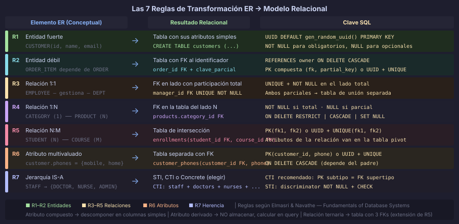
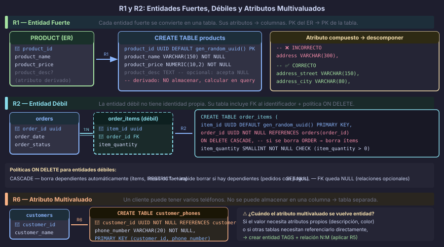

# Reglas de Transformación: Entidades y Atributos

## 🎯 Objetivos

- Aplicar la Regla 1 para transformar entidades fuertes en tablas relacionales
- Aplicar la Regla 2 para transformar entidades débiles con su clave compuesta
- Aplicar la Regla 6 para separar atributos multivaluados en tablas propias
- Mapear atributos compuestos, derivados y opcionales al DDL

---

## 📖 El Proceso de Transformación ER → Relacional

El **modelo relacional** es la representación de un diagrama ER como un conjunto de
tablas con columnas, claves primarias y claves foráneas.

El proceso sigue **7 reglas** establecidas y sistemáticas. Cada elemento del modelo
conceptual tiene una regla de transformación específica:



| Regla | Elemento ER | Resultado relacional |
|---|---|---|
| **R1** | Entidad fuerte | Tabla con sus atributos simples |
| **R2** | Entidad débil | Tabla con FK del identificador |
| **R3** | Relación 1:1 | FK en el lado con participación total |
| **R4** | Relación 1:N | FK en el lado N |
| **R5** | Relación N:M | Tabla de intersección |
| **R6** | Atributo multivaluado | Tabla separada con FK |
| **R7** | Jerarquía IS-A | STI / CTI / Concrete Table |

> Las reglas R3, R4, R5 y R7 se estudian en los archivos siguientes de esta semana.

---

## 📖 Regla 1: Entidad Fuerte → Tabla

Una **entidad fuerte** (con identidad propia, no dependiente de otra) se convierte
directamente en una tabla:

- Cada **atributo simple** → columna de la tabla
- El **atributo identificador** del ER → `PRIMARY KEY` de la tabla
- Los atributos opcionales en el ER → columnas `NULL`
- Los atributos obligatorios → columnas `NOT NULL`



### Ejemplo: PRODUCT en un e-commerce

ER conceptual:
```
PRODUCT (product_id [PK], product_name, product_price, product_stock, product_description?)
```

Tabla relacional resultante:

```sql
-- R1: Entidad fuerte PRODUCT → tabla products
CREATE TABLE products (
    product_id          UUID            DEFAULT gen_random_uuid() PRIMARY KEY,
    product_name        VARCHAR(150)    NOT NULL,
    product_price       NUMERIC(10, 2)  NOT NULL CHECK (product_price >= 0),
    product_stock       INTEGER         NOT NULL DEFAULT 0 CHECK (product_stock >= 0),
    product_description TEXT,           -- atributo opcional en el ER → NULL
    created_at          TIMESTAMPTZ     NOT NULL DEFAULT NOW()
);
```

### ¿Qué pasa con los atributos compuestos?

Un **atributo compuesto** (como `dirección` que tiene calle, ciudad, CP) se
**descompone** en columnas simples:

```sql
-- ❌ INCORRECTO — atributo compuesto como una sola columna
address VARCHAR(300),  -- Imposible filtrar por ciudad o código postal

-- ✅ CORRECTO — descomponer en columnas simples
address_street   VARCHAR(150),
address_city     VARCHAR(80),
address_zip_code VARCHAR(10),
address_country  VARCHAR(60)
```

### ¿Qué pasa con los atributos derivados?

Un **atributo derivado** (como `edad` calculada a partir de `fecha_nacimiento`) **no
se almacena**. Se calcula en las consultas:

```sql
-- ❌ INCORRECTO — almacenar un valor derivado
customer_age INTEGER,  -- queda desactualizado con el tiempo

-- ✅ CORRECTO — almacenar el valor base y calcular
customer_dob DATE NOT NULL,
-- Para consultar la edad:
-- SELECT DATE_PART('year', AGE(customer_dob)) AS customer_age FROM customers;
```

---

## 📖 Regla 2: Entidad Débil → Tabla

Una **entidad débil** no tiene identidad propia: solo existe si existe su **entidad
identificadora**. Se transforma aplicando:

1. Crear tabla con los atributos propios de la entidad débil
2. Agregar columna `FK` que apunte a la tabla identificadora
3. La `PK` puede ser:
   - **UUID propio** (recomendado en PostgreSQL) + constraint único sobre `(FK, clave_parcial)`
   - **PK compuesta** `(FK, clave_parcial)` — válido pero menos flexible

### Ejemplo: ORDER_ITEM depende de ORDER

En un sistema de pedidos, un ítem de orden (`ORDER_ITEM`) no tiene sentido sin la
orden a la que pertenece. Si la orden se elimina, el ítem también debe eliminarse.

```sql
-- La entidad identificadora: ORDER
CREATE TABLE orders (
    order_id     UUID            DEFAULT gen_random_uuid() PRIMARY KEY,
    customer_id  UUID            NOT NULL REFERENCES customers(customer_id),
    order_date   TIMESTAMPTZ     NOT NULL DEFAULT NOW(),
    order_status VARCHAR(15)     NOT NULL DEFAULT 'pending'
);

-- R2: Entidad débil ORDER_ITEM → tabla order_items
-- Opción A: UUID propio (recomendado)
CREATE TABLE order_items (
    item_id         UUID            DEFAULT gen_random_uuid() PRIMARY KEY,
    order_id        UUID            NOT NULL REFERENCES orders(order_id)
                                        ON DELETE CASCADE, -- si se borra la orden, se borran los ítems
    product_id      UUID            NOT NULL REFERENCES products(product_id),
    item_quantity   SMALLINT        NOT NULL CHECK (item_quantity > 0),
    item_unit_price NUMERIC(10, 2)  NOT NULL CHECK (item_unit_price >= 0),

    -- La combinación (order_id, product_id) identifica al ítem dentro de su orden
    CONSTRAINT uq_order_items_order_product UNIQUE (order_id, product_id)
);

-- Opción B: PK compuesta (clave parcial + FK identificadora)
CREATE TABLE order_items_v2 (
    order_id        UUID            NOT NULL REFERENCES orders(order_id)
                                        ON DELETE CASCADE,
    product_id      UUID            NOT NULL REFERENCES products(product_id),
    item_quantity   SMALLINT        NOT NULL CHECK (item_quantity > 0),
    item_unit_price NUMERIC(10, 2)  NOT NULL,

    CONSTRAINT pk_order_items PRIMARY KEY (order_id, product_id)
);
```

> **¿Cuándo usar PK compuesta vs. UUID?**
>
> | Criterio | PK compuesta | UUID propio |
> |---|---|---|
> | Referenciabilidad desde otras tablas | Compleja (hay que llevar las dos columnas) | Simple (solo el UUID) |
> | Legibilidad | Explícita sobre la dependencia | Menos explícita |
> | Recomendación PostgreSQL 16+ | Para entidades de intersección puras | Para entidades débiles que otros referencian |

### La política `ON DELETE`

Al transformar entidades débiles, la clave foránea hacia el identificador
**siempre debe declarar** qué sucede cuando se borra la entidad padre:

| Política | Significado | Cuándo usarla |
|---|---|---|
| `CASCADE` | Borra los dependientes automáticamente | Entidades débiles reales (ítems, líneas de factura) |
| `RESTRICT` | Impide borrar si hay dependientes | Entidades con vida propia (pedidos no borrar si tiene pagos) |
| `SET NULL` | Pone la FK en NULL | Relaciones opcionales (el padre puede desaparecer) |
| `SET DEFAULT` | Pone el valor por defecto | Raras veces; requiere valor por defecto con sentido |

---

## 📖 Regla 6: Atributo Multivaluado → Tabla Separada

Un **atributo multivaluado** (como los teléfonos de un cliente o las etiquetas de un
artículo) no puede almacenarse en una sola columna sin violar la Primera Forma Normal.

**Transformación:**
1. Crear tabla separada para el atributo multivaluado
2. Agregar columna `FK` que apunte a la entidad dueña
3. La `PK` puede ser compuesta `(FK, valor)` o un UUID propio

### Ejemplo: teléfonos de un cliente

```sql
-- La entidad dueña
CREATE TABLE customers (
    customer_id    UUID         DEFAULT gen_random_uuid() PRIMARY KEY,
    customer_name  VARCHAR(100) NOT NULL,
    customer_email VARCHAR(150) NOT NULL UNIQUE
);

-- R6: Atributo multivaluado PHONE → tabla customer_phones
CREATE TABLE customer_phones (
    customer_id    UUID        NOT NULL REFERENCES customers(customer_id)
                                   ON DELETE CASCADE,
    phone_number   VARCHAR(20) NOT NULL,
    phone_type     VARCHAR(10)          -- mobile, home, work
        CHECK (phone_type IN ('mobile', 'home', 'work', 'other')),

    -- PK compuesta: un cliente no puede tener el mismo número dos veces
    CONSTRAINT pk_customer_phones PRIMARY KEY (customer_id, phone_number)
);
```

### Ejemplo: etiquetas de un artículo (tags)

```sql
-- R6: Atributo multivaluado TAGS → tabla article_tags
CREATE TABLE article_tags (
    article_id UUID        NOT NULL REFERENCES articles(article_id) ON DELETE CASCADE,
    tag_name   VARCHAR(50) NOT NULL,
    CONSTRAINT pk_article_tags PRIMARY KEY (article_id, tag_name)
);
```

> **Nota:** Si las etiquetas necesitan atributos propios (descripción, color), entonces
> ya no son un atributo multivaluado simple — se convierten en una entidad `TAGS` con
> una relación N:M (aplicar Regla 5).

---

## 📖 Tabla de Decisiones: Tipos de Atributos

| Tipo de atributo | Transformación | Ejemplo |
|---|---|---|
| **Simple** | Columna directa | `product_name VARCHAR(150)` |
| **Obligatorio** | `NOT NULL` | `product_price NUMERIC NOT NULL` |
| **Opcional** | Sin `NOT NULL` (acepta `NULL`) | `product_description TEXT` |
| **Compuesto** | Descomponer en columnas simples | `address_street`, `address_city`... |
| **Derivado** | No almacenar; calcular en query | `AGE(customer_dob)` |
| **Multivaluado** | Tabla separada con FK (Regla 6) | `customer_phones` |
| **Clave (PK en ER)** | `PRIMARY KEY` | `customer_id UUID DEFAULT gen_random_uuid()` |

---

## ✅ Checklist — Reglas 1, 2 y 6

- [ ] Toda entidad fuerte tiene su tabla con nombre plural en `snake_case`
- [ ] Los atributos simples obligatorios tienen `NOT NULL`
- [ ] Los atributos compuestos están descompuestos en columnas simples
- [ ] Los atributos derivados **no** están almacenados como columnas
- [ ] Toda entidad débil tiene FK al identificador con política `ON DELETE` declarada
- [ ] Los atributos multivaluados tienen su propia tabla con FK

---

← [README](../README.md) &nbsp;&nbsp;|&nbsp;&nbsp; [Transformación de relaciones →](02-transformacion-relaciones.md)
