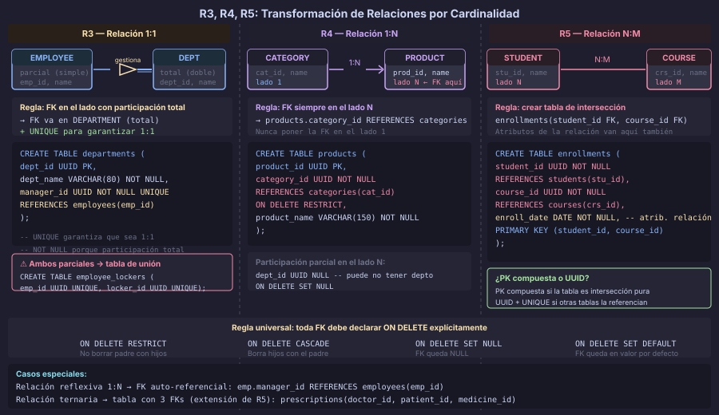

# Transformación de Relaciones por Cardinalidad

## 🎯 Objetivos

- Aplicar la Regla 3 para transformar relaciones 1:1 eligiendo el lado correcto para la FK
- Aplicar la Regla 4 para transformar relaciones 1:N con FK en el lado N
- Aplicar la Regla 5 para transformar relaciones N:M en tablas de intersección
- Transformar relaciones ternarias y reflexivas correctamente

---

## 📖 Participación Total vs. Parcial

Antes de ver las reglas, un concepto clave que afecta **dónde** colocar la clave foránea:

- **Participación total** (línea doble en ER): toda instancia de esa entidad participa en
  la relación → la FK es `NOT NULL`
- **Participación parcial** (línea simple): la participación es opcional → la FK puede
  ser `NULL`

```sql
-- Participación total: todo ORDER tiene un CUSTOMER (NOT NULL)
order_customer_id  UUID  NOT NULL REFERENCES customers(customer_id)

-- Participación parcial: un EMPLOYEE puede o no tener un MANAGER (NULL)
employee_manager_id  UUID  REFERENCES employees(employee_id)
```

---

## 📖 Regla 3: Relación 1:1 → FK en el Lado Total



En una relación 1:1 entre entidades A y B, hay tres casos:

### Caso A: Solo un lado tiene participación total

Colocar la FK en el lado con **participación total** (no puede ser NULL):

```sql
-- ER: EMPLOYEE (parcial) — gestiona — DEPARTMENT (total, todo depto tiene un manager)
-- → FK en DEPARTMENT porque la participación es total

CREATE TABLE employees (
    employee_id   UUID         DEFAULT gen_random_uuid() PRIMARY KEY,
    employee_name VARCHAR(100) NOT NULL
);

CREATE TABLE departments (
    department_id   UUID         DEFAULT gen_random_uuid() PRIMARY KEY,
    department_name VARCHAR(80)  NOT NULL,
    manager_id      UUID         NOT NULL UNIQUE -- FK NOT NULL porque participación total
        REFERENCES employees(employee_id)
    -- UNIQUE porque 1:1 (un empleado no puede gestionar dos departamentos)
);
```

> El `UNIQUE` en la FK es fundamental en relaciones 1:1 — sin él sería una relación 1:N.

### Caso B: Ambos lados tienen participación total

Se puede colocar la FK en cualquiera de las dos tablas. Elegir la que sea más
consultada como "propietaria" de la relación:

```sql
-- ER: PERSON (total) — tiene — PASSPORT (total)
CREATE TABLE persons (
    person_id   UUID         DEFAULT gen_random_uuid() PRIMARY KEY,
    person_name VARCHAR(100) NOT NULL
);

CREATE TABLE passports (
    passport_id      UUID         DEFAULT gen_random_uuid() PRIMARY KEY,
    person_id        UUID         NOT NULL UNIQUE
        REFERENCES persons(person_id) ON DELETE CASCADE,
    passport_number  VARCHAR(20)  NOT NULL UNIQUE,
    passport_expiry  DATE         NOT NULL
);
```

### Caso C: Ambos lados tienen participación parcial (poco común)

Crear una **tabla de unión** separada para evitar NULLs en ambas tablas:

```sql
-- ER: EMPLOYEE (parcial) — asignado_a — LOCKER (parcial)
-- Un empleado puede o no tener casillero; un casillero puede estar libre

CREATE TABLE employee_lockers (
    employee_id UUID NOT NULL UNIQUE REFERENCES employees(employee_id),
    locker_id   UUID NOT NULL UNIQUE REFERENCES lockers(locker_id),
    assigned_at TIMESTAMPTZ NOT NULL DEFAULT NOW(),
    CONSTRAINT pk_employee_lockers PRIMARY KEY (employee_id, locker_id)
);
```

---

## 📖 Regla 4: Relación 1:N → FK en el Lado N

En una relación 1:N, la FK siempre va en la tabla del lado **N** (muchos), apuntando
a la tabla del lado **1** (uno):

```
CATEGORY (1) ────< has >────── (N) PRODUCT
              Regla 4: FK en products
```

```sql
CREATE TABLE categories (
    category_id   UUID        DEFAULT gen_random_uuid() PRIMARY KEY,
    category_name VARCHAR(80) NOT NULL UNIQUE
);

CREATE TABLE products (
    product_id    UUID            DEFAULT gen_random_uuid() PRIMARY KEY,
    category_id   UUID            NOT NULL  -- participación total
        REFERENCES categories(category_id)
        ON DELETE RESTRICT,               -- no borrar categoría con productos
    product_name  VARCHAR(150)    NOT NULL,
    product_price NUMERIC(10, 2)  NOT NULL
);
```

### Participación parcial en 1:N

Si la participación del lado N es parcial (el campo puede no tener valor):

```sql
-- Un EMPLOYEE puede o no tener un DEPARTMENT asignado
CREATE TABLE employees (
    employee_id     UUID         DEFAULT gen_random_uuid() PRIMARY KEY,
    department_id   UUID                  -- NULL si no asignado
        REFERENCES departments(department_id)
        ON DELETE SET NULL,
    employee_name   VARCHAR(100) NOT NULL
);
```

### Atributos en la relación 1:N

Si la relación tiene atributos propios (fecha de asignación, etc.), se colocan
en la tabla del lado N junto con la FK:

```sql
CREATE TABLE employees (
    employee_id       UUID         DEFAULT gen_random_uuid() PRIMARY KEY,
    department_id     UUID         REFERENCES departments(department_id),
    employee_name     VARCHAR(100) NOT NULL,
    department_since  DATE         -- atributo de la relación
);
```

---

## 📖 Regla 5: Relación N:M → Tabla de Intersección

Una relación N:M **nunca puede representarse** con una simple FK (¿en qué tabla la
pondrías?). La solución es crear una **tabla de intersección** (también llamada tabla
de unión, junction table, o tabla asociativa):

```
STUDENT (N) ────< enrolls_in >───── (M) COURSE
          Regla 5: tabla enrollment
```

```sql
CREATE TABLE students (
    student_id   UUID         DEFAULT gen_random_uuid() PRIMARY KEY,
    student_name VARCHAR(100) NOT NULL
);

CREATE TABLE courses (
    course_id   UUID        DEFAULT gen_random_uuid() PRIMARY KEY,
    course_name VARCHAR(150) NOT NULL
);

-- R5: Tabla de intersección para la relación N:M
CREATE TABLE enrollments (
    student_id       UUID        NOT NULL REFERENCES students(student_id) ON DELETE CASCADE,
    course_id        UUID        NOT NULL REFERENCES courses(course_id)   ON DELETE CASCADE,
    enrollment_date  DATE        NOT NULL DEFAULT CURRENT_DATE,
    enrollment_grade NUMERIC(4,2),  -- atributo de la relación

    CONSTRAINT pk_enrollments PRIMARY KEY (student_id, course_id)
);
```

### ¿PK compuesta o UUID en la tabla de intersección?

| Criterio | PK compuesta `(fk1, fk2)` | UUID propio |
|---|---|---|
| ¿La tabla tiene identidad propia? | No pura | Sí (tiene atributos relevantes, se referencia de otros lugares) |
| ¿Evita duplicados automáticamente? | Sí | No (requiere `UNIQUE` adicional) |
| ¿Facilidad para referenciarla? | Compleja | Simple |
| **Recomendación** | Tabla de intersección pura | Entidad asociativa con vida propia |

**Tabla de intersección pura** (sin atributos propios importantes):

```sql
-- PK compuesta: ideal para intersecciones simples
CONSTRAINT pk_enrollments PRIMARY KEY (student_id, course_id)
```

**Entidad asociativa** (tiene atributos propios significativos, o puede ser
referenciada por otras tablas):

```sql
-- UUID propio: cuando la intersección tiene identidad propia
CREATE TABLE enrollments (
    enrollment_id    UUID    DEFAULT gen_random_uuid() PRIMARY KEY,
    student_id       UUID    NOT NULL REFERENCES students(student_id),
    course_id        UUID    NOT NULL REFERENCES courses(course_id),
    enrollment_date  DATE    NOT NULL DEFAULT CURRENT_DATE,
    enrollment_grade NUMERIC(4,2),

    CONSTRAINT uq_enrollments_student_course UNIQUE (student_id, course_id)
);
```

---

## 📖 Relaciones Especiales

### Relación Ternaria (tres entidades)

Una relación que involucra tres entidades simultáneamente se convierte en una tabla
de intersección con tres FKs:

```sql
-- ER: DOCTOR — PATIENT — MEDICINE (prescripción médica)
CREATE TABLE prescriptions (
    prescription_id   UUID          DEFAULT gen_random_uuid() PRIMARY KEY,
    doctor_id         UUID          NOT NULL REFERENCES doctors(staff_id),
    patient_id        UUID          NOT NULL REFERENCES patients(patient_id),
    medicine_id       UUID          NOT NULL REFERENCES medicines(medicine_id),
    prescription_date DATE          NOT NULL,
    prescription_dose VARCHAR(80)   NOT NULL,
    prescription_days SMALLINT      NOT NULL CHECK (prescription_days > 0),

    CONSTRAINT uq_prescriptions UNIQUE (doctor_id, patient_id, medicine_id, prescription_date)
);
```

### Relación Reflexiva (auto-referencial)

Una entidad que se relaciona consigo misma:

```sql
-- ER: EMPLOYEE — manages — EMPLOYEE (un empleado puede supervisar a otros)
CREATE TABLE employees (
    employee_id    UUID         DEFAULT gen_random_uuid() PRIMARY KEY,
    manager_id     UUID                  -- NULL si no tiene supervisor
        REFERENCES employees(employee_id) -- auto-referencia
        ON DELETE SET NULL,
    employee_name  VARCHAR(100) NOT NULL
);

-- Para relaciones N:M reflexivas (amistades, conexiones):
CREATE TABLE connections (
    requester_id UUID NOT NULL REFERENCES users(user_id),
    addressee_id UUID NOT NULL REFERENCES users(user_id),
    connected_at TIMESTAMPTZ NOT NULL DEFAULT NOW(),

    CONSTRAINT pk_connections PRIMARY KEY (requester_id, addressee_id),
    -- Evitar conexión consigo mismo
    CONSTRAINT ck_connections_no_self CHECK (requester_id <> addressee_id)
);
```

---

## 📖 Tabla de Decisiones: Relaciones

| Tipo de relación | Transformación | FK o tabla |
|---|---|---|
| **1:1 — lado total conocido** | FK en el lado total | `UNIQUE NOT NULL` |
| **1:1 — ambos parciales** | Tabla de unión separada | Tabla aparte |
| **1:N — lado N total** | FK en tabla N | `NOT NULL` |
| **1:N — lado N parcial** | FK en tabla N | `NULL` |
| **N:M** | Tabla de intersección | PK compuesta o UUID + UNIQUE |
| **Ternaria** | Tabla con 3 FKs | UUID + UNIQUE sobre tripleta |
| **Reflexiva 1:N** | FK auto-referencial | `NULL` (generalmente) |
| **Reflexiva N:M** | Tabla de auto-intersección | PK compuesta + `CHECK` no-self |

---

## ✅ Checklist — Reglas 3, 4 y 5

- [ ] Las relaciones 1:1 tienen `UNIQUE` en la FK
- [ ] Las FKs en relaciones 1:N están en la tabla del lado N
- [ ] Toda FK tiene política `ON DELETE` declarada explícitamente
- [ ] Las relaciones N:M tienen tabla de intersección
- [ ] Las tablas de intersección tienen `PRIMARY KEY` o `UNIQUE` para evitar duplicados
- [ ] Las relaciones reflexivas N:M tienen `CHECK` para evitar auto-referencia si aplica

---

← [Entidades y atributos](01-entidades-y-atributos.md) &nbsp;&nbsp;|&nbsp;&nbsp; [Herencia: tres estrategias →](03-herencia-tres-estrategias.md)
