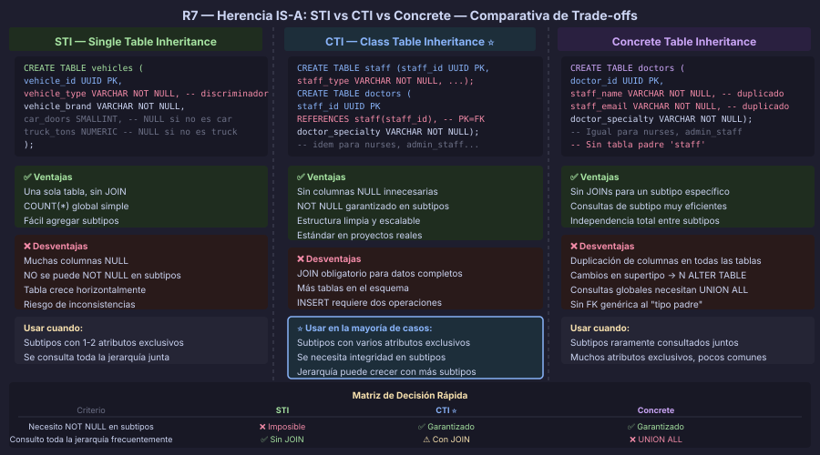

# Herencia: Tres Estrategias y sus Trade-offs

## 🎯 Objetivos

- Aplicar la Regla 7 para transformar jerarquías IS-A al modelo relacional
- Comparar STI, CTI y Concrete Table Inheritance con criterios técnicos
- Elegir la estrategia correcta según el contexto del negocio
- Implementar CTI en DBML y DDL PostgreSQL 16+

---

## 📖 Regla 7: Jerarquía IS-A → Elige una Estrategia

La transformación de jerarquías `IS-A` al modelo relacional es la única regla que
**no tiene una solución única**. Existen tres estrategias, cada una con ventajas y
desventajas que dependen del contexto.

> **Nota:** En la Semana 05 aprendiste los conceptos de especialización, generalización
> y restricciones (cobertura total/parcial, disyunción exclusiva/inclusiva). En esta
> semana aplicamos esos conceptos en el modelo relacional.



---

## 📖 Estrategia 1: Single Table Inheritance (STI)

**Toda la jerarquía en una sola tabla** con una columna discriminadora:

```sql
-- Jerarquía: VEHICLE → {CAR, TRUCK, MOTORCYCLE}
-- Estrategia: STI

CREATE TABLE vehicles (
    vehicle_id           UUID        DEFAULT gen_random_uuid() PRIMARY KEY,

    -- Columna discriminadora (indica el subtipo)
    vehicle_type         VARCHAR(12) NOT NULL
        CHECK (vehicle_type IN ('car', 'truck', 'motorcycle')),

    -- Atributos del supertipo (todos los vehículos)
    vehicle_brand        VARCHAR(80) NOT NULL,
    vehicle_year         SMALLINT    NOT NULL,
    vehicle_plate        VARCHAR(20) NOT NULL UNIQUE,

    -- Atributos de CAR (NULL para truck y motorcycle)
    car_doors            SMALLINT,
    car_trunk_liters     INTEGER,

    -- Atributos de TRUCK (NULL para car y motorcycle)
    truck_payload_tons   NUMERIC(6,2),
    truck_axles          SMALLINT,

    -- Atributos de MOTORCYCLE (NULL para car y truck)
    motorcycle_has_sidecar BOOLEAN,

    created_at           TIMESTAMPTZ NOT NULL DEFAULT NOW(),

    -- Restricciones de integridad para los subtipos
    CONSTRAINT ck_vehicles_car_attrs
        CHECK (vehicle_type <> 'car' OR (car_doors IS NOT NULL)),
    CONSTRAINT ck_vehicles_truck_attrs
        CHECK (vehicle_type <> 'truck' OR (truck_payload_tons IS NOT NULL))
);
```

### STI: Pros y contras

| ✅ Ventajas | ❌ Desventajas |
|---|---|
| Una sola tabla → consultas simples sin JOIN | Muchas columnas `NULL` (desperdicio, confusión) |
| `COUNT(*)` y listados globales sin JOIN | Imposible `NOT NULL` en atributos de subtipo |
| Fácil de agregar subtipos | Tabla crece horizontalmente con cada subtipo |
| Ideal cuando subtipos tienen pocos atributos propios | Violación implícita de 1FN si no se cuida |

**Cuándo usar STI:**
- Subtipos con **pocos atributos exclusivos** (1-2 por subtipo)
- Se consulta frecuentemente **toda la jerarquía junta**
- La jerarquía **no cambiará mucho** en el futuro

---

## 📖 Estrategia 2: Class Table Inheritance (CTI) ← Recomendada

**Una tabla para el supertipo + una tabla por cada subtipo**. La PK del subtipo es
también FK al supertipo, creando una relación 1:1 entre ambas:

```sql
-- Jerarquía: STAFF → {DOCTOR, NURSE, ADMIN}
-- Estrategia: CTI (recomendada para producción)

-- Supertipo
CREATE TABLE staff (
    staff_id        UUID         DEFAULT gen_random_uuid() PRIMARY KEY,
    staff_type      VARCHAR(10)  NOT NULL
        CHECK (staff_type IN ('doctor', 'nurse', 'admin')),
    staff_name      VARCHAR(100) NOT NULL,
    staff_email     VARCHAR(150) NOT NULL,
    staff_hire_date DATE         NOT NULL,
    created_at      TIMESTAMPTZ  NOT NULL DEFAULT NOW(),

    CONSTRAINT uq_staff_email UNIQUE (staff_email)
);

-- Subtipo DOCTOR — PK = FK (relación 1:1 con staff)
CREATE TABLE doctors (
    staff_id              UUID        PRIMARY KEY
        REFERENCES staff(staff_id) ON DELETE CASCADE,
    doctor_medical_number VARCHAR(20) NOT NULL,
    doctor_specialty      VARCHAR(80) NOT NULL,

    CONSTRAINT uq_doctors_medical_number UNIQUE (doctor_medical_number)
);

-- Subtipo NURSE
CREATE TABLE nurses (
    staff_id    UUID        PRIMARY KEY
        REFERENCES staff(staff_id) ON DELETE CASCADE,
    nurse_shift VARCHAR(10) NOT NULL
        CHECK (nurse_shift IN ('morning', 'afternoon', 'night')),
    nurse_unit  VARCHAR(80) NOT NULL
);

-- Subtipo ADMIN_STAFF
CREATE TABLE admin_staff (
    staff_id            UUID     PRIMARY KEY
        REFERENCES staff(staff_id) ON DELETE CASCADE,
    admin_department    VARCHAR(80) NOT NULL,
    admin_salary_level  SMALLINT    NOT NULL DEFAULT 1
        CHECK (admin_salary_level BETWEEN 1 AND 5)
);
```

### Consultar un subtipo específico (JOIN obligatorio en CTI)

```sql
-- Obtener todos los médicos con sus datos de staff
SELECT
    s.staff_id,
    s.staff_name,
    s.staff_email,
    d.doctor_medical_number,
    d.doctor_specialty
FROM staff       AS s
JOIN doctors     AS d ON d.staff_id = s.staff_id
WHERE s.staff_type = 'doctor';

-- Obtener TODOS los empleados (cualquier tipo)
SELECT
    s.staff_id,
    s.staff_name,
    s.staff_type,
    d.doctor_specialty,       -- NULL si no es doctor
    n.nurse_shift,            -- NULL si no es enfermero
    a.admin_department        -- NULL si no es admin
FROM staff           AS s
LEFT JOIN doctors    AS d ON d.staff_id = s.staff_id
LEFT JOIN nurses     AS n ON n.staff_id = s.staff_id
LEFT JOIN admin_staff AS a ON a.staff_id = s.staff_id;
```

### CTI: Pros y contras

| ✅ Ventajas | ❌ Desventajas |
|---|---|
| Sin columnas `NULL` innecesarias | Requiere JOIN para datos completos |
| `NOT NULL` garantizado en atributos de subtipo | Más tablas en el esquema |
| Fácil de agregar/eliminar subtipos | INSERT requiere dos operaciones (supertipo + subtipo) |
| Estructura limpia y escalable | Consultas globales más costosas |
| **Estrategia estándar en proyectos reales** | — |

**Cuándo usar CTI:**
- Subtipos con **varios atributos exclusivos**
- Se necesita **integridad garantizada** en los datos de subtipo
- La jerarquía puede **crecer** con más subtipos
- **Caso general** — cuando no tienes motivo específico para otra estrategia

---

## 📖 Estrategia 3: Concrete Table Inheritance

**Una tabla independiente por cada subtipo**, sin tabla para el supertipo. Los atributos
comunes se repiten en cada tabla:

```sql
-- Jerarquía: PAYMENT → {CREDIT_CARD_PAYMENT, BANK_TRANSFER, CASH_PAYMENT}
-- Estrategia: Concrete (cuando los subtipos raramente se consultan juntos)

CREATE TABLE credit_card_payments (
    payment_id       UUID            DEFAULT gen_random_uuid() PRIMARY KEY,
    order_id         UUID            NOT NULL REFERENCES orders(order_id),
    -- Atributos del supertipo (duplicados en cada tabla)
    payment_amount   NUMERIC(10, 2)  NOT NULL,
    payment_date     TIMESTAMPTZ     NOT NULL DEFAULT NOW(),
    -- Atributos exclusivos de este subtipo
    card_last_four   CHAR(4)         NOT NULL,
    card_brand       VARCHAR(20)     NOT NULL
);

CREATE TABLE bank_transfers (
    payment_id       UUID            DEFAULT gen_random_uuid() PRIMARY KEY,
    order_id         UUID            NOT NULL REFERENCES orders(order_id),
    -- Atributos del supertipo (duplicados)
    payment_amount   NUMERIC(10, 2)  NOT NULL,
    payment_date     TIMESTAMPTZ     NOT NULL DEFAULT NOW(),
    -- Atributos exclusivos
    transfer_bank    VARCHAR(80)     NOT NULL,
    transfer_ref     VARCHAR(40)     NOT NULL UNIQUE
);

CREATE TABLE cash_payments (
    payment_id       UUID            DEFAULT gen_random_uuid() PRIMARY KEY,
    order_id         UUID            NOT NULL REFERENCES orders(order_id),
    -- Atributos del supertipo (duplicados)
    payment_amount   NUMERIC(10, 2)  NOT NULL,
    payment_date     TIMESTAMPTZ     NOT NULL DEFAULT NOW(),
    -- Atributos exclusivos
    cash_received    NUMERIC(10, 2)  NOT NULL,
    cash_change      NUMERIC(10, 2)  NOT NULL DEFAULT 0
);
```

### Concrete: Pros y contras

| ✅ Ventajas | ❌ Desventajas |
|---|---|
| Sin JOINs para datos completos de un subtipo | Duplicación de columnas en todas las tablas |
| Consultas de un subtipo muy eficientes | Los cambios en el supertipo se propagan a N tablas |
| Independencia total entre subtipos | Consultas globales requieren `UNION ALL` |
| — | Sin tabla central → no hay FK genérica al "tipo padre" |

**Cuándo usar Concrete:**
- Subtipos que **raramente se consultan juntos**
- Cada subtipo tiene **muchos atributos exclusivos** y pocos comunes
- Se prioriza rendimiento en consultas por subtipo sobre mantenibilidad

---

## 📖 Matriz de Decisión

| Criterio | STI | CTI | Concrete |
|---|---|---|---|
| Pocos atributos exclusivos por subtipo | ✅ Ideal | ✅ Ok | ❌ Desperdicio |
| Muchos atributos exclusivos | ❌ Muchos NULL | ✅ Ideal | ✅ Ok |
| Necesidad de `NOT NULL` en atributos de subtipo | ❌ Imposible | ✅ Garantizado | ✅ Garantizado |
| Consultas frecuentes sobre toda la jerarquía | ✅ Sin JOIN | ❌ Con JOIN | ❌ UNION ALL |
| Consultas frecuentes sobre un subtipo | ✅ Sin JOIN | ❌ Con JOIN | ✅ Sin JOIN |
| Escalabilidad (agregar subtipos) | ✅ Fácil | ✅ Muy fácil | ⚠️ Duplicar código |
| Cambios en atributos del supertipo | ✅ Un ALTER | ✅ Un ALTER | ❌ N ALTER |
| **Recomendación general** | Jerarquías planas simples | **Producción estándar** | Subtipos muy independientes |

---

## 📖 CTI en DBML (repaso rápido)

```dbml
// Supertipo
Table staff {
  staff_id   uuid [pk, default: `gen_random_uuid()`]
  staff_type varchar(10) [not null]
  staff_name varchar(100) [not null]
  created_at timestamptz [not null, default: `now()`]
}

// Subtipo — ref: - indica relación 1-1 (herencia CTI)
Table doctors {
  staff_id             uuid [pk, ref: - staff.staff_id]
  doctor_medical_number varchar(20) [not null, unique]
  doctor_specialty      varchar(80) [not null]
}

Table nurses {
  staff_id    uuid       [pk, ref: - staff.staff_id]
  nurse_shift varchar(10) [not null]
  nurse_unit  varchar(80) [not null]
}
```

> **Recordatorio clave DBML:**
> - `ref: -` → relación 1:1 (PK subtipo = FK a supertipo — CTI)
> - `ref: >` → relación N:1 (FK en tabla con muchos)
> - `ref: <>` → relación N:M (tabla de intersección)

---

## ✅ Checklist — Regla 7: Herencia IS-A

- [ ] Identificada la restricción de cobertura (total o parcial)
- [ ] Identificada la restricción de disyunción (exclusiva o inclusiva)
- [ ] Elegida la estrategia con justificación documentada
- [ ] Si CTI: supertipo con columna discriminadora + `CHECK`
- [ ] Si CTI: cada subtipo tiene su tabla con PK = FK al supertipo (`ON DELETE CASCADE`)
- [ ] Si STI: columna discriminadora `NOT NULL` + `CHECK` con todos los valores válidos
- [ ] Si STI: `CHECK` constraints para garantizar atributos requeridos por subtipo
- [ ] Si Concrete: atributos del supertipo duplicados y documentados en cada tabla

---

← [Transformación de relaciones](02-transformacion-relaciones.md) &nbsp;&nbsp;|&nbsp;&nbsp; [README →](../README.md)
