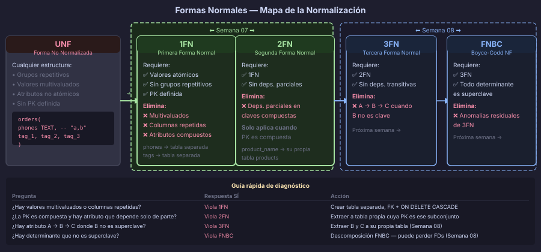
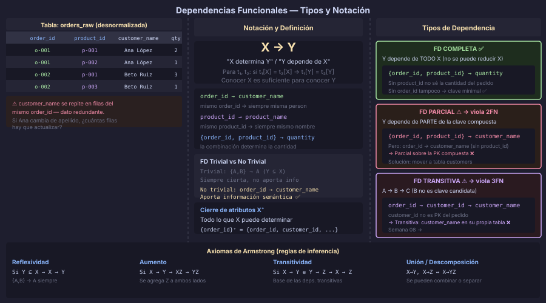

# Dependencias Funcionales

> **Semana 07 · Teoría 1 de 3** — La base matemática de la normalización



---

## ¿Por qué normalizar?

Antes de hablar de formas normales necesitamos una herramienta que nos permita
describir con precisión las relaciones entre los datos. Esa herramienta son las
**dependencias funcionales** (FD, del inglés *Functional Dependency*).

Una base de datos sin normalizar puede tener **anomalías** que hacen difícil mantener
los datos correctos:

| Anomalía | Descripción | Ejemplo |
|---|---|---|
| **Inserción** | No se puede insertar un dato sin conocer otro | No puedo agregar un producto sin tener un pedido |
| **Actualización** | Cambiar un dato requiere actualizar muchas filas | El nombre del cliente aparece en cada pedido |
| **Borrado** | Eliminar un registro borra información no relacionada | Al cancelar el último pedido, pierdo los datos del cliente |

La normalización elimina estas anomalías aplicando reglas que derivan directamente
del concepto de dependencia funcional.

---

## Definición formal

Dada una relación R con atributos A, B, C…, se dice que **X → Y** ("X determina Y")
si y solo si, para cualquier par de tuplas t₁ y t₂ en R:

$$\text{si } t_1[X] = t_2[X] \text{ entonces } t_1[Y] = t_2[Y]$$

En palabras: **conocer el valor de X es suficiente para conocer el valor de Y**.

### Terminología

| Término | Significado |
|---|---|
| **Determinante** | El lado izquierdo: X en X → Y |
| **Dependiente** | El lado derecho: Y en X → Y |
| **FD trivial** | Cuando Y ⊆ X (ejemplo: `{customer_id, customer_name} → customer_name`) |
| **FD no trivial** | Cuando Y ⊄ X — las relevantes para normalización |

---

## Ejemplo de referencia: LibroExpress

Usaremos esta tabla desnormalizada a lo largo de la semana:

```sql
-- Tabla desnormalizada (mal diseño — solo para análisis)
CREATE TABLE orders_raw (
    order_id          UUID,
    product_id        UUID,
    customer_id       UUID,
    customer_name     VARCHAR(100),
    customer_email    VARCHAR(150),
    customer_phones   TEXT,           -- "555-1234, 555-5678" ← violación 1FN
    product_name      VARCHAR(150),
    product_category  VARCHAR(80),
    quantity          SMALLINT,
    unit_price        NUMERIC(10,2),
    order_date        DATE,
    PRIMARY KEY (order_id, product_id)  -- PK compuesta
);
```

¿Cuáles son las dependencias funcionales en esta tabla?

```
order_id, product_id → quantity, unit_price            -- FD completa (depende de toda la PK)
order_id             → customer_id, customer_name,
                       customer_email, customer_phones,
                       order_date                      -- FD PARCIAL (solo la mitad de la PK)
product_id           → product_name, product_category -- FD PARCIAL (solo la mitad de la PK)
customer_id          → customer_name, customer_email   -- FD TRANSITIVA (a través de customer_id)
```



---

## Tipos de dependencias funcionales

### FD Completa (Full Functional Dependency)

Y depende **funcionalmente de forma completa** de X si X → Y y no existe ningún
subconjunto propio X' ⊂ X que también determine Y.

```
-- FD completa en orders_raw:
{order_id, product_id} → quantity

-- Verificación: ¿puede order_id sólo determinar quantity? NO
-- ¿puede product_id sólo determinar quantity? NO
-- Luego quantity depende de TODA la clave compuesta → FD completa ✅
```

### FD Parcial (Partial Functional Dependency)

Y depende **parcialmente** de X si existe un subconjunto propio X' ⊂ X tal que
X' → Y.

```
-- FD parcial en orders_raw:
{order_id, product_id} → customer_name

-- Pero también: order_id → customer_name (¡sin necesitar product_id!)
-- Luego customer_name depende SOLO de order_id → FD parcial ⚠️
```

Las FD parciales son el objetivo de la **Segunda Forma Normal (2FN)**.

### FD Transitiva (Transitive Functional Dependency)

Y es transitivamente dependiente de X si existe Z tal que X → Z y Z → Y,
pero Z no determina X (es decir, Z no es parte de ninguna clave candidata).

```
-- FD transitiva en orders_raw:
order_id     → customer_id          -- (1)
customer_id  → customer_name        -- (2)
-- Por transitividad: order_id → customer_name a través de customer_id

-- customer_id NO es clave candidata → es una FD transitiva ⚠️
```

Las FD transitivas son el objetivo de la **Tercera Forma Normal (3FN)** — próxima semana.

---

## Axiomas de Armstrong

Los **axiomas de Armstrong** son reglas de inferencia que permiten derivar todas las
FDs implicadas por un conjunto dado. Son completos y correctos.

| Axioma | Regla | Expresión |
|---|---|---|
| **Reflexividad** | Un conjunto de atributos determina a cualquier subconjunto propio | Si Y ⊆ X → X → Y |
| **Aumento** | Se pueden agregar atributos a ambos lados | Si X → Y → XZ → YZ |
| **Transitividad** | La determinación es transitiva | Si X → Y e Y → Z → X → Z |

Reglas derivadas útiles:

| Regla | Expresión |
|---|---|
| **Unión** | Si X → Y e X → Z → X → YZ |
| **Descomposición** | Si X → YZ → X → Y e X → Z |
| **Pseudo-transitividad** | Si X → Y e WY → Z → WX → Z |

---

## Cierre de atributos (Attribute Closure)

Dado un conjunto de atributos X y un conjunto de FDs F, el **cierre de X** (notado X⁺)
es el conjunto de todos los atributos que X determina (directa o transitivamente).

### Algoritmo para calcular X⁺

```
1. Inicializar: cierre = X
2. Repetir hasta que cierre no cambie:
   Para cada FD (A → B) en F:
     Si A ⊆ cierre:
       cierre = cierre ∪ B
3. Devolver cierre
```

**Ejemplo** con `orders_raw` y X = {order_id}:

```
Paso 1: cierre = {order_id}
Paso 2: Aplicar FDs:
  - order_id → customer_id, customer_name, customer_email, order_date
    → cierre = {order_id, customer_id, customer_name, customer_email, order_date}
  - customer_id → customer_name, customer_email
    → (ya están en cierre)
Resultado: {order_id}⁺ = {order_id, customer_id, customer_name, customer_email, order_date}

¿Es order_id una clave candidata? NO — porque no incluye quantity, unit_price, product_id
```

---

## Claves candidatas a partir de FDs

Una **clave candidata** de R es un conjunto minimal de atributos K tal que K⁺ = R
(todos los atributos de la relación).

**Ejemplo** con `orders_raw`:

```
¿Es {order_id, product_id} una clave candidata?
  {order_id, product_id}⁺ = todos los atributos de orders_raw? → Sí ✅
  ¿Es minimal? Probemos subconjuntos:
    {order_id}⁺ ≠ todos los atributos → No puede omitirse order_id
    {product_id}⁺ ≠ todos los atributos → No puede omitirse product_id
  → {order_id, product_id} ES clave candidata ✅
```

---

## Resumen: qué elimina cada forma normal

| Forma Normal | Requisito | Elimina |
|---|---|---|
| **1FN** | Atributos atómicos, sin grupos repetitivos | Valores multivaluados |
| **2FN** | 1FN + sin FD parciales | Redundancia en claves compuestas |
| **3FN** | 2FN + sin FD transitivas | Redundancia transitiva |
| **FNBC** | Toda FD X → Y tiene X como superclave | Anomalías residuales de 3FN |

---

← [README Semana 07](../README.md) &nbsp;&nbsp;|&nbsp;&nbsp; [02 — Primera Forma Normal →](./02-primera-forma-normal.md)
