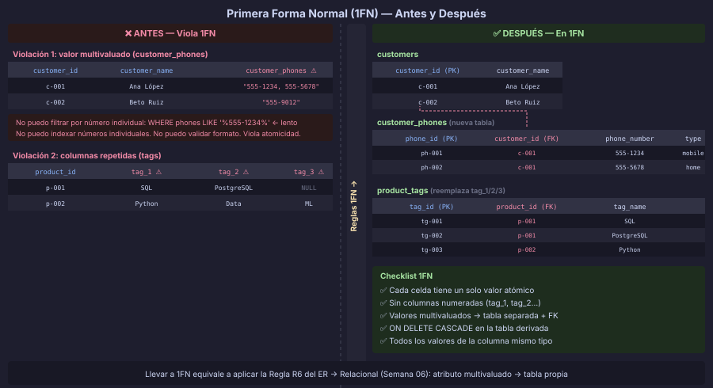

# Primera Forma Normal (1FN)

> **Semana 07 · Teoría 2 de 3** — Atributos atómicos y sin grupos repetitivos

---

## Prerequisito

Haber leído [01 — Dependencias Funcionales](./01-dependencias-funcionales.md).

---

## Definición

Una relación está en **Primera Forma Normal (1FN)** si y solo si:

1. Todos los atributos contienen valores **atómicos** (indivisibles)
2. No existen **grupos repetitivos** (columnas que se repiten con distinto nombre)
3. Cada celda contiene **un único valor** del dominio correspondiente
4. Todos los valores de una columna son del **mismo tipo**

La 1FN es la forma normal más básica y es un prerequisito para todas las demás.

---

## Violaciones más comunes

### Violación 1: Valores multivaluados en una celda

```sql
-- ❌ VIOLACIÓN: varios teléfonos en una sola columna
INSERT INTO customers VALUES
('c-001', 'Ana López', '555-1234, 555-5678, 555-9012');
--                      ^^^^^^^^^^^^^^^^^^^^^^^^^^^^^^^^
--                      Tres valores en una celda → viola 1FN
```

Problema: no podemos consultar, filtrar ni indexar un número de teléfono específico
sin parsear el texto.

### Violación 2: Columnas repetidas (grupos repetitivos)

```sql
-- ❌ VIOLACIÓN: columnas que replican la misma información
CREATE TABLE products_old (
    product_id     UUID PRIMARY KEY,
    product_name   VARCHAR(150),
    tag_1          VARCHAR(50),    -- grupo repetitivo
    tag_2          VARCHAR(50),    -- grupo repetitivo
    tag_3          VARCHAR(50)     -- grupo repetitivo
);
```

Problema: ¿cuántos tags puede tener un producto? ¿Y si necesita 10? Tendrías que
hacer `ALTER TABLE` para agregar columnas.

### Violación 3: Atributos compuestos sin descomponer

```sql
-- ❌ VIOLACIÓN: dirección como una sola cadena no atómica
CREATE TABLE suppliers (
    supplier_id      UUID PRIMARY KEY,
    supplier_address TEXT  -- "Av. Reforma 123, CDMX, México"
);
-- No podemos filtrar por ciudad sin hacer LIKE '%CDMX%'
```

---

## Cómo identificar violaciones 1FN

Hazte estas preguntas al revisar un esquema:

| Pregunta | Si la respuesta es SÍ... |
|---|---|
| ¿Alguna columna puede tener múltiples valores separados por coma/punto y coma? | Violación 1FN |
| ¿Hay columnas numeradas: `phone_1`, `phone_2`, `phone_3`? | Violación 1FN |
| ¿Se almacena JSON/XML en TEXT cuando se necesita consultar dentro? | Candidata a violación |
| ¿La dirección es una sola cadena cuando necesitas filtrar por ciudad? | Violación 1FN |

> **Nota sobre PostgreSQL y JSONB/ARRAY:**
> PostgreSQL admite columnas `JSONB` y `ARRAY` de forma nativa. Técnicamente
> violan 1FN en teoría relacional clásica. Se usan cuando el contenido es
> **opaco** (se guarda y recupera completo) y **no se requiere filtrar por
> sus elementos internos** con alta frecuencia. Si necesitas `WHERE skills @> '["SQL"]'`
> frecuentemente, es señal de que los datos deberían estar en su propia tabla.

---

## Cómo llevar a 1FN

### Caso 1: Valores multivaluados → tabla separada

Esta es exactamente la **Regla R6** de transformación ER que vimos en la Semana 06.

```sql
-- ANTES: teléfonos como lista de texto (viola 1FN)
CREATE TABLE customers_bad (
    customer_id     UUID PRIMARY KEY,
    customer_name   VARCHAR(100) NOT NULL,
    customer_phones TEXT         -- "555-1234, 555-5678"
);

-- DESPUÉS: tabla separada para teléfonos (1FN ✅)
CREATE TABLE customers (
    customer_id   UUID         DEFAULT gen_random_uuid() PRIMARY KEY,
    customer_name VARCHAR(100) NOT NULL
);

CREATE TABLE customer_phones (
    customer_phone_id UUID        DEFAULT gen_random_uuid() PRIMARY KEY,
    customer_id       UUID        NOT NULL
        REFERENCES customers(customer_id) ON DELETE CASCADE,
    phone_number      VARCHAR(20) NOT NULL,
    phone_type        VARCHAR(10) DEFAULT 'mobile'  -- mobile | home | work

    CONSTRAINT uq_customer_phone UNIQUE (customer_id, phone_number)
);
```

Ahora podemos consultar, filtrar e indexar teléfonos eficientemente:

```sql
-- ✅ Consulta eficiente en 1FN
SELECT c.customer_name, p.phone_number
FROM customers     AS c
JOIN customer_phones AS p ON p.customer_id = c.customer_id
WHERE p.phone_type = 'mobile';
```

### Caso 2: Columnas repetidas → tabla separada

```sql
-- ANTES: tags con columnas repetidas (viola 1FN)
CREATE TABLE products_bad (
    product_id   UUID PRIMARY KEY,
    product_name VARCHAR(150),
    tag_1        VARCHAR(50),
    tag_2        VARCHAR(50),
    tag_3        VARCHAR(50)
);

-- DESPUÉS: tabla separada para tags (1FN ✅)
CREATE TABLE products (
    product_id   UUID         DEFAULT gen_random_uuid() PRIMARY KEY,
    product_name VARCHAR(150) NOT NULL
);

CREATE TABLE product_tags (
    product_tag_id UUID        DEFAULT gen_random_uuid() PRIMARY KEY,
    product_id     UUID        NOT NULL
        REFERENCES products(product_id) ON DELETE CASCADE,
    tag_name       VARCHAR(50) NOT NULL,

    CONSTRAINT uq_product_tag UNIQUE (product_id, tag_name)
);
```

### Caso 3: Atributo compuesto → columnas atómicas

```sql
-- ANTES: dirección como cadena no atómica
CREATE TABLE suppliers_bad (
    supplier_id      UUID PRIMARY KEY,
    supplier_address TEXT
);

-- DESPUÉS: columnas atómicas (1FN ✅)
CREATE TABLE suppliers (
    supplier_id      UUID         DEFAULT gen_random_uuid() PRIMARY KEY,
    supplier_street  VARCHAR(150) NOT NULL,
    supplier_city    VARCHAR(80)  NOT NULL,
    supplier_state   VARCHAR(80),
    supplier_country VARCHAR(60)  NOT NULL DEFAULT 'México',
    supplier_zip     VARCHAR(10)
);
```

---

## LibroExpress: diagnóstico 1FN

Revisemos la tabla `orders_raw` de la Semana 07:

```sql
orders_raw(
    order_id,          -- UUID
    product_id,        -- UUID
    customer_id,       -- UUID
    customer_name,     -- VARCHAR → atómico ✅
    customer_email,    -- VARCHAR → atómico ✅
    customer_phones,   -- TEXT "555-1234, 555-5678" → VIOLA 1FN ❌
    product_name,      -- VARCHAR → atómico ✅
    product_category,  -- VARCHAR → atómico ✅
    quantity,          -- SMALLINT → atómico ✅
    unit_price,        -- NUMERIC → atómico ✅
    order_date         -- DATE → atómico ✅
)
```

**Una violación detectada:** `customer_phones` almacena múltiples teléfonos en texto.



**Corrección 1FN:** extraer `customer_phones` a una tabla separada.

```sql
-- customer_phones en su propia tabla
CREATE TABLE customer_phones (
    customer_phone_id UUID        DEFAULT gen_random_uuid() PRIMARY KEY,
    customer_id       UUID        NOT NULL
        REFERENCES customers(customer_id) ON DELETE CASCADE,
    phone_number      VARCHAR(20) NOT NULL,
    CONSTRAINT uq_customer_phone UNIQUE (customer_id, phone_number)
);
```

> Aunque corrijamos la violación 1FN, la tabla `orders_raw` (sin `customer_phones`)
> todavía tiene dependencias **parciales** que resolveremos en la próxima sección.

---

## Regla de oro: 1FN y PRIMARY KEY

Una tabla no puede tener una `PRIMARY KEY` válida si:
- La clave está formada por un valor no atómico
- Las filas no son distinguibles sin parsing de texto

La existencia de una `PRIMARY KEY` bien definida es señal de que al menos la
estructura básica de 1FN está cubierta.

---

← [01 — Dependencias Funcionales](./01-dependencias-funcionales.md) &nbsp;&nbsp;|&nbsp;&nbsp; [03 — Segunda Forma Normal →](./03-segunda-forma-normal.md)
