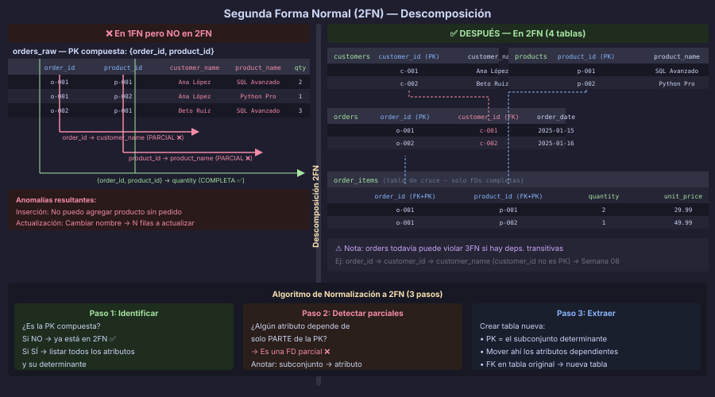

# Segunda Forma Normal (2FN)

> **Semana 07 · Teoría 3 de 3** — Eliminar dependencias parciales

---

## Prerequisito

Haber leído [02 — Primera Forma Normal](./02-primera-forma-normal.md).

---

## Definición

Una relación está en **Segunda Forma Normal (2FN)** si y solo si:

1. Está en **1FN**
2. Todo atributo no clave tiene **dependencia funcional completa** de la clave primaria
   (es decir, no existen dependencias funcionales **parciales**).

Una **dependencia parcial** ocurre cuando un atributo no clave depende de
*una parte* de la clave primaria compuesta, pero no de toda ella.

> **Importante:** La 2FN es relevante únicamente cuando la tabla tiene una
> **clave primaria compuesta**. Una tabla con clave primaria de una sola columna
> está automáticamente en 2FN (porque no puede haber un subconjunto propio
> de una clave de un único atributo).

---

## Anomalías por dependencias parciales

Usando la tabla `orders_raw` de LibroExpress (ya en 1FN, sin `customer_phones`):

```
PK: {order_id, product_id}

FDs en la tabla:
  {order_id, product_id} → quantity, unit_price   -- FD completa ✅
  order_id               → customer_id,            -- FD PARCIAL ⚠️
                           customer_name,
                           customer_email,
                           order_date
  product_id             → product_name,           -- FD PARCIAL ⚠️
                           product_category
```

Estas dependencias parciales generan las siguientes anomalías:

### Anomalía de inserción

```sql
-- ❌ No se puede registrar un nuevo producto si no existe ningún pedido
INSERT INTO orders_raw (product_id, product_name, product_category)
VALUES (gen_random_uuid(), 'Clean Code', 'Programación');
-- ERROR: order_id no puede ser NULL (es parte de la PK)
```

### Anomalía de actualización

```sql
-- ❌ Cambiar el nombre de un cliente requiere actualizar TODAS sus filas
-- Si "Ana López" tiene 50 pedidos, hay que actualizar 50 filas
UPDATE orders_raw
SET customer_name = 'Ana García'
WHERE customer_id = 'c-001';
-- Se actualizan 50 filas — inconsistencia si alguna falla
```

### Anomalía de borrado

```sql
-- ❌ Borrar el único pedido de un producto elimina toda la info del producto
DELETE FROM orders_raw
WHERE order_id = 'o-007' AND product_id = 'p-099';
-- Si era el único pedido del producto 'p-099', perdemos product_name y product_category
```

---

## Cómo llevar a 2FN

La solución es **descomponer** la tabla: mover cada grupo de atributos con
dependencia parcial a su propia tabla.

### Paso 1: Identificar los grupos de dependencia

```
Grupo 1 — depende de {order_id, product_id}:
  → quantity, unit_price

Grupo 2 — depende solo de {order_id}:
  → customer_id, customer_name, customer_email, order_date

Grupo 3 — depende solo de {product_id}:
  → product_name, product_category
```

> Nota: `customer_name` y `customer_email` también dependen de `customer_id`
> (dependencia transitiva). Esto se resuelve en la **Semana 08** con 3FN.

### Paso 2: Crear una tabla por cada grupo

```sql
-- Tabla 1: solo los datos del pedido + referencia al cliente
CREATE TABLE orders (
    order_id    UUID        DEFAULT gen_random_uuid() PRIMARY KEY,
    customer_id UUID        NOT NULL
        REFERENCES customers(customer_id) ON DELETE RESTRICT,
    order_date  DATE        NOT NULL DEFAULT CURRENT_DATE,
    created_at  TIMESTAMPTZ NOT NULL DEFAULT NOW()
);

-- Tabla 2: datos del producto
CREATE TABLE products (
    product_id       UUID        DEFAULT gen_random_uuid() PRIMARY KEY,
    product_name     VARCHAR(150) NOT NULL,
    product_category VARCHAR(80)  NOT NULL,
    created_at       TIMESTAMPTZ  NOT NULL DEFAULT NOW()
);

-- Tabla 3: intersección con los atributos que dependen de AMBAS claves (2FN ✅)
CREATE TABLE order_items (
    order_item_id  UUID         DEFAULT gen_random_uuid() PRIMARY KEY,
    order_id       UUID         NOT NULL
        REFERENCES orders(order_id)   ON DELETE CASCADE,
    product_id     UUID         NOT NULL
        REFERENCES products(product_id) ON DELETE RESTRICT,
    quantity       SMALLINT     NOT NULL CHECK (quantity > 0),
    unit_price     NUMERIC(10,2) NOT NULL CHECK (unit_price >= 0),

    CONSTRAINT uq_order_items_order_product UNIQUE (order_id, product_id)
);
```



---

## El esquema resultante (2FN)

```
customers (customer_id PK, customer_name, customer_email)
    ↑
    │ FK
orders (order_id PK, customer_id FK, order_date)
    ↑
    │ FK
order_items (order_item_id PK, order_id FK, product_id FK, quantity, unit_price)
                                                   ↑
                                                   │ FK
products (product_id PK, product_name, product_category)
```

Verificación:
- `order_items`: atributos `quantity` y `unit_price` dependen de `{order_id, product_id}` → FD completa ✅
- `orders`: atributo `order_date` depende de `order_id` (PK simple) → automáticamente 2FN ✅
- `customers`: atributos dependen de `customer_id` (PK simple) → automáticamente 2FN ✅
- `products`: atributos dependen de `product_id` (PK simple) → automáticamente 2FN ✅

> **¿Ya está en 3FN?** Todavía no. Veremos en la Semana 08 que `customer_name`
> y `customer_email` en la tabla `customers` podrían tener dependencias transitivas
> si, por ejemplo, hubiera un `customer_category_id` del que dependieran otros atributos.

---

## 2FN y UUIDs como PK

En el bootcamp usamos `UUID` como clave primaria en todas las tablas, lo que
**garantiza automáticamente 2FN** para los atributos directos de esa tabla.

Sin embargo, 2FN sigue siendo relevante en:

1. **Tablas de intersección** con PK compuesta:
   ```sql
   -- job_applications(user_id, job_posting_id)  ← PK compuesta
   -- Si agrego: job_posting_company_name VARCHAR -- ← depende solo de job_posting_id
   -- → viola 2FN ⚠️
   ```

2. **Análisis de FDs** para encontrar redundancias aunque la PK sea UUID:
   ```sql
   -- staff(staff_id PK, staff_name, staff_department_id, staff_department_name)
   -- staff_department_name depende de staff_department_id, no de staff_id
   -- Técnicamente es una FD transitiva (3FN), pero el análisis viene de los mismos principios
   ```

---

## Resumen: decisiones de diseño al aplicar 2FN

| Situación | Decisión |
|---|---|
| Atributo depende de toda la PK compuesta | Dejarlo en la tabla |
| Atributo depende solo de *parte* de la PK | Moverlo a una tabla nueva cuya PK es esa parte |
| PK es de una sola columna | Automáticamente en 2FN para todos sus atributos |
| Tabla de intersección con atributos propios | Verificar que dependen de AMBAS FK |

---

← [02 — Primera Forma Normal](./02-primera-forma-normal.md) &nbsp;&nbsp;|&nbsp;&nbsp; [→ README Semana 07](../README.md)
