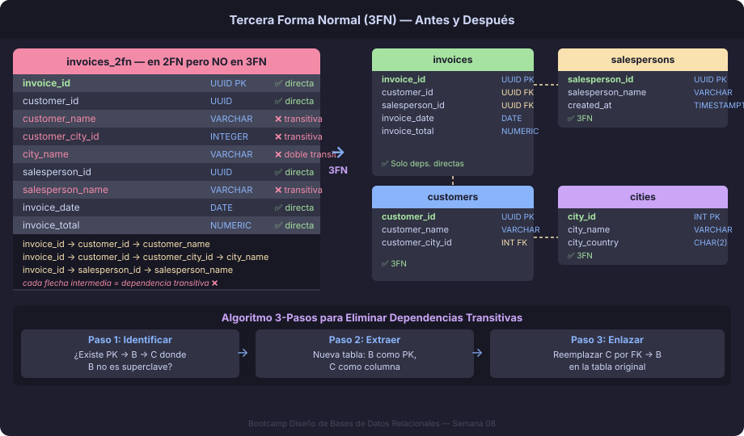

# Tercera Forma Normal (3FN)

## ¿Qué es la 3FN?

Una relación está en **Tercera Forma Normal** cuando cumple dos condiciones:

1. Está en **2FN** (sin dependencias parciales)
2. **No existen dependencias funcionales transitivas** de ningún atributo
   no-clave respecto a la clave primaria

Formalmente, para toda FD no-trivial `X → A` en la relación, debe cumplirse
**al menos una** de las siguientes condiciones:

- X es una superclave
- A es un atributo primo (forma parte de alguna clave candidata)

La segunda condición es la que distingue a la 3FN de la FNBC (que exige
únicamente la primera). Veremos la diferencia en el siguiente archivo.

---

## Dependencia Transitiva

Una **dependencia transitiva** ocurre cuando existe una cadena:

$$PK \to B \to C$$

donde `B` no es una superclave ni un atributo primo. En otras palabras,
`C` no depende directamente de la PK — llega a ella "saltando" por `B`.

```
PK ──────────────────────► C    (aparenta relación directa)
PK ──► B ──► C              (realidad: transitiva, B no es clave)
```

El problema: `B` es información sobre una entidad diferente a la que
representa la PK. Al mezclarlas en la misma tabla surgen las mismas
anomalías de actualización y borrado que ya conocemos.

---

## Caso de Estudio: FacturaPro

FacturaPro es un sistema de facturación. Después de aplicar 2FN la semana
pasada, la tabla `invoices` quedó con una sola clave primaria `invoice_id`
(sin deps. parciales). Sin embargo, contiene varias dependencias transitivas:



```sql
-- invoices EN 2FN (PK simple) — PERO viola 3FN
CREATE TABLE invoices_2fn (
    invoice_id       UUID         PRIMARY KEY,
    customer_id      UUID         NOT NULL,
    customer_name    VARCHAR(100) NOT NULL,   -- ❌ transitiva: customer_id → customer_name
    customer_city_id INTEGER      NOT NULL,   -- ❌ transitiva: customer_id → customer_city_id
    city_name        VARCHAR(80)  NOT NULL,   -- ❌ doble transitiva: city_id → city_name
    salesperson_id   UUID         NOT NULL,
    salesperson_name VARCHAR(100) NOT NULL,   -- ❌ transitiva: salesperson_id → salesperson_name
    invoice_date     DATE         NOT NULL,
    invoice_total    NUMERIC(12,2) NOT NULL
);
```

### Mapa de Dependencias Funcionales

```
invoice_id ──► customer_id ──► customer_name     ← transitiva ❌
                          ──► customer_city_id ──► city_name  ← doble transitiva ❌
invoice_id ──► salesperson_id ──► salesperson_name ← transitiva ❌
invoice_id ──► invoice_date                       ← directa ✅
invoice_id ──► invoice_total                      ← directa ✅
```

### Anomalías resultantes

**Actualización:** Si la ciudad "Monterrey" cambia de nombre, hay que actualizar
todas las filas de `invoices_2fn` que contengan ese `customer_city_id`. Si se
olvida alguna fila, dos facturas del mismo cliente mostrarán nombres de ciudad
distintos.

**Inserción:** No se puede dar de alta una ciudad sin que exista al menos una
factura que la use.

**Borrado:** Si se elimina la última factura del cliente C-042, se pierde
información sobre qué ciudad tenía ese cliente.

---

## Cómo llevar una tabla a 3FN

### Algoritmo de síntesis (3 pasos)

1. **Identificar** todas las FDs no-triviales del esquema
2. **Detectar** cuáles tienen un determinante que no es superclave ni
   el dependiente es primo
3. **Extraer** cada grupo de FD transitiva a su propia tabla, con el
   determinante como PK

### Aplicado a FacturaPro

```sql
-- ============================================================
-- PASO 1: Tabla de ciudades (city_id → city_name)
-- ============================================================
CREATE TABLE cities (
    city_id      SMALLINT     NOT NULL GENERATED ALWAYS AS IDENTITY,
    city_name    VARCHAR(80)  NOT NULL,
    city_country CHAR(2)      NOT NULL,

    CONSTRAINT pk_cities PRIMARY KEY (city_id)
);

-- ============================================================
-- PASO 2: Tabla de clientes (customer_id → customer_name, city_id)
-- ============================================================
CREATE TABLE customers (
    customer_id   UUID         NOT NULL DEFAULT gen_random_uuid(),
    customer_name VARCHAR(100) NOT NULL,
    customer_city_id SMALLINT  NOT NULL,
    created_at    TIMESTAMPTZ  NOT NULL DEFAULT NOW(),

    CONSTRAINT pk_customers           PRIMARY KEY (customer_id),
    CONSTRAINT fk_customers_city_id
        FOREIGN KEY (customer_city_id) REFERENCES cities(city_id)
);

-- ============================================================
-- PASO 3: Tabla de vendedores (salesperson_id → salesperson_name)
-- ============================================================
CREATE TABLE salespersons (
    salesperson_id   UUID         NOT NULL DEFAULT gen_random_uuid(),
    salesperson_name VARCHAR(100) NOT NULL,
    created_at       TIMESTAMPTZ  NOT NULL DEFAULT NOW(),

    CONSTRAINT pk_salespersons PRIMARY KEY (salesperson_id)
);

-- ============================================================
-- PASO 4: invoices — solo FDs directas sobre invoice_id
-- ============================================================
CREATE TABLE invoices (
    invoice_id       UUID           NOT NULL DEFAULT gen_random_uuid(),
    customer_id      UUID           NOT NULL,
    salesperson_id   UUID           NOT NULL,
    invoice_date     DATE           NOT NULL,
    invoice_total    NUMERIC(12, 2) NOT NULL,
    created_at       TIMESTAMPTZ    NOT NULL DEFAULT NOW(),

    CONSTRAINT pk_invoices            PRIMARY KEY (invoice_id),
    CONSTRAINT fk_invoices_customer
        FOREIGN KEY (customer_id)    REFERENCES customers(customer_id),
    CONSTRAINT fk_invoices_salesperson
        FOREIGN KEY (salesperson_id) REFERENCES salespersons(salesperson_id),
    CONSTRAINT ck_invoices_total
        CHECK (invoice_total >= 0)
);
```

---

## Verificación: ¿Está en 3FN?

Para confirmar que el nuevo modelo está en 3FN, verifica cada tabla:

| Tabla         | PK               | ¿Hay FD transitiva? | Resultado |
|---------------|------------------|---------------------|-----------|
| `cities`      | `city_id`        | No                  | ✅ 3FN    |
| `customers`   | `customer_id`    | No                  | ✅ 3FN    |
| `salespersons`| `salesperson_id` | No                  | ✅ 3FN    |
| `invoices`    | `invoice_id`     | No                  | ✅ 3FN    |

> **Regla rápida:** si todos los atributos no-clave dependen **única y
> directamente** de la PK — y de nada más — la tabla está en 3FN.

---

## Reconocer Dependencias Transitivas en la Práctica

Las deps. transitivas más comunes en diseños reales:

| Patrón                          | Señal de alerta                                  |
|---------------------------------|--------------------------------------------------|
| `entidad_id` + `entidad_nombre` | Dos columnas que siempre se mueven juntas        |
| `codigo_postal` + `ciudad`      | El código determina la ciudad                    |
| `categoria_id` + `categoria`    | La categoría no depende de la entidad principal  |
| `empleado_id` + `departamento`  | El departamento depende del empleado, no del PK  |

---

## 3FN y las Tablas con PK Simple

Un punto importante: **las deps. parciales solo existen en tablas con PK
compuesta** (eso era 2FN). Las deps. **transitivas**, en cambio, pueden
existir en tablas con PK simple o compuesta.

Por eso la secuencia es obligatoria: primero 2FN, luego 3FN.

---

## Resumen

| Concepto              | Descripción                                          |
|-----------------------|------------------------------------------------------|
| Dep. directa          | `PK → A` sin intermediario                           |
| Dep. transitiva       | `PK → B → A` donde B no es superclave               |
| Violación de 3FN      | Dep. transitiva con A no-primo                       |
| Corrección            | Extraer `B → A` a tabla propia; FK en tabla original |
| Diferencia con 2FN    | 2FN elimina parciales (PK compuesta); 3FN elimina transitivas |

---

← [README](../README.md) | → [02 — Forma Normal de Boyce-Codd](02-forma-normal-boyce-codd.md)
