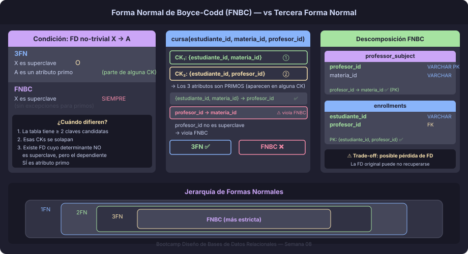

# Forma Normal de Boyce-Codd (FNBC)

## Motivación: ¿Por qué no basta con 3FN?

La Tercera Forma Normal tiene una condición de escape: un atributo puede
recibir una dependencia de un no-superclave **si ese atributo es primo**
(pertenece a alguna clave candidata).

Esto significa que ciertos diseños problemáticos pasan la prueba de 3FN
y, sin embargo, siguen teniendo anomalías. La **Forma Normal de Boyce-Codd**
(FNBC o BCNF) cierra esa brecha con una regla más estricta:

> **Para toda FD no-trivial `X → A`, X debe ser una superclave.**

Sin excepciones. Si cualquier determinante que no sea superclave existe en
la relación, la tabla viola FNBC.



---

## Cuándo Difieren 3FN y FNBC

3FN y FNBC solo difieren cuando se cumplen **simultáneamente** las tres
condiciones siguientes:

1. La tabla tiene **al menos dos claves candidatas**
2. Esas claves candidatas **se solapan** (comparten algún atributo)
3. Existe una **FD cuyo determinante no es superclave** pero el dependiente
   sí es un atributo primo

Si alguna de estas tres condiciones falla, 3FN = FNBC para esa tabla.

---

## Caso de Estudio: Horario Universitario

Una universidad registra qué estudiante cursa qué materia con qué profesor.
Las reglas de negocio son:

- Un estudiante cursa cada materia con **un solo** profesor
- Cada profesor enseña **una sola** materia (pero puede tener varios estudiantes)

Esto genera la siguiente tabla con sus FDs:

```sql
-- Relación: CURSA(estudiante_id, materia_id, profesor_id)
-- Regla 1: {estudiante_id, materia_id} → profesor_id
-- Regla 2: profesor_id → materia_id
```

### Análisis de Claves Candidatas

```
CK₁ = {estudiante_id, materia_id}
      (un estudiante + una materia determina el profesor)

CK₂ = {estudiante_id, profesor_id}
      (un estudiante + un profesor determina la materia,
       porque el profesor solo enseña una materia)
```

Los tres atributos son **primos** (aparecen en alguna CK).

### ¿Está en 3FN?

La FD `profesor_id → materia_id` tiene como dependiente `materia_id`.  
Como `materia_id` es primo (está en CK₁), la excepción de 3FN se aplica.  
**Resultado: SÍ está en 3FN.** ✅

### ¿Está en FNBC?

La FD `profesor_id → materia_id` tiene como determinante `profesor_id`.  
`profesor_id` solo **no** es superclave (hace falta `estudiante_id` para
identificar la fila).  
**Resultado: NO está en FNBC.** ❌

### El Problema Real

```sql
CREATE TABLE cursa (
    estudiante_id  VARCHAR(10) NOT NULL,
    materia_id     VARCHAR(10) NOT NULL,
    profesor_id    VARCHAR(10) NOT NULL,

    CONSTRAINT pk_cursa PRIMARY KEY (estudiante_id, materia_id),
    CONSTRAINT uq_cursa_alt UNIQUE (estudiante_id, profesor_id)
);

INSERT INTO cursa VALUES
    ('e-001', 'm-BD', 'p-Garcia'),
    ('e-001', 'm-OS', 'p-Lopez'),
    ('e-002', 'm-BD', 'p-Garcia'),
    ('e-002', 'm-OS', 'p-Ruiz'),   -- otro profesor enseña m-OS
    ('e-003', 'm-BD', 'p-Martinez'); -- otro profesor enseña m-BD ← ¡problema!
```

¿Cuál es la anomalía? Si el profesor García se va y lo reemplaza el profesor
Torres para m-BD, hay que actualizar **todas las filas** donde aparece
`p-Garcia`. Si se olvida alguna, dos filas del mismo estudiante podrían
apuntar a dos profesores distintos para la misma materia.

---

## Descomposición a FNBC

Para eliminar la violación, se extrae la FD problemática a su propia tabla:

```sql
-- Tabla 1: qué materia enseña cada profesor
CREATE TABLE professor_subject (
    profesor_id  VARCHAR(10) NOT NULL,
    materia_id   VARCHAR(10) NOT NULL,

    CONSTRAINT pk_professor_subject  PRIMARY KEY (profesor_id),
    CONSTRAINT uq_professor_subject  UNIQUE (materia_id, profesor_id)
);

-- Tabla 2: qué estudiante asiste a qué profesor
CREATE TABLE enrollments (
    estudiante_id  VARCHAR(10) NOT NULL,
    profesor_id    VARCHAR(10) NOT NULL,

    CONSTRAINT pk_enrollments PRIMARY KEY (estudiante_id, profesor_id),
    CONSTRAINT fk_enrollments_profesor
        FOREIGN KEY (profesor_id) REFERENCES professor_subject(profesor_id)
);
```

Ahora `profesor_id → materia_id` vive en `professor_subject` donde
`profesor_id` es la PK → es superclave. FNBC cumplida.

---

## El Trade-off: Pérdida de FDs

La descomposición FNBC **puede no ser reversible sin pérdida de FDs**.
En el ejemplo anterior, para recuperar la relación original
`(estudiante_id, materia_id, profesor_id)` basta un JOIN. Pero en casos
más complejos puede ocurrir que la FD original ya no sea computable desde
las tablas descompuestas sin ejecutar consultas adicionales.

Por esta razón, en la práctica muchos diseñadores prefieren quedarse en
**3FN** cuando la violación de FNBC involucra atributos primos, especialmente
si la anomalía es tolerable o gestionable por la aplicación.

> **Regla práctica:** Si la descomposición FNBC rompe una FD necesaria para
> el negocio, documenta la decisión y quédate en 3FN.

---

## Tabla Comparativa: 3FN vs FNBC

| Aspecto                        | 3FN                              | FNBC                             |
|--------------------------------|----------------------------------|----------------------------------|
| Condición                      | X→A: X es superclave **o** A es primo | X→A: X **siempre** es superclave |
| ¿Siempre descomponible sin pérdida? | Sí (teorema de síntesis)    | No siempre                       |
| ¿Elimina todas las anomalías?  | No siempre (excepción primo)     | Sí, cuando aplica                |
| Cuándo difieren                | Múltiples CKs solapadas          | Mismo caso                       |
| Uso en producción              | Muy común                        | Cuando las anomalías son críticas |

---

## Algoritmo para Detectar Violaciones FNBC

Para cada FD no-trivial `X → A` en la tabla:

1. Calcular `X⁺` (cierre de X)
2. Si `X⁺` contiene **todos los atributos** de la tabla → X es superclave → OK
3. Si no → violación FNBC → extraer `X → {todos los atributos que X determina}`
   a una nueva tabla con X como PK

Repetir hasta que ninguna FD viole FNBC.

---

## Ejemplo en PostgreSQL: Detectar CKs Solapadas

```sql
-- Verificar que profesor_id → materia_id es una FD real
-- (un profesor no enseña dos materias distintas)
SELECT profesor_id, COUNT(DISTINCT materia_id) AS materias_por_profesor
FROM cursa
GROUP BY profesor_id
HAVING COUNT(DISTINCT materia_id) > 1;
-- Si retorna filas → la regla de negocio se viola en los datos
-- Si no retorna filas → confirma la FD, y hay que evaluar FNBC
```

---

← [01 — Tercera Forma Normal](01-tercera-forma-normal.md) | → [03 — Desnormalización](03-desnormalizacion.md)
