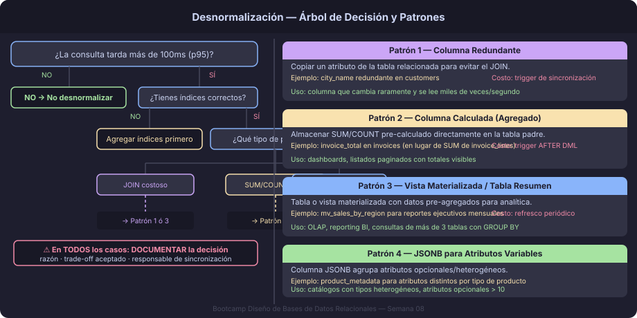

# Desnormalización: Cuándo y Cómo Hacerlo Bien

## ¿Qué es la Desnormalización?

La **desnormalización** es la decisión deliberada de introducir redundancia
controlada en un esquema normalizado para mejorar el rendimiento de lectura
o simplificar consultas frecuentes.

Es lo opuesto a la normalización — y puede ser completamente correcto cuando:

- Una consulta analítica ejecuta un JOIN costoso millones de veces por día
- El cálculo de un agregado requiere escanear miles de filas para mostrar
  un solo número en la pantalla
- Un requerimiento de negocio exige latencia de milisegundos en consultas
  que el esquema normalizado no puede proveer

> **Desnormalizar sin justificación es un error de diseño.  
> Desnormalizar con justificación documentada es ingeniería.**



---

## Cuándo Considerar Desnormalizar

### Señales de alerta en producción

```sql
-- Un JOIN de 5 tablas que se ejecuta 10,000 veces por hora:
EXPLAIN ANALYZE
SELECT
    i.invoice_id,
    c.customer_name,
    ct.city_name,
    s.salesperson_name,
    i.invoice_total
FROM invoices       i
JOIN customers      c  ON c.customer_id      = i.customer_id
JOIN cities         ct ON ct.city_id         = c.customer_city_id
JOIN salespersons   s  ON s.salesperson_id   = i.salesperson_id
ORDER BY i.invoice_date DESC
LIMIT 20;
-- Si el plan muestra Seq Scans y tiempo > 50ms → candidato a desnormalizar
```

Los indicadores técnicos que justifican desnormalizar:

| Indicador                           | Umbral orientativo         |
|-------------------------------------|----------------------------|
| Tiempo de consulta en producción    | > 100ms en p95             |
| Frecuencia de la consulta           | > 1,000 ejecuciones/hora   |
| Porcentaje de tráfico (SELECT/write)| > 90% lecturas             |
| Resultado de EXPLAIN ANALYZE        | `Seq Scan` en tabla grande |

---

## Patrones de Desnormalización

### Patrón 1: Columna Redundante

Copiar un atributo de una tabla relacionada directamente en la tabla que
lo necesita con frecuencia.

```sql
-- Normalizado (requiere JOIN para obtener city_name):
customers(customer_id, customer_name, customer_city_id FK)
cities(city_id, city_name)

-- Desnormalizado (city_name redundante pero de lectura directa):
customers(customer_id, customer_name, customer_city_id FK, customer_city_name)
-- NOTA: customer_city_name debe mantenerse sincronizado con cities.city_name
```

**Cuándo usarlo:** Cuando la tabla relacionada cambia raramente y la columna
copiada se lee miles de veces por segundo.

**Costo:** Necesita un trigger o proceso de sincronización para mantener
la coherencia cuando `city_name` cambia.

```sql
-- Trigger de sincronización (mantiene coherencia):
CREATE OR REPLACE FUNCTION fn_sync_customer_city_name()
RETURNS TRIGGER LANGUAGE plpgsql AS $$
BEGIN
    UPDATE customers
       SET customer_city_name = NEW.city_name
     WHERE customer_city_id = NEW.city_id;
    RETURN NEW;
END;
$$;

CREATE TRIGGER trg_cities_after_update
AFTER UPDATE OF city_name ON cities
FOR EACH ROW EXECUTE FUNCTION fn_sync_customer_city_name();
```

---

### Patrón 2: Columna Calculada (Agregado Pre-computado)

Almacenar el resultado de un `SUM`, `COUNT` u otro agregado directamente
en la fila padre.

```sql
-- Normalizado (requiere subquery o JOIN + GROUP BY):
SELECT i.invoice_id, SUM(li.line_total) AS total
FROM invoices i
JOIN invoice_lines li ON li.invoice_id = i.invoice_id
GROUP BY i.invoice_id;

-- Desnormalizado: invoice_total pre-calculado en invoices
ALTER TABLE invoices ADD COLUMN invoice_total NUMERIC(12,2) NOT NULL DEFAULT 0;

-- Mantener con trigger:
CREATE OR REPLACE FUNCTION fn_recalc_invoice_total()
RETURNS TRIGGER LANGUAGE plpgsql AS $$
BEGIN
    UPDATE invoices
       SET invoice_total = (
           SELECT COALESCE(SUM(line_quantity * line_unit_price), 0)
           FROM invoice_lines
           WHERE invoice_id = COALESCE(NEW.invoice_id, OLD.invoice_id)
       )
     WHERE invoice_id = COALESCE(NEW.invoice_id, OLD.invoice_id);
    RETURN NULL;
END;
$$;

CREATE TRIGGER trg_invoice_lines_after_change
AFTER INSERT OR UPDATE OR DELETE ON invoice_lines
FOR EACH ROW EXECUTE FUNCTION fn_recalc_invoice_total();
```

**Cuándo usarlo:** Dashboards, reportes en tiempo real, paginación de listas
donde el total se muestra sin abrir el detalle.

---

### Patrón 3: Tabla de Resumen / Reporte

Crear una tabla separada (o vista materializada) para consultas analíticas
costosas, actualizada periódicamente.

```sql
-- Vista materializada — se refresca una vez al día a las 3 AM:
CREATE MATERIALIZED VIEW mv_sales_by_region AS
SELECT
    ct.city_country                  AS region,
    DATE_TRUNC('month', i.invoice_date) AS month,
    COUNT(*)                         AS invoice_count,
    SUM(i.invoice_total)             AS revenue
FROM invoices    i
JOIN customers   c  ON c.customer_id   = i.customer_id
JOIN cities      ct ON ct.city_id      = c.customer_city_id
GROUP BY ct.city_country, DATE_TRUNC('month', i.invoice_date);

CREATE UNIQUE INDEX ix_mv_sales_region_month
    ON mv_sales_by_region (region, month);

-- Refrescar (puede automatizarse con pg_cron):
REFRESH MATERIALIZED VIEW CONCURRENTLY mv_sales_by_region;
```

**Cuándo usarlo:** Reportes ejecutivos, dashboards BI, consultas de más de
3 tablas con GROUP BY sobre millones de filas.

---

### Patrón 4: JSONB para Atributos Variables

Cuando una entidad tiene un subconjunto de atributos que varía por tipo o
categoría, agruparlos en una columna `JSONB` en lugar de crear decenas de
columnas `NULL`.

```sql
-- En lugar de:
ALTER TABLE products ADD COLUMN product_pages INTEGER;     -- solo libros
ALTER TABLE products ADD COLUMN product_isbn  VARCHAR(20); -- solo libros
ALTER TABLE products ADD COLUMN product_runtime_min INTEGER; -- solo videos

-- Mejor: JSONB para atributos específicos del tipo
ALTER TABLE products ADD COLUMN product_metadata JSONB;

-- Datos:
UPDATE products SET product_metadata = '{"pages": 450, "isbn": "978-3-16-148410-0"}'
WHERE product_type = 'book';

-- Consulta eficiente con índice GIN:
CREATE INDEX ix_products_metadata ON products USING gin(product_metadata);

SELECT product_name, product_metadata->>'isbn' AS isbn
FROM products
WHERE product_metadata @> '{"pages": 450}';
```

**Cuándo usarlo:** Catálogos con tipos heterogéneos, datos semi-estructurados,
cuando el número de atributos opcionales supera ~10.

---

## Documentación Obligatoria de Decisiones

Cada desnormalización **debe estar documentada**. Un buen registro incluye:

```sql
-- ============================================================
-- DECISIÓN DE DISEÑO: invoice_total en invoices (desnormalizado)
-- Fecha: 2025-01-20 | Autor: equipo-bd
-- ============================================================
-- JUSTIFICACIÓN:
--   La consulta de listado de facturas se ejecuta ~50,000 veces/día.
--   El JOIN con invoice_lines + SUM tardaba 280ms (p95 en producción).
--   Con invoice_total pre-calculado baja a 4ms.
--
-- TRADE-OFF ACEPTADO:
--   invoice_total puede quedar desincronizado si se insertan/borran
--   líneas sin pasar por el trigger trg_invoice_lines_after_change.
--
-- MECANISMO DE SINCRONIZACIÓN:
--   Trigger AFTER INSERT OR UPDATE OR DELETE ON invoice_lines.
--   Verificación diaria: SELECT invoice_id FROM invoices WHERE
--   invoice_total != (SELECT SUM(...) FROM invoice_lines WHERE ...).
--
-- ALTERNATIVA DESCARTADA:
--   Vista materializada — refresco cada 5min era demasiado lento
--   para el dashboard en tiempo real.
-- ============================================================
```

---

## El Árbol de Decisión

```
¿La consulta es lenta (> 100ms p95)?
├── NO → No desnormalizar. Revisar índices primero.
└── SÍ
    ├── ¿Ya tienes los índices correctos en las columnas de JOIN/WHERE?
    │   ├── NO → Agregar índices. Regresar al inicio.
    │   └── SÍ
    │       ├── ¿El problema es un JOIN costoso?
    │       │   ├── Columna redundante (Patrón 1)
    │       │   └── Vista materializada (Patrón 3)
    │       ├── ¿El problema es un COUNT/SUM?
    │       │   ├── Columna calculada con trigger (Patrón 2)
    │       │   └── Vista materializada periódica (Patrón 3)
    │       └── ¿Hay muchos atributos NULL por tipo de entidad?
    │           └── JSONB para atributos variables (Patrón 4)
    └── En todos los casos: DOCUMENTAR la decisión en el DDL
```

---

## Desnormalización vs Normalización: No es Blanco o Negro

| Criterio               | Normalizar          | Desnormalizar                  |
|------------------------|---------------------|--------------------------------|
| Escrituras frecuentes  | ✅ Mejor            | ❌ Más actualizaciones         |
| Lecturas frecuentes    | ❌ JOINs costosos   | ✅ Lectura directa             |
| Consistencia crítica   | ✅ Un solo punto    | ⚠️ Requiere sincronización     |
| Analítica / reporting  | ❌ Lento en escala  | ✅ Pre-calculado               |
| Datos en tiempo real   | ✅ Siempre fresco   | ⚠️ Puede estar desactualizado  |

---

← [02 — FNBC](02-forma-normal-boyce-codd.md) | → [README](../README.md)
