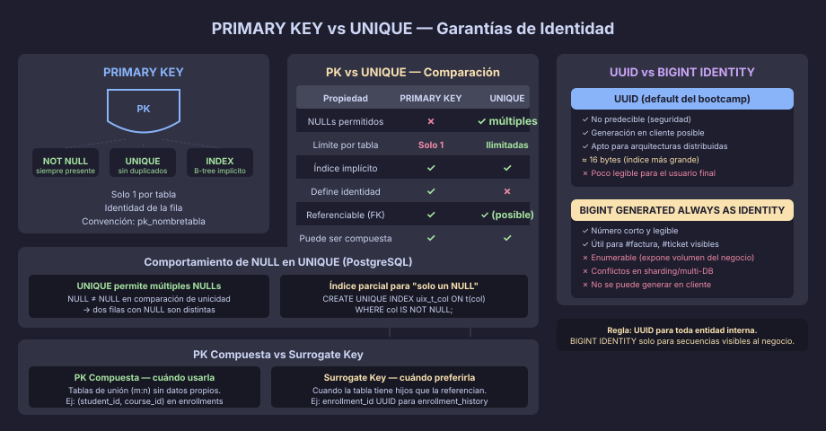

# PRIMARY KEY y UNIQUE: Garantías de Identidad

## ¿Qué es la Identidad en una Base de Datos?

Cada fila de una tabla debe ser **identificable de forma única**. Sin esa
garantía, no hay forma de saber si una actualización afecta a una o a cien filas,
ni si dos registros son el mismo dato o uno distinto.

PostgreSQL ofrece dos constraints para garantizar identidad:

| Constraint     | Garantía                             | NULLs permitidos | Por tabla   |
|----------------|--------------------------------------|------------------|-------------|
| `PRIMARY KEY`  | Identificador único de la fila       | ❌ Ninguno       | Solo 1      |
| `UNIQUE`       | Valor no repetido en la columna/grupo | ✅ Múltiples*   | Ilimitadas  |

> \* En PostgreSQL, `NULL != NULL` — dos NULLs en una columna UNIQUE están
> permitidos. Si necesitas que solo exista un NULL, usa un índice parcial.



---

## PRIMARY KEY

### Qué hace PostgreSQL cuando declaras una PK

1. Crea un índice B-tree único sobre las columnas de la PK
2. Añade implícitamente `NOT NULL` a cada columna
3. Registra la constraint en `pg_constraint` con type `'p'`

```sql
-- Sintaxis inline (columna simple):
CREATE TABLE products (
    product_id UUID NOT NULL DEFAULT gen_random_uuid(),
    product_name VARCHAR(120) NOT NULL,

    CONSTRAINT pk_products PRIMARY KEY (product_id)
);

-- Sintaxis inline con PK compuesta:
CREATE TABLE order_items (
    order_id         UUID NOT NULL,
    product_id       UUID NOT NULL,
    order_item_qty   SMALLINT NOT NULL,

    CONSTRAINT pk_order_items PRIMARY KEY (order_id, product_id)
);
```

> **Convención del bootcamp:** siempre nombrar la PK explícitamente —
> nunca dejar que PostgreSQL genere un nombre automático como
> `order_items_pkey`. El nombre estándar es `pk_nombretabla`.

### UUID vs BIGINT IDENTITY: ¿Cuándo Usar Cada Uno?

```sql
-- Opción A: UUID (recomendado para la mayoría de casos)
CREATE TABLE customers (
    customer_id UUID NOT NULL DEFAULT gen_random_uuid(),
    CONSTRAINT pk_customers PRIMARY KEY (customer_id)
);
-- Ventajas: no predecible (seguridad), se puede generar en cliente,
--           funciona en arquitecturas distribuidas/multi-tenant

-- Opción B: BIGINT GENERATED ALWAYS AS IDENTITY
CREATE TABLE invoice_numbers (
    invoice_number BIGINT NOT NULL GENERATED ALWAYS AS IDENTITY,
    invoice_id     UUID   NOT NULL DEFAULT gen_random_uuid(),
    CONSTRAINT pk_invoice_numbers PRIMARY KEY (invoice_id)
);
-- Usar SOLO cuando el número secuencial es visible al negocio
-- (número de factura, número de ticket de soporte, etc.)
-- Nunca como PK de entidades internas — un atacante puede enumerar registros
```

| Criterio                        | UUID                     | BIGINT IDENTITY          |
|---------------------------------|--------------------------|--------------------------|
| Predecibilidad (seguridad)      | ✅ No predecible         | ❌ Enumerable            |
| Generación en cliente           | ✅ Sí                    | ❌ Solo en servidor      |
| Arquitecturas distribuidas      | ✅ Sin conflicto         | ⚠️ Necesita coordinación |
| Visibilidad al usuario final    | ❌ UUID es largo/feo     | ✅ Número corto legible  |
| Índice B-tree (tamaño)          | ⚠️ 16 bytes              | ✅ 8 bytes               |

---

## UNIQUE

### Columna Simple

```sql
CREATE TABLE users (
    user_id    UUID         NOT NULL DEFAULT gen_random_uuid(),
    user_email VARCHAR(150) NOT NULL,
    user_name  VARCHAR(100) NOT NULL,

    CONSTRAINT pk_users       PRIMARY KEY (user_id),
    CONSTRAINT uq_users_email UNIQUE (user_email)
    -- Convención: uq_tabla_columna
);
```

### UNIQUE Compuesto

Garantiza que la combinación sea única, no cada columna individualmente:

```sql
CREATE TABLE team_memberships (
    membership_id UUID    NOT NULL DEFAULT gen_random_uuid(),
    team_id       UUID    NOT NULL,
    user_id       UUID    NOT NULL,
    joined_at     DATE    NOT NULL,

    CONSTRAINT pk_team_memberships         PRIMARY KEY (membership_id),
    -- Un usuario solo puede estar una vez en el mismo equipo:
    CONSTRAINT uq_team_memberships_pair    UNIQUE (team_id, user_id)
);
```

### UNIQUE con NULLs: El Comportamiento Especial

```sql
-- PostgreSQL permite múltiples NULLs en columnas UNIQUE:
INSERT INTO users (user_email, user_phone) VALUES ('a@b.com', NULL);
INSERT INTO users (user_email, user_phone) VALUES ('c@d.com', NULL);
-- Ambas filas son válidas — NULL ≠ NULL en la comparación de unicidad

-- Si necesitas SOLO UN NULL, usa un índice parcial:
CREATE UNIQUE INDEX uix_users_phone_not_null
    ON users (user_phone)
    WHERE user_phone IS NOT NULL;
-- Ahora: un solo número puede repetirse como NULL,
-- pero dos filas con el mismo teléfono no-nulo violarían el índice
```

---

## PRIMARY KEY Compuesta vs Surrogate Key

¿Cuándo usar una PK compuesta y cuándo agregar una surrogate key?

```sql
-- PK COMPUESTA — válida cuando la combinación tiene significado natural
-- y las dos columnas son estables (no cambian)
CREATE TABLE class_enrollments (
    student_id  UUID NOT NULL,
    course_id   UUID NOT NULL,
    enrolled_at TIMESTAMPTZ NOT NULL DEFAULT NOW(),

    CONSTRAINT pk_class_enrollments PRIMARY KEY (student_id, course_id)
);

-- SURROGATE KEY — preferida cuando:
-- a) La PK compuesta tiene muchas columnas FK (aumenta el tamaño del índice)
-- b) Las columnas de la PK natural pueden cambiar
-- c) Hay tablas hijas que necesitan referenciar la fila individualmente
CREATE TABLE class_enrollments_v2 (
    enrollment_id UUID NOT NULL DEFAULT gen_random_uuid(),
    student_id    UUID NOT NULL,
    course_id     UUID NOT NULL,
    enrolled_at   TIMESTAMPTZ NOT NULL DEFAULT NOW(),

    CONSTRAINT pk_class_enrollments_v2       PRIMARY KEY (enrollment_id),
    CONSTRAINT uq_class_enrollments_v2_pair  UNIQUE (student_id, course_id)
);
```

---

## Inspeccionar Constraints en PostgreSQL

```sql
-- Ver todas las constraints de una tabla:
SELECT
    conname      AS constraint_name,
    contype      AS type,  -- 'p'=PK, 'u'=UNIQUE, 'f'=FK, 'c'=CHECK, 'n'=NOT NULL
    pg_get_constraintdef(oid) AS definition
FROM pg_constraint
WHERE conrelid = 'public.users'::regclass
ORDER BY contype, conname;

-- Ver índices creados implícitamente por PK y UNIQUE:
SELECT indexname, indexdef
FROM pg_indexes
WHERE tablename = 'users'
ORDER BY indexname;
```

---

## Reglas de Nomenclatura Resumidas

| Tipo       | Patrón               | Ejemplo                        |
|------------|----------------------|--------------------------------|
| PK         | `pk_tabla`           | `pk_users`                     |
| UNIQUE     | `uq_tabla_columna`   | `uq_users_email`               |
| UNIQUE comp| `uq_tabla_col1_col2` | `uq_team_memberships_pair`     |
| Índice parcial | `uix_tabla_descripcion` | `uix_users_phone_not_null` |

---

← [README](../README.md) | → [02 — FOREIGN KEY](02-foreign-key-cascada.md)
