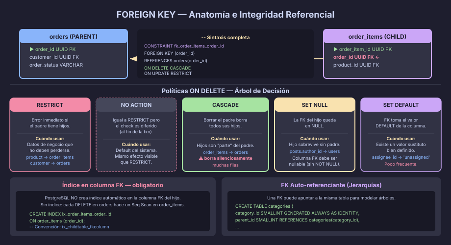

# FOREIGN KEY: Integridad Referencial y Políticas de Cascada

## ¿Qué es la Integridad Referencial?

Cuando una tabla hijo hace referencia a un valor de la tabla padre, la
**integridad referencial** garantiza que ese valor siempre exista. Sin esta
garantía, es posible tener un `order_id` en `order_items` que apunte a un
pedido que ya fue borrado — una fila huérfana.

```
orders (parent)               order_items (child)
────────────────              ────────────────────
order_id PK ──────────────►  order_id FK
order_status                  product_id FK
order_total                   order_item_qty
```

La FOREIGN KEY le dice a PostgreSQL: _"antes de insertar en `order_items`,
verifica que `order_id` exista en `orders`; y antes de borrar de `orders`,
decide qué hacer con los `order_items` relacionados"_.



---

## Sintaxis en PostgreSQL

```sql
CREATE TABLE order_items (
    order_item_id   UUID           NOT NULL DEFAULT gen_random_uuid(),
    order_id        UUID           NOT NULL,
    product_id      UUID           NOT NULL,
    order_item_qty  SMALLINT       NOT NULL,
    order_item_price NUMERIC(10,2) NOT NULL,

    CONSTRAINT pk_order_items           PRIMARY KEY (order_item_id),

    -- FK hacia orders: si se borra el pedido, borra también sus líneas
    CONSTRAINT fk_order_items_order_id
        FOREIGN KEY (order_id)   REFERENCES orders(order_id)
            ON DELETE CASCADE
            ON UPDATE RESTRICT,

    -- FK hacia products: no permitir borrar un producto con pedidos activos
    CONSTRAINT fk_order_items_product_id
        FOREIGN KEY (product_id) REFERENCES products(product_id)
            ON DELETE RESTRICT
            ON UPDATE RESTRICT
);
-- Convención: fk_childtable_parenttable o fk_childtable_fkcolumn
```

---

## Políticas ON DELETE

La decisión más importante al definir una FK es qué pasa cuando se borra
el padre. PostgreSQL ofrece cinco opciones:

### RESTRICT / NO ACTION

```sql
-- RESTRICT: error inmediato si existen hijos
-- NO ACTION: error diferido (al final de la transacción, default)
CONSTRAINT fk_payments_order_id
    FOREIGN KEY (order_id) REFERENCES orders(order_id)
        ON DELETE RESTRICT
```

> **Usar cuando:** el padre no debe poder borrarse mientras tenga hijos.
> Ejemplo: no se puede borrar un `product` que aparece en `order_items`.
> Es la opción más segura y la más común en datos de negocio.

### CASCADE

```sql
-- CASCADE: borrar el padre borra automáticamente todos sus hijos
CONSTRAINT fk_order_items_order_id
    FOREIGN KEY (order_id) REFERENCES orders(order_id)
        ON DELETE CASCADE
```

> **Usar cuando:** los hijos no tienen sentido sin el padre.
> Ejemplo: `order_items` son parte del pedido — si el pedido se anula,
> sus líneas tampoco tienen existencia independiente.  
> ⚠️ Cuidado: CASCADE puede borrar muchas filas silenciosamente.

### SET NULL

```sql
-- SET NULL: la FK del hijo queda en NULL cuando el padre se borra
CONSTRAINT fk_posts_author_id
    FOREIGN KEY (author_id) REFERENCES users(user_id)
        ON DELETE SET NULL
-- La columna author_id debe ser nullable: author_id UUID (sin NOT NULL)
```

> **Usar cuando:** el hijo puede existir sin el padre.
> Ejemplo: un post puede perder a su autor si este borra la cuenta,
> pero el post mismo se conserva (con `author_id = NULL`).

### SET DEFAULT

```sql
-- SET DEFAULT: la FK toma el valor DEFAULT de la columna
CONSTRAINT fk_tasks_assignee_id
    FOREIGN KEY (assignee_id) REFERENCES users(user_id)
        ON DELETE SET DEFAULT
-- La columna debe tener DEFAULT: assignee_id UUID DEFAULT '00000000-...'
```

> **Usar cuando:** hay un valor "sin asignar" bien definido.
> Ejemplo: tareas no asignadas apuntan a un usuario `system` o `unassigned`.
> Poco común — solo cuando el negocio define claramente ese valor por defecto.

---

## Árbol de Decisión para ON DELETE

```
¿El hijo tiene sentido sin el padre?
├── NO → Los hijos son "propiedad" del padre
│         └── ¿Quieres que se borren automáticamente?
│               ├── SÍ → CASCADE
│               └── NO → RESTRICT (error explícito, borrar manualmente)
└── SÍ → El hijo puede sobrevivir
          └── ¿Hay un valor sustituto?
                ├── SÍ (NULL) → SET NULL
                ├── SÍ (DEFAULT) → SET DEFAULT
                └── NO → RESTRICT (y reconsiderar el diseño)
```

---

## FK Auto-referenciante (Jerarquías)

Una FK puede apuntar a la propia tabla para modelar jerarquías:

```sql
CREATE TABLE categories (
    category_id     SMALLINT     NOT NULL GENERATED ALWAYS AS IDENTITY,
    category_name   VARCHAR(80)  NOT NULL,
    parent_id       SMALLINT,    -- NULL = categoría raíz

    CONSTRAINT pk_categories           PRIMARY KEY (category_id),
    CONSTRAINT uq_categories_name      UNIQUE (category_name),
    CONSTRAINT fk_categories_parent_id
        FOREIGN KEY (parent_id) REFERENCES categories(category_id)
            ON DELETE RESTRICT  -- No borrar una categoría que tiene hijas
);

-- Insertar la jerarquía:
INSERT INTO categories (category_name, parent_id) VALUES
    ('Electrónica',   NULL),   -- id=1, raíz
    ('Teléfonos',     1),      -- hijo de Electrónica
    ('Smartphones',   2),      -- hijo de Teléfonos
    ('Computadoras',  1);      -- hijo de Electrónica
```

---

## FK Circulares y DEFERRABLE

Cuando dos tablas se referencian mutuamente, el INSERT falla porque la otra
tabla aún no tiene el registro. La solución es una constraint `DEFERRABLE`:

```sql
-- Ejemplo: un order debe tener un customer; un customer puede tener
-- una dirección de facturación que a su vez referencia la dirección en
-- la tabla addresses (que ya existe por separado)

-- Si hubiera ciclo: orders → customers → orders (hipotético)
-- La constraint se verifica AL FINAL de la transacción, no en cada INSERT:
ALTER TABLE orders ADD CONSTRAINT fk_orders_customer_id
    FOREIGN KEY (customer_id) REFERENCES customers(customer_id)
    DEFERRABLE INITIALLY DEFERRED;
```

> En la práctica, los ciclos de FK son señal de un diseño que puede
> mejorarse. En la semana 13 (patrones avanzados) veremos cómo manejarlos.

---

## Índices en Columnas FK

PostgreSQL crea automáticamente el índice para la PK referenciada, pero
**NO crea el índice en la columna FK del lado hijo**. Hay que crearlo
manualmente:

```sql
-- Sin este índice, cada UPDATE/DELETE en orders hace un Seq Scan en order_items:
CREATE INDEX ix_order_items_order_id   ON order_items (order_id);
CREATE INDEX ix_order_items_product_id ON order_items (product_id);

-- Regla: crear un índice en TODA columna que sea FK
-- Naming: ix_childtable_fkcolumn
```

---

## Inspeccionar Foreign Keys

```sql
-- Ver todas las FKs de un esquema:
SELECT
    tc.table_name        AS child_table,
    kcu.column_name      AS fk_column,
    ccu.table_name       AS parent_table,
    ccu.column_name      AS parent_column,
    rc.delete_rule       AS on_delete,
    rc.update_rule       AS on_update
FROM information_schema.table_constraints         tc
JOIN information_schema.key_column_usage          kcu
    ON kcu.constraint_name = tc.constraint_name
JOIN information_schema.referential_constraints   rc
    ON rc.constraint_name = tc.constraint_name
JOIN information_schema.constraint_column_usage   ccu
    ON ccu.constraint_name = rc.unique_constraint_name
WHERE tc.constraint_type = 'FOREIGN KEY'
  AND tc.table_schema    = 'public'
ORDER BY tc.table_name, kcu.column_name;
```

---

## Resumen de Políticas

| Política      | Efecto en el hijo       | Cuándo usarla                          |
|---------------|-------------------------|----------------------------------------|
| `RESTRICT`    | Error — no se puede borrar el padre | Datos de negocio que no deben perderse |
| `NO ACTION`   | Error diferido          | Igual a RESTRICT para el 99% de casos |
| `CASCADE`     | Se borra el hijo        | Hijos que son "parte" del padre        |
| `SET NULL`    | FK del hijo → NULL      | Hijos que sobreviven sin padre         |
| `SET DEFAULT` | FK del hijo → DEFAULT   | Cuando existe un valor sustituto claro |

---

← [01 — PRIMARY KEY y UNIQUE](01-primary-key-unique.md) | → [03 — CHECK y NOT NULL](03-check-not-null.md)
