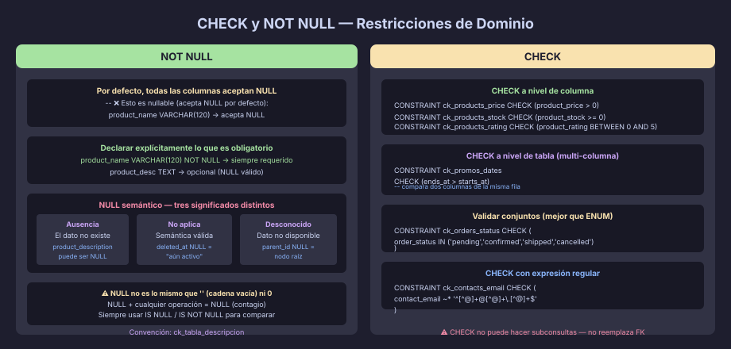
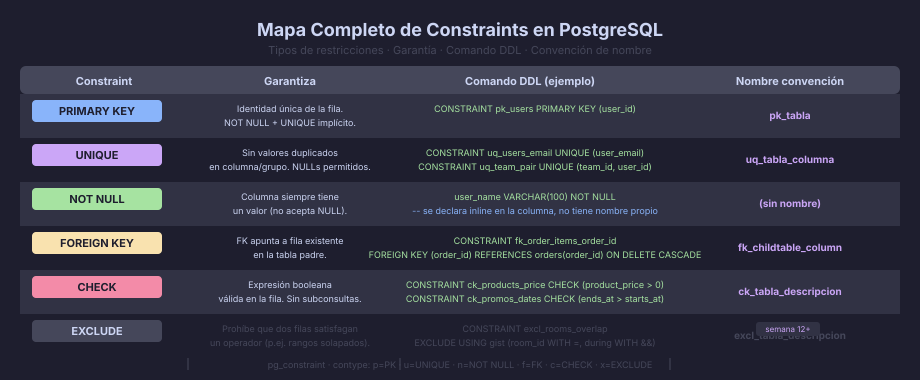

# CHECK y NOT NULL: Restricciones de Dominio

## ¿Qué son las Restricciones de Dominio?

Las restricciones de dominio validan que los valores almacenados en una columna
pertenezcan a un conjunto permitido — el **dominio** de esa columna. Mientras
que la PK y la UNIQUE garantizan *identidad*, las restricciones de dominio
garantizan *corrección de contenido*.



---

## NOT NULL

### Por Qué Declarar NOT NULL Explícitamente

Por defecto, toda columna en PostgreSQL acepta `NULL`. El `NOT NULL` debe
declararse deliberadamente. Esto importa porque:

- `NULL` significa "desconocido" o "no aplica" — son semánticas distintas
- Las operaciones sobre `NULL` retornan `NULL` (contagio del nulo)
- Los JOINs con NULLs producen filas perdidas si no se usan `LEFT JOIN`
- Los índices no incluyen NULLs por defecto — afecta rendimiento

```sql
-- ✅ Declarar explícitamente qué puede ser NULL y qué no:
CREATE TABLE products (
    product_id          UUID           NOT NULL DEFAULT gen_random_uuid(),
    category_id         UUID           NOT NULL,  -- siempre debe tener categoría
    product_name        VARCHAR(120)   NOT NULL,  -- siempre debe tener nombre
    product_description TEXT,                     -- puede ser NULL (no obligatorio)
    product_price       NUMERIC(10, 2) NOT NULL,  -- siempre debe tener precio
    product_stock       INTEGER        NOT NULL DEFAULT 0,
    discontinued_at     TIMESTAMPTZ,              -- NULL = aún activo (valid NULL)
    created_at          TIMESTAMPTZ    NOT NULL DEFAULT NOW(),

    CONSTRAINT pk_products PRIMARY KEY (product_id)
);
```

### El Patrón NULL Semántico Válido

Hay casos donde `NULL` tiene significado específico de negocio:

```sql
-- NULL en deleted_at significa "no fue borrado" — es un NULL semántico válido
deleted_at  TIMESTAMPTZ  -- NULL = activo; NOT NULL = borrado (soft delete)

-- NULL en discount_rate significa "sin descuento" (no 0%)
discount_rate  NUMERIC(5,2)  -- NULL = no aplica descuento; 0 = descuento 0%

-- NULL en parent_id significa "es nodo raíz" en una jerarquía
parent_id  UUID  -- NULL = sin padre (categoría raíz)
```

---

## CHECK

### CHECK a Nivel de Columna

Valida el valor de una sola columna:

```sql
CREATE TABLE products (
    product_id    UUID           NOT NULL DEFAULT gen_random_uuid(),
    product_price NUMERIC(10, 2) NOT NULL,
    product_stock INTEGER        NOT NULL DEFAULT 0,
    product_rating NUMERIC(3,1),

    CONSTRAINT pk_products             PRIMARY KEY (product_id),
    CONSTRAINT ck_products_price       CHECK (product_price > 0),
    CONSTRAINT ck_products_stock       CHECK (product_stock >= 0),
    CONSTRAINT ck_products_rating      CHECK (product_rating BETWEEN 0 AND 5)
    -- Convención: ck_tabla_descripcion
);
```

### CHECK a Nivel de Tabla (Multi-columna)

Valida relaciones entre varias columnas de la misma fila:

```sql
CREATE TABLE promotions (
    promotion_id    UUID        NOT NULL DEFAULT gen_random_uuid(),
    promotion_name  VARCHAR(80) NOT NULL,
    starts_at       DATE        NOT NULL,
    ends_at         DATE        NOT NULL,
    discount_pct    NUMERIC(5,2) NOT NULL,

    CONSTRAINT pk_promotions            PRIMARY KEY (promotion_id),
    -- La fecha de fin debe ser posterior a la de inicio:
    CONSTRAINT ck_promotions_dates      CHECK (ends_at > starts_at),
    -- El descuento debe estar entre 0.01% y 100%:
    CONSTRAINT ck_promotions_discount   CHECK (discount_pct BETWEEN 0.01 AND 100)
);
```

### CHECK para Validar Conjuntos de Valores (Enumeraciones)

```sql
CREATE TABLE orders (
    order_id     UUID        NOT NULL DEFAULT gen_random_uuid(),
    order_status VARCHAR(20) NOT NULL DEFAULT 'pending',

    CONSTRAINT pk_orders          PRIMARY KEY (order_id),
    CONSTRAINT ck_orders_status   CHECK (
        order_status IN ('pending', 'confirmed', 'shipped', 'delivered', 'cancelled')
    )
);
```

> **CHECK vs tipo ENUM:** PostgreSQL tiene el tipo `ENUM`, pero los CHECK
> sobre `VARCHAR` son más fáciles de modificar en producción. Cambiar un
> tipo ENUM requiere `ALTER TYPE`, mientras que modificar un CHECK es solo
> `ALTER TABLE ... DROP CONSTRAINT ... ADD CONSTRAINT ...`.

### CHECK con Expresiones Regulares

```sql
CREATE TABLE contacts (
    contact_id    UUID        NOT NULL DEFAULT gen_random_uuid(),
    contact_email VARCHAR(150) NOT NULL,
    contact_phone VARCHAR(20),

    CONSTRAINT pk_contacts         PRIMARY KEY (contact_id),
    -- Validación básica de email (no reemplaza la validación en la app):
    CONSTRAINT ck_contacts_email   CHECK (contact_email ~* '^[^@]+@[^@]+\.[^@]+$'),
    -- Teléfono: solo dígitos, +, -, espacios, paréntesis:
    CONSTRAINT ck_contacts_phone   CHECK (
        contact_phone IS NULL
        OR contact_phone ~ '^[0-9\+\-\(\) ]{7,20}$'
    )
);
```

> ⚠️ Los CHECK con regex son una segunda línea de defensa — la validación
> principal debe ocurrir en la capa de aplicación. En la BD solo
> capturamos lo que llegue directo (migraciones, scripts, acceso directo).

---

## Limitación Importante de CHECK en PostgreSQL

Los CHECK constraints **no se evalúan en columnas FK** — solo en la tabla
donde están declarados. Tampoco puede hacer subconsultas:

```sql
-- ❌ ESTO NO FUNCIONA en PostgreSQL:
CONSTRAINT ck_orders_customer
    CHECK (customer_id IN (SELECT customer_id FROM customers WHERE is_active = TRUE))
-- Error: subqueries are not allowed in check constraints

-- ✅ Para este tipo de validación, usa FK + columna de estado:
-- La FK garantiza que el customer_id existe en customers.
-- Si necesitas que el cliente esté activo, eso se valida en la capa de app
-- o con un trigger (semana 12).
```

---

## Combinar Constraints: Ejemplo Completo

```sql
CREATE TABLE invoices (
    invoice_id       UUID           NOT NULL DEFAULT gen_random_uuid(),
    customer_id      UUID           NOT NULL,
    invoice_number   BIGINT         NOT NULL GENERATED ALWAYS AS IDENTITY,
    invoice_status   VARCHAR(20)    NOT NULL DEFAULT 'draft',
    invoice_date     DATE           NOT NULL DEFAULT CURRENT_DATE,
    due_date         DATE           NOT NULL,
    invoice_subtotal NUMERIC(12, 2) NOT NULL DEFAULT 0,
    invoice_tax_pct  NUMERIC(5, 2)  NOT NULL DEFAULT 0,
    invoice_total    NUMERIC(12, 2) NOT NULL DEFAULT 0,
    paid_at          TIMESTAMPTZ,   -- NULL = no pagada
    created_at       TIMESTAMPTZ    NOT NULL DEFAULT NOW(),

    CONSTRAINT pk_invoices               PRIMARY KEY (invoice_id),
    CONSTRAINT uq_invoices_number        UNIQUE (invoice_number),

    CONSTRAINT fk_invoices_customer_id
        FOREIGN KEY (customer_id) REFERENCES customers(customer_id)
            ON DELETE RESTRICT,

    CONSTRAINT ck_invoices_status        CHECK (
        invoice_status IN ('draft', 'sent', 'paid', 'overdue', 'cancelled')
    ),
    CONSTRAINT ck_invoices_due_date      CHECK (due_date >= invoice_date),
    CONSTRAINT ck_invoices_subtotal      CHECK (invoice_subtotal >= 0),
    CONSTRAINT ck_invoices_tax_pct       CHECK (invoice_tax_pct BETWEEN 0 AND 100),
    CONSTRAINT ck_invoices_total         CHECK (invoice_total >= 0)
);
```

---

## Añadir y Eliminar Constraints en Tablas Existentes

```sql
-- Agregar CHECK a tabla existente:
ALTER TABLE products
    ADD CONSTRAINT ck_products_name_length
        CHECK (LENGTH(product_name) >= 3);

-- Eliminar constraint (sin borrar datos):
ALTER TABLE products
    DROP CONSTRAINT ck_products_name_length;

-- Agregar NOT NULL a una columna existente:
-- (Primero verificar que no hay NULLs actuales):
SELECT COUNT(*) FROM products WHERE product_description IS NULL;
ALTER TABLE products
    ALTER COLUMN product_description SET NOT NULL;

-- Quitar NOT NULL (volver a nullable):
ALTER TABLE products
    ALTER COLUMN product_description DROP NOT NULL;
```

---

## Resumen: Cuándo Usar Cada Constraint

| Constraint | Garantiza               | Cuándo declarar                           |
|------------|-------------------------|-------------------------------------------|
| `NOT NULL` | Valor siempre presente  | Siempre que el campo sea obligatorio      |
| `CHECK`    | Valor en rango/conjunto | Reglas de negocio simples y expresables   |
| `UNIQUE`   | Sin duplicados          | Campos de identificación natural          |
| `FK`       | Referencia válida       | Toda relación entre entidades             |
| `PK`       | Identidad de la fila    | Una por tabla, siempre explícita          |

---

## Mapa Completo de Constraints

Para una visión de conjunto de todos los tipos de constraints y cómo
se relacionan entre sí:



---

← [02 — FOREIGN KEY](02-foreign-key-cascada.md) | → [README](../README.md)
