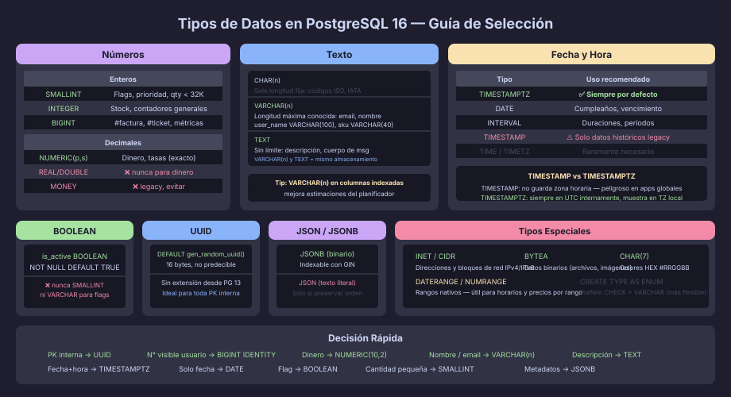

# Tipos de Datos en PostgreSQL 16: Guía de Selección

## Principio Fundamental

Elige el tipo **más restrictivo** que sirva para el dato. Usar `TEXT` para
todo parece cómodo, pero impide que el motor valide el contenido, consume más
espacio en índices y no comunica la intención del diseño.



---

## Números

### Enteros

| Tipo       | Bytes | Rango                                | Cuándo usarlo                                 |
|------------|-------|--------------------------------------|-----------------------------------------------|
| `SMALLINT` | 2     | −32 768 a 32 767                     | Flags, estados, prioridades, edad, cantidad pequeña |
| `INTEGER`  | 4     | −2 147 483 648 a 2 147 483 647       | Contadores generales, cantidades medianas     |
| `BIGINT`   | 8     | −9.2 × 10¹⁸ a 9.2 × 10¹⁸            | Secuencias visibles al usuario, métricas, bytes |

```sql
-- ✅ SMALLINT para cantidades con límite conocido:
order_item_quantity   SMALLINT        NOT NULL CHECK (order_item_quantity > 0)

-- ✅ INTEGER para contadores generales:
product_stock         INTEGER         NOT NULL DEFAULT 0

-- ✅ BIGINT para números de ticket/factura visibles:
invoice_number        BIGINT          NOT NULL GENERATED ALWAYS AS IDENTITY

-- ❌ BIGINT para todo es desperdicio de espacio en índices
```

### Decimales Exactos

```sql
-- ✅ NUMERIC(precision, scale) para dinero y cualquier decimal exacto:
product_price         NUMERIC(10, 2)  NOT NULL    -- hasta 99 999 999.99
tax_rate              NUMERIC(5, 4)   NOT NULL    -- hasta 9.9999 (ej: 0.1900)

-- ❌ REAL / DOUBLE PRECISION para dinero:
-- Almacenan en punto flotante binario — da errores de redondeo
-- 0.1 + 0.2 ≠ 0.3 en punto flotante
bad_price             DOUBLE PRECISION            -- ❌ nunca para dinero

-- ❌ MONEY (tipo legado de PostgreSQL):
-- Depende del locale del servidor, difícil de portar
legacy_amount         MONEY                       -- ❌ evitar en diseño nuevo
```

---

## Texto

PostgreSQL almacena `VARCHAR(n)` y `TEXT` de forma idéntica internamente.
La única diferencia es que `VARCHAR(n)` añade una restricción de longitud.

| Tipo          | Cuándo usarlo                                           |
|---------------|---------------------------------------------------------|
| `CHAR(n)`     | Strings de longitud **fija y conocida** (código ISO 2 letras, IATA) |
| `VARCHAR(n)`  | Strings con longitud **máxima conocida** (nombre, email, SKU) |
| `TEXT`        | Strings de longitud **arbitraria** (descripción, cuerpo de mensaje) |

```sql
-- ✅ CHAR(n) solo cuando la longitud es exactamente n:
country_code          CHAR(2)         NOT NULL   -- siempre 2 caracteres ISO
airport_code          CHAR(3)         NOT NULL   -- siempre 3 caracteres IATA

-- ✅ VARCHAR(n) con límite razonable para el atributo:
user_name             VARCHAR(100)    NOT NULL
product_sku           VARCHAR(40)     NOT NULL
user_email            VARCHAR(150)    NOT NULL

-- ✅ TEXT para contenido de longitud variable sin límite natural:
task_description      TEXT                       -- puede ser nulo o muy largo
comment_body          TEXT            NOT NULL
```

> **Tip de rendimiento:** Si la columna se usa frecuentemente en índices,
> `VARCHAR(n)` con un n razonable mejora la estimación del planificador.
> Para texto largo que no se indexa directamente, `TEXT` es equivalente.

---

## Fecha y Hora

| Tipo          | Almacena               | Zona horaria | Cuándo usarlo                        |
|---------------|------------------------|--------------|--------------------------------------|
| `DATE`        | Solo fecha             | No           | Fecha de nacimiento, fecha de vencimiento |
| `TIME`        | Solo hora              | No           | Horario de apertura (sin fecha)       |
| `TIMETZ`      | Hora + offset          | Sí           | Raramente necesario                  |
| `TIMESTAMP`   | Fecha + hora           | **No**       | ⚠️ Solo para datos históricos donde la TZ no importa |
| `TIMESTAMPTZ` | Fecha + hora + TZ      | **Sí**       | ✅ **Usar siempre por defecto**       |
| `INTERVAL`    | Duración               | N/A          | Diferencias de tiempo, períodos       |

```sql
-- ✅ TIMESTAMPTZ para todo evento o registro de auditoría:
created_at      TIMESTAMPTZ NOT NULL DEFAULT NOW()
updated_at      TIMESTAMPTZ NOT NULL DEFAULT NOW()
deleted_at      TIMESTAMPTZ              -- NULL = activo (soft delete)

-- ✅ DATE cuando solo importa el día:
patient_dob     DATE        NOT NULL
project_due     DATE

-- ✅ INTERVAL para almacenar duraciones:
session_duration  INTERVAL  -- ej: '1 hour 30 minutes'

-- ❌ TIMESTAMP (sin TZ) puede causar errores en apps globales:
bad_timestamp   TIMESTAMP   -- evitar salvo datos legacy
```

---

## Boolean

```sql
-- ✅ BOOLEAN — nunca VARCHAR o SMALLINT para flags:
is_active       BOOLEAN     NOT NULL DEFAULT TRUE
is_verified     BOOLEAN     NOT NULL DEFAULT FALSE

-- Los valores aceptados en INSERT: true/false, 't'/'f', 'yes'/'no', 1/0
-- El tipo devuelve 'true' o 'false' en SELECT
```

---

## UUID

```sql
-- ✅ UUID para claves primarias (disponible como tipo nativo):
user_id         UUID        NOT NULL DEFAULT gen_random_uuid()

-- gen_random_uuid() está disponible sin extensión desde PostgreSQL 13
-- En versiones anteriores: uuid_generate_v4() requiere CREATE EXTENSION "uuid-ossp"

-- El tipo UUID ocupa 16 bytes internamente (igual que un BIGINT × 2)
-- Comparación de rendimiento: 16B vs 8B — el impacto real es mínimo
-- hasta tablas de decenas de millones de filas
```

---

## JSON

```sql
-- ✅ JSONB (binario, indexable) — siempre preferir sobre JSON:
user_preferences    JSONB               -- acceso rápido, operadores GIN
product_metadata    JSONB DEFAULT '{}'

-- JSON almacena texto sin procesar; útil solo si necesitas preservar
-- el orden de las claves o los espacios del JSON original:
audit_payload       JSON                -- raramente necesario

-- Operadores JSONB comunes:
-- -> (acceder a clave, retorna JSON), ->> (retorna TEXT)
-- @> (contiene), <@ (está contenido), ? (tiene clave)

-- ❌ Usar JSONB para datos que deberían ser columnas estructuradas:
-- Si el JSON siempre tiene las mismas claves → normalizar como columnas
```

---

## Arrays

```sql
-- PostgreSQL tiene soporte nativo de arrays:
phone_numbers       TEXT[]
scores              INTEGER[]

-- ✅ Usar arrays cuando:
--   - Los elementos son simples (no tienen atributos propios)
--   - El orden importa pero no hay relación separada
--   - Son pocas columnas en SELECT y nunca se JOIN sobre ellos

-- ❌ NO usar arrays cuando:
--   - Los elementos tienen atributos propios → normalizar a tabla
--   - Necesitas hacer JOIN o GROUP BY sobre los elementos
--   - La longitud es ilimitada → tabla separada con FK
```

---

## Tipos Especiales

```sql
-- Redes:
server_ip           INET                -- almacena IPv4 o IPv6 con máscara
network_block       CIDR                -- solo el bloque de red

-- Binario:
file_content        BYTEA               -- datos binarios (imágenes, archivos)

-- Enum (alternativa a CHECK + VARCHAR):
CREATE TYPE order_status_enum AS ENUM ('pending','confirmed','shipped','delivered','cancelled');
-- ⚠️ Difícil de modificar en producción — preferir CHECK + VARCHAR para proyectos

-- Range types (PostgreSQL nativo):
booking_period      DATERANGE           -- [start, end) para evitar solapamientos
price_range         NUMRANGE
```

---

## Tabla de Decisión Rápida

| Situación                           | Tipo recomendado                    |
|-------------------------------------|-------------------------------------|
| Clave primaria interna              | `UUID DEFAULT gen_random_uuid()`    |
| Número visible al usuario (factura) | `BIGINT GENERATED ALWAYS AS IDENTITY` |
| Precio, monto, tasa                 | `NUMERIC(10, 2)` o similar          |
| Cantidad, stock, prioridad pequeña  | `SMALLINT`                          |
| Nombre, email, código               | `VARCHAR(n)` con n apropiado        |
| Descripción, cuerpo de mensaje      | `TEXT`                              |
| Código de longitud fija (ISO, IATA) | `CHAR(n)`                           |
| Fecha y hora de evento              | `TIMESTAMPTZ`                       |
| Solo fecha (cumpleaños, vencimiento)| `DATE`                              |
| Flag activo/inactivo                | `BOOLEAN NOT NULL DEFAULT TRUE/FALSE`|
| Metadatos estructurados opcionales  | `JSONB`                             |
| IP de un servidor                   | `INET`                              |

---

← [README](../README.md) | → [02 — CREATE SCHEMA](02-create-schema.md)
