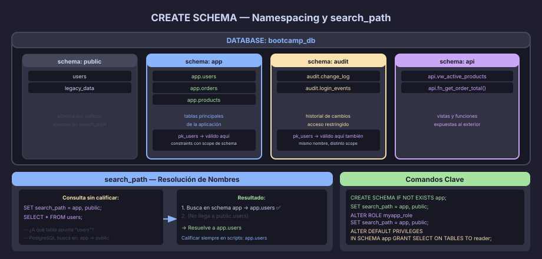

# CREATE SCHEMA: Organización y Namespacing

## ¿Qué es un Schema en PostgreSQL?

Un **schema** (esquema) es un espacio de nombres (*namespace*) dentro de una
base de datos. Es el nivel intermedio de la jerarquía de objetos:

```
Servidor PostgreSQL
  └── Base de Datos (DATABASE)
        ├── public       ← schema por defecto
        ├── app          ← ejemplo de schema de aplicación
        ├── audit        ← ejemplo de schema de auditoría
        └── pg_catalog   ← schema del sistema (solo lectura)
```

Todos los objetos — tablas, vistas, funciones, secuencias, tipos — pertenecen
a un schema. Cuando creas una tabla sin calificarla, va al primer schema del
`search_path`.



---

## Sintaxis Básica

```sql
-- Crear un schema:
CREATE SCHEMA app;
CREATE SCHEMA IF NOT EXISTS audit;

-- Crear tabla en un schema específico (nombre calificado):
CREATE TABLE app.users (
    user_id UUID NOT NULL DEFAULT gen_random_uuid(),
    CONSTRAINT pk_users PRIMARY KEY (user_id)
);

-- Referenciar entre schemas:
CREATE TABLE app.orders (
    order_id    UUID NOT NULL DEFAULT gen_random_uuid(),
    customer_id UUID NOT NULL,
    CONSTRAINT pk_orders     PRIMARY KEY (order_id),
    CONSTRAINT fk_orders_customer
        FOREIGN KEY (customer_id) REFERENCES app.customers(customer_id)
);

-- Eliminar schema y todos sus objetos:
DROP SCHEMA app CASCADE;
DROP SCHEMA IF EXISTS legacy CASCADE;
```

---

## search_path: Resolución de Nombres

Cuando usas un nombre no calificado (`users` en vez de `app.users`),
PostgreSQL busca en los schemas según el `search_path`:

```sql
-- Ver el search_path actual:
SHOW search_path;
-- Resultado típico: "$user", public

-- Cambiar search_path para la sesión:
SET search_path = app, public;

-- Ahora: CREATE TABLE users → crea app.users
-- Y: SELECT * FROM users → busca en app primero, luego en public

-- Establecer search_path permanente para un role:
ALTER ROLE bootcamp_user SET search_path = app, public;

-- Establecer search_path permanente para una base de datos:
ALTER DATABASE bootcamp_db SET search_path = app, public;
```

> **Importante para scripts:** en scripts de despliegue, **siempre califica**
> los nombres (`schema.tabla`) o establece `search_path` explícitamente al
> inicio. No dependas del search_path del entorno donde se ejecuta.

---

## Schemas del Sistema

PostgreSQL incluye schemas especiales que no debes modificar:

| Schema             | Contenido                                                  |
|--------------------|------------------------------------------------------------|
| `pg_catalog`       | Catálogos del sistema (`pg_tables`, `pg_constraint`, etc.) |
| `information_schema` | Vistas estándar SQL para inspeccionar la BD              |
| `pg_toast`         | Almacenamiento para valores muy grandes (TOAST)            |
| `public`           | Schema por defecto para objetos de usuario                 |

```sql
-- Consultar qué schemas existen:
SELECT schema_name, schema_owner
FROM information_schema.schemata
ORDER BY schema_name;

-- Ver todas las tablas de un schema:
SELECT table_name
FROM information_schema.tables
WHERE table_schema = 'app'
  AND table_type   = 'BASE TABLE'
ORDER BY table_name;
```

---

## Patrones de Organización con Schemas

### Patrón 1: Schema por Capa Funcional

```sql
CREATE SCHEMA IF NOT EXISTS app;     -- tablas principales de la aplicación
CREATE SCHEMA IF NOT EXISTS audit;   -- tablas de auditoría (historial de cambios)
CREATE SCHEMA IF NOT EXISTS api;     -- vistas y funciones expuestas al exterior
CREATE SCHEMA IF NOT EXISTS legacy;  -- tablas de sistemas anteriores (read-only)
```

```sql
-- La API externa solo ve lo que está en el schema api:
GRANT SELECT ON ALL TABLES IN SCHEMA api TO api_reader_role;
-- Los triggers escriben en audit sin que la app lo vea directamente:
GRANT INSERT ON ALL TABLES IN SCHEMA audit TO app_writer_role;
```

### Patrón 2: Schema por Módulo o Dominio

```sql
CREATE SCHEMA IF NOT EXISTS catalog;    -- productos, categorías
CREATE SCHEMA IF NOT EXISTS commerce;   -- pedidos, pagos, envíos
CREATE SCHEMA IF NOT EXISTS identity;   -- usuarios, sesiones, permisos
```

### Patrón 3: Schema por Tenant (Multi-tenant)

```sql
-- Un schema por cliente (tenant isolation):
CREATE SCHEMA IF NOT EXISTS tenant_acme;
CREATE SCHEMA IF NOT EXISTS tenant_globocorp;
-- Mismo conjunto de tablas en cada schema — aislamiento total
-- Desventaja: difícil de escalar a miles de tenants
```

> **Cuándo NO usar múltiples schemas:** Si el proyecto es pequeño y tiene
> una sola aplicación, el schema `public` es suficiente. Agregar schemas
> sin necesidad añade complejidad de deployment y mantenimiento.

---

## ALTER DEFAULT PRIVILEGES

Cuando creas objetos nuevos en un schema, los permisos por defecto pueden
no incluir el role de la aplicación. `ALTER DEFAULT PRIVILEGES` resuelve esto:

```sql
-- Que todo lo que cree 'migrator_role' en schema app
-- sea accesible para 'app_role':
ALTER DEFAULT PRIVILEGES
    FOR ROLE migrator_role
    IN SCHEMA app
    GRANT SELECT, INSERT, UPDATE, DELETE ON TABLES TO app_role;

ALTER DEFAULT PRIVILEGES
    FOR ROLE migrator_role
    IN SCHEMA app
    GRANT USAGE, SELECT ON SEQUENCES TO app_role;
```

---

## Convención del Bootcamp

Para los proyectos de este bootcamp, usamos un schema con el nombre del
sistema en `snake_case`:

```sql
-- En cada script DDL:
CREATE SCHEMA IF NOT EXISTS shophub;    -- o taskflow, clinicdb, etc.
SET search_path = shophub;

-- Esto permite ejecutar el script en la misma BD que otros proyectos
-- sin colisiones de nombres de tabla.
```

---

← [01 — Tipos de Datos](01-tipos-de-datos.md) | → [03 — Identidades y Secuencias](03-identidades-secuencias.md)
