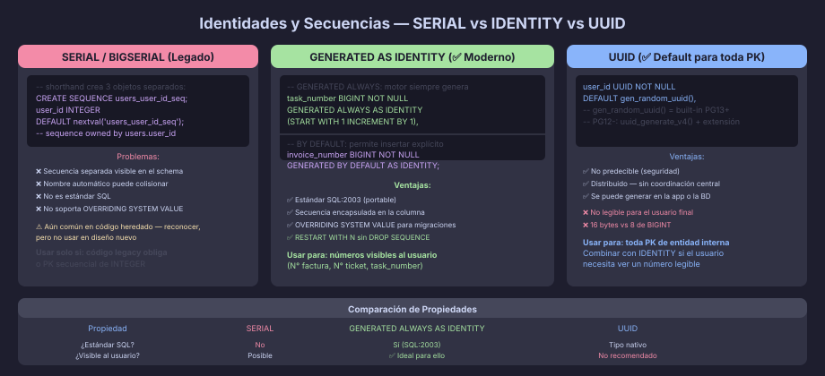

# Identidades, Secuencias y DEFAULT

## El Problema de los IDs Autogenerados

Toda tabla necesita una forma de generar valores únicos para la clave
primaria sin intervención del cliente. PostgreSQL ofrece tres mecanismos,
con niveles distintos de control y seguridad.



---

## Secuencias: el Mecanismo Base

Una **secuencia** es un objeto de la base de datos que genera enteros
únicos y crecientes. Todos los demás mecanismos (SERIAL, IDENTITY) se
construyen sobre secuencias.

```sql
-- Crear una secuencia explícita:
CREATE SEQUENCE invoice_seq
    START WITH 1000          -- primer valor
    INCREMENT BY 1           -- incremento
    MINVALUE 1000
    MAXVALUE 9999999999
    NO CYCLE                 -- error si se alcanza MAXVALUE
    CACHE 1;                 -- número de valores pre-generados en memoria

-- Usar la secuencia:
SELECT nextval('invoice_seq');   -- → 1000
SELECT nextval('invoice_seq');   -- → 1001
SELECT currval('invoice_seq');   -- → 1001 (último generado en esta sesión)
SELECT lastval();                 -- → mismo que currval del último nextval

-- Reiniciar:
SELECT setval('invoice_seq', 5000);   -- próximo nextval → 5001
SELECT setval('invoice_seq', 5000, false); -- próximo nextval → 5000

-- Ver el estado:
SELECT * FROM pg_sequences WHERE sequencename = 'invoice_seq';
```

> **Las secuencias no se revierten en una transacción abortada.**
> Si un INSERT falla y se hace ROLLBACK, el valor de la secuencia ya fue
> consumido. Los "huecos" en la numeración son normales y esperados.

---

## SERIAL / BIGSERIAL (Legado)

`SERIAL` fue la forma de generar IDs autoincrementales antes de SQL:2003.
Todavía aparece en código antiguo — es importante reconocerlo, pero
**no se recomienda para código nuevo**.

```sql
-- SERIAL es equivalente a este código expandido:
CREATE SEQUENCE users_user_id_seq;

CREATE TABLE users (
    user_id INTEGER NOT NULL DEFAULT nextval('users_user_id_seq')
);

ALTER SEQUENCE users_user_id_seq OWNED BY users.user_id;
-- La secuencia se llama tabla_columna_seq y es visible en el schema

-- BIGSERIAL hace lo mismo con BIGINT:
CREATE TABLE events (
    event_id BIGSERIAL PRIMARY KEY,   -- ← forma abreviada legada
    ...
);
```

**Problemas de SERIAL:**
- La secuencia es un objeto separado visible en el schema
- El nombre automático `tabla_columna_seq` puede colisionar
- No es estándar SQL — no portable a otros SGBD
- `INSERT ... OVERRIDING SYSTEM VALUE` no aplica (usa DEFAULT directamente)

---

## GENERATED ALWAYS AS IDENTITY (Recomendado)

`GENERATED ALWAYS AS IDENTITY` es el estándar SQL:2003. Es la forma
correcta de crear columnas de identidad en PostgreSQL 10+.

```sql
-- Sintaxis básica:
CREATE TABLE categories (
    category_id BIGINT NOT NULL GENERATED ALWAYS AS IDENTITY,
    category_name VARCHAR(80) NOT NULL,
    CONSTRAINT pk_categories PRIMARY KEY (category_id)
);

-- Opciones de la secuencia (dentro del paréntesis):
CREATE TABLE invoice_headers (
    invoice_number BIGINT NOT NULL GENERATED ALWAYS AS IDENTITY
        (START WITH 1000 INCREMENT BY 1 NO CYCLE),
    invoice_id     UUID NOT NULL DEFAULT gen_random_uuid(),
    CONSTRAINT pk_invoice_headers PRIMARY KEY (invoice_id),
    CONSTRAINT uq_invoice_headers_number UNIQUE (invoice_number)
);
-- Nota: la PK es el UUID; invoice_number es el número visible al cliente
```

### ALWAYS vs BY DEFAULT

```sql
-- GENERATED ALWAYS: el motor siempre genera el valor
-- No se puede hacer INSERT con un valor explícito (excepto con override)
CREATE TABLE tasks (
    task_number BIGINT NOT NULL GENERATED ALWAYS AS IDENTITY
);

-- INSERT INTO tasks (task_number) VALUES (99);
-- → ERROR: cannot insert into column "task_number" (is an identity column)

-- Para migraciones/cargas masivas, se puede override:
INSERT INTO tasks (task_number) VALUES (99)
OVERRIDING SYSTEM VALUE;

-- GENERATED BY DEFAULT: se puede insertar valor explícito sin override
-- Útil durante migraciones desde otro sistema
CREATE TABLE tasks_v2 (
    task_number BIGINT NOT NULL GENERATED BY DEFAULT AS IDENTITY
);
INSERT INTO tasks_v2 (task_number) VALUES (99);  -- ✅ funciona
```

### Reiniciar o Alterar la Secuencia Interna

```sql
-- Para modificar la secuencia de una columna IDENTITY:
ALTER TABLE tasks
    ALTER COLUMN task_number RESTART WITH 1;

ALTER TABLE tasks
    ALTER COLUMN task_number SET GENERATED ALWAYS
        (INCREMENT BY 2 START WITH 100);
```

---

## UUID como Clave Primaria

```sql
-- gen_random_uuid() genera UUIDs v4 (aleatorios)
-- Disponible sin extensión desde PostgreSQL 13:
CREATE TABLE users (
    user_id    UUID NOT NULL DEFAULT gen_random_uuid(),
    user_email VARCHAR(150) NOT NULL,
    CONSTRAINT pk_users PRIMARY KEY (user_id),
    CONSTRAINT uq_users_email UNIQUE (user_email)
);

-- En PostgreSQL 12 o anterior, necesitas la extensión:
-- CREATE EXTENSION IF NOT EXISTS "uuid-ossp";
-- DEFAULT uuid_generate_v4()

-- ✅ Cuándo usar UUID como PK:
--   - Entidades internas del sistema (no visibles al usuario final)
--   - Arquitecturas distribuidas o multi-tenant
--   - Cuando no se quiere revelar el volumen del negocio

-- ✅ Cuándo combinar UUID + IDENTITY:
--   - UUID como PK interna
--   - BIGINT IDENTITY para el número visible al usuario (factura, ticket)
```

---

## Columnas Generadas (Computed Columns)

PostgreSQL 12+ permite columnas cuyo valor se calcula automáticamente:

```sql
CREATE TABLE products (
    product_id      UUID           NOT NULL DEFAULT gen_random_uuid(),
    product_price   NUMERIC(10, 2) NOT NULL,
    tax_rate        NUMERIC(5, 4)  NOT NULL DEFAULT 0.19,

    -- Columna calculada — siempre igual a price * (1 + tax_rate):
    price_with_tax  NUMERIC(10, 2) NOT NULL
                    GENERATED ALWAYS AS (product_price * (1 + tax_rate)) STORED,

    CONSTRAINT pk_products PRIMARY KEY (product_id)
);

-- STORED: el valor se calcula en INSERT/UPDATE y se almacena físicamente
-- No existe VIRTUAL en PostgreSQL (a diferencia de MySQL)
-- No se puede hacer INSERT/UPDATE directo en la columna generada
```

---

## DEFAULT: Valores por Defecto

`DEFAULT` permite definir un valor que se usa cuando la columna no se
incluye en el `INSERT`:

```sql
CREATE TABLE orders (
    order_id     UUID        NOT NULL DEFAULT gen_random_uuid(),
    order_status VARCHAR(20) NOT NULL DEFAULT 'pending',
    is_priority  BOOLEAN     NOT NULL DEFAULT FALSE,
    created_at   TIMESTAMPTZ NOT NULL DEFAULT NOW(),
    updated_at   TIMESTAMPTZ NOT NULL DEFAULT NOW(),
    -- CURRENT_DATE, CURRENT_TIMESTAMP son equivalentes a NOW() como DEFAULT
    -- Pero NOW() captura el inicio de la transacción (consistente)

    CONSTRAINT pk_orders PRIMARY KEY (order_id)
);

-- Cambiar el DEFAULT después de crear la tabla:
ALTER TABLE orders
    ALTER COLUMN order_status SET DEFAULT 'draft';

-- Quitar el DEFAULT:
ALTER TABLE orders
    ALTER COLUMN order_status DROP DEFAULT;
```

---

## Resumen Comparativo

| Mecanismo                          | Estándar SQL | Control | Recomendado | Caso de uso |
|------------------------------------|-------------|---------|-------------|-------------|
| `SERIAL` / `BIGSERIAL`             | No          | Bajo    | ❌ Legado   | Código heredado |
| `GENERATED ALWAYS AS IDENTITY`     | Sí (2003)   | Alto    | ✅ Moderno  | Números visibles al usuario |
| `GENERATED BY DEFAULT AS IDENTITY` | Sí (2003)   | Alto    | ✅ Migraciones | Carga de datos desde otro sistema |
| `UUID DEFAULT gen_random_uuid()`   | Extensión   | Alto    | ✅ Default  | Toda PK de entidad interna |
| `GENERATED ALWAYS AS (expr) STORED`| Sí          | Alto    | ✅ Calculados | Campos derivados |

---

← [02 — CREATE SCHEMA](02-create-schema.md) | → [README](../README.md)
