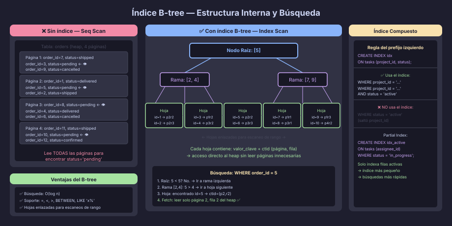

# Índices B-tree: Estructura Interna y Selectividad

## ¿Por Qué Existen los Índices?

Sin índice, PostgreSQL necesita leer **cada página** de una tabla para
encontrar las filas que cumplen un `WHERE`. Este proceso se llama
*Sequential Scan* y su costo es proporcional al tamaño total de la tabla.

Un índice es una **estructura de datos auxiliar** — separada de la tabla —
que permite encontrar filas sin leer todo el *heap* (datos principales).

```sql
-- Sin índice: PostgreSQL lee las 2 millones de filas de orders
SELECT * FROM orders WHERE order_status = 'pending';
-- → Seq Scan on orders (cost=0.00..48000.00)

-- Con índice: salta directamente a las filas relevantes
CREATE INDEX ix_orders_status ON orders (order_status);
-- → Index Scan on orders using ix_orders_status
```



---

## Estructura del B-tree

El B-tree (*Balanced Tree*) es el tipo de índice por defecto en PostgreSQL.
Su estructura tiene tres niveles:

```
                    [Nodo Raíz]
                  /      |      \
           [Rama]      [Rama]    [Rama]
          /     \      /    \    /    \
       [Hoja] [Hoja] [Hoja] [Hoja] [Hoja] [Hoja]
```

- **Nodo raíz:** entrada al árbol. Hay exactamente uno.
- **Nodos rama:** intermediarios que guían la búsqueda hacia abajo.
- **Nodos hoja:** contienen los valores de la columna indexada, ordenados,
  junto con un puntero al registro en el *heap* (llamado `ctid`).

Todas las hojas están enlazadas en orden — esto permite escaneos de rango
sin volver al nodo raíz.

---

## ¿Cuándo Usa PostgreSQL un B-tree?

El B-tree soporta todos los operadores de comparación:

| Operador / Cláusula      | ¿Usa B-tree? | Notas                                      |
|--------------------------|--------------|--------------------------------------------|
| `=`                      | ✅ Sí        | Búsqueda binaria: O(log n)                 |
| `<`, `<=`, `>`, `>=`     | ✅ Sí        | Escaneo de rango en hojas                  |
| `BETWEEN`                | ✅ Sí        | Equivale a `>= AND <=`                     |
| `LIKE 'prefijo%'`        | ✅ Sí        | Solo si el patrón empieza con literal       |
| `IS NULL`                | ✅ Sí        | PostgreSQL guarda NULLs en el índice B-tree |
| `IN (val1, val2, ...)`   | ✅ Sí        | Múltiples búsquedas de igualdad            |
| `ORDER BY columna`       | ✅ Sí        | El árbol ya está ordenado                  |
| `LIKE '%sufijo'`         | ❌ No        | Patrón sin prefijo fijo → Seq Scan         |
| Funciones sobre columna  | ❌ No*       | `lower(email)` → usar índice en expresión  |

---

## Selectividad: La Clave para Decidir

Un índice es útil **solo si filtra suficientemente**. La *selectividad*
mide qué fracción de las filas devuelve una condición:

```
Selectividad = filas_devueltas / filas_totales
```

- **Alta selectividad** (valor cercano a 0): pocas filas → índice muy útil
- **Baja selectividad** (valor cercano a 1): muchas filas → índice inútil

```sql
-- ✅ ALTA selectividad — solo 1 fila de 1 millón:
WHERE user_email = 'ana@example.com'     -- selectividad ≈ 0.000001

-- ✅ ALTA selectividad — 0.1% de las filas:
WHERE order_id = '550e8400-...'

-- ❌ BAJA selectividad — 50% de las filas:
WHERE is_active = TRUE                   -- solo 2 valores distintos

-- ❌ BAJA selectividad — 25% de las filas:
WHERE order_status = 'pending'           -- pocos estados distintos
-- PostgreSQL preferirá Seq Scan en tablas pequeñas/medianas
```

> **Regla práctica:** si una consulta retorna más del 5–10% de las filas,
> PostgreSQL generalmente preferirá un Sequential Scan sobre el Index Scan.
> El planificador elige automáticamente la estrategia más barata.

---

## Índices Compuestos

Un índice puede cubrir múltiples columnas. El **orden importa**:

```sql
-- Índice compuesto:
CREATE INDEX ix_tasks_project_status
    ON tasks (project_id, task_status);

-- ✅ Usa el índice (match en columna más a la izquierda):
WHERE project_id = '...'

-- ✅ Usa el índice (ambas columnas):
WHERE project_id = '...' AND task_status = 'in_progress'

-- ❌ NO usa el índice (saltó la primera columna):
WHERE task_status = 'in_progress'
-- → Seq Scan o índice separado en task_status
```

**Regla del prefijo más a la izquierda:** el índice compuesto solo se usa
si la consulta incluye la primera columna (o las primeras N columnas en
orden continuo de izquierda a derecha).

---

## Índices Parciales

Un índice parcial cubre solo las filas que cumplen una condición `WHERE`.
Son más pequeños y rápidos para consultas frecuentes sobre un subconjunto:

```sql
-- Índice solo en tareas activas (no las canceladas ni completadas):
CREATE INDEX ix_tasks_active_assignee
    ON tasks (assignee_id)
    WHERE task_status NOT IN ('done', 'cancelled');

-- Solo se usa cuando la consulta incluye la misma condición:
-- ✅ Usa el índice parcial:
SELECT * FROM tasks
WHERE assignee_id = '...'
  AND task_status NOT IN ('done', 'cancelled');
```

---

## Índices en Expresiones

Si las consultas aplican funciones sobre la columna, el índice estándar
no aplica. La solución es indexar la expresión:

```sql
-- ❌ Esto no usa el índice en user_email:
WHERE lower(user_email) = lower('Ana@Example.com')

-- ✅ Crear índice en la expresión:
CREATE INDEX ix_users_email_lower
    ON users (lower(user_email));

-- Ahora esta consulta usa el índice:
WHERE lower(user_email) = 'ana@example.com'
```

---

## Covering Indexes (INCLUDE)

Un *covering index* agrega columnas extra que **no** forman parte del
orden del árbol, solo para evitar acceder al heap en un `Index Only Scan`:

```sql
-- Sin INCLUDE: Index Scan debe ir al heap a buscar order_total
CREATE INDEX ix_orders_customer ON orders (customer_id);

-- Con INCLUDE: Index Only Scan satisface la consulta desde el índice
CREATE INDEX ix_orders_customer_covering
    ON orders (customer_id)
    INCLUDE (order_status, order_total, created_at);

-- La consulta no necesita ir al heap:
SELECT order_status, order_total, created_at
FROM orders
WHERE customer_id = '...';
-- → Index Only Scan
```

---

## CREATE INDEX CONCURRENTLY

En producción, un `CREATE INDEX` normal bloquea escrituras en la tabla
durante toda la construcción. `CONCURRENTLY` evita ese bloqueo:

```sql
-- En producción — no bloquea INSERT/UPDATE/DELETE:
CREATE INDEX CONCURRENTLY ix_orders_created_at
    ON orders (created_at DESC);

-- Tarda más (dos pasadas sobre la tabla), pero la app sigue funcionando
-- No puede ejecutarse dentro de una transacción
```

---

## Cuándo NO Crear un Índice

| Situación                          | Por qué no crear el índice                           |
|------------------------------------|------------------------------------------------------|
| Tabla muy pequeña (< 1 000 filas)  | Seq Scan es más rápido — el overhead del índice supera la ganancia |
| Columna con baja selectividad      | Boolean, status de 3–4 valores → casi no filtra      |
| Columna raramente en WHERE / JOIN  | El índice ocupa espacio y ralentiza escrituras sin beneficio |
| Escritura muy frecuente (INSERT/UPDATE masivo) | Cada escritura actualiza el índice — puede ser cuello de botella |
| Tabla ya con muchos índices        | Cada índice extra ralentiza los DML — evaluar con EXPLAIN |

---

← [README](../README.md) | → [02 — Índices Especializados](02-indices-especializados.md)
