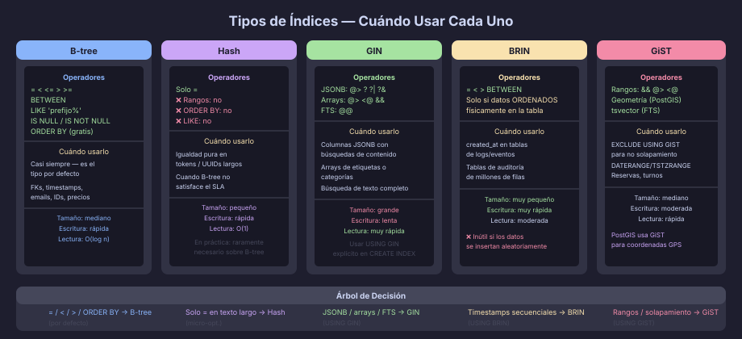

# Índices Especializados: Hash, GIN, BRIN y GiST

## Por Qué No Siempre Alcanza con B-tree

El índice B-tree es excelente para comparaciones de orden (`=`, `<`, `BETWEEN`,
`LIKE 'prefix%'`), pero **no sirve** para:

- Buscar un elemento dentro de un array o un documento JSONB
- Búsqueda de texto completo (*full-text search*)
- Datos naturalmente ordenados por bloques físicos (tablas de series temporales)
- Igualdad simple cuando el rendimiento de B-tree no es suficiente

Para estos casos, PostgreSQL ofrece tipos de índice especializados.



---

## Hash

El índice Hash calcula el **valor hash** de cada entrada y lo organiza en
cubos (*buckets*). La búsqueda de igualdad es O(1) en el mejor caso.

```sql
-- Crear un índice Hash:
CREATE INDEX ix_sessions_token_hash
    ON sessions USING HASH (session_token);

-- ✅ Funciona solo con igualdad:
WHERE session_token = 'abc123xyz'

-- ❌ No soporta rangos ni ordenamiento:
WHERE session_token > 'abc'         -- Seq Scan
ORDER BY session_token              -- Sort adicional
```

**Cuándo usar Hash:**
- Columnas de texto muy largas donde la igualdad es la única operación
- Casos donde la velocidad de B-tree no satisface el SLA
- En la práctica, B-tree es suficiente en casi todos los casos; Hash es
  un micro-optimización raramente necesaria

> **Nota histórica:** antes de PostgreSQL 10, los índices Hash no eran
> durables (no generaban WAL). Desde PG10 son completamente seguros.

---

## GIN — Generalized Inverted Index

GIN almacena una lista invertida: para cada *elemento posible*, guarda
todos los documentos (filas) que lo contienen. Es el índice de elección
para búsquedas de *contenido dentro de valores*.

### GIN para JSONB

```sql
-- Índice GIN sobre toda la columna JSONB (operadores @>, ?, ?|, ?&):
CREATE INDEX ix_products_metadata_gin
    ON products USING GIN (product_metadata);

-- ✅ Operador de contención — "dame productos cuyo metadata contenga esto":
WHERE product_metadata @> '{"brand": "Apple"}'

-- ✅ Operador de existencia de clave:
WHERE product_metadata ? 'discontinued'

-- ✅ Operador de ruta específica (con jsonb_path_ops, más ligero):
CREATE INDEX ix_products_metadata_path
    ON products USING GIN (product_metadata jsonb_path_ops);
-- jsonb_path_ops solo soporta @>, pero ocupa menos espacio
```

### GIN para Arrays

```sql
-- Columna de tipo array:
CREATE TABLE articles (
    article_id   UUID NOT NULL DEFAULT gen_random_uuid(),
    article_tags TEXT[]        NOT NULL DEFAULT '{}',
    CONSTRAINT pk_articles PRIMARY KEY (article_id)
);

CREATE INDEX ix_articles_tags_gin
    ON articles USING GIN (article_tags);

-- ✅ Contiene el elemento (operador @>):
WHERE article_tags @> ARRAY['postgresql']

-- ✅ Solapa con otro array (operador &&):
WHERE article_tags && ARRAY['postgresql', 'indexing']
```

### GIN para Full-Text Search

```sql
-- Columna de tipo tsvector (documento indexado para búsqueda de texto):
ALTER TABLE articles ADD COLUMN article_tsv TSVECTOR
    GENERATED ALWAYS AS (
        to_tsvector('spanish', article_title || ' ' || COALESCE(article_body, ''))
    ) STORED;

CREATE INDEX ix_articles_tsv_gin
    ON articles USING GIN (article_tsv);

-- ✅ Buscar artículos que contengan "índice" y "optimización":
WHERE article_tsv @@ to_tsquery('spanish', 'índice & optimización')
```

**Cuándo usar GIN:**
- Consultas de contenido en `JSONB`, `TEXT[]`, `tsvector`
- Operadores: `@>`, `<@`, `?`, `?|`, `?&`, `@@`
- GIN es más costoso de actualizar (escrituras más lentas) pero mucho
  más rápido en las búsquedas

---

## BRIN — Block Range Index

BRIN almacena los valores **mínimo y máximo** de una columna para cada
rango de bloques físicos (*block range*, por defecto 128 páginas).
El índice es extremadamente pequeño pero solo funciona si los datos
están **correlacionados con el orden físico** de la tabla.

```sql
-- BRIN es ideal para series temporales donde las filas más nuevas
-- están al final de la tabla (orden de inserción = orden temporal):
CREATE INDEX ix_orders_created_at_brin
    ON orders USING BRIN (created_at)
    WITH (pages_per_range = 64);  -- opcional, default 128

-- ✅ Consulta por rango de fechas:
WHERE created_at >= '2026-01-01' AND created_at < '2026-02-01'
-- BRIN descarta bloques cuyo max(created_at) < '2026-01-01'

-- ❌ NO funciona bien con datos desordenados:
-- Si los pedidos se insertan en orden aleatorio, BRIN no puede descartar nada
```

**Cuándo usar BRIN:**
- Tablas de eventos/logs con inserción secuencial por tiempo
- Columnas de fecha de creación en tablas de auditoría
- Tablas particionadas por rango temporal (complementa la partición)
- El índice BRIN de una tabla de 100 GB puede ocupar solo unos pocos KB

---

## GiST — Generalized Search Tree

GiST es una familia de índices extensible para tipos de datos que requieren
**predicados complejos**, como rangos, figuras geométricas y búsqueda de
texto (alternativa a GIN).

```sql
-- Índice para tipo de rango (DATERANGE, TSTZRANGE):
CREATE TABLE bookings (
    booking_id     UUID      NOT NULL DEFAULT gen_random_uuid(),
    resource_id    UUID      NOT NULL,
    booking_period TSTZRANGE NOT NULL,
    CONSTRAINT pk_bookings PRIMARY KEY (booking_id),
    CONSTRAINT no_overlap EXCLUDE USING GIST (
        resource_id WITH =,
        booking_period WITH &&
    )
);
-- El EXCLUDE USING GIST previene solapamientos de reservas para el mismo recurso

-- ✅ Consultas de solapamiento:
WHERE booking_period && '[2026-06-01, 2026-06-05)'::tstzrange
```

**Cuándo usar GiST:**
- Restricción de no solapamiento (`EXCLUDE USING GIST`) en rangos
- Datos geométricos (PostGIS usa GiST extensamente)
- Alternativa a GIN para `tsvector` cuando el índice necesita ser más
  pequeño a cambio de algo de velocidad

---

## Tabla Comparativa

| Tipo  | Operadores soportados                   | Tamaño relativo | Velocidad escritura | Caso de uso principal |
|-------|-----------------------------------------|-----------------|---------------------|-----------------------|
| B-tree | `=`, `<`, `>`, `BETWEEN`, `LIKE 'x%'` | Mediano         | Rápido              | Casi todo             |
| Hash  | Solo `=`                                | Pequeño         | Rápido              | Igualdad en texto largo |
| GIN   | `@>`, `?`, `&&`, `@@`                  | Grande          | Lento               | JSONB, arrays, FTS    |
| BRIN  | `=`, `<`, `>`, `BETWEEN`               | Muy pequeño     | Muy rápido          | Series temporales     |
| GiST  | Rangos, geometría, `&&`, `@>`          | Mediano         | Moderado            | Rangos, geometría     |

---

## Cuándo Elegir Cada Uno

```
¿Qué tipo de consulta necesitas indexar?
│
├─ Igualdad, rango, ORDER BY en tipo simple
│    └─ ✅ B-tree (por defecto)
│
├─ Solo igualdad en texto largo o UUID
│    └─ Hash (mejora marginal en igualdad pura)
│
├─ Contención en JSONB / array / full-text
│    └─ ✅ GIN
│
├─ Rango de fechas en tabla con inserción secuencial
│    └─ ✅ BRIN (ocupa casi nada)
│
└─ Prevenir solapamiento de rangos (reservas, turnos)
     └─ ✅ EXCLUDE USING GiST
```

---

← [01 — Índices B-tree](01-indices-btree.md) | → [03 — EXPLAIN ANALYZE](03-explain-analyze.md)
