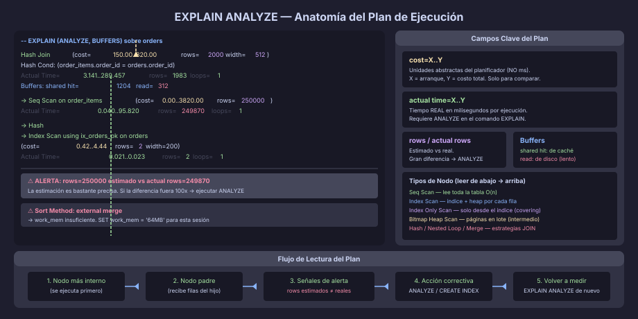

# EXPLAIN ANALYZE: Leer el Plan de Ejecución

## ¿Qué es el Plan de Ejecución?

Antes de ejecutar cualquier consulta, el **planificador** (*query planner*)
de PostgreSQL construye un **plan de ejecución**: un árbol de operaciones
que describe cómo se obtendrá el resultado.

Entender el plan te permite identificar cuellos de botella, confirmar que
los índices se usan y tomar decisiones informadas antes de optimizar.



---

## EXPLAIN vs EXPLAIN ANALYZE

```sql
-- EXPLAIN: muestra el plan estimado SIN ejecutar la consulta
EXPLAIN
SELECT * FROM tasks WHERE project_id = '...' AND task_status = 'in_progress';

-- EXPLAIN ANALYZE: EJECUTA la consulta y muestra tiempos reales
EXPLAIN (ANALYZE, BUFFERS)
SELECT * FROM tasks WHERE project_id = '...' AND task_status = 'in_progress';

-- Forma más completa para análisis:
EXPLAIN (ANALYZE, BUFFERS, VERBOSE, FORMAT TEXT)
SELECT ...;
```

> **Importante:** `EXPLAIN ANALYZE` ejecuta la consulta **de verdad**. Para
> `DELETE`, `UPDATE` o `INSERT`, envuelve en una transacción y haz ROLLBACK:
>
> ```sql
> BEGIN;
> EXPLAIN ANALYZE DELETE FROM tasks WHERE task_status = 'cancelled';
> ROLLBACK;
> ```

---

## Anatomía de la Salida

```
Seq Scan on tasks  (cost=0.00..4821.00 rows=98 width=312)
                    │            │       │        └─ tamaño estimado de fila (bytes)
                    │            │       └─────────── filas estimadas devueltas
                    │            └─────────────────── costo total estimado
                    └──────────────────────────────── costo de arranque estimado
  Filter: ((task_status = 'in_progress') AND (project_id = '...'))
  Rows Removed by Filter: 99902
  -> actual time=0.043..312.871 rows=98 loops=1
         │                    │      │       └─ veces que se ejecutó este nodo
         │                    │      └─────────── filas reales retornadas
         │                    └────────────────── tiempo real total (ms)
         └─────────────────────────────────────── tiempo real de arranque (ms)
```

### Los Dos Costos

| Campo          | Significado                                                     |
|----------------|-----------------------------------------------------------------|
| `cost=X..Y`    | **Estimación del planificador** en unidades abstractas (no ms). X = startup, Y = total |
| `actual time=X..Y` | **Tiempo real** en milisegundos. X = primer resultado, Y = último |
| `rows=N`       | Filas **estimadas** por el planificador                         |
| `actual rows=N`| Filas **reales** devueltas                                      |
| `loops=N`      | Veces que se ejecutó este nodo (importante en Nested Loop)      |

---

## Nodos Principales del Plan

### Seq Scan — Escaneo Secuencial

```
Seq Scan on orders  (cost=0.00..4250.00 rows=250000 width=200)
```

Lee todas las páginas de la tabla. Normal y eficiente para:
- Tablas pequeñas
- Consultas que retornan >5–10% de las filas
- Cuando no hay índice aplicable

---

### Index Scan

```
Index Scan using ix_tasks_project_status on tasks
  (cost=0.42..8.45 rows=3 width=312)
  Index Cond: ((project_id = '...') AND (task_status = 'in_progress'))
```

Usa el índice para encontrar los `ctid` de las filas, luego accede al
*heap* para cada fila. Eficiente cuando retorna pocas filas (alta selectividad).

---

### Index Only Scan

```
Index Only Scan using ix_orders_customer_covering on orders
  (cost=0.42..4.44 rows=2 width=48)
  Heap Fetches: 0
```

Satisface la consulta **completamente desde el índice** — no accede al heap.
Requiere un *covering index* (`INCLUDE`) y que la tabla esté vacuumeada
(visibilidad en el mapa de visibilidad).

---

### Bitmap Heap Scan + Bitmap Index Scan

```
Bitmap Heap Scan on orders  (cost=12.50..198.44 rows=450 width=200)
  Recheck Cond: (customer_id = '...')
  -> Bitmap Index Scan on ix_orders_customer_id
      (cost=0.00..12.39 rows=450 width=0)
      Index Cond: (customer_id = '...')
```

PostgreSQL primero construye un bitmap de páginas que contienen filas
relevantes (Bitmap Index Scan), luego accede al heap por páginas completas
(Bitmap Heap Scan). Más eficiente que Index Scan cuando hay muchas filas
pero menos que un Seq Scan.

---

### Hash Join / Nested Loop / Merge Join

```
Hash Join  (cost=150.00..820.00 rows=2000 width=512)
  Hash Cond: (order_items.order_id = orders.order_id)
  -> Seq Scan on order_items ...
  -> Hash
       -> Index Scan on orders ...
```

Los tres tipos de JOIN tienen casos de uso distintos:

| Tipo         | Cuándo el planificador lo elige                        |
|--------------|--------------------------------------------------------|
| Nested Loop  | Tabla interna pequeña o con índice eficiente           |
| Hash Join    | Tablas medianas, sin índice en la columna de join      |
| Merge Join   | Ambas entradas ya están ordenadas por la columna join  |

---

## Señales de Alerta

| Señal en el plan                          | Problema probable            | Acción                               |
|-------------------------------------------|------------------------------|--------------------------------------|
| `rows=1000` pero `actual rows=500000`     | Estadísticas obsoletas       | `ANALYZE tablename`                  |
| `Seq Scan` en tabla grande con `Filter`   | Índice faltante              | `CREATE INDEX` en la columna del filtro |
| `Sort Method: external merge`             | `work_mem` insuficiente      | `SET work_mem = '64MB'` para la sesión |
| `loops=50000` en Nested Loop              | Join ineficiente             | Revisar si falta índice en tabla interna |
| `Heap Fetches: 15000` en Index Only Scan  | Mapa de visibilidad desactualizado | `VACUUM tablename`            |
| Costo total estimado muy distinto del real | Estadísticas viejas o columna correlacionada | `ANALYZE`, o ajustar `default_statistics_target` |

---

## Estadísticas del Planificador

El planificador decide basándose en estadísticas que actualiza `ANALYZE`:

```sql
-- Actualizar estadísticas de una tabla:
ANALYZE tasks;

-- Actualizar toda la base de datos:
ANALYZE;

-- Ver las estadísticas almacenadas:
SELECT attname, n_distinct, correlation
FROM pg_stats
WHERE tablename = 'tasks';
-- correlation ≈ 1.0: datos físicamente ordenados (BRIN sería muy efectivo)
-- correlation ≈ 0.0: datos completamente desordenados
-- n_distinct < 0: valor negativo = fracción del total de filas (ej: -0.01 = 1%)
```

---

## Ver Uso Real de Índices

```sql
-- ¿Cuáles índices realmente se están usando?
SELECT
    indexrelname         AS index_name,
    relname              AS table_name,
    idx_scan             AS times_used,
    idx_tup_read         AS tuples_read,
    idx_tup_fetch        AS tuples_fetched
FROM pg_stat_user_indexes
JOIN pg_stat_user_tables USING (relid)
ORDER BY idx_scan DESC;

-- Un índice con idx_scan = 0 después de semanas de producción
-- probablemente no está siendo usado → candidato para DROP INDEX
```

---

## Flujo de Análisis de una Consulta Lenta

```
1. Identificar la consulta lenta (pg_stat_statements, logs)
        ↓
2. EXPLAIN (ANALYZE, BUFFERS) — obtener el plan real
        ↓
3. Leer el plan de abajo hacia arriba — el nodo más interior se ejecuta primero
        ↓
4. Buscar señales de alerta (filas estimadas vs reales, Seq Scan en tabla grande)
        ↓
5. Si estadísticas obsoletas → ANALYZE
   Si falta índice → CREATE INDEX CONCURRENTLY
   Si work_mem bajo → ajustar para la sesión o globalmente
   Si índice no se usa → revisar selectividad o condición de la consulta
        ↓
6. Ejecutar EXPLAIN ANALYZE nuevamente y comparar
```

---

← [02 — Índices Especializados](02-indices-especializados.md) | → [README](../README.md)
