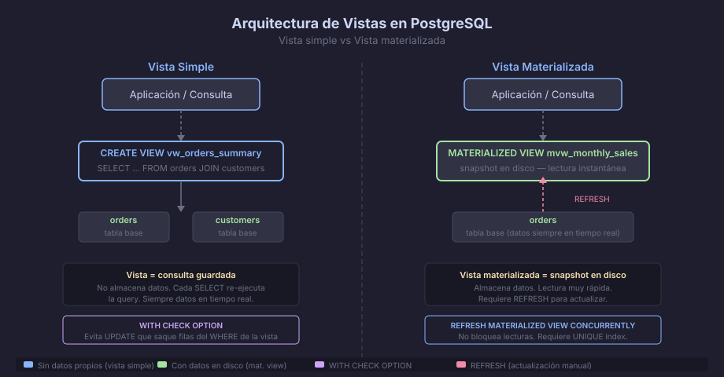

# Vistas y Vistas Materializadas

## ¿Por Qué Crear Vistas?

Una **vista** es una consulta nombrada almacenada en la base de datos.
Desde la perspectiva de quien la usa, se comporta como una tabla: se puede
hacer `SELECT`, aplicar `WHERE`, y unirla con otras tablas o vistas.

Las vistas resuelven tres problemas concretos:

1. **Encapsulación**: ocultan la complejidad de JOINs y subconsultas detrás
   de un nombre semántico (`vw_orders_summary` en lugar de 5 tablas unidas)
2. **Seguridad por columnas**: con `GRANT SELECT ON vw_... TO rol`, puedes
   exponer solo las columnas que un rol necesita ver
3. **Consistencia**: un cambio en la consulta se aplica en un solo lugar



---

## Vistas Simples

```sql
-- Sintaxis básica:
CREATE OR REPLACE VIEW vw_orders_summary AS
SELECT
    o.order_id,
    o.customer_id,
    c.customer_name,
    o.order_status,
    o.order_total,
    o.created_at
FROM orders    AS o
JOIN customers AS c ON c.customer_id = o.customer_id;

-- Usar la vista exactamente como una tabla:
SELECT * FROM vw_orders_summary WHERE order_status = 'pending';
SELECT COUNT(*) FROM vw_orders_summary WHERE created_at >= CURRENT_DATE - 7;

-- Eliminar la vista:
DROP VIEW IF EXISTS vw_orders_summary;
```

### Vistas con Seguridad de Columnas

```sql
-- Exponer solo datos no sensibles al rol de soporte:
CREATE OR REPLACE VIEW vw_customers_support AS
SELECT
    customer_id,
    customer_name,
    customer_email,
    created_at
    -- no incluimos datos de pago ni contraseñas
FROM customers
WHERE is_active = TRUE;

GRANT SELECT ON vw_customers_support TO support_role;
```

---

## Vistas Actualizables

PostgreSQL permite hacer `INSERT`, `UPDATE` y `DELETE` a través de una
vista si esta cumple ciertas condiciones:

- Un solo `FROM` (sin JOINs)
- Sin `DISTINCT`, `GROUP BY`, `HAVING`, `LIMIT`, `OFFSET`
- Sin funciones de agregación ni de ventana
- Sin subconsultas en la lista `SELECT`

```sql
-- Esta vista es actualizable:
CREATE OR REPLACE VIEW vw_active_products AS
SELECT product_id, product_name, product_price, product_stock
FROM products
WHERE product_stock > 0;

-- UPDATE a través de la vista:
UPDATE vw_active_products SET product_price = 99.99 WHERE product_id = '...';

-- WITH CHECK OPTION: previene insertar/actualizar filas que no satisfarían
-- la condición WHERE de la vista (evita que el UPDATE "saque" la fila de la vista):
CREATE OR REPLACE VIEW vw_active_products AS
SELECT product_id, product_name, product_price, product_stock
FROM products
WHERE product_stock > 0
WITH CHECK OPTION;

-- Esto fallaría porque product_stock=0 violaría el WHERE de la vista:
-- UPDATE vw_active_products SET product_stock = 0 WHERE product_id = '...';
```

---

## Vistas Materializadas

Una **vista materializada** almacena físicamente el resultado de la consulta
en disco. Las lecturas son instantáneas (como una tabla), pero los datos
no son en tiempo real: hay que refrescarlos manualmente o por schedule.

```sql
-- Crear la vista materializada:
CREATE MATERIALIZED VIEW mvw_monthly_sales AS
SELECT
    DATE_TRUNC('month', created_at)  AS sale_month,
    COUNT(*)                          AS total_orders,
    SUM(order_total)                  AS revenue,
    AVG(order_total)                  AS avg_order_value
FROM orders
WHERE order_status = 'delivered'
GROUP BY DATE_TRUNC('month', created_at)
ORDER BY sale_month;

-- Crear un índice sobre la vista materializada (igual que en una tabla):
CREATE INDEX ix_mvw_monthly_sales_month
    ON mvw_monthly_sales (sale_month);

-- Refrescar los datos (bloquea lecturas durante el refresh):
REFRESH MATERIALIZED VIEW mvw_monthly_sales;

-- Refrescar sin bloquear lecturas (requiere UNIQUE index):
CREATE UNIQUE INDEX uq_mvw_monthly_sales_month
    ON mvw_monthly_sales (sale_month);

REFRESH MATERIALIZED VIEW CONCURRENTLY mvw_monthly_sales;
```

### Automatizar el Refresco

```sql
-- No existe un SCHEDULER nativo en PostgreSQL.
-- Las opciones comunes son:
-- 1. pg_cron (extensión): permite definir trabajos cron dentro de PG
-- 2. Cron del sistema operativo: ejecuta REFRESH MATERIALIZED VIEW
-- 3. El propio ORM/framework de la aplicación

-- Con pg_cron (si está instalado):
SELECT cron.schedule(
    'refresh_monthly_sales',     -- nombre del job
    '0 3 * * *',                 -- expresión cron: cada día a las 3 AM
    'REFRESH MATERIALIZED VIEW CONCURRENTLY mvw_monthly_sales'
);
```

---

## Comparativa

| | Vista Simple | Vista Materializada |
|---|---|---|
| Datos | En tiempo real (la query se ejecuta cada vez) | Snapshot (hasta el último REFRESH) |
| Velocidad de lectura | Depende de la query subyacente | Muy rápida (como tabla) |
| Índices | No | Sí, como cualquier tabla |
| Escritura | Posible si es actualizable | No (read-only) |
| Uso típico | Encapsular lógica, control de acceso | Reportes, dashboards, queries analíticas |
| REFRESH necesario | No | Sí (manual o programado) |

---

## Cuándo Elegir Cada Una

```
¿Qué necesitas?
│
├─ Encapsular un JOIN complejo, controlar columnas visibles por rol
│    └─ ✅ Vista simple
│
├─ Dashboard analítico con GROUP BY sobre millones de filas (lenta)
│    └─ ✅ Vista materializada + índice + REFRESH CONCURRENTLY
│
├─ Datos que deben estar siempre frescos (tiempo real)
│    └─ ✅ Vista simple (nunca materializada)
│
└─ Reporte mensual de ventas, métricas de negocio con tolerancia de horas
     └─ ✅ Vista materializada + cron diario
```

---

← [README](../README.md) | → [02 — PL/pgSQL: Funciones y Procedimientos](02-plpgsql-funciones.md)
