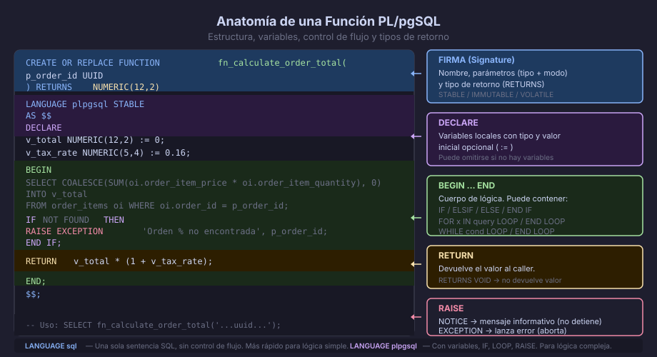

# PL/pgSQL: Funciones y Procedimientos Almacenados

## ¿Por Qué Lógica en la Base de Datos?

Mover lógica de negocio a la base de datos tiene ventajas concretas:

- **Reutilización**: cualquier aplicación (Python, Node, Java, psql) llama
  la misma función
- **Consistencia**: la validación ocurre en la capa de datos, no en la
  aplicación, independientemente del cliente
- **Rendimiento**: elimina viajes de ida y vuelta (round-trips) para
  operaciones que requieren múltiples queries
- **Encapsulación**: la lógica compleja queda detrás de un nombre semántico

El lenguaje procedural de PostgreSQL es **PL/pgSQL** (*Procedural Language
for PostgreSQL*), que extiende SQL con control de flujo, variables y manejo
de excepciones.



---

## Anatomía de una Función PL/pgSQL

```sql
CREATE OR REPLACE FUNCTION fn_calculate_order_total(
    p_order_id UUID           -- parámetro de entrada (prefijo p_ por convención)
)
RETURNS NUMERIC(12, 2)        -- tipo de retorno
LANGUAGE plpgsql              -- lenguaje
STABLE                        -- hint al planificador: no modifica la BD
AS $$                         -- delimitador de cuerpo
DECLARE
    -- Sección de declaración de variables locales:
    v_total     NUMERIC(12, 2) := 0;
    v_tax_rate  NUMERIC(5, 4)  := 0.16;
BEGIN
    -- Cuerpo de la función:
    SELECT COALESCE(SUM(order_item_price * order_item_quantity), 0)
    INTO v_total
    FROM order_items
    WHERE order_id = p_order_id;

    -- Si no existe la orden, lanzar excepción:
    IF NOT FOUND THEN
        RAISE EXCEPTION 'Orden % no encontrada', p_order_id
            USING ERRCODE = 'P0001';
    END IF;

    RETURN v_total * (1 + v_tax_rate);
END;
$$;

-- Llamar la función con SELECT (devuelve un valor escalar):
SELECT fn_calculate_order_total('...uuid...');
```

---

## Clasificadores de Comportamiento

PostgreSQL necesita saber si una función puede afectar la caché del
planificador y si puede modificar datos:

| Clasificador | Significado | Ejemplo |
|--------------|-------------|---------|
| `VOLATILE` | Puede retornar distintos valores en la misma transacción. **Default.** | `NOW()`, funciones con `INSERT`/`UPDATE` |
| `STABLE` | Misma entrada → mismo resultado dentro de la misma transacción. Puede leer BD. | Funciones de solo lectura |
| `IMMUTABLE` | Misma entrada → mismo resultado siempre. No puede leer la BD. | Funciones puramente matemáticas |

```sql
-- STABLE: función de solo lectura, resultado fijo dentro de la transacción
CREATE OR REPLACE FUNCTION fn_get_product_stock(p_product_id UUID)
RETURNS INTEGER
LANGUAGE plpgsql STABLE
AS $$
DECLARE v_stock INTEGER;
BEGIN
    SELECT product_stock INTO v_stock FROM products WHERE product_id = p_product_id;
    RETURN COALESCE(v_stock, 0);
END;
$$;
```

---

## Control de Flujo

```sql
CREATE OR REPLACE FUNCTION fn_classify_order(p_total NUMERIC)
RETURNS TEXT
LANGUAGE plpgsql IMMUTABLE
AS $$
BEGIN
    -- IF / ELSIF / ELSE:
    IF p_total >= 1000 THEN
        RETURN 'premium';
    ELSIF p_total >= 200 THEN
        RETURN 'standard';
    ELSE
        RETURN 'basic';
    END IF;
END;
$$;
```

```sql
-- FOR loop sobre una consulta:
CREATE OR REPLACE FUNCTION fn_log_pending_orders()
RETURNS void
LANGUAGE plpgsql
AS $$
DECLARE
    v_rec RECORD;
BEGIN
    FOR v_rec IN
        SELECT order_id, customer_id FROM orders WHERE order_status = 'pending'
    LOOP
        RAISE NOTICE 'Orden pendiente: %', v_rec.order_id;
    END LOOP;
END;
$$;
```

---

## Funciones que Devuelven Tablas

```sql
-- RETURNS TABLE: devuelve un conjunto de filas con columnas nombradas
CREATE OR REPLACE FUNCTION fn_orders_by_customer(
    p_customer_id UUID,
    p_limit       INT DEFAULT 10
)
RETURNS TABLE (
    order_id     UUID,
    order_status VARCHAR(20),
    order_total  NUMERIC(12, 2),
    created_at   TIMESTAMPTZ
)
LANGUAGE plpgsql STABLE
AS $$
BEGIN
    RETURN QUERY
        SELECT
            o.order_id,
            o.order_status,
            o.order_total,
            o.created_at
        FROM orders AS o
        WHERE o.customer_id = p_customer_id
        ORDER BY o.created_at DESC
        LIMIT p_limit;
END;
$$;

-- Llamar como una tabla:
SELECT * FROM fn_orders_by_customer('...uuid...', 5);
```

---

## Funciones en SQL Puro (LANGUAGE sql)

Para lógica simple sin control de flujo, `LANGUAGE sql` es más limpio y
generalmente más rápido que PL/pgSQL:

```sql
-- LANGUAGE sql: el cuerpo es un bloque SQL simple
CREATE OR REPLACE FUNCTION fn_full_name(
    p_first VARCHAR,
    p_last  VARCHAR
)
RETURNS TEXT
LANGUAGE sql IMMUTABLE
AS $$
    SELECT trim(p_first || ' ' || p_last);
$$;

SELECT fn_full_name('Ana', 'García');  -- 'Ana García'
```

---

## Procedimientos Almacenados (PostgreSQL 11+)

Un **procedimiento** (`CREATE PROCEDURE`) se diferencia de una función en
que puede gestionar sus propias transacciones con `COMMIT` y `ROLLBACK`
dentro del cuerpo:

```sql
-- Procedimiento para cancelar una orden
CREATE OR REPLACE PROCEDURE sp_cancel_order(
    p_order_id  UUID,
    p_reason    TEXT
)
LANGUAGE plpgsql
AS $$
DECLARE
    v_current_status VARCHAR(20);
BEGIN
    SELECT order_status
    INTO   v_current_status
    FROM   orders
    WHERE  order_id = p_order_id
    FOR UPDATE;  -- bloquear la fila mientras la modificamos

    IF v_current_status IS NULL THEN
        RAISE EXCEPTION 'Orden % no existe', p_order_id;
    END IF;

    IF v_current_status IN ('delivered', 'cancelled') THEN
        RAISE EXCEPTION 'No se puede cancelar una orden con estado %',
            v_current_status;
    END IF;

    UPDATE orders
       SET order_status = 'cancelled',
           updated_at   = NOW()
     WHERE order_id     = p_order_id;

    INSERT INTO order_cancellations (order_id, cancellation_reason, cancelled_at)
    VALUES (p_order_id, p_reason, NOW());

    -- COMMIT aquí es válido en procedimientos (no en funciones):
    COMMIT;
END;
$$;

-- Llamar con CALL:
CALL sp_cancel_order('...uuid...', 'El cliente solicitó la cancelación');
```

---

## Función vs Procedimiento

| | Función | Procedimiento |
|---|---|---|
| Devuelve valor | Sí (`RETURNS tipo`) | No (implícita `RETURNS void`) |
| Cómo se llama | `SELECT fn_...()` | `CALL sp_...()`  |
| `COMMIT` / `ROLLBACK` en el cuerpo | ❌ No permitido | ✅ Sí (PG11+) |
| Se puede usar en consultas | Sí | No |
| Caso de uso típico | Cálculos, transformaciones, lectura | Operaciones multi-paso con transacción propia |

---

## Manejo de Excepciones

```sql
CREATE OR REPLACE FUNCTION fn_safe_divide(a NUMERIC, b NUMERIC)
RETURNS NUMERIC
LANGUAGE plpgsql IMMUTABLE
AS $$
BEGIN
    RETURN a / b;
EXCEPTION
    WHEN division_by_zero THEN
        RAISE NOTICE 'División por cero — retornando NULL';
        RETURN NULL;
    WHEN OTHERS THEN
        RAISE EXCEPTION 'Error inesperado: %', SQLERRM;
END;
$$;
```

---

← [01 — Vistas](01-vistas.md) | → [03 — Triggers y Transacciones](03-triggers-transacciones.md)
