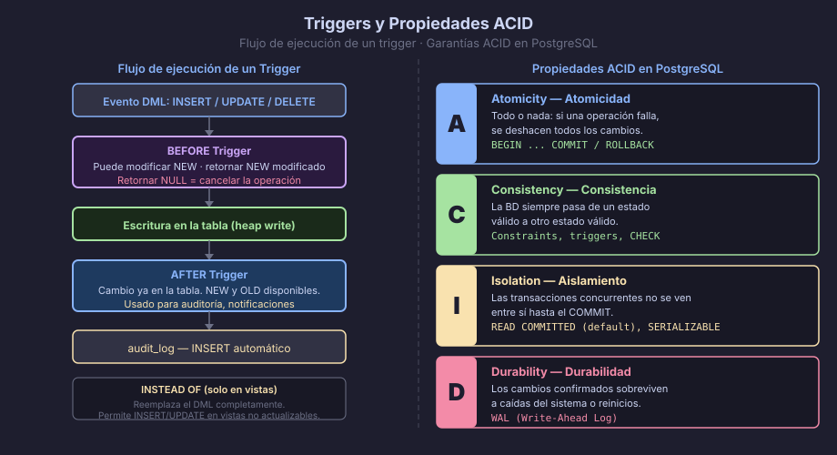

# Triggers y Transacciones ACID

## Triggers — Automatizar la Integridad

Un **trigger** es una función que PostgreSQL ejecuta automáticamente cuando
ocurre un evento (`INSERT`, `UPDATE`, `DELETE`, `TRUNCATE`) en una tabla o
vista. Se usa para:

- **Auditoría automática**: registrar quién cambió qué y cuándo
- **Consistencia derivada**: actualizar totales, contadores o campos
  calculados sin que la aplicación lo sepa
- **Validación compleja**: reglas que no se pueden expresar como `CHECK`



---

## Anatomía de un Trigger

Un trigger requiere **dos objetos**:

1. Una **función** que retorna `TRIGGER` (contiene la lógica)
2. El **trigger** que conecta la función con la tabla y el evento

```sql
-- PASO 1: Función trigger (siempre retorna TRIGGER)
CREATE OR REPLACE FUNCTION fn_trg_orders_audit()
RETURNS TRIGGER
LANGUAGE plpgsql
AS $$
BEGIN
    -- NEW: fila con los datos nuevos (en INSERT y UPDATE)
    -- OLD: fila con los datos anteriores (en UPDATE y DELETE)
    INSERT INTO audit_log (
        audit_table,
        audit_operation,
        audit_old_data,
        audit_new_data,
        audit_user,
        audit_at
    ) VALUES (
        TG_TABLE_NAME,          -- variable especial: nombre de la tabla
        TG_OP,                  -- variable especial: INSERT | UPDATE | DELETE
        row_to_json(OLD),       -- puede ser NULL en INSERT
        row_to_json(NEW),       -- puede ser NULL en DELETE
        current_user,
        NOW()
    );
    RETURN NEW;  -- en AFTER triggers de INSERT/UPDATE: retornar NEW
                 -- en AFTER triggers de DELETE: retornar OLD o NULL
END;
$$;

-- PASO 2: Crear el trigger sobre la tabla
CREATE TRIGGER trg_orders_after_update
    AFTER INSERT OR UPDATE OR DELETE
    ON orders
    FOR EACH ROW
    EXECUTE FUNCTION fn_trg_orders_audit();
```

---

## BEFORE vs AFTER vs INSTEAD OF

| Momento | Cuándo se ejecuta | Uso típico |
|---------|-------------------|------------|
| `BEFORE` | Antes de la operación, puede modificar `NEW` o cancelar la operación | Normalización de datos, validaciones complejas, modificar valores antes de insertar |
| `AFTER` | Después de la operación, los cambios ya están en la tabla | Auditoría, actualizaciones de tablas relacionadas, notificaciones |
| `INSTEAD OF` | Reemplaza la operación (solo en vistas) | Hacer que una vista no actualizable acepte `INSERT`/`UPDATE`/`DELETE` |

```sql
-- BEFORE INSERT: normalizar email antes de insertar
CREATE OR REPLACE FUNCTION fn_trg_normalize_email()
RETURNS TRIGGER
LANGUAGE plpgsql
AS $$
BEGIN
    NEW.customer_email := lower(trim(NEW.customer_email));
    RETURN NEW;  -- retornar NEW modificado = usar este valor en la inserción
END;
$$;

CREATE TRIGGER trg_customers_before_insert
    BEFORE INSERT OR UPDATE OF customer_email
    ON customers
    FOR EACH ROW
    EXECUTE FUNCTION fn_trg_normalize_email();
```

```sql
-- INSTEAD OF en vista: permitir INSERT en vista de solo lectura
CREATE OR REPLACE FUNCTION fn_trg_insert_order_view()
RETURNS TRIGGER
LANGUAGE plpgsql
AS $$
BEGIN
    INSERT INTO orders (customer_id, order_status, order_total)
    VALUES (NEW.customer_id, 'pending', NEW.order_total);
    RETURN NEW;
END;
$$;

CREATE TRIGGER trg_vw_orders_insert
    INSTEAD OF INSERT
    ON vw_orders_summary
    FOR EACH ROW
    EXECUTE FUNCTION fn_trg_insert_order_view();
```

---

## FOR EACH ROW vs FOR EACH STATEMENT

```sql
-- FOR EACH ROW: se ejecuta una vez por fila afectada (más común)
CREATE TRIGGER trg_tasks_row
    AFTER UPDATE ON tasks
    FOR EACH ROW
    EXECUTE FUNCTION fn_trg_tasks_audit();

-- FOR EACH STATEMENT: se ejecuta una vez por sentencia SQL,
-- independientemente de cuántas filas afecte. NEW y OLD no están disponibles.
CREATE TRIGGER trg_orders_statement
    AFTER DELETE ON orders
    FOR EACH STATEMENT
    EXECUTE FUNCTION fn_trg_log_bulk_delete();
```

---

## Tabla de Auditoría (Patrón Estándar)

```sql
-- Tabla genérica de auditoría (sirve para todas las tablas)
CREATE TABLE audit_log (
    audit_log_id   UUID        NOT NULL DEFAULT gen_random_uuid(),
    audit_table    TEXT        NOT NULL,
    audit_operation TEXT       NOT NULL CHECK (audit_operation IN ('INSERT','UPDATE','DELETE')),
    audit_old_data JSONB,
    audit_new_data JSONB,
    audit_user     TEXT        NOT NULL DEFAULT current_user,
    audit_at       TIMESTAMPTZ NOT NULL DEFAULT NOW(),
    CONSTRAINT pk_audit_log PRIMARY KEY (audit_log_id)
);

CREATE INDEX ix_audit_log_table_at ON audit_log (audit_table, audit_at DESC);
```

---

## Transacciones ACID

PostgreSQL garantiza las propiedades **ACID** para todas las transacciones:

| Propiedad | Significado | PostgreSQL |
|-----------|-------------|------------|
| **A**tomicity (Atomicidad) | Todo o nada: si una operación falla, se deshacen todas | `BEGIN` / `ROLLBACK` |
| **C**onsistency (Consistencia) | La BD pasa de un estado válido a otro válido | Constraints, triggers |
| **I**solation (Aislamiento) | Las transacciones concurrentes no se ven entre sí | Niveles de aislamiento |
| **D**urability (Durabilidad) | Los cambios confirmados sobreviven a fallos | WAL (Write-Ahead Log) |

```sql
-- Transacción básica:
BEGIN;

    UPDATE products SET product_stock = product_stock - 1
    WHERE product_id = '...uuid...' AND product_stock > 0;

    INSERT INTO order_items (order_id, product_id, order_item_quantity, order_item_price)
    VALUES ('...uuid...', '...uuid...', 1, 29.99);

    UPDATE orders SET order_status = 'confirmed' WHERE order_id = '...uuid...';

COMMIT;  -- confirmar todos los cambios

-- Si algo falla antes del COMMIT:
-- ROLLBACK;  -- deshacer todos los cambios de la transacción
```

---

## SAVEPOINT — Puntos de Control Internos

Un `SAVEPOINT` permite hacer `ROLLBACK` parcial dentro de una transacción
sin deshacer toda la transacción:

```sql
BEGIN;

    -- Reservar producto
    UPDATE products SET product_stock = product_stock - 1 WHERE product_id = '...';

    SAVEPOINT sp_after_stock;

    -- Intentar aplicar descuento (puede fallar)
    UPDATE coupons SET coupon_used = TRUE WHERE coupon_code = 'DESCUENTO10'
      AND coupon_expires_at > NOW();

    -- Si el cupón ya estaba usado o expiró, deshacer solo el cupón
    -- (sin deshacer la reserva de stock):
    -- ROLLBACK TO SAVEPOINT sp_after_stock;

    -- Si todo estuvo bien:
    RELEASE SAVEPOINT sp_after_stock;

COMMIT;
```

---

## Niveles de Aislamiento

PostgreSQL soporta 4 niveles de aislamiento. El default es `READ COMMITTED`:

```sql
-- Cambiar el nivel para una transacción específica:
BEGIN ISOLATION LEVEL REPEATABLE READ;
    -- Aquí las lecturas ven un snapshot fijo del inicio de la transacción
COMMIT;
```

| Nivel | Dirty Read | Non-Repeatable Read | Phantom Read | Uso típico |
|-------|-----------|---------------------|-------------|------------|
| `READ UNCOMMITTED` | Posible* | Posible | Posible | (*PG lo trata como READ COMMITTED) |
| `READ COMMITTED` | No | Posible | Posible | **Default** — operaciones OLTP normales |
| `REPEATABLE READ` | No | No | No** | Reportes que necesitan vista consistente |
| `SERIALIZABLE` | No | No | No | Transacciones financieras críticas |

---

← [02 — PL/pgSQL: Funciones y Procedimientos](02-plpgsql-funciones.md) | → [README](../README.md)
