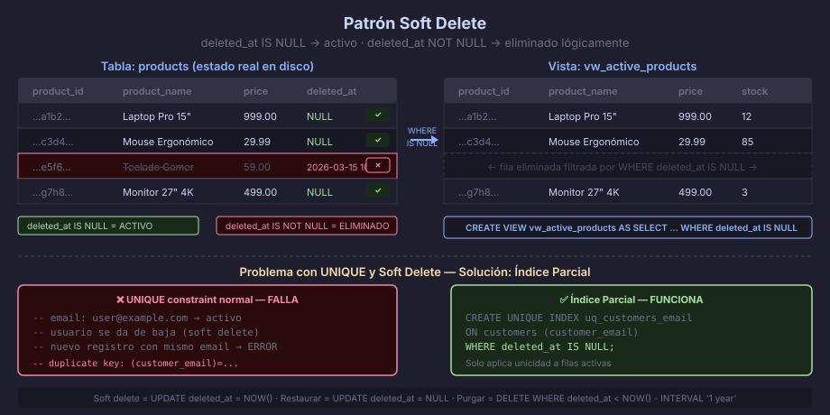

# Soft Delete — Eliminación Lógica

## ¿Qué es Soft Delete?

**Soft delete** (o eliminación lógica) es el patrón de marcar un registro
como eliminado en lugar de borrarlo físicamente de la base de datos.

En lugar de ejecutar:

```sql
DELETE FROM products WHERE product_id = '...';
```

Se ejecuta:

```sql
UPDATE products
   SET deleted_at = NOW()
 WHERE product_id = '...';
```

El registro permanece en la tabla, invisible para las consultas normales,
pero disponible para auditoría, restauración o reportes históricos.



---

## Implementación Básica

### Agregar la Columna

```sql
-- Agregar deleted_at a una tabla existente:
ALTER TABLE products
    ADD COLUMN deleted_at TIMESTAMPTZ DEFAULT NULL;

-- En una tabla nueva:
CREATE TABLE articles (
    article_id      UUID          NOT NULL DEFAULT gen_random_uuid(),
    article_title   VARCHAR(300)  NOT NULL,
    article_content TEXT          NOT NULL,
    is_published    BOOLEAN       NOT NULL DEFAULT FALSE,
    created_at      TIMESTAMPTZ   NOT NULL DEFAULT NOW(),
    updated_at      TIMESTAMPTZ   NOT NULL DEFAULT NOW(),
    deleted_at      TIMESTAMPTZ,  -- NULL = activo | NOT NULL = eliminado
    CONSTRAINT pk_articles PRIMARY KEY (article_id)
);
```

### Operaciones CRUD con Soft Delete

```sql
-- Soft delete (en lugar de DELETE):
UPDATE products
   SET deleted_at = NOW(),
       updated_at = NOW()
 WHERE product_id = '...uuid...'
   AND deleted_at IS NULL;

-- Restaurar un registro eliminado:
UPDATE products
   SET deleted_at = NULL,
       updated_at = NOW()
 WHERE product_id = '...uuid...';

-- Filtrar registros activos (patrón estándar):
SELECT * FROM products WHERE deleted_at IS NULL;

-- Ver solo registros eliminados:
SELECT * FROM products WHERE deleted_at IS NOT NULL;

-- Ver todos (incluyendo eliminados):
SELECT *, (deleted_at IS NOT NULL) AS is_deleted FROM products;
```

---

## Vista para Registros Activos

La forma más limpia de aplicar soft delete es encapsular el filtro
`deleted_at IS NULL` en una vista. El resto de la aplicación trabaja
con la vista sin necesidad de recordar el filtro:

```sql
-- Vista que solo expone registros activos:
CREATE OR REPLACE VIEW vw_active_products AS
SELECT
    product_id,
    product_name,
    product_price,
    product_stock,
    created_at,
    updated_at
FROM products
WHERE deleted_at IS NULL
WITH CHECK OPTION;  -- impide que un UPDATE a través de la vista reactive un eliminado
                    -- ya que restaurar requeriría pasar deleted_at = NULL,
                    -- lo cual viola el WHERE de la vista

-- Toda la aplicación usa vw_active_products:
SELECT * FROM vw_active_products WHERE product_price < 100;
```

---

## El Problema con `UNIQUE` y Soft Delete

Si una tabla tiene un constraint `UNIQUE (email)` y un usuario se da de baja
(soft delete), no se puede crear otra cuenta con el mismo email porque la
fila eliminada sigue ocupando el slot en el índice único.

La solución es un **índice parcial** que solo incluye filas activas:

```sql
-- ❌ Problema: este índice bloquea emails de usuarios eliminados
ALTER TABLE customers ADD CONSTRAINT uq_customers_email UNIQUE (customer_email);

-- ✅ Solución: índice parcial — solo filas con deleted_at IS NULL son únicas
DROP INDEX IF EXISTS uq_customers_email;

CREATE UNIQUE INDEX uq_customers_active_email
    ON customers (customer_email)
    WHERE deleted_at IS NULL;

-- Ahora es posible:
-- 1. Usuario activo: user@example.com → deleted_at IS NULL → único
-- 2. El mismo email puede existir en un registro eliminado (deleted_at NOT NULL)
-- 3. Y también en un nuevo usuario activo (deleted_at IS NULL) → serán distintos
```

---

## Purga Periódica (Archivado)

Los registros eliminados acumulan espacio. Una política habitual es
purgarlos después de un período de retención:

```sql
-- Borrar físicamente registros eliminados hace más de 1 año:
DELETE FROM products
WHERE deleted_at < NOW() - INTERVAL '1 year';

-- Alternativamente, mover a tabla de archivo antes de borrar:
INSERT INTO products_archive
    SELECT *, NOW() AS archived_at FROM products
    WHERE deleted_at < NOW() - INTERVAL '1 year';

DELETE FROM products
WHERE deleted_at < NOW() - INTERVAL '1 year';
```

---

## Cuándo NO Usar Soft Delete

| Tipo de tabla | Recomendación |
|--------------|---------------|
| Tablas de referencia (catálogos pequeños y estables) | Soft delete ✅ |
| Entidades de negocio (usuarios, productos, órdenes) | Soft delete ✅ |
| Logs, eventos, time-series | ❌ No — los logs no se "borran", se retienen por período |
| Tablas intermedias (N:M sin lógica) | ❌ No — borrado físico es más simple |
| Tablas con altísimo volumen y rotación (>10M rows/día) | ❌ No — el índice parcial se vuelve costoso |

---

## Trade-offs

| A favor | En contra |
|---------|-----------|
| Recuperación de datos accidental | La tabla crece sin límite |
| Trazabilidad y auditoría básica | Todas las queries deben filtrar `deleted_at IS NULL` |
| Cumplimiento regulatorio (GDPR: "derecho al olvido" requiere eventual purga) | JOINs a otras tablas pueden traer registros eliminados involuntariamente |
| Papelera de reciclaje para usuarios | Los indices únicos requieren estrategia especial (partial index) |

---

← [README](../README.md) | → [02 — Auditoría e Historia de Cambios](02-auditoria-historia.md)
