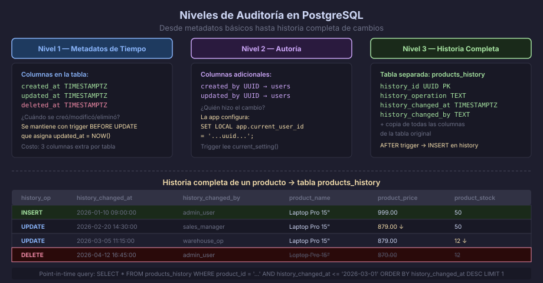

# Auditoría — Historia Completa de Cambios

## Los Tres Niveles de Auditoría

No todas las aplicaciones necesitan el mismo nivel de trazabilidad. Existen
tres niveles progresivos de implementación:

| Nivel | Implementación | Responde a |
|-------|---------------|------------|
| **1 — Metadatos de tiempo** | `created_at`, `updated_at`, `deleted_at` | ¿Cuándo se creó/modificó/eliminó? |
| **2 — Autoría** | `created_by`, `updated_by` | ¿Quién lo hizo? |
| **3 — Historia completa** | Tabla `*_history` con trigger | ¿Qué valor tenía antes? |



---

## Nivel 1 — Metadatos de Tiempo

El mínimo recomendado para cualquier tabla de entidades:

```sql
CREATE TABLE products (
    product_id    UUID          NOT NULL DEFAULT gen_random_uuid(),
    product_name  VARCHAR(200)  NOT NULL,
    product_price NUMERIC(10,2) NOT NULL,
    created_at    TIMESTAMPTZ   NOT NULL DEFAULT NOW(),
    updated_at    TIMESTAMPTZ   NOT NULL DEFAULT NOW(),
    deleted_at    TIMESTAMPTZ,
    CONSTRAINT pk_products PRIMARY KEY (product_id)
);

-- Trigger para mantener updated_at automáticamente:
CREATE OR REPLACE FUNCTION fn_trg_set_updated_at()
RETURNS TRIGGER
LANGUAGE plpgsql
AS $$
BEGIN
    NEW.updated_at := NOW();
    RETURN NEW;
END;
$$;

CREATE TRIGGER trg_products_updated_at
    BEFORE UPDATE ON products
    FOR EACH ROW
    EXECUTE FUNCTION fn_trg_set_updated_at();
```

---

## Nivel 2 — Autoría (Created By / Updated By)

Permite saber qué usuario de la aplicación realizó cada cambio. La clave
es distinguir entre el usuario de la BD (`current_user`) y el usuario
de la aplicación (pasado por la sesión):

```sql
ALTER TABLE products
    ADD COLUMN created_by  UUID,  -- FK a users.user_id
    ADD COLUMN updated_by  UUID;

-- La aplicación establece el usuario en la sesión antes de cada operación:
-- SET LOCAL app.current_user_id = '...uuid...';

-- El trigger lo lee automáticamente:
CREATE OR REPLACE FUNCTION fn_trg_set_audit_user()
RETURNS TRIGGER
LANGUAGE plpgsql
AS $$
DECLARE
    v_user_id UUID;
BEGIN
    -- Leer el UUID del usuario de la aplicación desde la configuración de sesión:
    BEGIN
        v_user_id := current_setting('app.current_user_id')::UUID;
    EXCEPTION WHEN OTHERS THEN
        v_user_id := NULL;  -- si no se configuró (ej: migraciones), no falla
    END;

    IF TG_OP = 'INSERT' THEN
        NEW.created_by := v_user_id;
        NEW.updated_by := v_user_id;
    ELSIF TG_OP = 'UPDATE' THEN
        NEW.updated_by := v_user_id;
    END IF;

    NEW.updated_at := NOW();
    RETURN NEW;
END;
$$;
```

---

## Nivel 3 — Tabla de Historial

La tabla de historial almacena una copia completa de cada versión anterior
de una fila. Es la solución más robusta y permite consultas de
*point-in-time*: "¿cómo estaba este producto el 15 de marzo a las 10:00?"

### Estructura de la Tabla de Historial

```sql
-- Tabla original:
CREATE TABLE products (
    product_id    UUID          NOT NULL DEFAULT gen_random_uuid(),
    product_name  VARCHAR(200)  NOT NULL,
    product_price NUMERIC(10,2) NOT NULL,
    product_stock INTEGER       NOT NULL DEFAULT 0,
    is_active     BOOLEAN       NOT NULL DEFAULT TRUE,
    created_at    TIMESTAMPTZ   NOT NULL DEFAULT NOW(),
    updated_at    TIMESTAMPTZ   NOT NULL DEFAULT NOW(),
    CONSTRAINT pk_products PRIMARY KEY (product_id)
);

-- Tabla de historial (mismas columnas + metadatos de historial):
CREATE TABLE products_history (
    -- Metadatos del historial:
    history_id          UUID        NOT NULL DEFAULT gen_random_uuid(),
    history_operation   TEXT        NOT NULL
        CHECK (history_operation IN ('INSERT', 'UPDATE', 'DELETE')),
    history_changed_at  TIMESTAMPTZ NOT NULL DEFAULT NOW(),
    history_changed_by  TEXT        NOT NULL DEFAULT current_user,

    -- Copia de todas las columnas de products:
    product_id    UUID,
    product_name  VARCHAR(200),
    product_price NUMERIC(10,2),
    product_stock INTEGER,
    is_active     BOOLEAN,
    created_at    TIMESTAMPTZ,
    updated_at    TIMESTAMPTZ,

    CONSTRAINT pk_products_history PRIMARY KEY (history_id)
);

-- Índice para consultas de historial por entidad y tiempo:
CREATE INDEX ix_products_history_product_id
    ON products_history (product_id, history_changed_at DESC);
```

### Trigger que Alimenta el Historial

```sql
CREATE OR REPLACE FUNCTION fn_trg_products_history()
RETURNS TRIGGER
LANGUAGE plpgsql
AS $$
DECLARE
    v_row products%ROWTYPE;  -- tipo de la tabla original
BEGIN
    -- En UPDATE y DELETE guardamos el estado ANTES del cambio (OLD):
    -- En INSERT guardamos el estado nuevo (NEW):
    IF TG_OP = 'DELETE' THEN
        v_row := OLD;
    ELSE
        v_row := NEW;
    END IF;

    INSERT INTO products_history (
        history_operation,
        product_id, product_name, product_price,
        product_stock, is_active, created_at, updated_at
    ) VALUES (
        TG_OP,
        v_row.product_id, v_row.product_name, v_row.product_price,
        v_row.product_stock, v_row.is_active, v_row.created_at, v_row.updated_at
    );

    RETURN NEW;
END;
$$;

CREATE TRIGGER trg_products_history
    AFTER INSERT OR UPDATE OR DELETE
    ON products
    FOR EACH ROW
    EXECUTE FUNCTION fn_trg_products_history();
```

---

## Consultas de Point-in-Time

```sql
-- ¿Cómo estaba el producto en un momento específico del pasado?
SELECT *
FROM products_history
WHERE product_id     = '...uuid...'
  AND history_changed_at <= '2026-03-15 10:00:00+00'
ORDER BY history_changed_at DESC
LIMIT 1;

-- Timeline completo de cambios de un producto:
SELECT
    history_operation,
    history_changed_at,
    history_changed_by,
    product_price,
    product_stock,
    is_active
FROM products_history
WHERE product_id = '...uuid...'
ORDER BY history_changed_at;

-- ¿Qué cambió entre la versión anterior y la actual?
-- (usando LAG para comparar con la fila anterior)
SELECT
    history_changed_at,
    product_price,
    LAG(product_price) OVER (
        PARTITION BY product_id ORDER BY history_changed_at
    ) AS previous_price,
    product_price - LAG(product_price) OVER (
        PARTITION BY product_id ORDER BY history_changed_at
    ) AS price_change
FROM products_history
WHERE product_id = '...uuid...'
ORDER BY history_changed_at;
```

---

## Diferencia: Tabla de Historial vs `audit_log` Genérico

| | Tabla de Historial (`products_history`) | `audit_log` genérico (Semana 12) |
|---|---|---|
| Estructura | Columnas tipadas de la tabla original | Columnas JSONB (old_data / new_data) |
| Consultas | SQL directo sobre columnas (`WHERE product_price > 100`) | Requiere operadores JSONB (`->`, `->>`) |
| Rendimiento de lectura | Alto — índices normales funcionan | Menor — JSONB es flexible pero más lento |
| Mantenimiento | Requiere actualizar la tabla de historial si cambia el schema | Genérico — funciona sin cambios |
| Complejidad del trigger | Más código (columna por columna) | Más simple (`row_to_json(OLD)`) |
| Caso de uso ideal | Entidades críticas con historial consultable | Auditoría rápida y genérica de muchas tablas |

La recomendación práctica: usar `audit_log` genérico como base y agregar
tablas de historial tipadas solo para las entidades de mayor valor de negocio.

---

← [01 — Soft Delete](01-soft-delete.md) | → [03 — Jerarquías y Multi-Tenancy](03-jerarquias-multi-tenancy.md)
