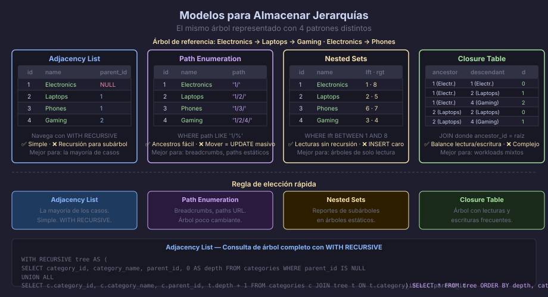
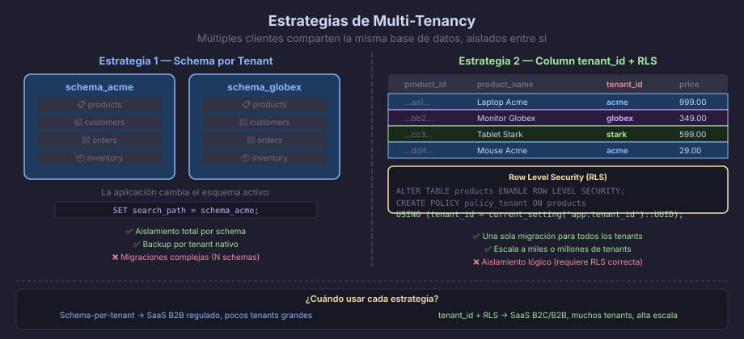

# Jerarquías y Multi-Tenancy

## Almacenar Estructuras en Árbol

Las jerarquías aparecen en casi todos los sistemas: categorías de productos,
organigramas, comentarios anidados, sistemas de archivos, menús de navegación.
En una base de datos relacional, hay cuatro patrones clásicos para modelarlas.



---

## Patrón 1 — Adjacency List (Lista de Adyacencia)

Cada nodo almacena una referencia a su padre directo. Es el modelo más
simple y el más común en la práctica:

```sql
CREATE TABLE categories (
    category_id   UUID        NOT NULL DEFAULT gen_random_uuid(),
    parent_id     UUID,       -- NULL = nodo raíz
    category_name VARCHAR(80) NOT NULL,
    CONSTRAINT pk_categories          PRIMARY KEY (category_id),
    CONSTRAINT fk_categories_parent   FOREIGN KEY (parent_id)
        REFERENCES categories (category_id) ON DELETE RESTRICT
);

-- Datos de ejemplo:
-- id=1 (Electrónicos, parent=NULL)
-- id=2 (Laptops,      parent=1)
-- id=3 (Celulares,    parent=1)
-- id=4 (Gaming,       parent=2)
```

### Consultar con Recursión (`WITH RECURSIVE`)

```sql
-- Obtener toda la rama de "Electrónicos" (id='...') y sus descendientes:
WITH RECURSIVE category_tree AS (
    -- Caso base: el nodo raíz de la búsqueda
    SELECT
        category_id,
        parent_id,
        category_name,
        0               AS depth,
        category_name   AS path
    FROM categories
    WHERE category_id = '...uuid_electronica...'

    UNION ALL

    -- Caso recursivo: hijos del nodo actual
    SELECT
        c.category_id,
        c.parent_id,
        c.category_name,
        ct.depth + 1,
        ct.path || ' → ' || c.category_name
    FROM categories     AS c
    JOIN category_tree  AS ct ON ct.category_id = c.parent_id
)
SELECT * FROM category_tree ORDER BY depth, category_name;

-- Resultado:
-- depth=0  Electrónicos
-- depth=1  Celulares      path: Electrónicos → Celulares
-- depth=1  Laptops        path: Electrónicos → Laptops
-- depth=2  Gaming         path: Electrónicos → Laptops → Gaming
```

**Pros:** simple, fácil de entender, fácil de mover nodos  
**Contras:** requiere CTE recursiva para queries de árbol completo

---

## Patrón 2 — Path Enumeration (Enumeración de Rutas)

Cada nodo almacena su ruta completa como texto:

```sql
ALTER TABLE categories ADD COLUMN category_path TEXT;

-- Datos:
-- 'Electronics'           → path: '1/'
-- 'Laptops'               → path: '1/2/'
-- 'Gaming'                → path: '1/2/4/'
-- 'Celulares'             → path: '1/3/'

-- Todos los descendientes de Electrónicos (path empieza con '1/'):
SELECT * FROM categories WHERE category_path LIKE '1/%';

-- Todos los ancestros de Gaming (path '1/2/4/'):
SELECT * FROM categories
WHERE '1/2/4/' LIKE category_path || '%'
ORDER BY length(category_path);
```

**Pros:** consultas de ancestros/descendientes sin recursión  
**Contras:** mover un nodo requiere actualizar el path de todos los descendientes

---

## Patrón 3 — Nested Sets (Conjuntos Anidados)

Cada nodo tiene dos enteros `lft` y `rgt` que representan el árbol como
rangos anidados. El árbol se numera en preorder (izquierda → derecha):

```sql
ALTER TABLE categories
    ADD COLUMN cat_lft INTEGER NOT NULL DEFAULT 0,
    ADD COLUMN cat_rgt INTEGER NOT NULL DEFAULT 0;

-- Electrónicos: lft=1, rgt=8
--   Laptops:    lft=2, rgt=5
--     Gaming:   lft=3, rgt=4
--   Celulares:  lft=6, rgt=7

-- Todos los descendientes de Electrónicos (lft entre 1 y 8):
SELECT c.*
FROM categories AS c, categories AS parent
WHERE parent.category_name = 'Electrónicos'
  AND c.cat_lft BETWEEN parent.cat_lft AND parent.cat_rgt
ORDER BY c.cat_lft;

-- Contar el nivel de profundidad de un nodo:
SELECT c.category_name, COUNT(parent.category_id) - 1 AS depth
FROM categories AS c
JOIN categories AS parent
  ON c.cat_lft BETWEEN parent.cat_lft AND parent.cat_rgt
GROUP BY c.category_id, c.category_name;
```

**Pros:** consultas de subárboles completos sin recursión  
**Contras:** insertar o mover nodos requiere renumerar toda la tabla

---

## Patrón 4 — Closure Table (Tabla de Cierre)

Una tabla auxiliar almacena todos los pares ancestro-descendiente,
incluyendo relaciones no directas:

```sql
-- Tabla principal (solo datos del nodo):
CREATE TABLE categories (
    category_id   UUID PRIMARY KEY DEFAULT gen_random_uuid(),
    category_name VARCHAR(80) NOT NULL
);

-- Tabla de cierre (todas las relaciones del árbol):
CREATE TABLE category_paths (
    ancestor_id   UUID    NOT NULL REFERENCES categories (category_id),
    descendant_id UUID    NOT NULL REFERENCES categories (category_id),
    path_depth    INTEGER NOT NULL DEFAULT 0,
    CONSTRAINT pk_category_paths PRIMARY KEY (ancestor_id, descendant_id)
);

-- Para el árbol: Electrónicos(1) → Laptops(2) → Gaming(4)
-- category_paths contendría:
-- (1,1,0) — Electrónicos es ancestro de sí mismo
-- (1,2,1) — Electrónicos → Laptops (depth 1)
-- (1,4,2) — Electrónicos → Gaming  (depth 2)
-- (2,2,0) — Laptops es ancestro de sí mismo
-- (2,4,1) — Laptops → Gaming

-- Todos los descendientes directos de Electrónicos:
SELECT c.*
FROM categories    AS c
JOIN category_paths AS cp ON cp.descendant_id = c.category_id
WHERE cp.ancestor_id = '...uuid_electronica...'
  AND cp.path_depth  = 1;

-- Todos los ancestros de Gaming:
SELECT c.*
FROM categories    AS c
JOIN category_paths AS cp ON cp.ancestor_id = c.category_id
WHERE cp.descendant_id = '...uuid_gaming...'
ORDER BY cp.path_depth DESC;
```

**Pros:** excelente balance lectura/escritura, no requiere recursión  
**Contras:** más complejo de mantener (insertar un nodo requiere insertar N filas en la tabla de cierre)

---

## Resumen Comparativo de Modelos de Árbol

| Modelo | INSERT nodo | Mover nodo | Subárbol completo | Complejidad código |
|--------|------------|------------|-------------------|-------------------|
| Adjacency List | Simple | Simple | CTE recursiva | Baja |
| Path Enumeration | Simple | Caro (UPDATE masivo) | `LIKE` sencillo | Media |
| Nested Sets | Caro (renumerar) | Muy caro | Sin recursión | Alta |
| Closure Table | Media (N inserts) | Media | Sin recursión | Media-alta |

**Regla práctica:** para la mayoría de aplicaciones, **Adjacency List** con
`WITH RECURSIVE` es suficiente. Usar Closure Table cuando las queries de
árbol completo son frecuentes y el árbol cambia con regularidad.

---

## Multi-Tenancy

**Multi-tenancy** es la arquitectura donde múltiples clientes (`tenants`)
comparten la misma instalación de la base de datos, aislados entre sí.



### Estrategia 1 — Schema por Tenant

Cada tenant tiene su propio esquema PostgreSQL con las mismas tablas:

```sql
-- Crear esquema por tenant:
CREATE SCHEMA tenant_acme;
CREATE SCHEMA tenant_globex;

-- Las tablas se crean dentro del esquema:
CREATE TABLE tenant_acme.products ( ... );
CREATE TABLE tenant_globex.products ( ... );

-- La aplicación enruta al esquema correcto:
SET search_path = tenant_acme;
SELECT * FROM products;  -- solo ve productos de Acme
```

**Cuándo usar:** tenants con datos muy sensibles (banca, salud), tenants
con volumetría diferente, necesidad de backups aislados por tenant.

### Estrategia 2 — Columna `tenant_id` con Row Level Security

Todas las entidades comparten tablas y tienen una columna `tenant_id`:

```sql
-- Agregar tenant_id a todas las tablas del sistema:
CREATE TABLE products (
    product_id  UUID NOT NULL DEFAULT gen_random_uuid(),
    tenant_id   UUID NOT NULL,               -- ← discriminador de tenant
    product_name VARCHAR(200) NOT NULL,
    product_price NUMERIC(10,2) NOT NULL,
    CONSTRAINT pk_products   PRIMARY KEY (product_id),
    CONSTRAINT fk_products_tenant FOREIGN KEY (tenant_id)
        REFERENCES tenants (tenant_id)
);

-- Índice para que cada query de tenant sea eficiente:
CREATE INDEX ix_products_tenant_id ON products (tenant_id);

-- Row Level Security: PostgreSQL filtra automáticamente por tenant_id
ALTER TABLE products ENABLE ROW LEVEL SECURITY;

CREATE POLICY policy_products_tenant
    ON products
    USING (tenant_id = current_setting('app.tenant_id')::UUID);

-- La aplicación configura el tenant antes de cada query:
-- SET LOCAL app.tenant_id = '...uuid_tenant...';
SELECT * FROM products;  -- automáticamente solo ve sus productos
```

---

## Resumen Comparativo de Estrategias Multi-Tenancy

| | Schema por Tenant | Column `tenant_id` + RLS |
|---|---|---|
| Aislamiento | Total (schemas separados) | Lógico (RLS, un bug puede filtrar datos) |
| Migraciones | Compleja (N schemas = N migrations) | Simple (una sola migración) |
| Backup por tenant | Nativo (`pg_dump schema`) | Complejo (filtrar por tenant_id) |
| Escala de tenants | Cientos (máximo ~1000 schemas) | Miles o millones de tenants |
| Caso de uso | SaaS B2B con grandes cuentas, regulado | SaaS B2C o B2B con muchas cuentas pequeñas |

---

← [02 — Auditoría e Historia de Cambios](02-auditoria-historia.md) | → [README](../README.md)
