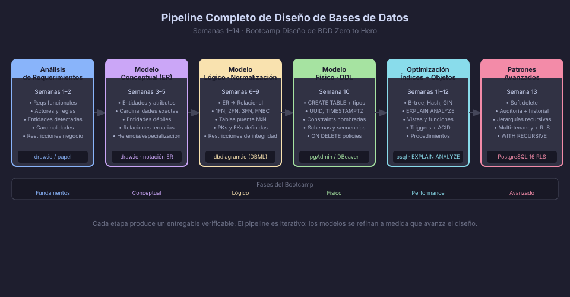

# Revisión Integral — Del Análisis al Modelo Físico

Esta semana no introduce conceptos nuevos. Su propósito es consolidar
el **pipeline completo de diseño** recorrido durante las 13 semanas anteriores,
conectar cada etapa con las herramientas que usarás en el proyecto final
y mostrar cómo todas las piezas encajan en un sistema de producción real.



---

## Etapa 1 — Análisis de Requerimientos (Semanas 1-2)

El diseño empieza antes de escribir una sola línea de SQL. Las preguntas
que debes responder son:

- **¿Qué entidades** existen en el dominio del negocio?
- **¿Qué hacen** esas entidades y **cómo se relacionan** entre sí?
- **¿Cuáles son las reglas de negocio** que el modelo debe respetar?

### Técnica: Extracción de entidades desde prosa

Lee el enunciado y subraya:

- **Sustantivos** → posibles entidades o atributos
- **Verbos** → posibles relaciones
- **Números y restricciones** → posibles constraints (`NOT NULL`, `CHECK`, cardinalidades)

**Ejemplo:**

> _"Un cliente puede realizar múltiples pedidos. Cada pedido contiene al menos un
> producto. Un producto pertenece a exactamente una categoría."_

Extracción:
- Entidades: `customers`, `orders`, `products`, `categories`
- Relaciones: `customer` 1:N `orders`, `orders` M:N `products`, `products` N:1 `categories`
- Regla: "al menos un producto" → no puede existir un pedido vacío (`order_items` mínimo 1)

---

## Etapa 2 — Modelo Conceptual ER (Semanas 3-5)

Traduce los requerimientos a un **diagrama Entidad-Relación** (notación Chen o
Crow's Foot) con:

- **Entidades** y sus atributos (identificador, simples, derivados, multivaluados)
- **Relaciones** con cardinalidad exacta (1:1, 1:N, M:N)
- **Relaciones especiales**: ternarias, reflexivas, entidades débiles
- **Especialización/Generalización** (herencia de entidades)

### Checklist del modelo conceptual

- [ ] Toda entidad tiene un atributo identificador
- [ ] Las cardinalidades mínima y máxima están documentadas
- [ ] Las entidades débiles tienen su relación identificadora marcada
- [ ] No hay atributos multivaluados sin resolver (se modelan como entidades)
- [ ] Las relaciones M:N están todas identificadas (se materializarán como tablas puente)

---

## Etapa 3 — Modelo Lógico: Transformación y Normalización (Semanas 6-9)

Aplica las reglas de transformación ER → Relacional y normaliza hasta 3FN:

### Reglas de transformación clave

| Situación en ER | Resultado en modelo relacional |
|----------------|-------------------------------|
| Entidad fuerte | Tabla con PK |
| Relación 1:N | FK en el lado N |
| Relación M:N | Tabla puente con FK a ambos extremos |
| Relación 1:1 | FK en cualquiera de los dos lados (o tabla unificada) |
| Entidad débil | Tabla con FK a entidad fuerte, PK compuesta |
| Herencia (total/exclusiva) | Una tabla con discriminador, o una tabla por subtipo |
| Atributo multivaluado | Tabla separada con FK a la entidad propietaria |

### Verificación de normalización

```
1FN: ✅ Todos los atributos son atómicos (sin grupos repetitivos, sin listas)
2FN: ✅ Todos los atributos dependen de la PK completa (no de una parte de ella)
3FN: ✅ Todos los atributos dependen directamente de la PK (sin dependencias transitivas)
FNBC: ✅ Todo determinante es una clave candidata
```

---

## Etapa 4 — Modelo Físico: DDL en PostgreSQL (Semana 10)

Traduce el modelo lógico a SQL siguiendo las convenciones del bootcamp:

```sql
-- Estructura de una tabla bien diseñada:
CREATE TABLE order_items (
    -- PK: UUID auto-generado, nombre auto-documentado
    order_item_id       UUID            NOT NULL DEFAULT gen_random_uuid(),
    -- FKs: nombre incluye la entidad referenciada
    order_id            UUID            NOT NULL,
    product_id          UUID            NOT NULL,
    -- Atributos con prefijo de entidad
    order_item_quantity SMALLINT        NOT NULL CHECK (order_item_quantity > 0),
    order_item_price    NUMERIC(10, 2)  NOT NULL CHECK (order_item_price >= 0),
    -- Metadatos de auditoría (sin prefijo por convención)
    created_at          TIMESTAMPTZ     NOT NULL DEFAULT NOW(),
    -- Constraints con nombres explícitos
    CONSTRAINT pk_order_items          PRIMARY KEY (order_item_id),
    CONSTRAINT fk_order_items_order_id FOREIGN KEY (order_id)
        REFERENCES orders (order_id) ON DELETE CASCADE,
    CONSTRAINT fk_order_items_product_id FOREIGN KEY (product_id)
        REFERENCES products (product_id) ON DELETE RESTRICT
);
```

### Tipos de datos PostgreSQL 16 — decisiones clave

| Decisión | Opción correcta | Opción a evitar |
|----------|----------------|-----------------|
| Clave primaria | `UUID DEFAULT gen_random_uuid()` | `SERIAL`, `INT` |
| Fecha y hora | `TIMESTAMPTZ` | `TIMESTAMP` (sin zona) |
| Dinero / precisión | `NUMERIC(p, s)` | `FLOAT`, `REAL` |
| Texto sin límite fijo | `TEXT` | `VARCHAR(10000)` |
| Flags / estados binarios | `BOOLEAN` | `CHAR(1)`, `SMALLINT` |
| JSON estructurado | `JSONB` | `JSON`, `TEXT` |

---

## Etapa 5 — Optimización: Índices y Planes de Ejecución (Semana 11)

Un buen diseño físico incluye siempre una estrategia de indexación:

```sql
-- Regla 1: Indexar siempre las columnas FK
CREATE INDEX ix_order_items_order_id   ON order_items (order_id);
CREATE INDEX ix_order_items_product_id ON order_items (product_id);

-- Regla 2: Indexar columnas usadas en WHERE frecuente
CREATE INDEX ix_orders_created_at ON orders (created_at);

-- Regla 3: Índice compuesto cuando el WHERE siempre filtra por N columnas
CREATE INDEX ix_orders_customer_status ON orders (customer_id, order_status);

-- Regla 4: Índice parcial cuando solo una fracción de filas es relevante
CREATE INDEX ix_orders_pending ON orders (created_at) WHERE order_status = 'pending';
```

Verifica con `EXPLAIN ANALYZE` antes de asumir que un índice es necesario:

```sql
-- Antes de agregar un índice, mide:
EXPLAIN ANALYZE
SELECT * FROM orders WHERE customer_id = '...' AND order_status = 'pending';
-- Si ves "Seq Scan" en una tabla grande → el índice sería útil
-- Si ves "Index Scan" → ya hay un índice funcionando
```

---

## Etapa 6 — Objetos Avanzados y Patrones (Semanas 12-13)

El modelo físico se completa con:

| Objeto | Cuándo usarlo |
|--------|--------------|
| **Vista** | Simplificar queries complejas; aplicar filtros permanentes (soft delete) |
| **Vista materializada** | Queries analíticas costosas que se ejecutan frecuentemente |
| **Función** | Lógica de negocio reutilizable (calcular totales, formatear datos) |
| **Procedimiento** | Operaciones transaccionales multi-paso (crear orden + descontar stock) |
| **Trigger** | Automatizar acciones reactivas (actualizar `updated_at`, registrar historial) |
| **Soft delete** | Cuando los registros eliminados deben conservarse (trazabilidad, normativa) |
| **Auditoría** | Cuando se requiere saber quién cambió qué y cuándo |
| **Jerarquía** | Categorías anidadas, organigramas, menús recursivos |
| **Multi-tenancy + RLS** | Plataformas SaaS con múltiples clientes compartiendo la misma BD |

---

## El Ciclo Completo — Ejemplo Mínimo

Para consolidar el pipeline, aquí está el ciclo completo para una entidad `products`:

```
Requerimiento → "Cada producto tiene nombre, precio y pertenece a una categoría"
         ↓
ER Conceptual → Entidad PRODUCT con atributos: product_id (PK), name, price
               Relación M:1 BELONGS_TO → CATEGORY
         ↓
Modelo Lógico → Tabla products(product_id, category_id FK, name, price)
               Verificación 3FN: price depende de product_id (no hay transitividad)
         ↓
DDL Físico → CREATE TABLE products (
                product_id UUID PK, category_id UUID FK,
                product_name VARCHAR(200), product_price NUMERIC(10,2),
                deleted_at TIMESTAMPTZ  ← soft delete
             );
         ↓
Índices → CREATE INDEX ix_products_category_id ON products(category_id);
          CREATE INDEX ix_products_active ON products(product_name)
              WHERE deleted_at IS NULL;
         ↓
Objetos → CREATE VIEW vw_active_products AS SELECT ... WHERE deleted_at IS NULL;
          CREATE TRIGGER trg_products_history AFTER INSERT OR UPDATE OR DELETE ...
```

---

→ [02 — Checklist de Calidad](02-checklist-calidad.md)
