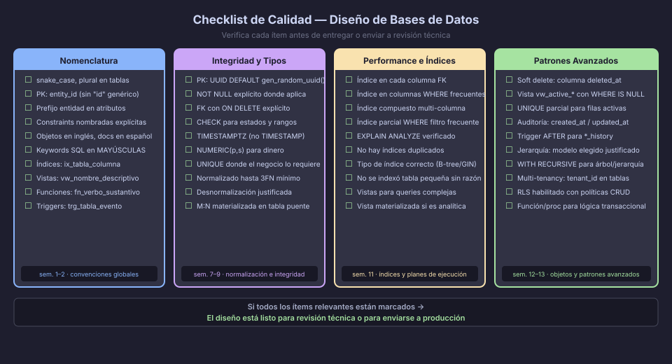

# Checklist de Calidad para Diseño de Bases de Datos

Antes de entregar cualquier diseño de base de datos, recorre este checklist
sistemáticamente. Un diseño que supera todos los puntos está listo para
revisión de pares o para ser enviado a producción.



---

## Categoría 1 — Nomenclatura y Convenciones

Estas reglas hacen que el esquema sea legible por cualquier miembro del equipo,
hoy y en dos años.

```
□ Tablas en snake_case, plural: users, order_items, product_categories
□ PKs auto-documentadas: user_id, product_id, order_id (NUNCA solo "id")
□ Atributos con prefijo de entidad: user_name, product_price, order_status
□ Excepciones permitidas (sin prefijo): created_at, updated_at, deleted_at
□ Constraints nombradas explícitamente:
    pk_tabla, fk_tabla_columna, uq_tabla_columna, ck_tabla_columna, ix_tabla_columna
□ Objetos de BD en inglés (tablas, columnas, funciones, triggers, índices)
□ Comentarios SQL educativos en español
□ Keywords SQL en MAYÚSCULAS; identificadores en minúsculas
```

**Anti-patrón frecuente:**

```sql
-- ❌ id genérico, nombres ambiguos, constraint sin nombre
CREATE TABLE clientes (
    id       INT PRIMARY KEY,
    nombre   VARCHAR(100) NOT NULL,
    email    VARCHAR(150) UNIQUE,
    fk_cat   INT REFERENCES categorias(id)
);

-- ✅ UUID auto-documentado, prefijos, constraints nombradas
CREATE TABLE customers (
    customer_id     UUID        NOT NULL DEFAULT gen_random_uuid(),
    customer_name   VARCHAR(100) NOT NULL,
    customer_email  VARCHAR(150) NOT NULL,
    category_id     UUID        NOT NULL,
    CONSTRAINT pk_customers              PRIMARY KEY (customer_id),
    CONSTRAINT uq_customers_email        UNIQUE (customer_email),
    CONSTRAINT fk_customers_category_id  FOREIGN KEY (category_id)
        REFERENCES categories (category_id) ON DELETE RESTRICT
);
```

---

## Categoría 2 — Modelo Conceptual (ER)

```
□ Toda entidad tiene exactamente un atributo identificador
□ Las cardinalidades (min, max) están documentadas para cada relación
□ Las relaciones M:N están todas identificadas
□ Los atributos multivaluados están modelados como entidades separadas
□ Las entidades débiles tienen su relación identificadora marcada
□ Las relaciones reflexivas (autor-supervisor, categoría-subcategoría) están presentes
□ La herencia (si aplica) define si es total/parcial y exclusiva/superpuesta
□ El modelo es coherente con todos los requerimientos funcionales listados
```

---

## Categoría 3 — Normalización y Modelo Lógico

```
□ 1FN: No hay grupos repetitivos ni atributos que almacenen listas
□ 1FN: No hay columnas calculadas almacenadas que dependan de otras columnas
□ 2FN: En tablas con PK compuesta, cada atributo depende de la PK COMPLETA
□ 3FN: No hay dependencias transitivas (A → B → C donde A es la PK)
□ FNBC (si aplica): Cada determinante es una clave candidata
□ Toda relación M:N del ER se materializó como tabla puente en el modelo lógico
□ Los atributos de relaciones M:N con datos propios están en la tabla puente
□ El modelo lógico refleja exactamente el modelo conceptual (sin entidades perdidas)
```

**Ejemplo de violación 3FN:**

```sql
-- ❌ order_city depende de customer_id, no de order_id (transitiva)
CREATE TABLE orders (
    order_id    UUID PRIMARY KEY,
    customer_id UUID,
    order_city  TEXT,   -- depende del customer, no del order → violación 3FN
    order_total NUMERIC
);

-- ✅ order_city va en la tabla customers
CREATE TABLE customers (
    customer_id   UUID PRIMARY KEY,
    customer_city TEXT   -- depende directamente del customer
);
CREATE TABLE orders (
    order_id    UUID PRIMARY KEY,
    customer_id UUID REFERENCES customers(customer_id),
    order_total NUMERIC
);
```

---

## Categoría 4 — Integridad en el DDL

```
□ Toda PK está declarada como PRIMARY KEY
□ Toda columna que no puede ser nula tiene NOT NULL explícito
□ Todas las FKs tienen política ON DELETE explícita (CASCADE, RESTRICT, SET NULL)
□ Las FKs reflexivas (parent_id) usan ON DELETE RESTRICT para evitar borrado en cascada
□ Las columnas de estado/tipo tienen constraint CHECK con los valores permitidos
□ Las columnas de precio/cantidad tienen CHECK (valor > 0 o >= 0 según el caso)
□ Los emails y slugs únicos tienen UNIQUE constraint o índice único
□ Los UUIDs usan DEFAULT gen_random_uuid() y no dependen de la aplicación
□ Las columnas de fecha/hora usan TIMESTAMPTZ (con zona horaria)
□ Las columnas de dinero usan NUMERIC(p, s), no FLOAT ni REAL
```

---

## Categoría 5 — Índices y Performance

```
□ Toda columna FK tiene un índice (ix_tabla_columna)
□ Las columnas usadas en WHERE frecuente tienen índice
□ Las columnas en ORDER BY de queries frecuentes tienen índice
□ Se usaron índices compuestos cuando el WHERE siempre filtra por N columnas juntas
□ Los índices UNIQUE de soft delete usan filtro parcial WHERE deleted_at IS NULL
□ No hay índices duplicados (mismo orden de columnas = mismo índice)
□ Se verificó con EXPLAIN ANALYZE que los índices son usados en queries reales
□ No se indexó excesivamente tablas pequeñas (< 10.000 filas raramente necesitan índices)
```

---

## Categoría 6 — Patrones Avanzados (cuando aplican)

```
Soft Delete:
□ Tablas con borrado reversible tienen columna deleted_at TIMESTAMPTZ
□ Existe vista vw_active_* que filtra WHERE deleted_at IS NULL
□ Los índices UNIQUE usan filtro parcial para solo filas activas

Auditoría:
□ Tablas de entidad tienen created_at, updated_at (mínimo nivel 1)
□ Si se requiere autoría: created_by, updated_by FK → users
□ Si se requiere historial: tabla *_history con trigger AFTER

Jerarquías:
□ Se eligió el modelo correcto para el caso de uso (ver tabla comparativa semana 13)
□ Las auto-referencias (parent_id) tienen ON DELETE RESTRICT

Multi-tenancy:
□ Todas las tablas tienen tenant_id UUID NOT NULL
□ RLS está habilitado en tablas con datos de tenant
□ Las políticas RLS cubren SELECT, INSERT, UPDATE y DELETE
```

---

## Categoría 7 — Documentación y Entregables

```
□ El script DDL es idempotente (DROP SCHEMA IF EXISTS o CREATE IF NOT EXISTS)
□ Los comentarios SQL explican el "por qué" de las decisiones no obvias
□ Las decisiones de desnormalización (si las hay) están justificadas en comentarios
□ El modelo DBML en dbdiagram.io es coherente con el DDL implementado
□ El diagrama ER es coherente con el modelo lógico
□ Las consultas de demostración cubren los casos de uso principales
□ Los datos de prueba son suficientes para validar las constraints
```

---

## Resumen — Los 10 Errores Más Comunes

| # | Error | Corrección |
|---|-------|-----------|
| 1 | Usar `id INT` como PK | Usar `entity_id UUID DEFAULT gen_random_uuid()` |
| 2 | Omitir `NOT NULL` | Declararlo explícito en cada columna que lo requiere |
| 3 | FK sin `ON DELETE` | Siempre declarar `ON DELETE CASCADE / RESTRICT / SET NULL` |
| 4 | `TIMESTAMP` en vez de `TIMESTAMPTZ` | `TIMESTAMPTZ` evita bugs de zona horaria en producción |
| 5 | `FLOAT` para dinero | `NUMERIC(10,2)` para precisión exacta |
| 6 | No indexar FKs | `CREATE INDEX ix_tabla_col_id ON tabla(col_id)` |
| 7 | Constraints sin nombre | `CONSTRAINT pk_tabla PRIMARY KEY (...)` |
| 8 | `DELETE` físico en vez de soft delete | `UPDATE SET deleted_at = NOW()` |
| 9 | Dependencias transitivas sin resolver | Normalizar a 3FN antes de escribir DDL |
| 10 | Relación M:N sin tabla puente | Materializar como tabla puente con dos FKs |

---

← [01 — Revisión Integral](01-revision-integral.md) | → [03 — Presentación de Diseños](03-presentacion-disenos.md)
