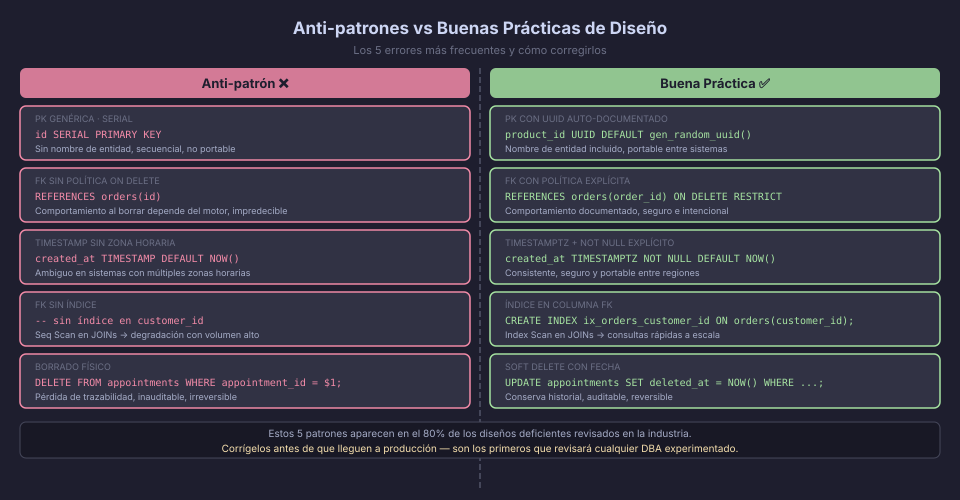

# Cómo Documentar y Presentar un Diseño Técnico de Base de Datos

Diseñar una base de datos correcta es solo la mitad del trabajo. El diseño
debe poder ser **comunicado, revisado y mantenido** por otras personas. Esta
sección explica cómo documentar un diseño para que sea comprensible y cómo
presentar las decisiones técnicas de forma profesional.



---

## Qué Debe Incluir un Documento de Diseño

Un documento de diseño de base de datos profesional tiene estas secciones:

### 1. Contexto del Sistema

Responde: ¿Qué problema resuelve este sistema? ¿Quiénes son los actores?
¿Cuál es el volumen estimado de datos?

```markdown
## Contexto

MediSync es un sistema de gestión hospitalaria para clínicas de mediana escala
(hasta 500 camas). Gestiona pacientes, médicos, citas, historiales médicos
y prescripciones. Volumen estimado: 1.000 pacientes/mes, 10.000 consultas/mes.
```

### 2. Requerimientos Funcionales

Lista los casos de uso que el modelo debe soportar. Sé específico:

```markdown
## Requerimientos Funcionales

RF-01: Un paciente puede tener múltiples consultas. Cada consulta pertenece
       a un médico y genera exactamente un historial médico.
RF-02: Un médico pertenece a un departamento. Los departamentos tienen
       jerarquía (Medicina Interna → Cardiología → Cardiopatía Congénita).
RF-03: Las prescripciones no se borran físicamente: se cancelan con fecha.
RF-04: Todo cambio en un historial médico queda registrado con autor y fecha.
```

### 3. Diagrama ER (Modelo Conceptual)

Incluye el diagrama como imagen referenciada. Explica brevemente las decisiones
no obvias del modelo:

```markdown
## Modelo Conceptual


Decisiones de diseño:
- La relación CONSULTA es ternaria (médico + paciente + turno) porque una
  cita no existe sin los tres participantes.
- HISTORIAL_MEDICO es entidad débil de CONSULTA: no puede existir sin ella.
```

### 4. Modelo Lógico (DBML)

Presenta el modelo relacional con tipos de datos y relaciones. El link a
dbdiagram.io permite que otros exploren el diagrama interactivo:

```markdown
## Modelo Lógico

Ver diagrama interactivo en dbdiagram.io: [link al proyecto]

Decisiones de normalización:
- `appointment_notes` se separó en `medical_records` para cumplir 3FN:
  los notas del médico dependen del historial, no de la cita en sí.
- `drug_name` se normalizó en tabla `drugs` para evitar redundancia entre
  prescripciones que usan el mismo medicamento.
```

### 5. Modelo Físico (DDL)

El script SQL comentado es el entregable central. Los comentarios explican
el "por qué":

```sql
-- ============================================================
-- TABLA: appointments
-- Registra cada consulta entre un médico y un paciente.
-- Soft delete: las citas canceladas conservan el registro para auditoría.
-- ============================================================
CREATE TABLE appointments (
    appointment_id      UUID        NOT NULL DEFAULT gen_random_uuid(),
    patient_id          UUID        NOT NULL,
    doctor_id           UUID        NOT NULL,
    appointment_date    TIMESTAMPTZ NOT NULL,
    -- Decisión: 'scheduled', 'completed', 'cancelled' son los únicos estados válidos.
    -- No usamos ENUM de PostgreSQL para facilitar futuros estados sin migración DDL.
    appointment_status  VARCHAR(20) NOT NULL DEFAULT 'scheduled'
                        CHECK (appointment_status IN ('scheduled','completed','cancelled')),
    -- Soft delete: cancelled_at en vez de deleted_at porque el concepto
    -- de "cancelación" tiene significado de negocio propio.
    cancelled_at        TIMESTAMPTZ,
    created_at          TIMESTAMPTZ NOT NULL DEFAULT NOW(),
    updated_at          TIMESTAMPTZ NOT NULL DEFAULT NOW(),
    CONSTRAINT pk_appointments          PRIMARY KEY (appointment_id),
    CONSTRAINT fk_appointments_patient  FOREIGN KEY (patient_id)
        REFERENCES patients (patient_id) ON DELETE RESTRICT,
    CONSTRAINT fk_appointments_doctor   FOREIGN KEY (doctor_id)
        REFERENCES doctors (doctor_id) ON DELETE RESTRICT
);
```

### 6. Estrategia de Indexación

Documenta cada índice con su justificación:

```sql
-- Índice para buscar citas por médico (query más frecuente en la app)
-- Query: SELECT * FROM appointments WHERE doctor_id = $1 AND appointment_date > NOW()
CREATE INDEX ix_appointments_doctor_date ON appointments (doctor_id, appointment_date);

-- Índice parcial para citas pendientes (el 90% de las queries filtra por 'scheduled')
-- Solo indexa las filas activas; reduce tamaño del índice ~10x
CREATE INDEX ix_appointments_scheduled ON appointments (appointment_date)
    WHERE appointment_status = 'scheduled' AND cancelled_at IS NULL;
```

---

## Cómo Presentar un Diseño en Design Review

Un **design review** es una revisión entre pares donde el objetivo no es
criticar sino mejorar el diseño colectivamente. Estructura la presentación así:

### Estructura de 10 minutos

| Minuto | Contenido |
|--------|-----------|
| 0-2 | Contexto: qué sistema es, qué problema resuelve, quiénes son los actores |
| 2-5 | Modelo ER: recorre las entidades principales y las relaciones clave |
| 5-7 | Decisiones técnicas: normalización, índices, patrones aplicados |
| 7-9 | Demostración SQL: ejecuta 2-3 queries que muestren el sistema funcionando |
| 9-10 | Preguntas y trade-offs: qué alternativas consideraste y por qué las descartaste |

### Preguntas frecuentes en design reviews

Prepárate para responder:

1. **"¿Por qué usaste UUID y no SERIAL aquí?"**
   - UUIDs permiten generar PKs en el cliente sin roundtrip a la BD.
   - Evita colisiones al fusionar datos de múltiples fuentes.
   - Costo: 16 bytes vs 8 (BIGINT). Aceptable para la mayoría de sistemas.

2. **"¿Por qué no normalizaste esta columna?"**
   - Justifica con volumen de datos y frecuencia de actualización.
   - "Desnormalizamos `customer_city` en `orders` para evitar un JOIN en el 95%
     de las consultas, y la ciudad del cliente rara vez cambia."

3. **"¿Qué pasa si borramos un médico que tiene citas?"**
   - FK con `ON DELETE RESTRICT` protege contra el borrado accidental.
   - Primero se deben cancelar o reasignar las citas, luego marcar al médico
     como inactivo (soft delete).

4. **"¿Por qué no usaste una tabla genérica de auditoría en vez de `_history` por tabla?"**
   - La tabla genérica almacena cambios como JSONB, lo que hace imposible
     hacer `JOIN` o filtros por campos específicos.
   - La tabla `_history` por entidad es más verbose pero 100x más consultable.

---

## Cómo Dar Feedback en un Design Review

El feedback constructivo sigue el patrón **Observación → Impacto → Sugerencia**:

```
❌ Mal feedback:
"Este diseño está mal normalizado."

✅ Buen feedback:
"La columna `doctor_specialty` en `appointments` crea redundancia con `doctors.doctor_specialty`.
Si un médico cambia de especialidad, habría que actualizar todas sus citas históricas.
Sugiero removerla de `appointments` y hacer JOIN con `doctors` cuando se necesite."
```

---

← [02 — Checklist de Calidad](02-checklist-calidad.md) | → [README de la Semana](../README.md)
